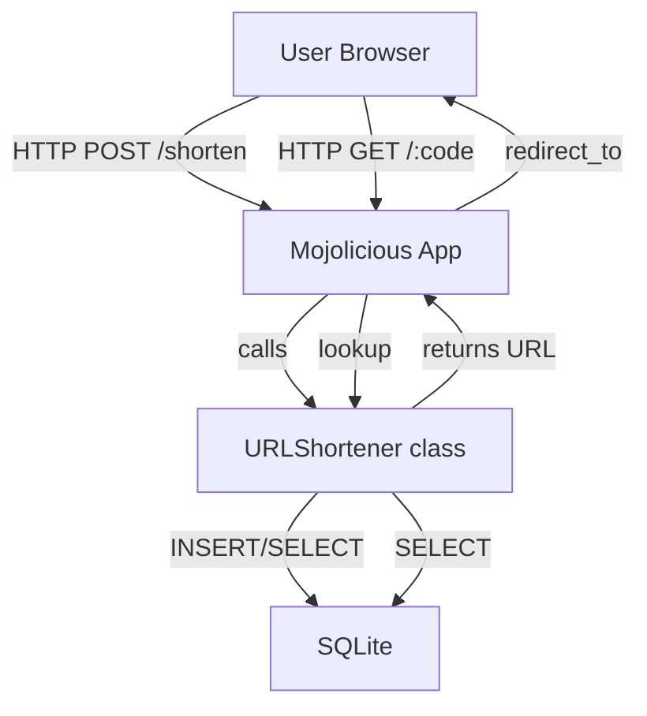

[@nqounet](https://x.com/nqounet)です。

連載「URL短縮サポーターを作ってみよう」の第12回、いよいよ最終回です。

## 前回の振り返り

第11回では、`Data::Validate::URI`を使って、不正なURL入力を防ぐバリデーション機能を実装しました。



前回学んだ内容を簡単に振り返ります。

- `javascript:`スキームなどの不正なURLはXSS攻撃の踏み台になる危険性がある
- URL短縮サービスではHTTP/HTTPSスキームのみを許可すべきである
- `Data::Validate::URI`モジュールの`is_http_uri`と`is_https_uri`でスキームを検証できる
- 無効なURLには400 Bad Requestを返して処理を中断する

今回は、見た目を整えてサービスを完成させ、さらにMooを使ったクラス設計でリファクタリングする方法を紹介します。

## 今回のゴール

第12回では、以下を達成することを目標とします。

- EPテンプレートを使って見た目を改善する
- Mooを使ったクラス設計でリファクタリングの方向性を理解する
- シリーズ全12回で学んだことを振り返る

## タカシさんに見せよう

### 完成間近！

ここまで11回にわたって開発を進めてきたURL短縮サービス。ついにタカシさんに見せるときがやってきました。

「できたよ！ URLを入力して短縮ボタンを押すと、短いURLが発行されるんだ」

画面を見せると、タカシさんは目を丸くしました。

「おお！ 本当に動いてる！ でも…ちょっと見た目が寂しいかも？」

たしかに、現状のアプリケーションは機能は揃っているものの、見た目はシンプルすぎます。最終回では、見た目を整えてサービスを完成させましょう。

### EPテンプレートとは

Mojoliciousには、EPテンプレート（Embedded Perl Template）という仕組みが標準で用意されています。HTMLの中にPerlの変数や式を埋め込むことができ、動的なページを簡単に作成できます。

これまでは`__DATA__`セクションに簡易的なテンプレートを書いていましたが、EPテンプレートの記法を使うことで、より表現力のあるページを作成できます。

## EPテンプレートで見た目を改善する

### 短縮URL表示ページの作成

短縮URLを発行した後の表示ページを、EPテンプレートで整えてみましょう。

```perl
#!/usr/bin/env perl
# app.pl（抜粋: テンプレート部分）
# Perl: 5.20以上（サブルーチンシグネチャ使用）
# 依存: Mojolicious（cpanmでインストール）

# ... 省略（第1回〜第11回で作成したuse文やDB接続など）...

post '/shorten' => sub ($c) {
    my $url = $c->param('url');

    # バリデーション処理（省略）

    # 短縮コード生成・保存処理（省略）

    # テンプレートに変数を渡してレンダリング
    $c->stash(short_url => "http://localhost:3000/$code");
    $c->render(template => 'result');
};

app->start;

__DATA__

@@ result.html.ep
<!DOCTYPE html>
<html>
<head>
  <title>短縮URL発行完了</title>
  <style>
    body { font-family: sans-serif; max-width: 600px; margin: 50px auto; }
    .result { background: #e8f5e9; padding: 20px; border-radius: 8px; }
    .url { font-size: 1.2em; font-weight: bold; color: #2e7d32; }
    a { color: #1565c0; }
  </style>
</head>
<body>
  <h1>短縮URLが発行されました</h1>
  <div class="result">
    <p>あなたの短縮URL:</p>
    <p class="url"><%= $short_url %></p>
    <p><a href="<%= $short_url %>">動作確認する</a></p>
  </div>
  <p><a href="/">別のURLを短縮する</a></p>
</body>
</html>
```

コードの流れを解説します。

#### stashで変数を渡す

```perl
$c->stash(short_url => "http://localhost:3000/$code");
```

`$c->stash()`メソッドを使って、テンプレートに渡したい変数を設定します。ここでは`short_url`という名前で短縮URLを渡しています。

#### テンプレートでの変数展開

```html
<p class="url"><%= $short_url %></p>
```

`<%= ... %>`という記法で、Perlの変数や式の値をHTMLに埋め込むことができます。この記法はHTMLエスケープも自動的に行われるため、XSS対策にもなります。

### EPテンプレートの基本記法

EPテンプレートでよく使う記法をまとめておきます。

- `<%= $var %>` — 変数の値を出力（HTMLエスケープあり）
- `<%== $var %>` — 変数の値を出力（HTMLエスケープなし）
- `% if ($condition) {` — Perlの制御構文（行頭に`%`）
- `% }` — ブロックの終了

これらの記法を使えば、条件分岐やループを含む複雑なページも作成できます。

## Mooでクラス化してリファクタリング

### なぜクラス化するのか

現在の`app.pl`は、ルーティング、データベース操作、短縮コード生成などが1つのファイルに混在しています。機能追加や保守を考えると、責務ごとにクラスを分離するのが望ましいです。

ここで、連載の前提知識として学んだ「Mooで覚えるオブジェクト指向プログラミング」の知識が活きてきます。



Mooを使うことで、以下のようなメリットがあります。

- データベース接続の管理をカプセル化できる
- 短縮処理のロジックを独立したメソッドとして定義できる
- テスト可能なコードになる
- 将来の機能拡張がしやすくなる

### URLShortenerクラスの雛形

Mooを使ったURLShortenerクラスの雛形を見てみましょう。

```perl
# lib/URLShortener.pm
# Perl: 5.20以上
# 依存: Moo, DBI, DBD::SQLite, Digest::SHA（cpanmでインストール）
package URLShortener;
use Moo;
use DBI;
use Digest::SHA qw(sha1_hex);

has 'dbh' => (
    is      => 'ro',
    lazy    => 1,
    builder => '_build_dbh',
);

has 'db_file' => (
    is      => 'ro',
    default => sub { 'urls.db' },
);

sub _build_dbh {
    my ($self) = @_;
    return DBI->connect(
        "dbi:SQLite:dbname=" . $self->db_file,
        "", "",
        { RaiseError => 1, AutoCommit => 1 }
    );
}

sub shorten {
    my ($self, $url) = @_;

    my $code = substr(sha1_hex($url), 0, 6);

    my $sth = $self->dbh->prepare(
        "INSERT OR IGNORE INTO urls (original_url, short_code) VALUES (?, ?)"
    );
    $sth->execute($url, $code);

    return $code;
}

sub resolve {
    my ($self, $code) = @_;

    my $sth = $self->dbh->prepare(
        "SELECT original_url FROM urls WHERE short_code = ?"
    );
    $sth->execute($code);

    my $row = $sth->fetchrow_hashref;
    return $row ? $row->{original_url} : undef;
}

1;
```

コードのポイントを解説します。

#### has 'dbh' — データベース接続の管理

```perl
has 'dbh' => (
    is      => 'ro',
    lazy    => 1,
    builder => '_build_dbh',
);
```

`has`でアトリビュートを定義します。`lazy => 1`を指定することで、実際に使われるまで接続を遅延させています。`builder`で初期化用のメソッドを指定しています。

#### sub shorten — 短縮処理のメソッド化

```perl
sub shorten {
    my ($self, $url) = @_;
    # ...
    return $code;
}
```

短縮処理をメソッドとして切り出すことで、`app.pl`からはシンプルに呼び出せるようになります。

### app.plからの呼び出し

クラス化した後の`app.pl`は、以下のようにシンプルになります。

```perl
use lib 'lib';
use URLShortener;

my $shortener = URLShortener->new;

post '/shorten' => sub ($c) {
    my $url = $c->param('url');
    # バリデーション後...
    my $code = $shortener->shorten($url);
    $c->stash(short_url => "http://localhost:3000/$code");
    $c->render(template => 'result');
};
```

ルーティングの責務とビジネスロジックの責務が分離され、コードの見通しがよくなりました。



## シリーズを振り返る

### 全12回で学んだこと

この連載を通じて、以下のことを学びました。

| 回 | タイトル | 学んだ概念 |
|----|----------|-----------|
| 1 | 友人からの依頼 | Mojolicious::Lite導入、morboで起動 |
| 2 | まずは入口を作ろう | GETルーティング、HTMLフォーム |
| 3 | 入力を受け取ろう | POSTルーティング、パラメータ取得 |
| 4 | 短くするには？ | Digest::SHAでハッシュ生成 |
| 5 | 忘れないように保存しよう | DBIとSQLite接続 |
| 6 | データの住所を決めよう | CREATE TABLEでテーブル設計 |
| 7 | URLを登録しよう | INSERT文とプレースホルダ |
| 8 | 短縮URLへアクセス！ | 動的ルーティング |
| 9 | 元のURLを探そう | SELECT文でデータ取得 |
| 10 | 転送しよう！ | HTTPリダイレクト |
| 11 | 変なURLは断ろう | 入力バリデーション |
| 12 | 完成！そして次へ | EPテンプレート、Moo連携 |

### 身についたスキル

この連載を完了したあなたは、以下のスキルを身につけています。

- Mojolicious::Liteを使ったWebアプリケーション開発の基礎
- DBIを使ったデータベース操作（CRUD）
- HTTPの基本（GET/POST、リダイレクト、ステータスコード）
- セキュリティの基礎（SQLインジェクション対策、入力バリデーション）
- Mooを活用したクラス設計の考え方

## 今後の発展

### さらなる機能追加の可能性

URL短縮サービスには、まだまだ追加できる機能がたくさんあります。

- アクセスカウント: 短縮URLが何回クリックされたかを記録する
- 有効期限: 一定期間後に短縮URLを無効にする
- カスタムコード: ユーザーが好きな短縮コードを指定できる
- QRコード生成: 短縮URLのQRコードを自動生成する
- 認証機能: ログインしたユーザーのみが短縮URLを作成できる

これらの機能を追加する際も、Mooでクラス化した設計が役立ちます。

### 次のステップ

Webアプリケーション開発の次のステップとして、以下をおすすめします。

- Mojolicious（フルスタック版）への移行
- テストコードの追加（Test::Mojo）
- 本番環境へのデプロイ（hypnotoad）
- データベースのマイグレーション管理

## おわりに

### タカシさんからのメッセージ

「ありがとう！ これでSNSに長いURLを貼らなくて済むよ。しかも、自分でサービスを持てるなんてすごいね！」

タカシさんは満足そうに短縮URLを使い始めました。

### 連載を終えて

全12回にわたる連載「URL短縮サポーターを作ってみよう」を最後まで読んでいただき、ありがとうございました。

この連載では、「友人からの依頼」という身近なきっかけから始まり、実際に動くWebアプリケーションを完成させるまでの道のりを一緒に歩んできました。Perlの力を借りて、あなた自身の手でWebサービスを作り上げる体験ができたのではないでしょうか。

学んだ知識をベースに、ぜひ自分だけのアイデアを形にしてみてください。Perlは今でも現役で、あなたのアイデアを実現する強力なパートナーです。

Happy Hacking!
