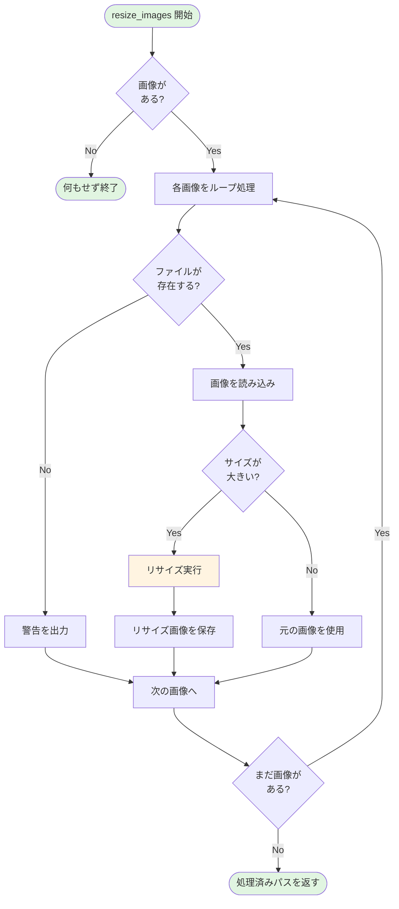
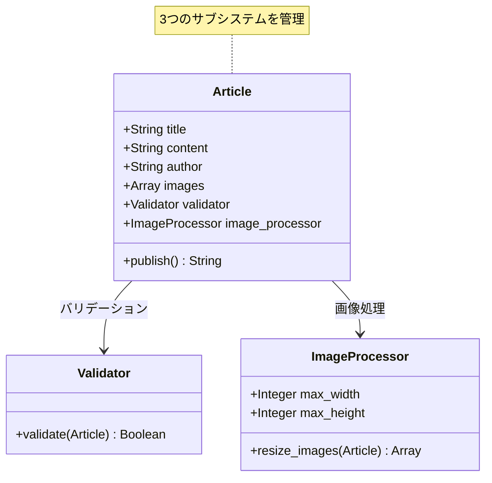

## はじめに

こんにちは！「自然に覚えるデザインパターン（Facade）」連載の第3回です。

前回は、`Article::Validator`クラスを作成して、記事のバリデーション機能を実装しました。これで、空のタイトルや本文をチェックできるようになりましたね。

今回は、さらに新しい機能を追加します。それは**画像の自動リサイズ**機能です。ブログ記事に含まれる画像を、公開時に適切なサイズに自動変換する機能を実装します。

### 前回の振り返り

前回までに、`Article`クラスは以下のような構造になりました：

```perl
# 前回までのpublish()メソッド（簡略版）
sub publish {
    my ($self) = @_;
    
    # バリデーション
    $self->validator->validate($self);
    
    # ファイル保存
    # ...
}
```

バリデーション処理を`Article::Validator`クラスに分離したことで、`publish()`メソッドはスッキリしました。でも、これから機能を追加していくと、どうなるでしょうか？

### 今回のゴール

第3回では、以下を実現します：

- 記事に含まれる画像のパスを保持する
- 画像を指定サイズにリサイズする`Article::ImageProcessor`クラスを作成
- `publish()`メソッドから画像処理を呼び出す
- publish()メソッドが徐々に複雑化していく様子を観察する

## なぜ画像処理が必要なのか？

### ブログにおける画像の重要性

現代のブログでは、画像は記事の重要な要素です。しかし、そのまま使うと問題が発生することがあります：

- **ファイルサイズが大きすぎる**: 高解像度の写真をそのままアップロードすると、ページの読み込みが遅くなる
- **表示サイズがバラバラ**: スマホで撮った縦長の写真と、デジカメで撮った横長の写真が混在する
- **帯域の無駄遣い**: ユーザーのデータ通信量を圧迫する

これらの問題を解決するには、画像を適切なサイズにリサイズすることが重要です。

### 実際のブログシステムでの画像処理

WordPressやはてなブログなど、多くのブログシステムでは、アップロードされた画像を自動的に複数のサイズに変換します：

- サムネイル（150x150px）
- 中サイズ（640x480px）
- 大サイズ（1024x768px）
- オリジナル（元のサイズ）

今回は、このような機能の簡易版を実装します。

## 画像パスを保持する

### Articleクラスに画像パスを追加

まず、`Article`クラスに画像ファイルのパスを保持する属性を追加しましょう：

```perl
# Article.pm（画像パス追加版）
# Perl: v5.26以上推奨
# 外部依存: Moo, Path::Tiny, Article::Validator
package Article;

use strict;
use warnings;
use utf8;
use Moo;
use Path::Tiny;
use Article::Validator;

# 既存の属性（前回と同じ）
has title => (
    is       => 'rw',
    required => 1,
);

has content => (
    is       => 'rw',
    required => 1,
);

has author => (
    is       => 'rw',
    required => 1,
);

# 新規追加：画像ファイルのパス（配列リファレンス）
has images => (
    is      => 'rw',
    default => sub { [] },    # デフォルトは空配列
);

# Validatorインスタンス
has validator => (
    is      => 'ro',
    default => sub { Article::Validator->new },
);

# ... publish()メソッドは後で変更
```

`images`属性は配列リファレンスで、複数の画像パスを保持できます。デフォルトは空配列なので、画像がない記事でも問題ありません。

## Article::ImageProcessorクラスを作る

### 画像処理を専用クラスに分離する

バリデーション処理を`Validator`クラスに分離したのと同じように、画像処理も専用のクラスに分離します。

以下は画像処理のフローを示した図です：



### コード例1：ImageProcessorクラスの定義

```perl
# Article/ImageProcessor.pm
# Perl: v5.26以上推奨
# 外部依存: Moo, Imager
package Article::ImageProcessor;

use strict;
use warnings;
use utf8;
use Moo;
use Imager;
use Path::Tiny;

# リサイズ後の最大幅（ピクセル）
has max_width => (
    is      => 'ro',
    default => sub { 800 },
);

# リサイズ後の最大高さ（ピクセル）
has max_height => (
    is      => 'ro',
    default => sub { 600 },
);

# 画像をリサイズする
sub resize_images {
    my ($self, $article) = @_;
    
    my $images = $article->images;
    
    # 画像がない場合は何もしない
    return unless @$images;
    
    my @resized_paths;
    
    foreach my $image_path (@$images) {
        # 画像ファイルが存在するかチェック
        unless (-f $image_path) {
            warn "警告: 画像ファイルが見つかりません: $image_path\n";
            next;
        }
        
        # Imagerで画像を読み込み
        my $img = Imager->new(file => $image_path)
            or die "画像の読み込みに失敗: $image_path - " . Imager->errstr;
        
        # 現在のサイズを取得
        my $width  = $img->getwidth;
        my $height = $img->getheight;
        
        # リサイズが必要かチェック
        if ($width > $self->max_width || $height > $self->max_height) {
            # アスペクト比を維持してリサイズ
            my $resized = $img->scale(
                xpixels => $self->max_width,
                ypixels => $self->max_height,
                type    => 'min',    # アスペクト比を維持
            );
            
            # リサイズ後のパスを生成
            my $path = path($image_path);
            my $resized_path = $path->parent->child(
                $path->basename('.jpg') . '_resized.jpg'
            );
            
            # リサイズした画像を保存
            $resized->write(file => $resized_path->stringify)
                or die "リサイズ画像の保存に失敗: " . $resized->errstr;
            
            print "画像をリサイズしました: $image_path -> $resized_path\n";
            push @resized_paths, $resized_path->stringify;
        }
        else {
            # リサイズ不要の場合はそのまま使用
            print "画像はリサイズ不要です: $image_path\n";
            push @resized_paths, $image_path;
        }
    }
    
    # 処理後のパスを返す
    return \@resized_paths;
}

1;
```

このクラスのポイント：

- **Imagerモジュールを使用**: Perlでの画像処理によく使われる標準的なモジュール
- **max_width/max_height**: リサイズ後の最大サイズを設定可能
- **アスペクト比を維持**: 画像の縦横比を崩さずにリサイズ
- **条件付きリサイズ**: 既に小さい画像はリサイズしない
- **エラーハンドリング**: ファイルが見つからない場合は警告を出して続行

## publish()メソッドに画像処理を統合する

### クラス構成の進化

画像処理機能を追加することで、クラスの関係はさらに複雑になります：



### コード例2：resize_images()で画像処理

`Article`クラスの`publish()`メソッドから、`ImageProcessor`を呼び出すように変更します：

```perl
# Article.pm（画像処理統合版）
# Perl: v5.26以上推奨
# 外部依存: Moo, Path::Tiny, Article::Validator, Article::ImageProcessor
use Article::ImageProcessor;

# ImageProcessorインスタンス
has image_processor => (
    is      => 'ro',
    default => sub { Article::ImageProcessor->new },
);

# 記事を公開する（画像処理付き）
sub publish {
    my ($self) = @_;
    
    # ステップ1: バリデーション
    $self->validator->validate($self);
    
    # ステップ2: 画像処理（新規追加）
    if (@{$self->images}) {
        my $resized_paths = $self->image_processor->resize_images($self);
        print "画像処理が完了しました（", scalar(@$resized_paths), "枚）\n";
    }
    
    # ステップ3: ファイル保存
    my $filename = $self->title;
    $filename =~ s/\s+/-/g;
    $filename = lc $filename;
    $filename = "articles/${filename}.txt";
    
    my $output = sprintf(
        "Title: %s\nAuthor: %s\n\n%s\n",
        $self->title,
        $self->author,
        $self->content
    );
    
    path($filename)->spew_utf8($output);
    
    print "記事「", $self->title, "」を公開しました: $filename\n";
    
    return $filename;
}
```

`publish()`メソッドが少しずつ長くなってきました。現在は3つのステップがあります：

1. バリデーション
2. 画像処理
3. ファイル保存

それぞれのステップは別のクラスに処理を委譲していますが、`publish()`メソッド自体は各ステップの呼び出しを管理しています。

## 動かしてみよう

### 実行例とその結果

実際に画像付きの記事を公開してみましょう：

```perl
#!/usr/bin/env perl
# test_image_processing.pl
use strict;
use warnings;
use utf8;
use lib './lib';
use Article;
use Path::Tiny;

path('articles')->mkpath;

# テスト用の大きな画像ファイルがあると仮定
# （実際には適切な画像ファイルを用意してください）
my $article = Article->new(
    title   => 'Perlで画像処理',
    content => 'Imagerモジュールを使えば、画像処理も簡単です！',
    author  => 'image_fan',
    images  => ['test_images/large_photo.jpg'],
);

eval {
    $article->publish();
};

if ($@) {
    print "エラーが発生しました: $@";
} else {
    print "公開に成功しました！\n";
}
```

実行結果（画像がmax_widthより大きい場合）：

```
画像をリサイズしました: test_images/large_photo.jpg -> test_images/large_photo_resized.jpg
画像処理が完了しました（1枚）
記事「Perlで画像処理」を公開しました: articles/perlで画像処理.txt
公開に成功しました！
```

### 徐々に複雑化していく様子

第1回と比べて、`publish()`メソッドがどう変化したか見てみましょう：

**第1回（シンプル）**:
```perl
sub publish {
    my ($self) = @_;
    # ファイル保存のみ
}
```

**第2回（バリデーション追加）**:
```perl
sub publish {
    my ($self) = @_;
    $self->validator->validate($self);
    # ファイル保存
}
```

**第3回（画像処理追加、今回）**:
```perl
sub publish {
    my ($self) = @_;
    $self->validator->validate($self);
    # 画像処理
    # ファイル保存
}
```

段階的に処理が増えていますね。まだ読みやすい範囲ですが、この調子で機能が増えたらどうなるでしょうか？

## 次回予告：メール通知を送る

### さらに機能を追加

次回（第4回）では、**メール通知機能**を追加します。記事を公開したときに、管理者や購読者にメールで通知する機能です。

`Article::Notifier`クラスを作成し、`publish()`メソッドから呼び出すようにします。すると、`publish()`メソッドはこうなります：

```perl
sub publish {
    my ($self) = @_;
    
    # バリデーション
    $self->validator->validate($self);
    
    # 画像処理
    $self->image_processor->resize_images($self);
    
    # メール通知（次回追加）
    $self->notifier->send_notification($self);
    
    # ファイル保存
    # ...
}
```

4つのステップを持つメソッドになります。この時点で、「あれ、ちょっと長くなってきたな」と感じるかもしれません。

### 問題の兆候が見え始める

次回は、機能追加の最後です。その後、第5回で「このままでいいのか？」という問題を整理します。そして第6回で、ついにFacadeパターンが登場します。

それでは、第4回でお会いしましょう！

## まとめ

### 今回学んだこと

第3回では、以下のことを学びました：

- ブログシステムにおける画像処理の必要性
- `Article::ImageProcessor`クラスの実装
- Imagerモジュールを使った画像リサイズ
- `publish()`メソッドへの画像処理の統合
- メソッドの段階的な複雑化

### 設計の変化

今回の追加で、`Article`クラスは3つのサブシステムを使うようになりました：

- `Article::Validator` - バリデーション処理
- `Article::ImageProcessor` - 画像処理
- `Path::Tiny` - ファイル保存

それぞれを別クラスに分離したことで、各機能は再利用可能でテストしやすくなっています。しかし、`publish()`メソッド自体は徐々に長くなってきました。

### 次回への準備

次回はメール通知機能を追加します。今のうちに、以下のことを考えてみてください：

- `publish()`メソッドに4つ目のステップが増えたら、読みやすさはどうなる？
- 各ステップでエラーが起きたら、どう処理すべき？
- テストを書くとき、すべてのステップをテストする必要がある？

これらの疑問が、次回以降の展開につながります。

---

**連載リンク**:
- 第1回：[Facadeパターン入門：ブログ記事を公開しよう](/content/post/facade-series-01.md)
- 第2回：[バリデーションを追加する](/content/post/facade-series-02.md)
- 第3回（今回）：画像を自動リサイズする
- 第4回：メール通知を送る（準備中）

**関連記事**:

