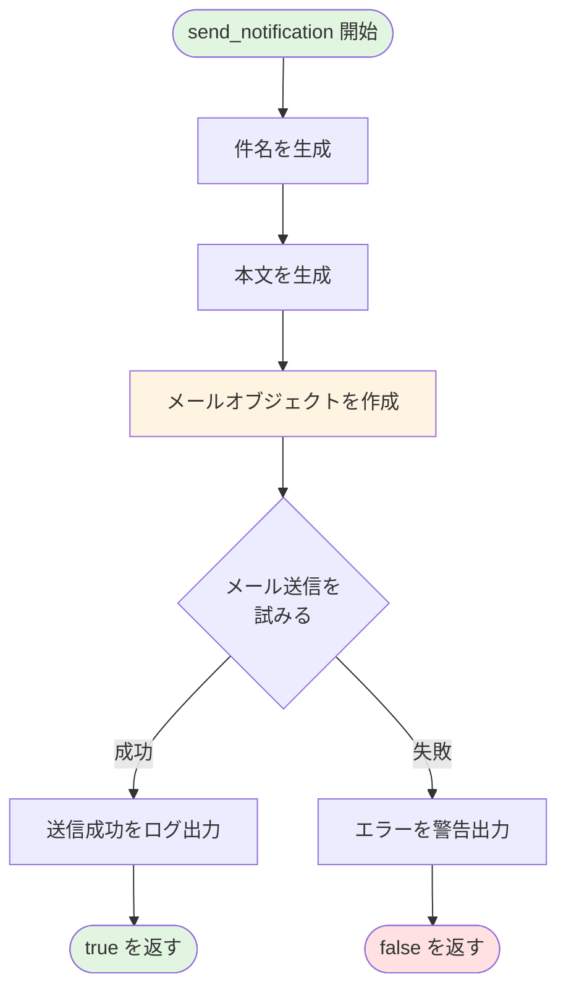
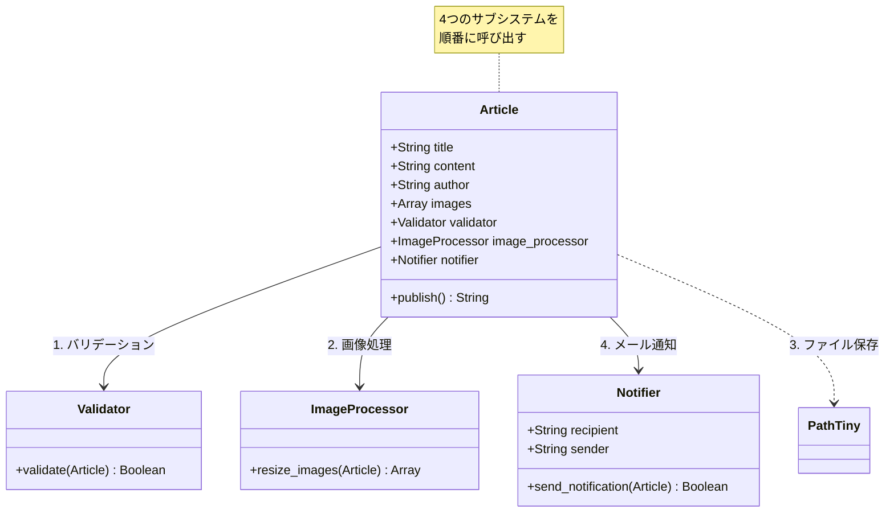

## はじめに

こんにちは！「自然に覚えるデザインパターン（Facade）」連載の第4回です。

前回は、`Article::ImageProcessor`クラスを作成して、記事に含まれる画像を自動でリサイズする機能を実装しました。これで、`publish()`メソッドはバリデーション、画像処理、ファイル保存の3つのステップを持つようになりました。

今回は、機能追加の最後として、**メール通知機能**を実装します。記事を公開したときに、管理者や購読者にメールで通知を送る機能です。

### 前回の振り返り

前回までに、`publish()`メソッドは以下のような構造になりました：

```perl
# 前回までのpublish()メソッド（簡略版）
sub publish {
    my ($self) = @_;
    
    # ステップ1: バリデーション
    $self->validator->validate($self);
    
    # ステップ2: 画像処理
    $self->image_processor->resize_images($self);
    
    # ステップ3: ファイル保存
    # ...
}
```

各ステップは専用のクラスに処理を委譲しており、それ自体は良い設計です。でも、`publish()`メソッドが徐々に長くなってきているのも事実ですね。

### 今回のゴール

第4回では、以下を実現します：

- メール送信機能を持つ`Article::Notifier`クラスを作成
- 記事公開時に通知メールを送信
- `publish()`メソッドに4つ目のステップを追加
- メソッドの肥大化問題を認識する

## なぜメール通知が必要なのか？

### ブログにおける通知の重要性

現代のブログシステムでは、記事を公開したときに関係者に通知を送ることが一般的です：

- **管理者への通知**: 記事が正常に公開されたことを確認できる
- **購読者への通知**: 新しい記事が公開されたことを読者に知らせる
- **チーム内の共有**: 複数人で運営しているブログでは、他のメンバーに通知する

WordPressやはてなブログなど、多くのブログプラットフォームがこの機能を持っています。

### 実装の選択肢

メール送信には、いくつかの選択肢があります：

- **Email::Sender::Simple**: シンプルで使いやすいPerlモジュール（今回使用）
- **Email::Simple** + **Email::Sender::Transport::SMTP**: より細かい制御が可能
- **外部サービス**: SendGrid、Mailgunなどのメール配信サービスを利用

今回は、手軽に使える`Email::Sender::Simple`を使います。

## Article::Notifierクラスを作る

### 通知処理を専用クラスに分離する

これまでと同様に、メール通知機能も専用のクラスに分離します。単一責任の原則を守るためです。

以下は、メール通知処理のフローを示した図です：



### コード例1：Notifierクラスの定義

```perl
# Article/Notifier.pm
# Perl: v5.26以上推奨
# 外部依存: Moo, Email::Sender::Simple, Email::Simple
package Article::Notifier;

use strict;
use warnings;
use utf8;
use Moo;
use Email::Sender::Simple qw(sendmail);
use Email::Simple;
use Email::Simple::Creator;

# 通知先メールアドレス
has recipient => (
    is       => 'ro',
    required => 1,
);

# 送信元メールアドレス
has sender => (
    is      => 'ro',
    default => sub { 'blog@example.com' },
);

# メール件名のプレフィックス
has subject_prefix => (
    is      => 'ro',
    default => sub { '[ブログ通知]' },
);

# 記事公開通知を送信する
sub send_notification {
    my ($self, $article) = @_;
    
    # メールの件名を生成
    my $subject = sprintf(
        '%s 新しい記事が公開されました: %s',
        $self->subject_prefix,
        $article->title
    );
    
    # メール本文を生成
    my $body = sprintf(
        "記事が公開されました。\n\n" .
        "タイトル: %s\n" .
        "著者: %s\n\n" .
        "内容:\n%s\n\n" .
        "---\n" .
        "このメールは自動送信されています。\n",
        $article->title,
        $article->author,
        $article->content
    );
    
    # メールオブジェクトを作成
    my $email = Email::Simple->create(
        header => [
            To      => $self->recipient,
            From    => $self->sender,
            Subject => $subject,
        ],
        body => $body,
    );
    
    # メールを送信（実際の環境ではSMTPサーバー設定が必要）
    eval {
        sendmail($email);
        print "通知メールを送信しました: ", $self->recipient, "\n";
    };
    
    if ($@) {
        # エラーが発生した場合は警告を出すが、処理は継続
        warn "メール送信に失敗しました: $@\n";
        warn "（記事の公開は継続します）\n";
        return 0;  # 失敗
    }
    
    return 1;  # 成功
}

1;
```

このクラスのポイント：

- **recipient属性**: 通知先メールアドレスは必須
- **sender/subject_prefix**: 送信元とメール件名のカスタマイズが可能
- **send_notification()**: 記事オブジェクトを受け取り、通知メールを送信
- **エラーハンドリング**: メール送信に失敗しても、記事公開処理は継続する

### エラー処理の設計判断

`send_notification()`では、メール送信に失敗しても例外を投げずに警告を出すだけにしています。これは、**メール送信の失敗が記事公開を妨げるべきではない**という設計判断です。

しかし、この判断が常に正しいとは限りません。重要な通知の場合は、失敗時に例外を投げる設計も考えられます。

## publish()メソッドに通知機能を統合する

### 複雑化するクラス構成

メール通知機能を追加することで、クラスの関係はさらに複雑になります：



この図からわかるように、`Article`クラスは4つの異なるサブシステムを管理するようになりました。

### コード例2：send_notification()でメール送信

`Article`クラスの`publish()`メソッドから、`Notifier`を呼び出すように変更します：

```perl
# Article.pm（通知機能統合版）
# Perl: v5.26以上推奨
# 外部依存: Moo, Path::Tiny, Article::Validator, 
#          Article::ImageProcessor, Article::Notifier
package Article;

use strict;
use warnings;
use utf8;
use Moo;
use Path::Tiny;
use Article::Validator;
use Article::ImageProcessor;
use Article::Notifier;

# 既存の属性（省略）
# ...

# Validatorインスタンス
has validator => (
    is      => 'ro',
    default => sub { Article::Validator->new },
);

# ImageProcessorインスタンス
has image_processor => (
    is      => 'ro',
    default => sub { Article::ImageProcessor->new },
);

# Notifierインスタンス（新規追加）
has notifier => (
    is      => 'ro',
    default => sub {
        Article::Notifier->new(
            recipient => 'admin@example.com',
        )
    },
);

# 記事を公開する（通知機能付き）
sub publish {
    my ($self) = @_;
    
    # ステップ1: バリデーション
    $self->validator->validate($self);
    
    # ステップ2: 画像処理
    if (@{$self->images}) {
        my $resized_paths = $self->image_processor->resize_images($self);
        print "画像処理が完了しました（", scalar(@$resized_paths), "枚）\n";
    }
    
    # ステップ3: ファイル保存
    my $filename = $self->title;
    $filename =~ s/\s+/-/g;
    $filename = lc $filename;
    $filename = "articles/${filename}.txt";
    
    my $output = sprintf(
        "Title: %s\nAuthor: %s\n\n%s\n",
        $self->title,
        $self->author,
        $self->content
    );
    
    path($filename)->spew_utf8($output);
    
    print "記事「", $self->title, "」を公開しました: $filename\n";
    
    # ステップ4: メール通知（新規追加）
    my $notification_result = $self->notifier->send_notification($self);
    if (!$notification_result) {
        print "（通知は送信されませんでしたが、記事は正常に公開されました）\n";
    }
    
    return $filename;
}

1;
```

`publish()`メソッドが**4つのステップ**を持つようになりました：

1. バリデーション
2. 画像処理
3. ファイル保存
4. メール通知

メソッドの行数も増え、複雑さが増してきました。

## 動かしてみよう

### 実行例とその結果

実際に通知機能付きで記事を公開してみましょう：

```perl
#!/usr/bin/env perl
# test_notification.pl
use strict;
use warnings;
use utf8;
use lib './lib';
use Article;
use Article::Notifier;
use Path::Tiny;

path('articles')->mkpath;

# カスタムNotifierを作成（テスト用）
my $notifier = Article::Notifier->new(
    recipient => 'test@example.com',
    sender    => 'myblog@example.com',
);

my $article = Article->new(
    title    => 'メール通知機能のテスト',
    content  => 'Perlでメール送信も簡単にできます！',
    author   => 'notification_tester',
    notifier => $notifier,
);

eval {
    $article->publish();
};

if ($@) {
    print "エラーが発生しました: $@";
} else {
    print "すべての処理が完了しました！\n";
}
```

実行結果：

```
記事「メール通知機能のテスト」を公開しました: articles/メール通知機能のテスト.txt
通知メールを送信しました: test@example.com
すべての処理が完了しました！
```

### publish()メソッドの変遷

第1回から第4回までの`publish()`メソッドの変化を見てみましょう：

**第1回（シンプル）**:
```perl
sub publish {
    # ファイル保存のみ（約10行）
}
```

**第2回（バリデーション追加）**:
```perl
sub publish {
    # バリデーション + ファイル保存（約15行）
}
```

**第3回（画像処理追加）**:
```perl
sub publish {
    # バリデーション + 画像処理 + ファイル保存（約25行）
}
```

**第4回（通知追加、今回）**:
```perl
sub publish {
    # バリデーション + 画像処理 + ファイル保存 + 通知（約35行）
}
```

徐々に長くなり、**複雑さが増している**ことが分かります。

## 現状の問題点を認識する

### publish()メソッドの肥大化

現在の`publish()`メソッドには、以下のような問題があります：

1. **長すぎる**: 約35行のメソッドは、一目で理解するには少し長い
2. **複数の責任**: バリデーション、画像処理、ファイル保存、通知と、4つの異なる処理を呼び出している
3. **変更の影響範囲**: 新しい機能を追加するたびに、このメソッドを変更しなければならない
4. **テストの複雑さ**: すべてのステップを含む統合テストが必要になる

### 各クラスは良い設計なのに...

不思議なことに、個々のクラス（`Validator`、`ImageProcessor`、`Notifier`）は、それぞれ単一責任の原則を守った良い設計です。でも、それらを呼び出す`publish()`メソッドは複雑になってしまいました。

これは何が問題なのでしょうか？そして、どう解決すればいいのでしょうか？

### 次回、問題を整理する

次回（第5回）では、現状の設計の問題点を詳しく整理します。そして、「この複雑さをどう解決するか？」という問いに向き合います。

その答えが、**Facadeパターン**です。でも、それは第6回までのお楽しみ。まずは問題をしっかり理解することが重要です。

## 次回予告：publish()が複雑すぎる！

### 問題を可視化する

次回は、機能追加を一旦止めて、現状の設計を振り返ります：

- `publish()`メソッドの複雑さを可視化する
- なぜこうなったのかを分析する
- どんな問題が発生しうるかを考える
- 理想的な設計とは何かを考える

これまで「作る」ことに集中してきましたが、次回は「振り返る」回です。リファクタリングの第一歩は、問題の認識から始まります。

### いよいよFacadeパターンへ

第5回で問題を整理した後、第6回でついにFacadeパターンを導入します。複雑な`publish()`メソッドが、どのようにシンプルになるのか？お楽しみに！

それでは、第5回でお会いしましょう！

## まとめ

### 今回学んだこと

第4回では、以下のことを学びました：

- ブログシステムにおけるメール通知の重要性
- `Article::Notifier`クラスの実装
- Email::Sender::Simpleを使ったメール送信
- エラーハンドリングの設計判断（通知失敗時の処理）
- `publish()`メソッドの肥大化問題

### 設計の現状

現在の`Article`クラスは、4つのサブシステムを使っています：

- `Article::Validator` - バリデーション処理
- `Article::ImageProcessor` - 画像処理
- `Article::Notifier` - メール通知
- `Path::Tiny` - ファイル保存

各サブシステムは適切に分離されていますが、それらを統合する`publish()`メソッドが複雑になってきました。

### 問題の兆候

以下のような兆候が見られます：

- メソッドが長い（約35行）
- 複数の処理ステップを管理している
- 新機能追加のたびに変更が必要
- テストが複雑になりそう

これらの問題をどう解決するか？それが次回以降のテーマです。

### 次回への準備

次回は問題整理の回です。今のうちに、以下のことを考えてみてください：

- `publish()`メソッドを読んで、すぐに何をしているか理解できる？
- もし新しい機能（例：SNS投稿、統計記録）を追加するとしたら、どこを変更する？
- このメソッドをテストするとき、どんなテストケースが必要？

これらの疑問が、Facadeパターンの必要性を理解する手がかりになります。

---

**連載リンク**:
- 第1回：[Facadeパターン入門：ブログ記事を公開しよう](/content/post/facade-series-01.md)
- 第2回：[バリデーションを追加する](/content/post/facade-series-02.md)
- 第3回：[画像を自動リサイズする](/content/post/facade-series-03.md)
- 第4回（今回）：メール通知を送る
- 第5回：publish()が複雑すぎる！（準備中）

**関連記事**:

