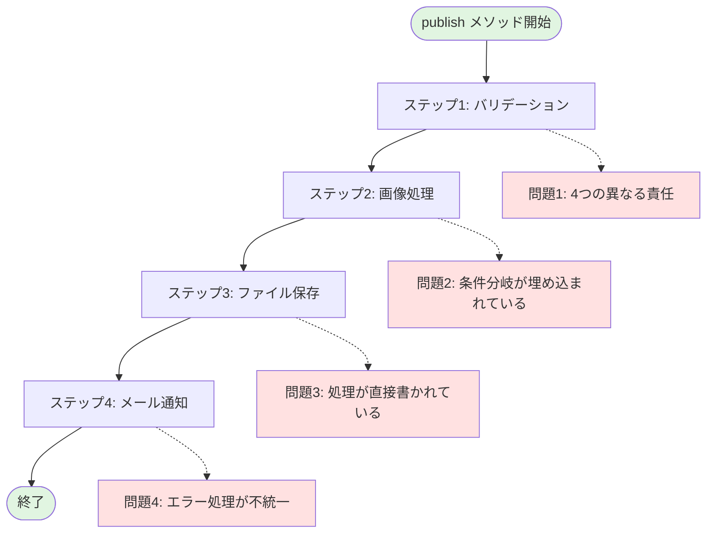
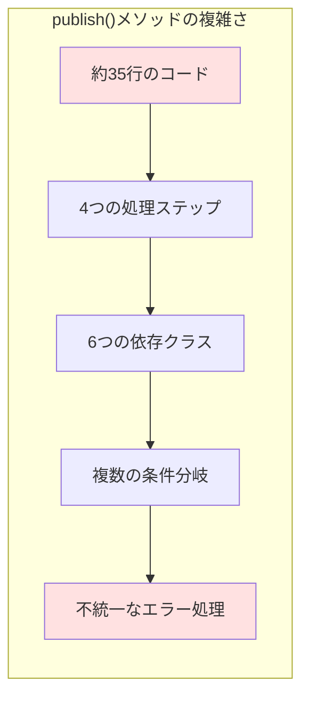
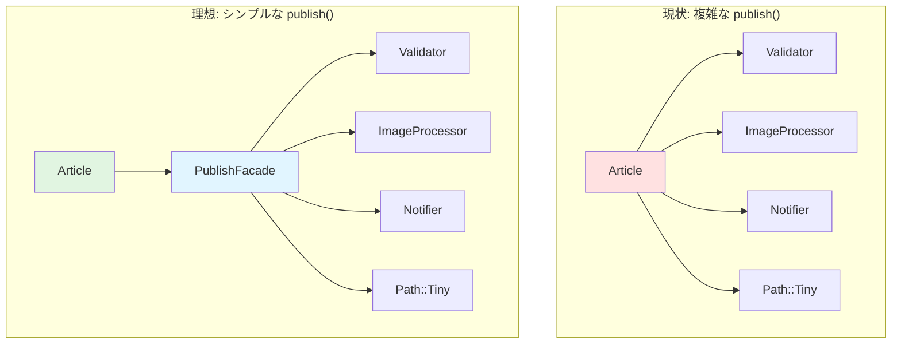

## はじめに

こんにちは！「自然に覚えるデザインパターン（Facade）」連載の第5回です。

前回まで、ブログ記事公開システムに以下の4つの機能を追加してきました：

1. バリデーション（第2回）
2. 画像処理（第3回）
3. メール通知（第4回）
4. ファイル保存（第1回から）

各機能は適切に別クラスに分離され、単一責任の原則も守られています。素晴らしいですね！

でも、ちょっと待ってください。**何かがおかしい**と感じませんか？

### 前回の振り返り

前回までに、`publish()`メソッドは以下のようになりました：

```perl
# 現在のpublish()メソッド（第4回時点）
sub publish {
    my ($self) = @_;
    
    # ステップ1: バリデーション
    $self->validator->validate($self);
    
    # ステップ2: 画像処理
    if (@{$self->images}) {
        my $resized_paths = $self->image_processor->resize_images($self);
        print "画像処理が完了しました（", scalar(@$resized_paths), "枚）\n";
    }
    
    # ステップ3: ファイル保存
    my $filename = $self->title;
    $filename =~ s/\s+/-/g;
    $filename = lc $filename;
    $filename = "articles/${filename}.txt";
    
    my $output = sprintf(
        "Title: %s\nAuthor: %s\n\n%s\n",
        $self->title,
        $self->author,
        $self->content
    );
    
    path($filename)->spew_utf8($output);
    
    print "記事「", $self->title, "」を公開しました: $filename\n";
    
    # ステップ4: メール通知
    my $notification_result = $self->notifier->send_notification($self);
    if (!$notification_result) {
        print "（通知は送信されませんでしたが、記事は正常に公開されました）\n";
    }
    
    return $filename;
}
```

約35行のメソッドです。機能は動きますし、各処理は適切に分離されています。でも、**何かがおかしい**のです。

### 今回のゴール

第5回では、機能追加を一旦止めて、現状の設計を振り返ります：

- `publish()`メソッドの複雑さを可視化する
- なぜこうなったのかを分析する
- どんな問題が発生しているかを明確にする
- 理想的な設計とは何かを考える

問題を認識することが、解決への第一歩です。

## コード例1：現状のpublish()メソッド（複雑版）

### 全体像を見てみる

改めて、現在の`Article`クラス全体を見てみましょう：

```perl
# Article.pm（第4回時点の完全版）
# Perl: v5.26以上推奨
# 外部依存: Moo, Path::Tiny, Article::Validator, 
#          Article::ImageProcessor, Article::Notifier
package Article;

use strict;
use warnings;
use utf8;
use Moo;
use Path::Tiny;
use Article::Validator;
use Article::ImageProcessor;
use Article::Notifier;

# 記事の属性
has title => (
    is       => 'rw',
    required => 1,
);

has content => (
    is       => 'rw',
    required => 1,
);

has author => (
    is       => 'rw',
    required => 1,
);

has images => (
    is      => 'rw',
    default => sub { [] },
);

# サブシステムのインスタンス
has validator => (
    is      => 'ro',
    default => sub { Article::Validator->new },
);

has image_processor => (
    is      => 'ro',
    default => sub { Article::ImageProcessor->new },
);

has notifier => (
    is      => 'ro',
    default => sub {
        Article::Notifier->new(
            recipient => 'admin@example.com',
        )
    },
);

# 記事を公開する（複雑版）
sub publish {
    my ($self) = @_;
    
    # ステップ1: バリデーション
    $self->validator->validate($self);
    
    # ステップ2: 画像処理
    if (@{$self->images}) {
        my $resized_paths = $self->image_processor->resize_images($self);
        print "画像処理が完了しました（", scalar(@$resized_paths), "枚）\n";
    }
    
    # ステップ3: ファイル保存
    my $filename = $self->title;
    $filename =~ s/\s+/-/g;
    $filename = lc $filename;
    $filename = "articles/${filename}.txt";
    
    my $output = sprintf(
        "Title: %s\nAuthor: %s\n\n%s\n",
        $self->title,
        $self->author,
        $self->content
    );
    
    path($filename)->spew_utf8($output);
    
    print "記事「", $self->title, "」を公開しました: $filename\n";
    
    # ステップ4: メール通知
    my $notification_result = $self->notifier->send_notification($self);
    if (!$notification_result) {
        print "（通知は送信されませんでしたが、記事は正常に公開されました）\n";
    }
    
    return $filename;
}

1;
```

### 数字で見る複雑さ

このコードを数値的に分析してみましょう：

- **行数**: 約100行（属性定義を含む）
- **publish()メソッド**: 約35行
- **依存クラス数**: 6つ（Moo, Path::Tiny, 3つのArticle::*モジュール）
- **処理ステップ数**: 4つ（バリデーション、画像処理、ファイル保存、通知）
- **条件分岐**: 2つ（画像がある場合、通知失敗時）

一見すると、そこまで悪くないように見えます。でも、本当にそうでしょうか？

## コード例2：問題点の整理（図解またはコメント付きコード）

### 問題点を可視化する

現状の`publish()`メソッドの構造を視覚化してみましょう：



さらに、複雑さを数値で可視化してみましょう：



現状の`publish()`メソッドの問題点をコメントで可視化してみましょう：

```perl
sub publish {
    my ($self) = @_;
    
    # 【問題1】4つの異なる処理を1つのメソッドで管理している
    # → 単一責任の原則に反している
    
    # ステップ1: バリデーション
    $self->validator->validate($self);
    
    # ステップ2: 画像処理
    # 【問題2】条件分岐が埋め込まれている
    # → この条件を変更したいときはどうする？
    if (@{$self->images}) {
        my $resized_paths = $self->image_processor->resize_images($self);
        print "画像処理が完了しました（", scalar(@$resized_paths), "枚）\n";
    }
    
    # ステップ3: ファイル保存
    # 【問題3】ファイル保存処理が直接書かれている
    # → 他のメソッドで再利用できない
    my $filename = $self->title;
    $filename =~ s/\s+/-/g;
    $filename = lc $filename;
    $filename = "articles/${filename}.txt";
    
    my $output = sprintf(
        "Title: %s\nAuthor: %s\n\n%s\n",
        $self->title,
        $self->author,
        $self->content
    );
    
    path($filename)->spew_utf8($output);
    
    print "記事「", $self->title, "」を公開しました: $filename\n";
    
    # ステップ4: メール通知
    # 【問題4】エラーハンドリングが一貫していない
    # → バリデーションはdieするが、通知は警告のみ
    my $notification_result = $self->notifier->send_notification($self);
    if (!$notification_result) {
        print "（通知は送信されませんでしたが、記事は正常に公開されました）\n";
    }
    
    # 【問題5】この順序は適切？
    # → 画像処理の後にバリデーションすべき？
    # → 通知はファイル保存の前でもいい？
    
    # 【問題6】新しい処理を追加するには？
    # → このメソッドを直接変更するしかない（開放閉鎖の原則に反する）
    
    return $filename;
}
```

問題が6つも見つかりました！それぞれを詳しく見ていきましょう。

## 主な問題点

### 問題1：単一責任の原則違反

`publish()`メソッドは、実質的に4つの異なる責任を持っています：

- バリデーション処理の呼び出し
- 画像処理の呼び出し
- ファイル保存の実行
- メール通知の呼び出し

これは**単一責任の原則**（Single Responsibility Principle）に反しています。1つのメソッドは1つのことだけをすべきです。

### 問題2：読みにくさ

初めてこのコードを読む人は、以下の疑問を持つでしょう：

- 「全体の流れがすぐに理解できない」
- 「各ステップの詳細と、全体の流れが混ざっている」
- 「どこまでがバリデーションで、どこからが保存処理？」

**可読性が低い**のです。

### 問題3：テストの困難さ

このメソッドをテストするには、以下のすべてをセットアップする必要があります：

- Validatorのモック（または本物）
- ImageProcessorのモック（または本物）
- Notifierのモック（または本物）
- ファイルシステムへのアクセス
- メール送信環境

**統合テストしか書けない**状態です。個別の処理をテストしたいのに、全部を準備しなければなりません。

### 問題4：変更の影響範囲

新しい機能を追加したい場合（例：SNSへの投稿、アクセス統計の記録）、このメソッドを直接変更する必要があります。

これは**開放閉鎖の原則**（Open-Closed Principle）に反しています。拡張には開いているべきですが、変更には閉じているべきです。

### 問題5：エラーハンドリングの不統一

- バリデーション失敗時：`die`で例外を投げる
- 通知失敗時：警告を出すだけ

エラー処理の方針が**一貫していない**ため、呼び出し側が混乱します。

### 問題6：処理順序の硬直性

現在の処理順序は固定されています：

1. バリデーション → 2. 画像処理 → 3. ファイル保存 → 4. 通知

でも、この順序が常に正しいとは限りません。例えば：

- 画像処理に時間がかかるなら、先にファイル保存して後から画像を追加したい
- 通知は非同期で送りたい

**柔軟性がない**のです。

## なぜこうなったのか？

### 段階的な機能追加の弊害

私たちは、段階的に機能を追加してきました：

- 第1回：シンプルなファイル保存
- 第2回：バリデーション追加
- 第3回：画像処理追加
- 第4回：メール通知追加

各回で1つずつ機能を追加するのは良いアプローチでした。でも、**全体の設計を見直すタイミング**を逃してしまったのです。

### サブシステムは良いのに...

不思議なことに、個々のサブシステム（`Validator`、`ImageProcessor`、`Notifier`）は良い設計です：

- それぞれが単一責任を持つ
- 独立してテストできる
- 再利用可能

問題は、**それらを統合する部分**にあります。

## 理想的な設計とは？

### あるべき姿を考える

理想的な`publish()`メソッドは、こんな風になるべきではないでしょうか：

```perl
# 理想的なpublish()メソッド（案）
sub publish {
    my ($self) = @_;
    
    # 複雑な公開処理を、シンプルな1行で呼び出せる
    return $self->publish_facade->execute($self);
}
```

たった1行です！すべての複雑さは`publish_facade`の中に隠蔽されています。

以下の図は、現状の設計と理想的な設計を比較したものです：



この設計には、以下のメリットがあります：

- **読みやすい**: 何をしているか一目瞭然
- **テストしやすい**: `publish_facade`をモックに差し替えられる
- **変更に強い**: 新しい処理を追加しても、このメソッドは変更不要
- **柔軟**: 処理順序の変更も`publish_facade`内部だけで完結

### 複雑さをどこに置くか

重要なのは、**複雑さを消すのではなく、適切な場所に置く**ことです。

現状では、複雑さが`Article`クラスの`publish()`メソッドに集中しています。これを、専用のクラス（Facade）に移動させるのです。

## 次回予告：Facadeパターンで解決する

### いよいよFacadeパターンの登場

次回（第6回）では、ついに**Facadeパターン**を導入します。

`Article::PublishFacade`というクラスを作成し、すべての公開処理を統一インターフェースに集約します。すると、`publish()`メソッドは驚くほどシンプルになります。

### Facadeパターンとは？

Facadeパターンは、**複雑なサブシステムを隠蔽して、クライアントに対してシンプルなインターフェースを提供する**デザインパターンです。

まさに、今回の問題にぴったりのパターンなのです！

### 何が変わるのか？

第6回では、以下のことを実現します：

- `Article::PublishFacade`クラスの作成
- すべての公開処理をFacadeに集約
- `publish()`メソッドのシンプル化
- テスト容易性の向上

お楽しみに！

## まとめ

### 今回学んだこと

第5回では、以下のことを学びました：

- 現状の`publish()`メソッドの問題点（6つの問題）
- なぜこうなったのか（段階的機能追加の弊害）
- 理想的な設計とは何か
- 複雑さを適切な場所に置くことの重要性

### 問題点の整理

主な問題点：

1. **単一責任の原則違反**: 1つのメソッドが4つの責任を持つ
2. **読みにくさ**: 全体の流れと詳細が混在
3. **テストの困難さ**: 統合テストしか書けない
4. **変更の影響範囲**: 新機能追加のたびにメソッドを変更
5. **エラーハンドリングの不統一**: 処理ごとに異なるエラー処理
6. **処理順序の硬直性**: 順序変更が困難

これらすべてを、Facadeパターンで解決します！

### 次回への準備

次回はFacadeパターンの実装です。今のうちに、以下のことを考えてみてください：

- 「複雑さを隠蔽する」とは、具体的にどういうこと？
- Facadeクラスはどんなメソッドを持つべき？
- Facadeを使うと、テストはどう変わる？

これらの疑問が、次回の理解を深めます。

それでは、第6回でお会いしましょう！

---

**連載リンク**:
- 第1回：[Facadeパターン入門：ブログ記事を公開しよう](/content/post/facade-series-01.md)
- 第2回：[バリデーションを追加する](/content/post/facade-series-02.md)
- 第3回：[画像を自動リサイズする](/content/post/facade-series-03.md)
- 第4回：[メール通知を送る](/content/post/facade-series-04.md)
- 第5回（今回）：publish()が複雑すぎる！
- 第6回：Facadeパターンで解決する（準備中）

**関連記事**:


