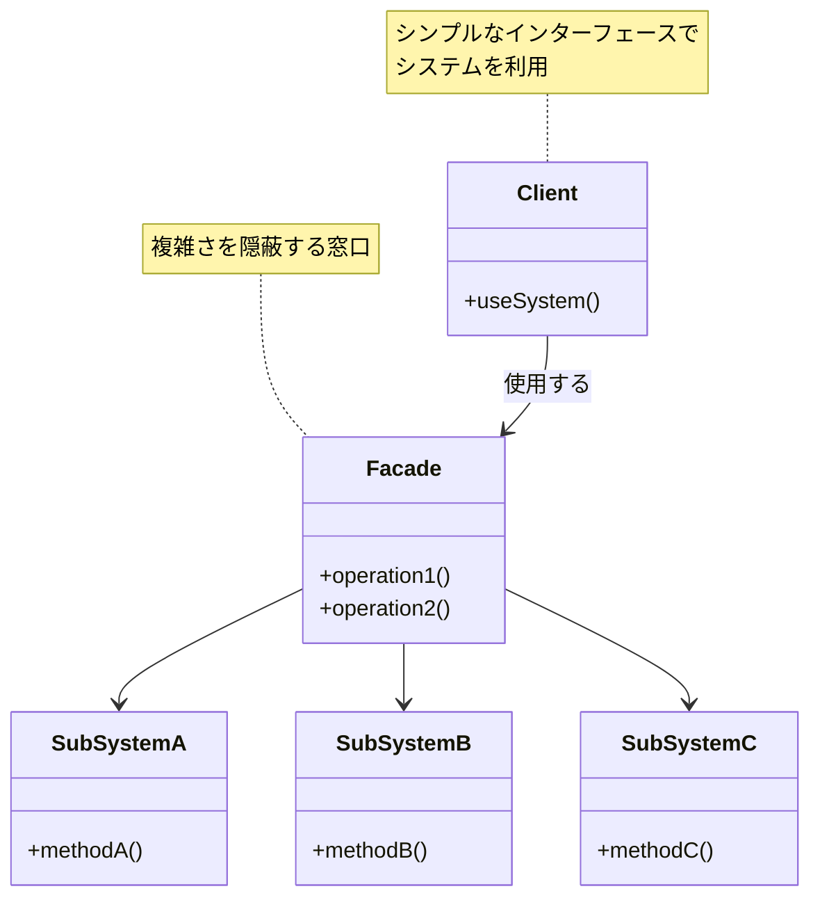
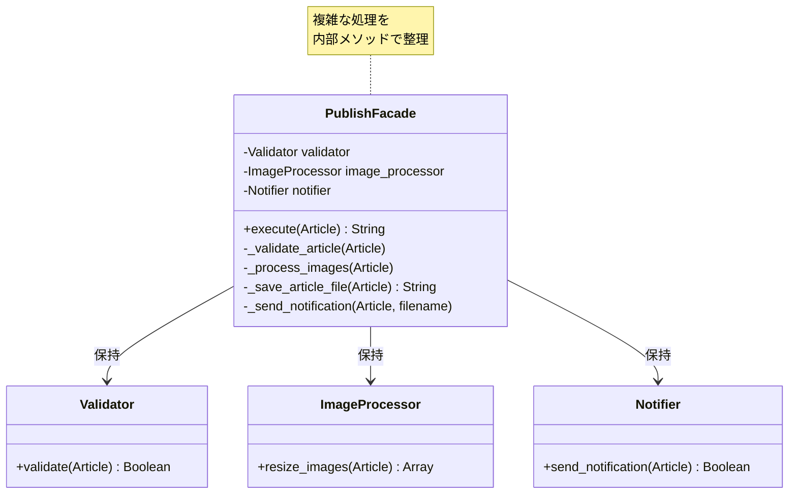
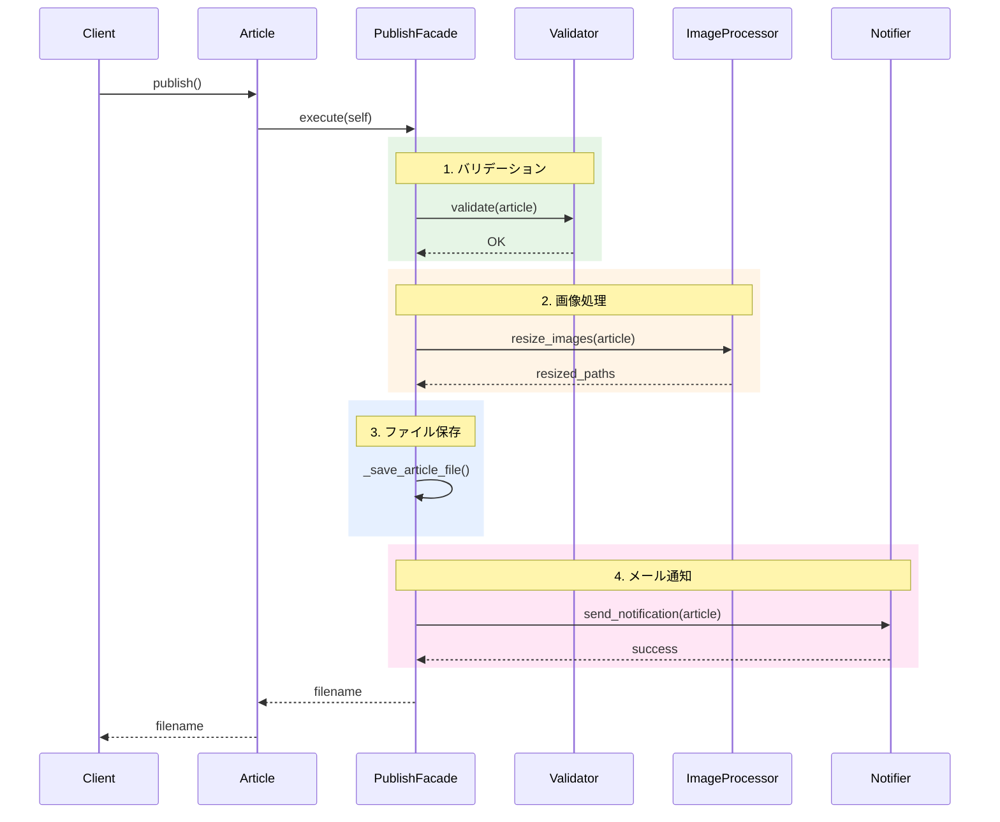

## はじめに

こんにちは！「自然に覚えるデザインパターン（Facade）」連載の第6回です。

前回は、`publish()`メソッドの問題点を整理しました。4つのサブシステムを呼び出す複雑なメソッドは、読みにくく、テストしにくく、変更に弱いという問題を抱えていましたね。

今回は、いよいよ**Facadeパターン**を導入して、これらの問題を解決します！

### 前回の振り返り

前回、以下の問題点を認識しました：

1. **単一責任の原則違反**: 1つのメソッドが4つの責任を持つ
2. **読みにくさ**: 全体の流れと詳細が混在
3. **テストの困難さ**: 統合テストしか書けない
4. **変更の影響範囲**: 新機能追加のたびにメソッドを変更
5. **エラーハンドリングの不統一**: 処理ごとに異なるエラー処理
6. **処理順序の硬直性**: 順序変更が困難

これらをどう解決するか？答えがFacadeパターンです。

### 今回のゴール

第6回では、以下を実現します：

- Facadeパターンの概念を理解する
- `Article::PublishFacade`クラスを作成する
- 複雑な公開処理をFacadeに集約する
- `publish()`メソッドをシンプルにする
- ビフォー・アフターの比較

## Facadeパターンとは？

### パターンの定義

**Facadeパターン**（ファサードパターン）は、構造パターンの1つで、以下のように定義されます：

> サブシステムにある一連のインターフェースに対する統一されたインターフェースを提供する。Facadeパターンは、サブシステムを使いやすくするための高レベルのインターフェースを定義する。

もっとシンプルに言うと：

**複雑なサブシステムをまとめて、シンプルな窓口（Facade）を提供する**

以下の図は、Facadeパターンの基本的な構造を示しています：



### 建築用語からの由来

「Facade」は建築用語で「建物の正面」という意味です。建物の裏側には複雑な配管や配線がありますが、正面（Facade）からはそれらが見えません。美しくシンプルな外観だけが見えます。

プログラミングでも同じです。複雑な内部構造を隠蔽し、シンプルなインターフェースだけを外部に公開するのです。

### いつ使うべきか？

Facadeパターンは、以下のような場合に有効です：

- 複数のサブシステムがあり、それらの呼び出しが複雑
- サブシステムの詳細を隠蔽したい
- クライアントコードをシンプルに保ちたい
- サブシステム間の依存関係を管理したい

まさに、私たちの`publish()`メソッドの状況にぴったりです！

## コード例1：PublishFacadeクラスの定義

### Facadeクラスを作る

では、`Article::PublishFacade`クラスを作成しましょう。このクラスは、記事公開に関するすべての処理を統一インターフェースで提供します。

まず、PublishFacadeの内部構造を見てみましょう：



```perl
# Article/PublishFacade.pm
# Perl: v5.26以上推奨
# 外部依存: Moo, Path::Tiny, Article::Validator,
#          Article::ImageProcessor, Article::Notifier
package Article::PublishFacade;

use strict;
use warnings;
use utf8;
use Moo;
use Path::Tiny;
use Article::Validator;
use Article::ImageProcessor;
use Article::Notifier;

# サブシステム1: Validator
has validator => (
    is      => 'ro',
    default => sub { Article::Validator->new },
);

# サブシステム2: ImageProcessor
has image_processor => (
    is      => 'ro',
    default => sub { Article::ImageProcessor->new },
);

# サブシステム3: Notifier
has notifier => (
    is      => 'ro',
    lazy    => 1,
    builder => '_build_notifier',
);

sub _build_notifier {
    my ($self) = @_;
    return Article::Notifier->new(
        recipient => 'admin@example.com',
    );
}

# 記事を公開する（統一インターフェース）
sub execute {
    my ($self, $article) = @_;
    
    # ステップ1: バリデーション
    $self->_validate_article($article);
    
    # ステップ2: 画像処理
    $self->_process_images($article);
    
    # ステップ3: ファイル保存
    my $filename = $self->_save_article_file($article);
    
    # ステップ4: メール通知
    $self->_send_notification($article, $filename);
    
    return $filename;
}

# 内部メソッド: バリデーション
sub _validate_article {
    my ($self, $article) = @_;
    
    $self->validator->validate($article);
    print "[PublishFacade] バリデーション完了\n";
}

# 内部メソッド: 画像処理
sub _process_images {
    my ($self, $article) = @_;
    
    return unless @{$article->images};
    
    my $resized_paths = $self->image_processor->resize_images($article);
    print "[PublishFacade] 画像処理完了（", scalar(@$resized_paths), "枚）\n";
}

# 内部メソッド: ファイル保存
sub _save_article_file {
    my ($self, $article) = @_;
    
    # ファイル名を生成
    my $filename = $article->title;
    $filename =~ s/\s+/-/g;
    $filename = lc $filename;
    $filename = "articles/${filename}.txt";
    
    # 記事の内容を整形
    my $output = sprintf(
        "Title: %s\nAuthor: %s\n\n%s\n",
        $article->title,
        $article->author,
        $article->content
    );
    
    # ファイルに保存
    path($filename)->spew_utf8($output);
    
    print "[PublishFacade] ファイル保存完了: $filename\n";
    
    return $filename;
}

# 内部メソッド: メール通知
sub _send_notification {
    my ($self, $article, $filename) = @_;
    
    my $result = $self->notifier->send_notification($article);
    
    if ($result) {
        print "[PublishFacade] 通知メール送信完了\n";
    } else {
        print "[PublishFacade] 通知メール送信失敗（記事公開は完了）\n";
    }
}

1;
```

### Facadeクラスのポイント

このクラスには、重要な設計上の特徴があります：

1. **統一インターフェース**: `execute()`メソッド1つで全処理を実行
2. **内部メソッドの活用**: 各ステップを`_validate_article()`などの内部メソッドに分離
3. **サブシステムの集約**: すべてのサブシステムをFacadeが持つ
4. **詳細の隠蔽**: クライアントは内部の処理順序や詳細を知る必要がない
5. **一貫したログ出力**: すべてのログに`[PublishFacade]`プレフィックス

### なぜ内部メソッドに分けるのか？

`execute()`メソッドから各処理を内部メソッドに分離した理由：

- **可読性**: `execute()`メソッドが処理の流れだけを示し、読みやすい
- **保守性**: 各ステップの実装を変更しても、`execute()`は影響を受けない
- **テスト容易性**: 各内部メソッドを個別にテストできる（後述）

## コード例2：publish()メソッドのシンプル化

### Articleクラスをリファクタリングする

では、`Article`クラスの`publish()`メソッドを書き直しましょう：

```perl
# Article.pm（Facadeパターン適用版）
# Perl: v5.26以上推奨
# 外部依存: Moo, Article::PublishFacade
package Article;

use strict;
use warnings;
use utf8;
use Moo;
use Article::PublishFacade;

# 記事の属性（変更なし）
has title => (
    is       => 'rw',
    required => 1,
);

has content => (
    is       => 'rw',
    required => 1,
);

has author => (
    is       => 'rw',
    required => 1,
);

has images => (
    is      => 'rw',
    default => sub { [] },
);

# PublishFacadeインスタンス（新規追加）
has publish_facade => (
    is      => 'ro',
    default => sub { Article::PublishFacade->new },
);

# 記事を公開する（シンプル版）
sub publish {
    my ($self) = @_;
    
    # Facadeに処理を委譲するだけ！
    return $self->publish_facade->execute($self);
}

1;
```

驚くほどシンプルになりました！`publish()`メソッドはたった3行です。

### ビフォー・アフター比較

**Before（第5回時点）**:
```perl
sub publish {
    my ($self) = @_;
    
    # バリデーション
    $self->validator->validate($self);
    
    # 画像処理
    if (@{$self->images}) {
        my $resized_paths = $self->image_processor->resize_images($self);
        print "画像処理が完了しました（", scalar(@$resized_paths), "枚）\n";
    }
    
    # ファイル保存（約10行）
    # ...
    
    # メール通知
    my $notification_result = $self->notifier->send_notification($self);
    # ...
    
    return $filename;
}
# 約35行
```

**After（Facadeパターン適用後）**:
```perl
sub publish {
    my ($self) = @_;
    
    return $self->publish_facade->execute($self);
}
# 3行！
```

この劇的な変化を図で見てみましょう：



## 問題はどう解決されたか？

### 解決された問題点

前回挙げた6つの問題が、どのように解決されたか見てみましょう：

#### 問題1: 単一責任の原則違反 → **解決！**

`publish()`メソッドは、「Facadeに処理を委譲する」という単一の責任だけを持つようになりました。複雑な処理はすべて`PublishFacade`に移動しました。

#### 問題2: 読みにくさ → **解決！**

```perl
return $self->publish_facade->execute($self);
```

一目で「記事を公開している」ことが分かります。詳細を知りたければ、`PublishFacade`クラスを見ればいいのです。

#### 問題3: テストの困難さ → **解決！**

`publish()`メソッドのテストでは、`publish_facade`をモックに差し替えるだけで済みます：

```perl
# テスト例（簡略版）
my $mock_facade = Test::MockObject->new;
$mock_facade->mock('execute', sub { 'test.txt' });

my $article = Article->new(
    title          => 'Test',
    content        => 'Content',
    author         => 'Tester',
    publish_facade => $mock_facade,
);

is $article->publish(), 'test.txt', '公開処理が呼ばれた';
```

統合テストから単体テストへ変わりました！

#### 問題4: 変更の影響範囲 → **解決！**

新しい処理（例：SNS投稿）を追加したい場合、`PublishFacade`の`execute()`メソッドに1行追加するだけです。`Article`クラスは変更不要です。

#### 問題5: エラーハンドリングの不統一 → **改善！**

エラーハンドリングの方針を`PublishFacade`内で統一できます。各内部メソッドでの処理を標準化できるのです。

#### 問題6: 処理順序の硬直性 → **改善！**

処理順序の変更は、`PublishFacade`の`execute()`メソッドを変更するだけで済みます。`Article`クラスには影響しません。

## 動かしてみよう

### 実行例

Facadeパターン適用後のコードを動かしてみましょう：

```perl
#!/usr/bin/env perl
# test_facade.pl
use strict;
use warnings;
use utf8;
use lib './lib';
use Article;
use Path::Tiny;

path('articles')->mkpath;

my $article = Article->new(
    title   => 'Facadeパターンを使ってみた',
    content => '複雑な処理がとてもシンプルになりました！',
    author  => 'facade_user',
);

print "=== 記事公開開始 ===\n";

eval {
    my $filename = $article->publish();
    print "=== 公開完了: $filename ===\n";
};

if ($@) {
    print "エラーが発生しました: $@";
}
```

実行結果：

```
=== 記事公開開始 ===
[PublishFacade] バリデーション完了
[PublishFacade] ファイル保存完了: articles/facadeパターンを使ってみた.txt
通知メールを送信しました: admin@example.com
[PublishFacade] 通知メール送信完了
=== 公開完了: articles/facadeパターンを使ってみた.txt ===
```

見事に動きました！そして、すべての処理が`[PublishFacade]`を通じて実行されていることが分かります。

## Facadeパターンの効果

### メリット

Facadeパターンを導入したことで、以下のメリットが得られました：

1. **シンプルなクライアントコード**: `Article`クラスの`publish()`メソッドが3行に
2. **テスト容易性**: Facadeをモックに差し替えられる
3. **保守性**: 処理の追加・変更がFacade内で完結
4. **可読性**: 処理の流れが明確
5. **責任の分離**: `Article`は記事のデータ、`PublishFacade`は公開処理と明確

### デメリット（注意点）

Facadeパターンにも、注意すべき点があります：

1. **Facadeの肥大化リスク**: すべてを詰め込むと、Facade自体が巨大化する
2. **過度の抽象化**: 単純な処理にFacadeを使うと、かえって複雑になる
3. **直接アクセスの可能性**: サブシステムへの直接アクセスを禁止しているわけではない

これらに注意しながら、適切にパターンを適用することが重要です。

## 次回予告：テストしやすくなった！

### Facadeのモック化

次回（第7回）では、Facadeパターンのもう1つの大きなメリット、**テスト容易性**にフォーカスします。

`PublishFacade`をモック化することで、各サブシステムを個別にテストできるようになります。これまで統合テストしか書けなかったものが、単体テストで書けるようになるのです。

### テスト駆動開発への第一歩

テストしやすいコードは、良いコードです。次回は、以下のようなテストを書きます：

- `publish()`メソッドの単体テスト（Facadeをモック化）
- `PublishFacade`の単体テスト（各サブシステムをモック化）
- 統合テスト（すべてを本物で動かす）

それでは、第7回でお会いしましょう！

## まとめ

### 今回学んだこと

第6回では、以下のことを学びました：

- **Facadeパターンの定義と目的**
- **PublishFacadeクラスの実装**
- **publish()メソッドのシンプル化**
- **6つの問題点の解決**
- **Facadeパターンのメリットとデメリット**

### Facadeパターンの本質

Facadeパターンの本質は、**複雑さを隠蔽し、シンプルなインターフェースを提供すること**です。

複雑さは消えたわけではありません。`PublishFacade`という適切な場所に移動し、整理されたのです。

### ビフォー・アフター

**Before**: `Article`の`publish()`メソッドが約35行で、4つのサブシステムを直接呼び出し

**After**: `Article`の`publish()`メソッドが3行で、`PublishFacade`に処理を委譲

**結果**: コードがシンプルになり、テストしやすく、変更に強くなった

### 次回への準備

次回はテストの話題です。今のうちに、以下のことを考えてみてください：

- `publish()`メソッドをテストするには、何をモックにすればいい？
- `PublishFacade`をテストするには？
- 単体テストと統合テスト、どう使い分ける？

これらの疑問が、次回の理解を深めます。

---

**連載リンク**:
- 第1回：[Facadeパターン入門：ブログ記事を公開しよう](/2026/01/06/120000/)
- 第2回：[バリデーションを追加する](/2026/01/06/130000/)
- 第3回：[画像を自動リサイズする](/2026/01/06/140000/)
- 第4回：[メール通知を送る](/2026/01/06/150000/)
- 第5回：[publish()が複雑すぎる！](/2026/01/06/160000/)
- 第6回（今回）：Facadeパターンで解決する
- 第7回：テストしやすくなった！（準備中）

**関連記事**:


