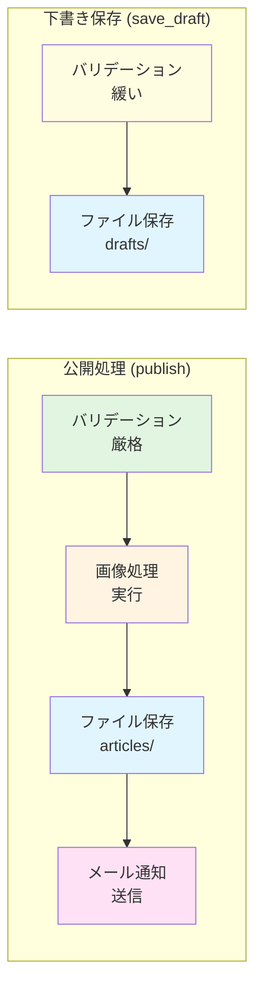
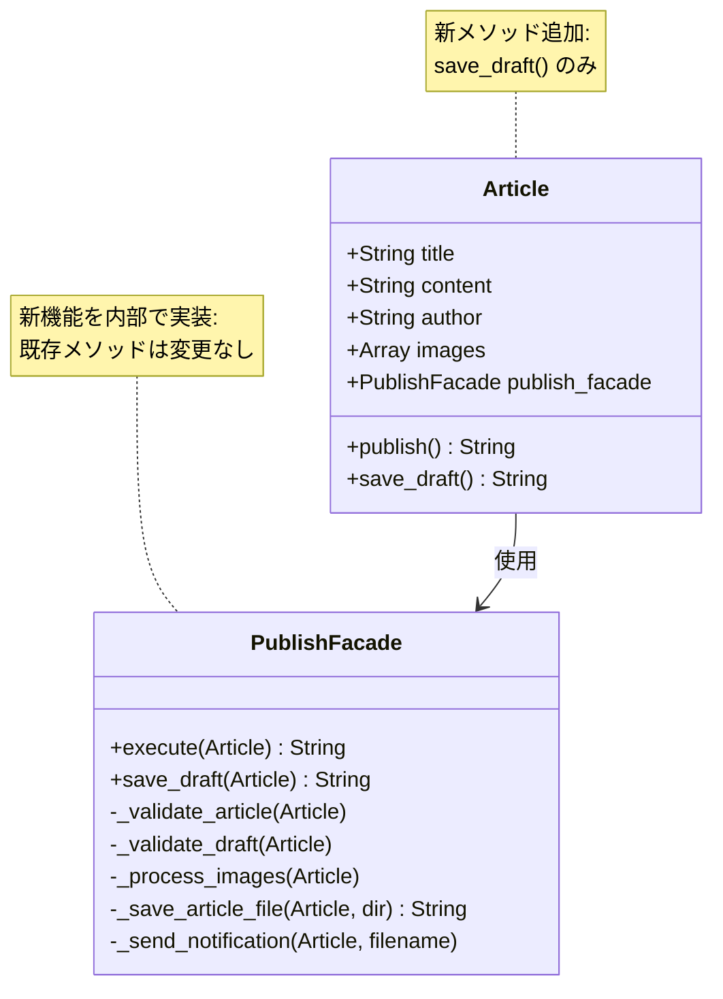
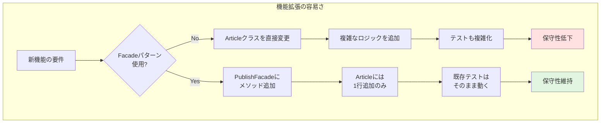

## はじめに

こんにちは！「自然に覚えるデザインパターン（Facade）」連載の第8回、最終回です。

これまでの7回で、ブログ記事公開システムを段階的に構築し、複雑化した`publish()`メソッドをFacadeパターンでリファクタリングし、テスト容易性を向上させてきました。

最終回では、**新機能の追加**を通じて、Facadeパターンの真の価値を実感します。Facadeパターンがあることで、機能拡張がどれほど簡単になるか、実際に体験しましょう！

### 前回の振り返り

前回は、Facadeパターンによるテスト容易性の向上を学びました：

- `PublishFacade`をモック化することで、単体テストが書ける
- テストピラミッド戦略（単体テスト多、統合テスト中、E2Eテスト少）
- 高速なテストにより、開発速度が向上

テストしやすい設計は、良い設計です。

### 今回のゴール

第8回では、以下を実現します：

- 下書き保存機能の要件を理解する
- `save_draft()`メソッドを実装する
- 既存コードへの影響が最小限であることを確認する
- Facadeパターンの拡張性を体験する
- 連載全体を振り返り、Facadeパターンの真価をまとめる

## 新機能の要件：下書き保存

### なぜ下書き保存が必要か？

ブログシステムでは、記事をいきなり公開するのではなく、**下書きとして保存**する機能が必要です：

- **途中で保存**: 記事を書いている途中で保存できる
- **公開前の確認**: 公開前にプレビューや修正ができる
- **段階的な執筆**: 何度も保存しながら、徐々に記事を完成させる

WordPressやはてなブログなど、ほとんどのブログシステムにこの機能があります。

### 下書き保存と公開の違い

下書き保存と公開では、必要な処理が異なります：



| 処理 | 公開 (publish) | 下書き保存 (save_draft) |
|------|--------------|----------------------|
| バリデーション | ✅ 必須 | △ 緩い（タイトルのみなど） |
| 画像処理 | ✅ 実行 | ❌ 不要（公開時に行う） |
| ファイル保存 | ✅ `articles/` | ✅ `drafts/` |
| メール通知 | ✅ 送信 | ❌ 不要 |

下書き保存は、**公開の簡易版**といえます。

## Facadeパターンなしでの実装（問題点）

### もしFacadeパターンがなかったら...

Facadeパターンを使わない場合、`save_draft()`メソッドは以下のようになるでしょう：

```perl
# Facadeパターンなしでの実装（悪い例）
sub save_draft {
    my ($self) = @_;
    
    # バリデーション（緩いチェックのみ）
    if (!defined $self->title || $self->title eq '') {
        die "エラー: タイトルが空です\n";
    }
    
    # ファイル保存（ファイル名に「draft」を含める）
    my $filename = $self->title;
    $filename =~ s/\s+/-/g;
    $filename = lc $filename;
    $filename = "drafts/${filename}.txt";  # draftsディレクトリに保存
    
    my $output = sprintf(
        "Title: %s\nAuthor: %s\n\n%s\n",
        $self->title,
        $self->author,
        $self->content
    );
    
    path($filename)->spew_utf8($output);
    
    print "下書きを保存しました: $filename\n";
    
    return $filename;
}
```

この実装の問題点：

- **コードの重複**: `publish()`とほぼ同じコードを書いている（ファイル保存処理）
- **保守性の低下**: ファイル保存のロジックを変更する際、2箇所を変更する必要がある
- **テストの重複**: 同じような処理を2回テストしなければならない

Facadeパターンがあれば、この問題を回避できます！

## コード例1：save_draft()メソッドの実装

### PublishFacadeに下書き保存機能を追加

まず、`Article::PublishFacade`に`save_draft()`メソッドを追加します：

```perl
# Article/PublishFacade.pm（下書き保存機能追加版）
# Perl: v5.26以上推奨
# 外部依存: Moo, Path::Tiny, Article::Validator,
#          Article::ImageProcessor, Article::Notifier
package Article::PublishFacade;

use strict;
use warnings;
use utf8;
use Moo;
use Path::Tiny;
use Article::Validator;
use Article::ImageProcessor;
use Article::Notifier;

# サブシステム（前回と同じ、省略）
# ...

# 記事を公開する（前回と同じ）
sub execute {
    my ($self, $article) = @_;
    
    $self->_validate_article($article);
    $self->_process_images($article);
    my $filename = $self->_save_article_file($article, 'articles');
    $self->_send_notification($article, $filename);
    
    return $filename;
}

# 下書きを保存する（新規追加）
sub save_draft {
    my ($self, $article) = @_;
    
    # ステップ1: 緩いバリデーション（タイトルのみチェック）
    $self->_validate_draft($article);
    
    # ステップ2: ファイル保存（draftsディレクトリに）
    my $filename = $self->_save_article_file($article, 'drafts');
    
    print "[PublishFacade] 下書き保存完了: $filename\n";
    
    return $filename;
}

# 内部メソッド: 下書きのバリデーション（新規追加）
sub _validate_draft {
    my ($self, $article) = @_;
    
    # タイトルだけチェック（本文や著者は空でもOK）
    if (!defined $article->title || $article->title eq '') {
        die "エラー: タイトルが空です\n";
    }
    
    print "[PublishFacade] 下書きバリデーション完了\n";
}

# 内部メソッド: ファイル保存（リファクタリング）
# 公開と下書きの両方で使える汎用メソッドに変更
sub _save_article_file {
    my ($self, $article, $directory) = @_;
    $directory //= 'articles';  # デフォルトはarticles
    
    # ファイル名を生成
    my $filename = $article->title;
    $filename =~ s/\s+/-/g;
    $filename = lc $filename;
    $filename = "${directory}/${filename}.txt";
    
    # 記事の内容を整形
    my $output = sprintf(
        "Title: %s\nAuthor: %s\n\n%s\n",
        $article->title || '(タイトル未設定)',
        $article->author || '(著者未設定)',
        $article->content || '(本文未設定)'
    );
    
    # ディレクトリが存在しない場合は作成
    path($directory)->mkpath;
    
    # ファイルに保存
    path($filename)->spew_utf8($output);
    
    print "[PublishFacade] ファイル保存完了: $filename\n";
    
    return $filename;
}

# その他の内部メソッド（_validate_article, _process_images, _send_notificationなど）
# は前回と同じ（省略）

1;
```

### 重要なポイント

1. **save_draft()メソッドの追加**: 下書き保存用の新しい公開インターフェース
2. **_validate_draft()の追加**: 下書き用の緩いバリデーション
3. **_save_article_file()のリファクタリング**: 保存先ディレクトリを引数で指定できるように変更
4. **コードの再利用**: ファイル保存のロジックは公開と下書きで共通化

このように、Facadeクラス内部だけの変更で、新機能が実装できました！

## コード例2：既存コードへの影響が少ない様子

### Articleクラスにsave_draft()を追加

次に、`Article`クラスに`save_draft()`メソッドを追加します：

拡張後のクラス構成を見てみましょう：



```perl
# Article.pm（下書き保存機能追加版）
# Perl: v5.26以上推奨
# 外部依存: Moo, Article::PublishFacade
package Article;

use strict;
use warnings;
use utf8;
use Moo;
use Article::PublishFacade;

# 属性（前回と同じ、省略）
# ...

# PublishFacadeインスタンス（前回と同じ）
has publish_facade => (
    is      => 'ro',
    default => sub { Article::PublishFacade->new },
);

# 記事を公開する（前回と同じ、変更なし！）
sub publish {
    my ($self) = @_;
    
    return $self->publish_facade->execute($self);
}

# 下書きを保存する（新規追加）
sub save_draft {
    my ($self) = @_;
    
    # Facadeに処理を委譲するだけ！
    return $self->publish_facade->save_draft($self);
}

1;
```

驚くべきことに、`Article`クラスへの追加は**たった5行**です！

### 既存コードへの影響

新機能を追加したことによる、既存コードへの影響を確認しましょう：

**変更が必要だったクラス**:
- `Article::PublishFacade`: 新メソッド追加、内部メソッドのリファクタリング
- `Article`: 新メソッド追加（5行のみ）

**変更が不要だったクラス**:
- `Article::Validator`: 変更なし
- `Article::ImageProcessor`: 変更なし
- `Article::Notifier`: 変更なし

**テストへの影響**:
- 既存のテストは**すべてそのまま動く**
- 新しいテスト（`save_draft()`のテスト）を追加するだけ

これが、Facadeパターンの拡張性です！

## 動かしてみよう

### 実行例

下書き保存機能を実際に使ってみましょう：

```perl
#!/usr/bin/env perl
# test_save_draft.pl
use strict;
use warnings;
use utf8;
use lib './lib';
use Article;
use Path::Tiny;

# 下書き用のディレクトリを作成
path('drafts')->mkpath;

# 途中まで書いた記事
my $draft_article = Article->new(
    title   => '下書きのテスト',
    content => 'まだ書きかけです...',
    author  => '',  # 著者未設定でもOK（下書きなので）
);

print "=== 下書き保存 ===\n";

eval {
    my $filename = $draft_article->save_draft();
    print "下書き保存成功: $filename\n";
};

if ($@) {
    print "エラーが発生しました: $@";
}

print "\n=== 後で続きを書いて公開 ===\n";

# 記事を完成させる
$draft_article->author('draft_writer');
$draft_article->content($draft_article->content . "\n\n完成しました！");

eval {
    my $filename = $draft_article->publish();
    print "公開成功: $filename\n";
};

if ($@) {
    print "エラーが発生しました: $@";
}
```

実行結果：

```
=== 下書き保存 ===
[PublishFacade] 下書きバリデーション完了
[PublishFacade] ファイル保存完了: drafts/下書きのテスト.txt
下書き保存成功: drafts/下書きのテスト.txt

=== 後で続きを書いて公開 ===
[PublishFacade] バリデーション完了
[PublishFacade] ファイル保存完了: articles/下書きのテスト.txt
通知メールを送信しました: admin@example.com
[PublishFacade] 通知メール送信完了
公開成功: articles/下書きのテスト.txt
```

完璧に動きました！そして、下書き保存では画像処理やメール通知がスキップされていることが分かります。

## Facadeパターンの拡張性

### なぜ簡単に拡張できたのか？

下書き保存機能の追加が簡単だった理由：

1. **責任の集中**: 公開処理の複雑さが`PublishFacade`に集中している
2. **柔軟な設計**: 内部メソッドをパラメータ化（`_save_article_file($directory)`）
3. **既存機能の再利用**: ファイル保存ロジックを共通化
4. **開放閉鎖の原則**: 既存のメソッド（`execute()`）を変更せず、新しいメソッド（`save_draft()`）を追加

以下の図は、Facadeパターンによる拡張性の高さを示しています：



### 他の拡張例

Facadeパターンがあれば、他の機能も簡単に追加できます：

**例1: SNSへの投稿**
```perl
sub publish_with_sns {
    my ($self, $article) = @_;
    
    # 通常の公開処理
    my $filename = $self->execute($article);
    
    # SNSに投稿（新規処理）
    $self->_post_to_sns($article, $filename);
    
    return $filename;
}
```

**例2: 予約公開**
```perl
sub schedule_publish {
    my ($self, $article, $publish_time) = @_;
    
    # バリデーションだけ先に実行
    $self->_validate_article($article);
    
    # ジョブキューに登録
    $self->_enqueue_publish_job($article, $publish_time);
    
    return "予約公開が設定されました";
}
```

Facadeクラスに新しいメソッドを追加するだけで、様々な機能を実装できます！

## 連載の振り返り：全8回で学んだこと

### 第1回〜第4回：段階的な機能追加

- **第1回**: シンプルな記事公開機能（`Article`クラス、`publish()`メソッド）
- **第2回**: バリデーション追加（`Article::Validator`）
- **第3回**: 画像処理追加（`Article::ImageProcessor`）
- **第4回**: メール通知追加（`Article::Notifier`）

各機能を別クラスに分離したことで、単一責任の原則は守られました。しかし、`publish()`メソッドが複雑化しました。

以下の図は、連載全体の流れを示しています：

```mermaid
timeline
    title Facadeパターン学習の旅
    section 第1-4回 : 機能追加フェーズ
        第1回 : シンプルな実装
              : Article + publish()
        第2回 : バリデーション追加
              : Validator導入
        第3回 : 画像処理追加
              : ImageProcessor導入
        第4回 : メール通知追加
              : Notifier導入
              : publish()が35行に肥大化
    section 第5-6回 : リファクタリングフェーズ
        第5回 : 問題の認識と分析
              : 6つの問題点を整理
        第6回 : Facadeパターン導入
              : PublishFacade作成
              : publish()が3行に!
    section 第7-8回 : 効果の実感フェーズ
        第7回 : テスト容易性向上
              : モック化による単体テスト
        第8回 : 拡張性の体験
              : save_draft()を簡単に追加
```

### 第5回：問題の認識

複雑化した`publish()`メソッドの問題点を整理：

- 単一責任の原則違反
- 読みにくさ
- テストの困難さ
- 変更の影響範囲
- エラーハンドリングの不統一
- 処理順序の硬直性

問題を認識することが、解決への第一歩でした。

### 第6回：Facadeパターンの導入

`Article::PublishFacade`クラスを作成し、複雑な処理を統一インターフェースに集約：

- `publish()`メソッドが3行に
- すべての問題が解決
- コードがシンプルで読みやすく

### 第7回：テスト容易性の向上

Facadeパターンによるテストの改善：

- モックを使った単体テストが書ける
- テストが高速で安定
- テストピラミッド戦略の実現

### 第8回（今回）：拡張性の体験

下書き保存機能の追加を通じて、Facadeパターンの拡張性を実感：

- 既存コードへの影響が最小限
- 新機能が簡単に追加できる
- コードの再利用が容易

## Facadeパターンの真価

### いつ使うべきか？

Facadeパターンは、以下のような場合に有効です：

1. **複数のサブシステムがある**: 3つ以上のサブシステムを呼び出す複雑な処理
2. **クライアントコードをシンプルに保ちたい**: 詳細を隠蔽して、使いやすいインターフェースを提供
3. **サブシステムが変更される可能性がある**: Facadeが変更の影響を吸収
4. **テストしやすくしたい**: モック化による単体テストの実現

逆に、以下のような場合は不要です：

- サブシステムが1〜2個だけ
- 処理が非常にシンプル
- 将来的に機能が増える予定がない

### 他のデザインパターンとの関係

Facadeパターンは、他のパターンと組み合わせることも多いです：

- **Adapterパターン**: Facadeは簡素化、Adapterはインターフェース変換
- **Singletonパターン**: FacadeをSingletonにすることがある
- **Strategyパターン**: Facade内部で処理戦略を切り替える
- **Factoryパターン**: Facadeがサブシステムのインスタンスを生成

デザインパターンは、単独で使うよりも組み合わせることで、より強力になります。

### Facadeパターンの本質

この連載を通じて、Facadeパターンの本質が見えてきたのではないでしょうか：

**複雑さを消すのではなく、適切な場所に置く**

複雑さは必然的に発生します。機能が増えれば、コードも複雑になります。重要なのは、その複雑さを**どこに置くか**です。

Facadeパターンは、複雑さを専用のクラスに集約し、クライアントからは隠蔽します。これにより、システム全体の見通しが良くなり、保守性・拡張性・テスト容易性が向上するのです。

## おわりに

### 全8回、お疲れさまでした！

この連載「自然に覚えるデザインパターン（Facade）」は、これで完結です。第1回から最後まで読んでくださった皆さん、本当にありがとうございました！

### 次のステップ

この連載で学んだことを、ぜひ実際のプロジェクトで活用してください：

1. **既存のコードを見直す**: 複雑化しているメソッドはないか？
2. **リファクタリングを試す**: Facadeパターンで整理できるか？
3. **テストを書く**: Facadeをモック化した単体テストを書いてみる
4. **他のパターンも学ぶ**: Adapter、Strategy、Factoryなど

デザインパターンは、実践してこそ身につきます。

### さらに学びたい方へ

Perlとデザインパターンについてさらに学びたい方は、以下の記事もおすすめです：




また、次の連載もお楽しみに！

## まとめ

### 今回学んだこと

第8回では、以下のことを学びました：

- **下書き保存機能の実装**
- **Facadeクラスへの機能追加の容易さ**
- **既存コードへの影響が最小限であること**
- **Facadeパターンの拡張性**

### 連載全体のまとめ

全8回を通じて学んだこと：

1. **段階的な機能追加**: シンプルな実装から始めて、徐々に複雑化
2. **問題の認識**: 複雑化したコードの問題点を整理
3. **Facadeパターンの導入**: 複雑さを適切な場所に集約
4. **テスト容易性**: モックを使った単体テストの実現
5. **拡張性**: 新機能が簡単に追加できる設計

### Facadeパターンの価値

- **シンプルさ**: クライアントコードが読みやすくなる
- **保守性**: 変更が局所化され、影響範囲が明確
- **テスト容易性**: モック化による高速なテスト
- **拡張性**: 新機能が簡単に追加できる

これらすべてが、**良い設計**の条件です。

### 最後に

デザインパターンは魔法ではありません。適切な場面で適切に使うことが重要です。

でも、Facadeパターンを知っていることで、複雑なコードに直面したとき、「どう整理すればいいか」のヒントが得られます。

それでは、また次の連載でお会いしましょう！Happy Coding with Perl! 🐪✨

---

**連載リンク（全8回完結）**:
- 第1回：[Facadeパターン入門：ブログ記事を公開しよう](/2026/01/06/120000/)
- 第2回：[バリデーションを追加する](/2026/01/06/130000/)
- 第3回：[画像を自動リサイズする](/2026/01/06/140000/)
- 第4回：[メール通知を送る](/2026/01/06/150000/)
- 第5回：[publish()が複雑すぎる！](/2026/01/06/160000/)
- 第6回：[Facadeパターンで解決する](/2026/01/06/170000/)
- 第7回：[テストしやすくなった！](/2026/01/06/180000/)
- 第8回（今回）：下書き保存機能を追加

**関連記事**:


