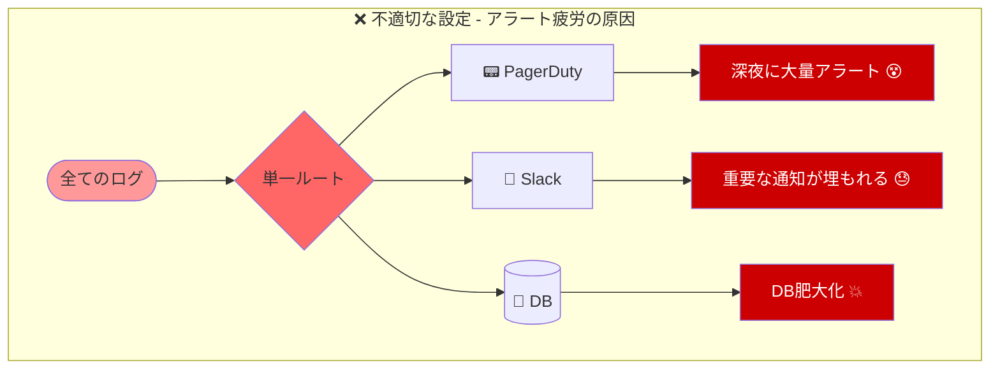
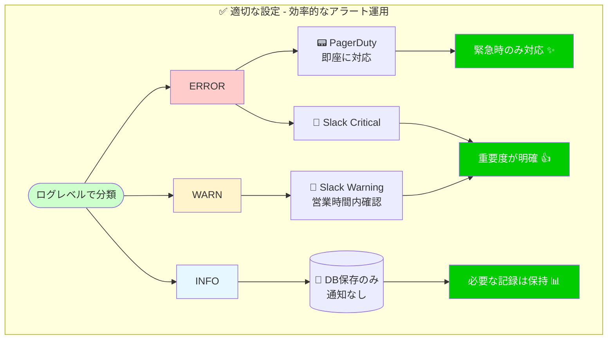
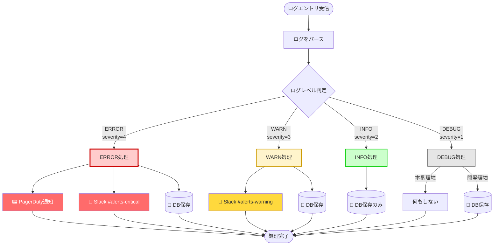

# ログ監視システムの要件定義と基本設計 - ログレベルとアラートルーティング【Perl】

> この記事は「ログ監視と多段アラート判定 - Chain of Responsibilityパターン実践」シリーズの第1回です。  
> Perlでログ監視システムを構築し、デザインパターンで保守性を高める実践的な連載です。

## この記事で学べること

- ✅ プロダクション環境で必要なログ監視の要件定義方法
- ✅ アラートレベル（ERROR、WARN、INFO）の設計原則
- ✅ 複数通知先へのルーティング実装（Slack、PagerDuty）
- ✅ アラート疲労を防ぐベストプラクティス

## 想定読者

- Perlで実務経験があり、ログ監視を実装する必要がある方
- アラート設計で悩んでいる運用担当者
- Modern Perl（Perl 5.36+）のベストプラクティスを学びたい方

---

## はじめに：なぜログ監視が重要なのか

システム運用の現場で、「あの障害、ログを見れば予兆があったのに...」という経験はありませんか？ログ監視は、システムの健全性を保つための最も基本的で、かつ最も重要な仕組みです。

本連載では、Perlを使ってログ監視システムを段階的に構築していきます。第1回となる本記事では、プロダクション環境で本当に必要な要件を整理し、基本設計を行います。

### 連載の構成

| 回数 | タイトル | 内容 |
|-----|---------|-----|
| 第1回（本記事） | 要件定義と基本設計 | ログレベルとアラートルーティングの基本を実装 |
| 第2回 | Mooでハンドラクラス実装 | Moo/Moo::Roleによるクラス設計 |
| 第3回 | Chain of Responsibility適用 | ハンドラチェーンで処理を連結し完成 |

---

## ログ監視の要件定義

### プロダクション環境での現実

実際の運用現場では、以下のような要件が発生します：

#### 🔴 ERROR（エラー）
- 性質: システム障害や重大なエラー
- 必要な対応: 即座の対応が必要
- 通知先: PagerDuty + Slack（緊急チャンネル）
- 例: データベース接続失敗、API呼び出しエラー、クラッシュ

#### 🟡 WARN（警告）
- 性質: 潜在的な問題や注意が必要な事象
- 必要な対応: 営業時間内に確認・対処
- 通知先: Slack（通常チャンネル）
- 例: ディスク使用率が80%到達、リトライ処理の発生

#### 🟢 INFO（情報）
- 性質: 正常な動作の記録
- 必要な対応: 記録のみ（通知不要）
- 保存先: ログファイル、データベース
- 例: ユーザーログイン、処理完了、定期実行タスク

### アラート疲労（Alert Fatigue）を防ぐ

アラート疲労とは、大量のアラートによって担当者が鈍感化し、本当に重要なアラートを見逃してしまうリスクです。

#### 防ぐための原則

1. ログレベルの厳格な運用
   - ERRORとWARNだけをアラート対象とする
   - INFOやDEBUGはディスク記録のみ

2. 適切な通知先の選定
   - 緊急度に応じて通知先を分ける
   - すべてをPagerDutyに送らない

3. 動的しきい値の活用
   - 通常の変動範囲を学習し、本当の異常時のみアラート
   - 静的閾値（例：常に90%でアラート）は過剰反応を招く

#### アラート疲労の問題を視覚化

不適切な設定と適切な設定を比較してみましょう：




図2: アラート疲労の問題と解決策の比較

この図から以下が理解できます：

| 設定タイプ | 結果 | 問題点/利点 |
|----------|------|-----------|
| 不適切な設定 | すべてのログで通知 | ・深夜に大量アラート<br/>・重要な通知が埋もれる<br/>・対応コストが増大 |
| 適切な設定 | ログレベルで通知先を分離 | ・緊急時のみ即座に対応<br/>・重要度が明確<br/>・担当者の負担軽減 |

---

## ログレベルの理解と実装

### ログレベルとアラートフローの全体像

まず、ログレベルごとにどのように通知がルーティングされるかを視覚化してみましょう：



図1: ログレベル別アラートルーティングフロー

この図から、以下の重要なポイントが理解できます：

- ERROR（赤色）: 最も重要度が高く、PagerDuty・Slack・DBの3つに通知
- WARN（黄色）: 中程度の重要度で、Slack・DBの2つに通知
- INFO（緑色）: 通知は不要で、記録のみ（DB保存）
- DEBUG（グレー）: 本番環境では何もせず、開発環境のみDB保存

### ログレベルの定義

Modern Perlらしく、まずはログレベルを定数として定義しましょう：

```perl
use v5.36;
use warnings;

# ログレベル定数の定義
use constant {
    LOG_ERROR => 4,
    LOG_WARN  => 3,
    LOG_INFO  => 2,
    LOG_DEBUG => 1,
};

# レベル名からseverityへのマッピング
my %LEVEL_MAP = (
    ERROR => LOG_ERROR,
    WARN  => LOG_WARN,
    INFO  => LOG_INFO,
    DEBUG => LOG_DEBUG,
);
```

ポイント：
- 数値が大きいほど重要度が高い設計
- `use constant`で型安全性を確保（タイポ防止）
- ハッシュでの逆引きも容易

### Severity Mapping の実装

ログエントリからseverityを判定する関数を実装します：

```perl
use v5.36;
use warnings;

# ログレベル定数
use constant {
    LOG_ERROR => 4,
    LOG_WARN  => 3,
    LOG_INFO  => 2,
    LOG_DEBUG => 1,
};

sub parse_log_entry($line) {
    # 正規表現でログをパース
    # 想定フォーマット: "2026-01-05 12:34:56 [ERROR] Database connection failed"
    if ($line =~ /^\d{4}-\d{2}-\d{2}\s+\d{2}:\d{2}:\d{2}\s+\[(\w+)\]\s+(.+)$/) {
        my ($level, $message) = ($1, $2);
        
        return {
            level    => $level,
            message  => $message,
            severity => get_severity($level),
            timestamp => time,
        };
    }
    
    return undef;  # パース失敗
}

sub get_severity($level) {
    my %level_map = (
        ERROR => LOG_ERROR,
        WARN  => LOG_WARN,
        INFO  => LOG_INFO,
        DEBUG => LOG_DEBUG,
    );
    
    return $level_map{$level} // 0;  # デフォルトは0
}

# 使用例
my $log_line = "2026-01-05 12:34:56 [ERROR] Database connection failed";
my $entry = parse_log_entry($log_line);

if ($entry) {
    say "Level: $entry->{level}";
    say "Severity: $entry->{severity}";
    say "Message: $entry->{message}";
}
```

Perlらしいポイント：
- `//`演算子（defined-or）でデフォルト値を簡潔に設定
- 正規表現でのキャプチャを即座に変数展開
- シグネチャ（5.36+）で引数を明示的に宣言

---

## アラートルーティングの基本設計

### 通知先の選定基準

| ログレベル | Severity | 通知先 | 理由 |
|----------|---------|-------|------|
| ERROR | 4 | PagerDuty + Slack | 即座の対応が必要 |
| WARN | 3 | Slack | 営業時間内に確認 |
| INFO | 2 | なし（記録のみ） | 通知不要 |
| DEBUG | 1 | なし（記録のみ） | 開発時のみ有効 |

### 振り分けロジックの初期実装

まずはシンプルなif/else実装から始めます：

```perl
use v5.36;
use warnings;
use feature 'say';

# ログレベル定数
use constant {
    LOG_ERROR => 4,
    LOG_WARN  => 3,
    LOG_INFO  => 2,
    LOG_DEBUG => 1,
};

sub route_alert($log_entry) {
    my $severity = $log_entry->{severity};
    my $message  = $log_entry->{message};
    
    # ERROR: PagerDutyとSlackの両方に通知
    if ($severity >= LOG_ERROR) {
        send_to_pagerduty($log_entry);
        send_to_slack($log_entry, channel => '#alerts-critical');
        save_to_database($log_entry);
        say "[ROUTED] ERROR → PagerDuty + Slack + DB";
    }
    # WARN: Slackのみに通知
    elsif ($severity >= LOG_WARN) {
        send_to_slack($log_entry, channel => '#alerts-warning');
        save_to_database($log_entry);
        say "[ROUTED] WARN → Slack + DB";
    }
    # INFO: 記録のみ
    elsif ($severity >= LOG_INFO) {
        save_to_database($log_entry);
        say "[ROUTED] INFO → DB only";
    }
    # DEBUG: 開発環境のみ記録
    else {
        save_to_database($log_entry) if $ENV{APP_ENV} eq 'development';
        say "[ROUTED] DEBUG → skipped in production";
    }
}

# スタブ実装（実際は外部API呼び出し）
sub send_to_pagerduty($entry) {
    say "  → PagerDuty: $entry->{message}";
    # 実装例: HTTP POSTでPagerDuty Events API v2を呼び出し
}

sub send_to_slack($entry, %opts) {
    my $channel = $opts{channel} // '#general';
    say "  → Slack($channel): $entry->{message}";
    # 実装例: Slack Incoming Webhookを使用
}

sub save_to_database($entry) {
    say "  → Database: saved";
    # 実装例: DBIでINSERT文実行
}

# テスト実行
my @test_logs = (
    { severity => LOG_ERROR, message => "Database connection failed" },
    { severity => LOG_WARN,  message => "Disk usage at 85%" },
    { severity => LOG_INFO,  message => "User logged in" },
);

for my $log (@test_logs) {
    say "\nProcessing: $log->{message}";
    route_alert($log);
}
```

実行結果：
```
Processing: Database connection failed
  → PagerDuty: Database connection failed
  → Slack(#alerts-critical): Database connection failed
  → Database: saved
[ROUTED] ERROR → PagerDuty + Slack + DB

Processing: Disk usage at 85%
  → Slack(#alerts-warning): Disk usage at 85%
  → Database: saved
[ROUTED] WARN → Slack + DB

Processing: User logged in
  → Database: saved
[ROUTED] INFO → DB only
```

### この実装の問題点

一見シンプルで分かりやすいこのコードですが、以下の問題があります：

1. 拡張性の欠如
   - 新しい通知先を追加するには、既存コードの修正が必要
   - 例：「ERRORでもDB系はJiraにも通知」を追加するには？

2. 責任の集中
   - `route_alert()`関数が全ての判定と通知を担当
   - 単一責任の原則（SRP）に違反

3. テストの困難性
   - 各通知先のモック化が複雑
   - 条件分岐ごとにテストケースが増える

4. 可読性の低下（今後）
   - さらに条件が増えるとネストが深くなる
   - if-elseスパゲッティ化のリスク

次回予告：第2回では、これらの問題をMooとMoo::Roleで解決していきます！

---

## 実際に動かしてみよう

### 完全な動作例

ここまでの内容を統合した、実際に動作するスクリプトです：

```perl
#!/usr/bin/env perl
use v5.36;
use warnings;
use feature 'say';

# ログレベル定数
use constant {
    LOG_ERROR => 4,
    LOG_WARN  => 3,
    LOG_INFO  => 2,
    LOG_DEBUG => 1,
};

# ログパース関数
sub parse_log_entry($line) {
    if ($line =~ /^\d{4}-\d{2}-\d{2}\s+\d{2}:\d{2}:\d{2}\s+\[(\w+)\]\s+(.+)$/) {
        my ($level, $message) = ($1, $2);
        
        return {
            level    => $level,
            message  => $message,
            severity => get_severity($level),
            timestamp => time,
        };
    }
    
    return undef;
}

sub get_severity($level) {
    my %level_map = (
        ERROR => LOG_ERROR,
        WARN  => LOG_WARN,
        INFO  => LOG_INFO,
        DEBUG => LOG_DEBUG,
    );
    
    return $level_map{$level} // 0;
}

# アラートルーティング
sub route_alert($log_entry) {
    my $severity = $log_entry->{severity};
    
    if ($severity >= LOG_ERROR) {
        send_to_pagerduty($log_entry);
        send_to_slack($log_entry, channel => '#alerts-critical');
        save_to_database($log_entry);
    }
    elsif ($severity >= LOG_WARN) {
        send_to_slack($log_entry, channel => '#alerts-warning');
        save_to_database($log_entry);
    }
    elsif ($severity >= LOG_INFO) {
        save_to_database($log_entry);
    }
}

# 通知先実装（スタブ）
sub send_to_pagerduty($entry) {
    say "  [PagerDuty] 🚨 $entry->{message}";
}

sub send_to_slack($entry, %opts) {
    my $channel = $opts{channel} // '#general';
    say "  [Slack:$channel] 💬 $entry->{message}";
}

sub save_to_database($entry) {
    say "  [Database] 💾 Saved: $entry->{level}";
}

# メイン処理
sub main() {
    # テスト用ログデータ
    my @log_lines = (
        "2026-01-05 12:00:00 [ERROR] Database connection failed",
        "2026-01-05 12:05:00 [WARN] Disk usage at 85%",
        "2026-01-05 12:10:00 [INFO] User admin logged in",
        "2026-01-05 12:15:00 [ERROR] Payment API timeout",
    );
    
    say "=== Log Monitoring System - Part 1 ===\n";
    
    for my $line (@log_lines) {
        my $entry = parse_log_entry($line);
        
        if ($entry) {
            say "Processing: [$entry->{level}] $entry->{message}";
            route_alert($entry);
            say "";
        }
    }
}

main();
```

### 実行結果

```
=== Log Monitoring System - Part 1 ===

Processing: [ERROR] Database connection failed
  [PagerDuty] 🚨 Database connection failed
  [Slack:#alerts-critical] 💬 Database connection failed
  [Database] 💾 Saved: ERROR

Processing: [WARN] Disk usage at 85%
  [Slack:#alerts-warning] 💬 Disk usage at 85%
  [Database] 💾 Saved: WARN

Processing: [INFO] User admin logged in
  [Database] 💾 Saved: INFO

Processing: [ERROR] Payment API timeout
  [PagerDuty] 🚨 Payment API timeout
  [Slack:#alerts-critical] 💬 Payment API timeout
  [Database] 💾 Saved: ERROR
```

### 試してみよう

このコードを`log_monitor_v1.pl`として保存し、実行してみましょう：

```bash
chmod +x log_monitor_v1.pl
./log_monitor_v1.pl
```

実際のログファイルを読み込む場合：

```perl
# ファイルから読み込む例
use Path::Tiny;

sub process_log_file($filepath) {
    my @lines = path($filepath)->lines_utf8;
    
    for my $line (@lines) {
        my $entry = parse_log_entry($line);
        route_alert($entry) if $entry;
    }
}
```

---

## ベストプラクティスと注意点

### ログレベルの使い分け指針

#### ❌ よくない例

```perl
# INFOにエラーを混ぜない
say "[INFO] Database error occurred";  # これはERROR!

# WARNを多用しすぎない
say "[WARN] User clicked button";  # これはINFO!
```

#### ✅ 良い例

```perl
# 明確な基準で分類
if ($db_connection_failed) {
    say "[ERROR] Database connection failed: $error";  # 処理継続不可
}

if ($disk_usage > 0.8) {
    say "[WARN] Disk usage high: ${disk_usage}%";  # 注意が必要
}

say "[INFO] User $user_id logged in at $timestamp";  # 正常な記録
```

### セキュリティ上の注意

```perl
# ❌ 機密情報をログに出力しない
say "[ERROR] Login failed for password: $password";

# ✅ 必要最小限の情報のみ
say "[ERROR] Login failed for user: $username";
```

### パフォーマンス考慮

```perl
# ログレベルチェックを先に行う
sub debug_log($message) {
    return unless $ENV{LOG_LEVEL} eq 'DEBUG';  # 早期リターン
    
    # 重い処理はここ
    my $detailed_info = get_detailed_debug_info();
    say "[DEBUG] $message: $detailed_info";
}
```

---

## まとめと次回予告

### 本記事で学んだこと

1. ログ監視の要件定義
   - プロダクション環境で必要な要件を整理
   - アラート疲労を防ぐ設計原則

2. ログレベルの理解
   - ERROR/WARN/INFO/DEBUGの明確な使い分け
   - Severity mappingの実装

3. アラートルーティングの基本
   - 通知先の選定基準
   - シンプルなif/else実装

4. 問題点の認識
   - 拡張性、責任の集中、テストの困難性
   - 今後の改善の方向性

### 次回予告：Mooでハンドラクラスを実装する

第2回では、本記事で見えてきた問題点を解決します：

- Mooによるクラス設計: 通知ハンドラ、フィルタハンドラを独立したクラスに分離
- Moo::Roleでインターフェース定義: 共通の振る舞いをロールで定義
- 拡張性の確保: 新しいハンドラの追加が既存コード修正なしで可能に

こんな実装を目指します：

```perl
# 第2回で実装するコードのプレビュー
use Moo;

package SlackNotifier {
    use Moo;
    with 'NotifierRole';
    
    sub notify($self, $log_entry) {
        # Slack通知の実装
    }
}

package PagerDutyNotifier {
    use Moo;
    with 'NotifierRole';
    
    sub notify($self, $log_entry) {
        # PagerDuty通知の実装
    }
}
```

楽しみにしていてください！ 🚀

---

## 次回予告

次回は、このif/elseスパゲッティをMooを使ったハンドラクラスにリファクタリングします。Moo::Roleでインターフェースを定義し、各通知先を独立したクラスとして実装することで、拡張性と保守性を大きく向上させます。



---

## 参考リンク

### 関連記事

- [Chain of Responsibilityパターン調査ドキュメント](/warehouse/chain-of-responsibility-pattern/)
- [Moo OOP連載調査](/warehouse/moo-oop-series-research/)
- [デザインパターン概要](/warehouse/design-patterns-overview/)

### 外部リソース

- [ログ監視とは？目的とツール - AI Security](https://aisecurity.co.jp/article/3006)
- [アラート疲労対策 - LogicMonitor](https://www.logicmonitor.jp/blog/network-monitoring-avoid-alert-fatigue)
- [Log Levels Explained - Zenduty](https://zenduty.com/blog/log-levels/)
- [Moo公式ドキュメント - MetaCPAN](https://metacpan.org/pod/Moo)

---

## シリーズ記事

1. 本番環境のログ監視要件定義 - アラートレベル設計とルーティング実装【Perl】（本記事）
2. Mooでハンドラクラスを実装する - Moo::Roleによる拡張可能な設計【Perl】（次回）
3. Chain of Responsibilityでログ処理パイプライン構築 - 本番対応完全版【Perl】
