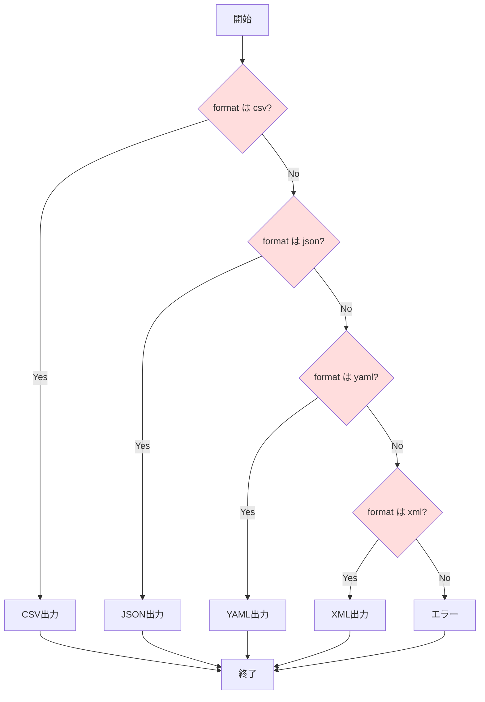

[@nqounet](https://twitter.com/nqounet)です。

前回は、if/elseを使ってCSVとJSONの2つの形式でアドレス帳データを出力できるようにしました。

今回は、新しい形式を追加するとコードがどうなるか見ていきましょう。

## YAMLとXML形式も追加したい

お客様から「YAML形式とXML形式でも出力したい」というリクエストが来ました。

さっそく対応してみましょう。前回のif/else文に新しい条件を追加します。



```perl
#!/usr/bin/env perl
use v5.36;
use JSON::PP;
use YAML::Tiny;

# アドレス帳データ
my @contacts = (
    { name => '田中太郎', email => 'tanaka@example.com', phone => '090-1234-5678' },
    { name => '鈴木花子', email => 'suzuki@example.com', phone => '080-2345-6789' },
    { name => '佐藤次郎', email => 'sato@example.com',   phone => '070-3456-7890' },
);

# コマンドライン引数から形式を取得（デフォルトはcsv）
my $format = $ARGV[0] // 'csv';

# 形式に応じて出力を切り替え
if ($format eq 'csv') {
    # CSV形式で出力
    say "name,email,phone";
    for my $contact (@contacts) {
        say "$contact->{name},$contact->{email},$contact->{phone}";
    }
}
elsif ($format eq 'json') {
    # JSON形式で出力
    my $json = JSON::PP->new->pretty->encode(\@contacts);
    print $json;
}
elsif ($format eq 'yaml') {
    # YAML形式で出力
    my $yaml = YAML::Tiny->new(\@contacts);
    print $yaml->write_string;
}
elsif ($format eq 'xml') {
    # XML形式で出力
    say '<?xml version="1.0" encoding="UTF-8"?>';
    say '<contacts>';
    for my $contact (@contacts) {
        say '  <contact>';
        say "    <name>$contact->{name}</name>";
        say "    <email>$contact->{email}</email>";
        say "    <phone>$contact->{phone}</phone>";
        say '  </contact>';
    }
    say '</contacts>';
}
else {
    die "未対応の形式です: $format\n";
}
```

## 動作確認

YAML形式で出力：

```shell
cpanm YAML::Tiny  # 初回のみ
perl exporter.pl yaml
```

出力結果：

```yaml
---
- email: tanaka@example.com
  name: 田中太郎
  phone: 090-1234-5678
- email: suzuki@example.com
  name: 鈴木花子
  phone: 080-2345-6789
- email: sato@example.com
  name: 佐藤次郎
  phone: 070-3456-7890
```

XML形式で出力：

```shell
perl exporter.pl xml
```

出力結果：

```xml
<?xml version="1.0" encoding="UTF-8"?>
<contacts>
  <contact>
    <name>田中太郎</name>
    <email>tanaka@example.com</email>
    <phone>090-1234-5678</phone>
  </contact>
  ...
</contacts>
```

動きましたね！でも、コードを見てください…

## if/elseが肥大化している！

コードが長くなってきました。問題点を整理してみましょう。

```
 ┌──────────────────────────────────────────────────────────────┐
 │                        exporter.pl                           │
 ├──────────────────────────────────────────────────────────────┤
 │  if (csv)  { CSV出力処理... }                                │
 │  elsif (json) { JSON出力処理... }                            │
 │  elsif (yaml) { YAML出力処理... }      ← どんどん増える！    │
 │  elsif (xml)  { XML出力処理... }                             │
 │  elsif (tsv)  { ... }                                        │
 │  elsif (markdown) { ... }                                    │
 │  elsif (html) { ... }                                        │
 │  ...                                                         │
 └──────────────────────────────────────────────────────────────┘
```

**問題1: コードが長くなる**

形式が増えるたびに`elsif`ブロックが増えていきます。今は4形式ですが、TSV、Markdown、HTML…と増えていくと、このファイルは何百行にもなるでしょう。

**問題2: 変更時の影響範囲が大きい**

CSV出力の処理を修正したいだけなのに、JSON、YAML、XMLの処理も同じファイル内にあります。うっかり別の形式のコードを壊してしまうかもしれません。

**問題3: テストが難しい**

CSV出力だけをテストしたくても、このファイル全体を読み込む必要があります。

**問題4: 新しい形式の追加が怖い**

既存のコードに手を入れるので、動いている部分を壊してしまう可能性があります。

## これが「コードの臭い」です

このような問題を**コードの臭い（Code Smell）**と呼びます。

今回のケースは「**長いメソッド（Long Method）**」や「**分岐の多さ（Switch Statements）**」という典型的なコードの臭いです。

コードの臭いは、今すぐバグになるわけではありませんが、将来的に問題を引き起こす兆候です。

## どうすれば良いのか？

次回から、このコードを改善していきます。

まずは「出力処理を別のクラスに分ける」ことから始めましょう。そうすることで、各形式の処理が独立し、変更や追加がしやすくなります。

## 今回の完成コード

```perl
#!/usr/bin/env perl
use v5.36;
use JSON::PP;
use YAML::Tiny;

# アドレス帳データ
my @contacts = (
    { name => '田中太郎', email => 'tanaka@example.com', phone => '090-1234-5678' },
    { name => '鈴木花子', email => 'suzuki@example.com', phone => '080-2345-6789' },
    { name => '佐藤次郎', email => 'sato@example.com',   phone => '070-3456-7890' },
);

# コマンドライン引数から形式を取得（デフォルトはcsv）
my $format = $ARGV[0] // 'csv';

# 形式に応じて出力を切り替え
if ($format eq 'csv') {
    # CSV形式で出力
    say "name,email,phone";
    for my $contact (@contacts) {
        say "$contact->{name},$contact->{email},$contact->{phone}";
    }
}
elsif ($format eq 'json') {
    # JSON形式で出力
    my $json = JSON::PP->new->pretty->encode(\@contacts);
    print $json;
}
elsif ($format eq 'yaml') {
    # YAML形式で出力
    my $yaml = YAML::Tiny->new(\@contacts);
    print $yaml->write_string;
}
elsif ($format eq 'xml') {
    # XML形式で出力
    say '<?xml version="1.0" encoding="UTF-8"?>';
    say '<contacts>';
    for my $contact (@contacts) {
        say '  <contact>';
        say "    <name>$contact->{name}</name>";
        say "    <email>$contact->{email}</email>";
        say "    <phone>$contact->{phone}</phone>";
        say '  </contact>';
    }
    say '</contacts>';
}
else {
    die "未対応の形式です: $format\n";
}
```

## まとめ

- 新しい形式を追加するとif/elseが肥大化することを体験しました
- コードが長くなると、保守性やテスト容易性が低下します
- このような問題を「コードの臭い」と呼びます
- 次回から、この問題を解決するためのリファクタリングを始めます

次回は、出力処理を専用クラスに分けていきます。お楽しみに！
