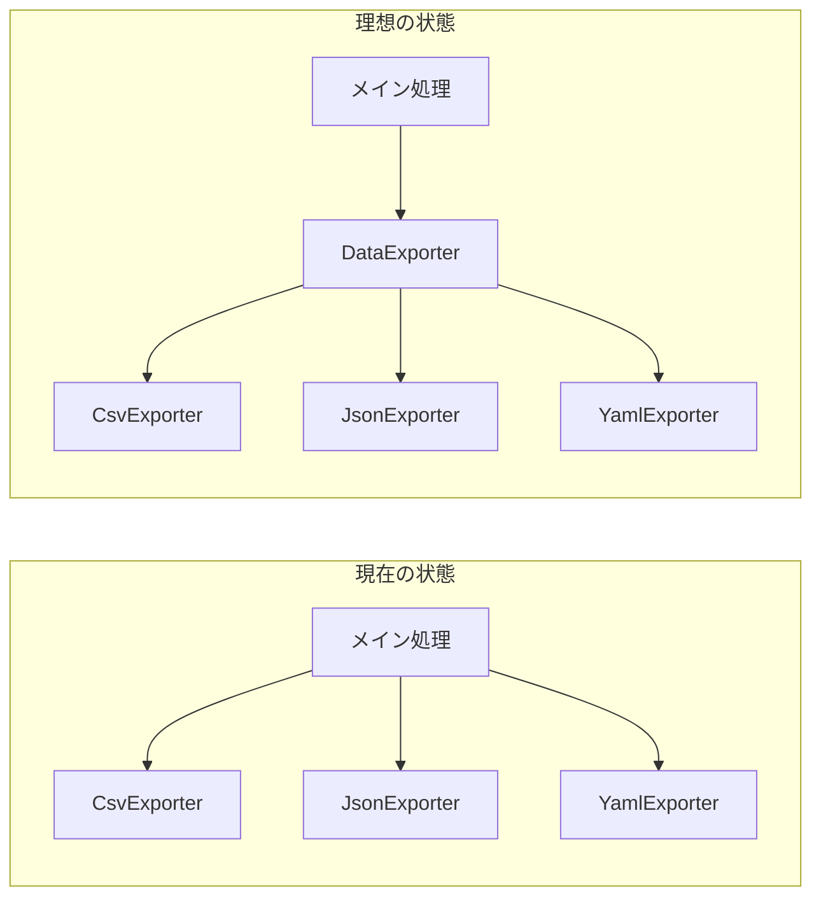
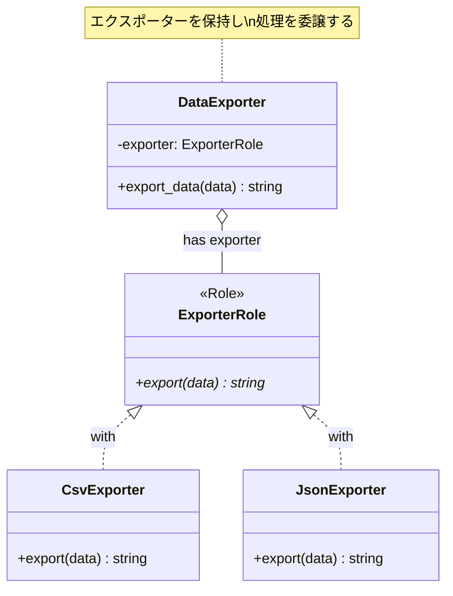

[@nqounet](https://twitter.com/nqounet)です。

前回は、Moo::Roleを使って「exportメソッドを持つ」という約束を定義しました。

今回は、エクスポーターを管理する専用のクラス「DataExporter」を作ります。

## なぜ管理クラスが必要なのか？

現在のメイン処理を見てみましょう。

```perl
# 形式に応じてエクスポーターを選択
my $exporter;
if ($format eq 'csv') {
    $exporter = CsvExporter->new;
}
elsif ($format eq 'json') {
    $exporter = JsonExporter->new;
}

# エクスポーターを使って出力
print $exporter->export(\@contacts);
```

この処理は「アドレス帳データをエクスポートする」という1つの機能ですが、複数のクラスを直接触っています。



もしこの機能を別の場所でも使いたい場合、同じコードをコピーすることになります。

そこで、エクスポーターを管理する専用のクラスを作り、使う側はそのクラスだけを意識すれば良いようにしましょう。

## DataExporterクラスを作る

エクスポーターを保持し、データのエクスポートを担当するクラスを作ります。



```perl
package DataExporter {
    use Moo;
    use v5.36;

    has exporter => (
        is       => 'ro',
        required => 1,
    );

    sub export_data ($self, $data) {
        return $self->exporter->export($data);
    }
}
```

このクラスの役割は以下の通りです：

- `exporter`属性でエクスポーターオブジェクトを保持
- `export_data`メソッドで、保持しているエクスポーターにデータの出力を依頼

`export_data`メソッドの中身を見ると、`$self->exporter->export($data)`と書いてあります。

これは「自分が持っているエクスポーターのexportメソッドを呼び出す」という意味です。このように、別のオブジェクトにお仕事を任せることを**委譲（delegation）**と呼びます。

## DataExporterを使う

作成したDataExporterクラスを使って、メイン処理を書き直します。

```perl
#!/usr/bin/env perl
use v5.36;
use JSON::PP;

# ========================================
# ExporterRole - エクスポーターの約束
# ========================================
package ExporterRole {
    use Moo::Role;
    requires 'export';
}

# ========================================
# CsvExporterクラス
# ========================================
package CsvExporter {
    use Moo;
    use v5.36;
    with 'ExporterRole';

    sub export ($self, $data) {
        my $output = "name,email,phone\n";
        for my $contact (@$data) {
            $output .= "$contact->{name},$contact->{email},$contact->{phone}\n";
        }
        return $output;
    }
}

# ========================================
# JsonExporterクラス
# ========================================
package JsonExporter {
    use Moo;
    use v5.36;
    use JSON::PP;
    with 'ExporterRole';

    sub export ($self, $data) {
        return JSON::PP->new->pretty->encode($data);
    }
}

# ========================================
# DataExporterクラス（エクスポーター管理）
# ========================================
package DataExporter {
    use Moo;
    use v5.36;

    has exporter => (
        is       => 'ro',
        required => 1,
    );

    sub export_data ($self, $data) {
        return $self->exporter->export($data);
    }
}

# ========================================
# メイン処理
# ========================================
package main;

# アドレス帳データ
my @contacts = (
    { name => '田中太郎', email => 'tanaka@example.com', phone => '090-1234-5678' },
    { name => '鈴木花子', email => 'suzuki@example.com', phone => '080-2345-6789' },
    { name => '佐藤次郎', email => 'sato@example.com',   phone => '070-3456-7890' },
);

# コマンドライン引数から形式を取得
my $format = $ARGV[0] // 'csv';

# 形式に応じてエクスポーターを選択
my $exporter_obj;
if ($format eq 'csv') {
    $exporter_obj = CsvExporter->new;
}
elsif ($format eq 'json') {
    $exporter_obj = JsonExporter->new;
}
else {
    die "未対応の形式です: $format\n";
}

# DataExporterを作成してエクスポート
my $data_exporter = DataExporter->new(exporter => $exporter_obj);
print $data_exporter->export_data(\@contacts);
```

## 何が良くなったのか？

### 1. 使う側はDataExporterだけを意識すれば良い

```perl
my $data_exporter = DataExporter->new(exporter => CsvExporter->new);
print $data_exporter->export_data(\@contacts);
```

### 2. 拡張がしやすい

将来、ログ出力やエラーハンドリングを追加したい場合、DataExporterクラスに追加すれば全体に適用されます。

### 3. テストがしやすい

DataExporterクラスを個別にテストでき、モック（テスト用の偽物）も注入しやすくなります。

## 今回のポイント

今回作った`DataExporter`のようなクラスを、設計の用語で**Context（コンテキスト）**と呼ぶことがあります。

Contextは「状況」や「文脈」という意味で、「どのエクスポーターを使うか」という状況を管理するクラスです。

また、「Mooで覚えるオブジェクト指向プログラミング」シリーズの第11回で学んだ**委譲**の考え方も活用しています。

## まとめ

- エクスポーターを管理するDataExporterクラスを作りました
- `has exporter`でエクスポーターオブジェクトを保持します
- `export_data`メソッドで、保持しているエクスポーターに処理を委譲します
- 使う側はDataExporterだけを意識すれば良くなりました

次回は、実行時にエクスポーターを切り替える機能を追加します。お楽しみに！
