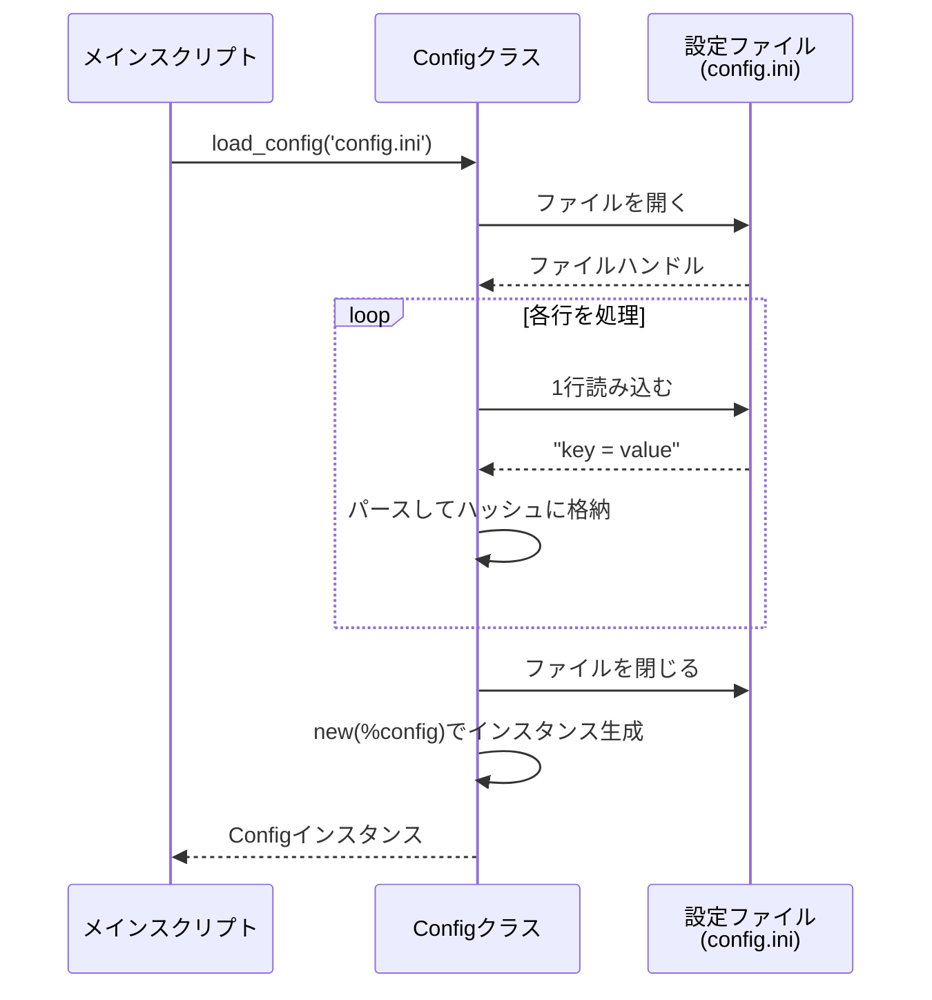

[@nqounet](https://x.com/nqounet)です。

シリーズ「設定ファイルマネージャーを作ってみよう」の第2回です。

## 前回のおさらい

[第1回](/2026/01/07/093522/)では、ハードコードされた設定値をMooのConfigクラスで管理する方法を学びました。アプリケーション名、バージョン、デバッグモードなどの設定値をConfigクラスの属性として管理できるようになりました。

しかし、前回のコードには1つ課題があります。設定値を変更するには、コードを直接編集する必要があるのです。本番環境と開発環境で設定を切り替えたい場合、そのたびにコードを書き換えるのは現実的ではありません。

## 今回学ぶこと

今回の新しい概念は「ファイル読み込み」です。

外部ファイルから設定を読み込む `load_config` メソッドを追加することで、コードを変更せずに設定を切り替えられるようになります。設定ファイルには、シンプルで広く使われているINI形式を採用します。

設定ファイル読み込みの流れは以下のとおりです。



*図1: load_configメソッドによる設定ファイル読み込みの流れ*

## INI形式の設定ファイル

INI形式は、シンプルなキーと値のペアで設定を記述するフォーマットです。以下のような形式で記述します。

```ini
# これはコメントです
db_host = localhost
db_port = 3306
db_name = myapp
db_user = admin
db_pass = secret123

api_url = https://api.example.com
api_timeout = 30

log_file = /var/log/myapp.log
debug_mode = 1
```

この形式の特徴は以下のとおりです。

- `key = value` の形式で設定を記述する
- `#` で始まる行はコメントとして無視される
- 空行は無視される
- シンプルで人間が読み書きしやすい

## INI風ファイルの読み込み処理

まず、INI形式のファイルを読み込む基本的な処理を見てみましょう。

```perl
#!/usr/bin/env perl
use v5.36;

sub load_config ($filename) {
    my %config;

    open my $fh, '<', $filename
        or die "Cannot open $filename: $!";

    while (my $line = <$fh>) {
        chomp $line;

        # 空行とコメント行をスキップ
        next if $line =~ /^\s*$/;
        next if $line =~ /^\s*#/;

        # key = value の形式をパース
        if ($line =~ /^\s*(\w+)\s*=\s*(.*)$/) {
            my ($key, $value) = ($1, $2);
            $value =~ s/\s+$//;  # 末尾の空白を除去
            $config{$key} = $value;
        }
    }

    close $fh;
    return %config;
}

# テスト用：設定ファイルを読み込んで表示
my %settings = load_config('config.ini');

for my $key (sort keys %settings) {
    say "$key = $settings{$key}";
}
```

このコードのポイントを解説します。

- `open my $fh, '<', $filename` : ファイルを読み取りモードで開く
- `while (my $line = <$fh>)` : ファイルを1行ずつ読み込む
- `chomp $line` : 行末の改行文字を除去する
- `next if $line =~ /^\s*$/` : 空行をスキップする
- `next if $line =~ /^\s*#/` : コメント行をスキップする
- `$line =~ /^\s*(\w+)\s*=\s*(.*)$/` : キーと値をキャプチャする正規表現

## 設定ファイル読み込み対応版

次に、このファイル読み込み機能をConfigクラスに組み込みます。

```perl
#!/usr/bin/env perl
use v5.36;

# === Configクラスの定義 ===
package Config {
    use Moo;

    # データベース設定
    has db_host => (
        is      => 'ro',
        default => sub { 'localhost' },
    );

    has db_port => (
        is      => 'ro',
        default => sub { 3306 },
    );

    has db_name => (
        is      => 'ro',
        default => sub { 'myapp' },
    );

    has db_user => (
        is      => 'ro',
        default => sub { 'admin' },
    );

    has db_pass => (
        is      => 'ro',
        default => sub { 'secret123' },
    );

    # API設定
    has api_url => (
        is      => 'ro',
        default => sub { 'https://api.example.com' },
    );

    has api_timeout => (
        is      => 'ro',
        default => sub { 30 },
    );

    # ログ設定
    has log_file => (
        is      => 'ro',
        default => sub { '/var/log/myapp.log' },
    );

    has debug_mode => (
        is      => 'ro',
        default => sub { 1 },
    );

    # ファイルから設定を読み込んでインスタンスを生成
    sub load_config ($class, $filename) {
        my %config;

        open my $fh, '<', $filename
            or die "Cannot open $filename: $!";

        while (my $line = <$fh>) {
            chomp $line;

            # 空行とコメント行をスキップ
            next if $line =~ /^\s*$/;
            next if $line =~ /^\s*#/;

            # key = value の形式をパース
            if ($line =~ /^\s*(\w+)\s*=\s*(.*)$/) {
                my ($key, $value) = ($1, $2);
                $value =~ s/\s+$//;  # 末尾の空白を除去
                $config{$key} = $value;
            }
        }

        close $fh;

        # 読み込んだ設定でインスタンスを生成
        return $class->new(%config);
    }
}

# === メイン処理 ===
package main;

# 設定ファイルから読み込んでインスタンスを生成
my $config = Config->load_config('config.ini');

# データベースに接続する処理
say "Connecting to " . $config->db_host . ":" . $config->db_port
    . "/" . $config->db_name . " as " . $config->db_user;

# APIにリクエストを送る処理
say "Calling API: " . $config->api_url
    . " (timeout: " . $config->api_timeout . "s)";

# ログファイルに書き込む処理
say "Logging to " . $config->log_file
    . " (debug: " . $config->debug_mode . ")";
```

## コード解説

### load_configメソッドの構造

`load_config` はクラスメソッドとして定義しています。

```perl
sub load_config ($class, $filename) {
    # ...
    return $class->new(%config);
}
```

- 第1引数の `$class` にはクラス名（`Config`）が渡される
- 設定ファイルを読み込んでハッシュに格納する
- 最後に `$class->new(%config)` でインスタンスを生成して返す

このように設計することで、`Config->load_config('config.ini')` という自然な形式で呼び出せます。

### ファイルが存在しない場合のエラー処理

`open` が失敗した場合、`die` でプログラムを終了します。

```perl
open my $fh, '<', $filename
    or die "Cannot open $filename: $!";
```

`$!` には、ファイルが開けなかった理由（「No such file or directory」など）が格納されています。

### 設定ファイルに存在しないキーの扱い

設定ファイルに記載されていない項目は、Mooの `default` で定義したデフォルト値が使われます。これにより、すべての設定項目を設定ファイルに書く必要がなくなります。

## 使い方

まず、`config.ini` ファイルを作成します。

```ini
# 開発環境の設定
db_host = dev-db.example.com
db_name = myapp_dev
debug_mode = 1
```

次に、スクリプトを実行します。

```shell
perl config_demo.pl
```

設定ファイルに記載された値が使われ、記載されていない項目はデフォルト値が適用されます。

## 今回のまとめ

今回は、ファイル読み込みの概念を学びました。

- INI形式の設定ファイルの構造を理解した
- Perlでファイルを1行ずつ読み込む方法を学んだ
- 正規表現を使ってキーと値をパースする方法を学んだ
- Configクラスに `load_config` メソッドを追加した
- 設定ファイルに存在しないキーはデフォルト値が使われることを確認した

次回は、このConfigクラスをさらに発展させていきます。



## 完成コード

今回の完成コードです。`config_demo.pl` として保存して実行できます。

```perl
#!/usr/bin/env perl
use v5.36;

# === Configクラスの定義 ===
package Config {
    use Moo;

    # データベース設定
    has db_host => (
        is      => 'ro',
        default => sub { 'localhost' },
    );

    has db_port => (
        is      => 'ro',
        default => sub { 3306 },
    );

    has db_name => (
        is      => 'ro',
        default => sub { 'myapp' },
    );

    has db_user => (
        is      => 'ro',
        default => sub { 'admin' },
    );

    has db_pass => (
        is      => 'ro',
        default => sub { 'secret123' },
    );

    # API設定
    has api_url => (
        is      => 'ro',
        default => sub { 'https://api.example.com' },
    );

    has api_timeout => (
        is      => 'ro',
        default => sub { 30 },
    );

    # ログ設定
    has log_file => (
        is      => 'ro',
        default => sub { '/var/log/myapp.log' },
    );

    has debug_mode => (
        is      => 'ro',
        default => sub { 1 },
    );

    # ファイルから設定を読み込んでインスタンスを生成
    sub load_config ($class, $filename) {
        my %config;

        open my $fh, '<', $filename
            or die "Cannot open $filename: $!";

        while (my $line = <$fh>) {
            chomp $line;

            # 空行とコメント行をスキップ
            next if $line =~ /^\s*$/;
            next if $line =~ /^\s*#/;

            # key = value の形式をパース
            if ($line =~ /^\s*(\w+)\s*=\s*(.*)$/) {
                my ($key, $value) = ($1, $2);
                $value =~ s/\s+$//;  # 末尾の空白を除去
                $config{$key} = $value;
            }
        }

        close $fh;

        # 読み込んだ設定でインスタンスを生成
        return $class->new(%config);
    }
}

# === メイン処理 ===
package main;

# 設定ファイルの作成（デモ用）
my $config_content = <<'END_CONFIG';
# 開発環境の設定
db_host = dev-db.example.com
db_name = myapp_dev
db_user = developer
db_pass = dev_password

api_url = https://dev-api.example.com
api_timeout = 60

debug_mode = 1
END_CONFIG

# デモ用の設定ファイルを作成
open my $fh, '>', 'config.ini' or die "Cannot create config.ini: $!";
print $fh $config_content;
close $fh;

say "Created config.ini for demo";
say "";

# 設定ファイルから読み込んでインスタンスを生成
my $config = Config->load_config('config.ini');

# データベースに接続する処理
say "Connecting to " . $config->db_host . ":" . $config->db_port
    . "/" . $config->db_name . " as " . $config->db_user;

# APIにリクエストを送る処理
say "Calling API: " . $config->api_url
    . " (timeout: " . $config->api_timeout . "s)";

# ログファイルに書き込む処理
say "Logging to " . $config->log_file
    . " (debug: " . $config->debug_mode . ")";

say "";
say "Note: db_port and log_file use default values";
say "      because they are not specified in config.ini";
```

このスクリプトを実行するには、まずMooをインストールしてください。

```shell
cpanm Moo
perl config_demo.pl
```

実行結果:

```
Created config.ini for demo

Connecting to dev-db.example.com:3306/myapp_dev as developer
Calling API: https://dev-api.example.com (timeout: 60s)
Logging to /var/log/myapp.log (debug: 1)

Note: db_port and log_file use default values
      because they are not specified in config.ini
```
