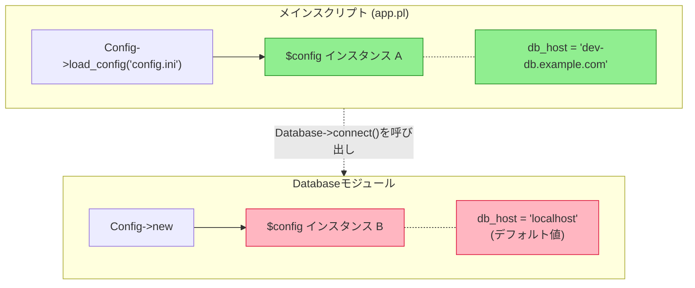

[@nqounet](https://x.com/nqounet)です。

シリーズ「設定ファイルマネージャーを作ってみよう」の第3回です。

## 前回のおさらい

[第2回](/2026/01/07/093725/)では、外部のINI形式の設定ファイルを読み込む `load_config` メソッドを追加しました。これにより、コードを変更せずに設定を切り替えられるようになりました。

しかし、アプリケーションが大きくなってくると、メインスクリプトだけでなく、さまざまなモジュールから設定を参照したくなります。今回は、複数の場所から設定を使おうとしたときに発生する問題を見ていきます。

## 今回学ぶこと

今回の新しい概念は「複数箇所での利用」です。

アプリケーションが成長すると、データベース処理、API通信、ログ出力など、機能ごとにモジュールを分割することになります。それぞれのモジュールで設定値を参照したい場合、どのようにConfigクラスを使えばよいのでしょうか。

現在のコードで発生する問題を図で確認しましょう。



*図1: 複数インスタンス問題 - 各モジュールが別々のConfigインスタンスを持ってしまう*

この図のように、メインスクリプトとDatabaseモジュールで別々のインスタンスが作成されてしまうことが問題です。

## ファイル構成

今回は、以下のようにファイルを分割して実装します。

```
.
├── config.ini          # 設定ファイル
├── lib/
│   ├── Config.pm       # 設定クラス
│   └── Database.pm     # データベース処理モジュール
└── app.pl              # メインスクリプト
```

## メインスクリプトでの設定読み込み

まず、メインスクリプト `app.pl` を見てみましょう。設定ファイルを読み込み、データベースモジュールを呼び出します。

```perl
#!/usr/bin/env perl
use v5.36;
use lib 'lib';
use Config;
use Database;

# 設定ファイルを読み込んでConfigインスタンスを作成
my $config = Config->load_config('config.ini');

say "=== Main Script ===";
say "DB Host (from main): " . $config->db_host;
say "Debug Mode (from main): " . $config->debug_mode;
say "";

# データベースモジュールを使う
Database->connect();
```

このコードでは、`Config->load_config('config.ini')` で設定ファイルを読み込み、その設定値を表示しています。その後、`Database` モジュールの `connect` メソッドを呼び出します。

## 別モジュールでも設定を使いたい

次に、`lib/Database.pm` を見てみましょう。このモジュールでも設定値を参照したいので、Configクラスを使います。

```perl
package Database;
use v5.36;
use Config;

sub connect ($class) {
    # 設定を参照するためにConfigインスタンスを作成
    my $config = Config->new;

    say "=== Database Module ===";
    say "DB Host (from Database): " . $config->db_host;
    say "DB Port (from Database): " . $config->db_port;
    say "Debug Mode (from Database): " . $config->debug_mode;

    # 実際のDB接続処理...
    say "Connecting to database...";
}

1;
```

ここで問題が発生しています。`Database` モジュールでは、`Config->new` で新しいConfigインスタンスを作成しています。

## 問題の発覚

このコードを実行すると、以下のような結果になります。

```
=== Main Script ===
DB Host (from main): dev-db.example.com
Debug Mode (from main): 1

=== Database Module ===
DB Host (from Database): localhost
DB Port (from Database): 3306
Debug Mode (from Database): 1

Connecting to database...
```

おかしいことに気づきましたか？メインスクリプトでは `db_host` が `dev-db.example.com` と表示されているのに、Databaseモジュールでは `localhost` になっています。

これは、メインスクリプトとDatabaseモジュールで**別々のConfigインスタンス**を作成しているためです。

- メインスクリプト: `Config->load_config('config.ini')` で設定ファイルを読み込んだインスタンス
- Databaseモジュール: `Config->new` でデフォルト値だけのインスタンス

## なぜこれが問題なのか

この問題は、アプリケーションが大きくなるにつれて深刻になります。

- 設定ファイルを読み込んだはずなのに、一部のモジュールではデフォルト値が使われる
- どのモジュールでも設定ファイルを読み込めばよいが、同じファイルを何度も読み込むのは非効率である
- 設定を変更しても、すでに作成されたインスタンスには反映されない
- どのインスタンスが「正しい設定」を持っているのか、追跡が困難になる

## 今回のまとめ

今回は、複数箇所での利用という概念を学びました。

- メインスクリプトとモジュールで別々にConfigインスタンスを作成した
- それぞれのインスタンスが独立しているため、設定が共有されない問題が発覚した
- 設定ファイルを読み込んだインスタンスとデフォルトのインスタンスが混在する危険性を確認した

次回は、この問題を解決する方法を学びます。アプリケーション全体で同じ設定インスタンスを共有するにはどうすればよいのでしょうか？



## 完成コード

今回の完成コードです。以下のファイル構成で保存してください。

```
.
├── config.ini
├── lib/
│   ├── Config.pm
│   └── Database.pm
└── app.pl
```

### config.ini

```ini
# 開発環境の設定
db_host = dev-db.example.com
db_name = myapp_dev
db_user = developer
db_pass = dev_password

api_url = https://dev-api.example.com
api_timeout = 60

debug_mode = 1
```

### lib/Config.pm

```perl
package Config;
use v5.36;
use Moo;

# データベース設定
has db_host => (
    is      => 'ro',
    default => sub { 'localhost' },
);

has db_port => (
    is      => 'ro',
    default => sub { 3306 },
);

has db_name => (
    is      => 'ro',
    default => sub { 'myapp' },
);

has db_user => (
    is      => 'ro',
    default => sub { 'admin' },
);

has db_pass => (
    is      => 'ro',
    default => sub { 'secret123' },
);

# API設定
has api_url => (
    is      => 'ro',
    default => sub { 'https://api.example.com' },
);

has api_timeout => (
    is      => 'ro',
    default => sub { 30 },
);

# ログ設定
has log_file => (
    is      => 'ro',
    default => sub { '/var/log/myapp.log' },
);

has debug_mode => (
    is      => 'ro',
    default => sub { 1 },
);

# ファイルから設定を読み込んでインスタンスを生成
sub load_config ($class, $filename) {
    my %config;

    open my $fh, '<', $filename
        or die "Cannot open $filename: $!";

    while (my $line = <$fh>) {
        chomp $line;

        # 空行とコメント行をスキップ
        next if $line =~ /^\s*$/;
        next if $line =~ /^\s*#/;

        # key = value の形式をパース
        if ($line =~ /^\s*(\w+)\s*=\s*(.*)$/) {
            my ($key, $value) = ($1, $2);
            $value =~ s/\s+$//;  # 末尾の空白を除去
            $config{$key} = $value;
        }
    }

    close $fh;

    # 読み込んだ設定でインスタンスを生成
    return $class->new(%config);
}

1;
```

### lib/Database.pm

```perl
package Database;
use v5.36;
use Config;

sub connect ($class) {
    # 設定を参照するためにConfigインスタンスを作成
    # ⚠️ 問題: ここで新しいインスタンスを作成している
    my $config = Config->new;

    say "=== Database Module ===";
    say "DB Host (from Database): " . $config->db_host;
    say "DB Port (from Database): " . $config->db_port;
    say "Debug Mode (from Database): " . $config->debug_mode;

    # 実際のDB接続処理...
    say "Connecting to database...";
}

1;
```

### app.pl

```perl
#!/usr/bin/env perl
use v5.36;
use lib 'lib';
use Config;
use Database;

# 設定ファイルを読み込んでConfigインスタンスを作成
my $config = Config->load_config('config.ini');

say "=== Main Script ===";
say "DB Host (from main): " . $config->db_host;
say "Debug Mode (from main): " . $config->debug_mode;
say "";

# データベースモジュールを使う
Database->connect();
```

このスクリプトを実行するには、まずMooをインストールしてください。

```shell
cpanm Moo
perl app.pl
```

実行結果:

```
=== Main Script ===
DB Host (from main): dev-db.example.com
Debug Mode (from main): 1

=== Database Module ===
DB Host (from Database): localhost
DB Port (from Database): 3306
Debug Mode (from Database): 1

Connecting to database...
```

メインスクリプトでは設定ファイルの値が使われていますが、Databaseモジュールではデフォルト値が使われていることがわかります。これが今回発覚した問題です。
