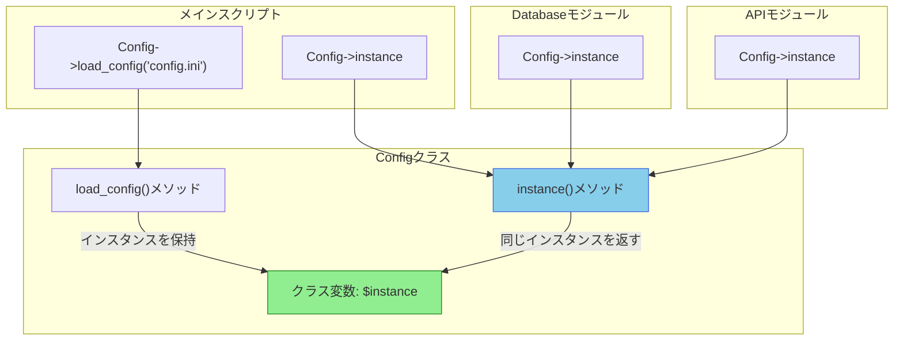

[@nqounet](https://x.com/nqounet)です。

シリーズ「設定ファイルマネージャーを作ってみよう」の第4回です。

## 前回のおさらい

[第3回](/2026/01/07/093928/)では、複数の場所からConfigクラスを使おうとしたときに発生する問題を確認しました。メインスクリプトでは設定ファイルを読み込んだインスタンスを使っていたのに、別モジュールでは `Config->new` で新しいインスタンスを作成してしまい、設定が共有されないという問題でした。

今回は、この問題を解決する方法を学びます。

## 今回学ぶこと

今回の新しい概念は「instance()メソッド」です。

アプリケーション全体で同じConfigインスタンスを共有するには、どこからでも同じインスタンスを取得できる仕組みが必要です。そのために、クラス変数を使ってインスタンスを保持し、`instance()` メソッドを通じてのみインスタンスを取得する設計を導入します。

以下の図で、instance()メソッドによる単一インスタンス保証の仕組みを確認しましょう。



*図1: instance()メソッドによる単一インスタンス共有の仕組み*

どのモジュールから呼び出しても、同じインスタンスが返されることがポイントです。

## ファイル構成

前回と同じファイル構成を使用しますが、`Config.pm` と `Database.pm` を修正します。

```
.
├── config.ini
├── lib/
│   ├── Config.pm
│   └── Database.pm
└── app.pl
```

## クラス変数によるインスタンス保持

まず、Configクラスにクラス変数を追加してインスタンスを保持する仕組みを見てみましょう。

```perl
package Config;
use v5.36;
use Moo;

# クラス変数でインスタンスを保持
our $instance;

# 設定属性（前回と同じ）
has db_host => (
    is      => 'ro',
    default => sub { 'localhost' },
);

# ... 他の属性 ...

# instance()メソッド：常に同じインスタンスを返す
sub instance ($class) {
    return $instance if defined $instance;
    $instance = $class->new;
    return $instance;
}
```

このコードのポイントを解説します。

- `our $instance` : パッケージ変数（クラス変数）としてインスタンスを保持する。`our` で宣言された変数は、パッケージ内で共有される
- `instance()` メソッド : インスタンスがすでに存在すればそれを返し、存在しなければ新しく作成して保持する

## instance()メソッドの実装

次に、完全な実装を見てみましょう。設定ファイルからの読み込みにも対応します。

```perl
package Config;
use v5.36;
use Moo;

# クラス変数でインスタンスを保持
our $instance;

# データベース設定
has db_host => (
    is      => 'ro',
    default => sub { 'localhost' },
);

has db_port => (
    is      => 'ro',
    default => sub { 3306 },
);

has db_name => (
    is      => 'ro',
    default => sub { 'myapp' },
);

has db_user => (
    is      => 'ro',
    default => sub { 'admin' },
);

has db_pass => (
    is      => 'ro',
    default => sub { 'secret123' },
);

# API設定
has api_url => (
    is      => 'ro',
    default => sub { 'https://api.example.com' },
);

has api_timeout => (
    is      => 'ro',
    default => sub { 30 },
);

# ログ設定
has log_file => (
    is      => 'ro',
    default => sub { '/var/log/myapp.log' },
);

has debug_mode => (
    is      => 'ro',
    default => sub { 1 },
);

# 唯一のインスタンスを取得
sub instance ($class) {
    return $instance if defined $instance;
    $instance = $class->new;
    return $instance;
}

# ファイルから設定を読み込んでインスタンスを初期化
sub load_config ($class, $filename) {
    my %config;

    open my $fh, '<', $filename
        or die "Cannot open $filename: $!";

    while (my $line = <$fh>) {
        chomp $line;

        # 空行とコメント行をスキップ
        next if $line =~ /^\s*$/;
        next if $line =~ /^\s*#/;

        # key = value の形式をパース
        if ($line =~ /^\s*(\w+)\s*=\s*(.*)$/) {
            my ($key, $value) = ($1, $2);
            $value =~ s/\s+$//;  # 末尾の空白を除去
            $config{$key} = $value;
        }
    }

    close $fh;

    # クラス変数にインスタンスを保持
    $instance = $class->new(%config);
    return $instance;
}

1;
```

## コード解説

### instance()メソッドの動作

`instance()` メソッドは、以下のように動作します。

```perl
sub instance ($class) {
    return $instance if defined $instance;
    $instance = $class->new;
    return $instance;
}
```

- インスタンスがすでに存在する場合（`defined $instance`）は、それをそのまま返す
- インスタンスが存在しない場合は、`new` で作成して `$instance` に保持してから返す
- 2回目以降の呼び出しでは、必ず最初に作成したインスタンスが返される

### load_config()メソッドの変更点

`load_config()` メソッドも、クラス変数にインスタンスを保持するように変更しました。

```perl
$instance = $class->new(%config);
return $instance;
```

これにより、`load_config()` で読み込んだ設定が、その後の `instance()` 呼び出しでも取得できるようになります。

### Databaseモジュールの修正

`Database.pm` では、`Config->new` の代わりに `Config->instance` を使います。

```perl
package Database;
use v5.36;
use Config;

sub connect ($class) {
    # instance()を使って共有インスタンスを取得
    my $config = Config->instance;

    say "=== Database Module ===";
    say "DB Host (from Database): " . $config->db_host;
    say "DB Port (from Database): " . $config->db_port;
    say "Debug Mode (from Database): " . $config->debug_mode;

    say "Connecting to database...";
}

1;
```

### メインスクリプトの修正

メインスクリプトでも、設定の取得に `instance()` を使うように統一できます。

```perl
#!/usr/bin/env perl
use v5.36;
use lib 'lib';
use Config;
use Database;

# 設定ファイルを読み込んで初期化
Config->load_config('config.ini');

# 以降はinstance()で取得
my $config = Config->instance;

say "=== Main Script ===";
say "DB Host (from main): " . $config->db_host;
say "Debug Mode (from main): " . $config->debug_mode;
say "";

# データベースモジュールを使う
Database->connect();
```

## 実行結果

修正後のコードを実行すると、以下のような結果になります。

```
=== Main Script ===
DB Host (from main): dev-db.example.com
Debug Mode (from main): 1

=== Database Module ===
DB Host (from Database): dev-db.example.com
DB Port (from Database): 3306
Debug Mode (from Database): 1

Connecting to database...
```

メインスクリプトでもDatabaseモジュールでも、同じ `db_host`（`dev-db.example.com`）が表示されています。設定ファイルで指定した値がアプリケーション全体で共有されるようになりました。

## なぜこれで問題が解決したのか

この設計により、以下のことが保証されます。

- `Config->load_config()` で初期化したインスタンスがクラス変数に保持される
- どのモジュールから `Config->instance` を呼び出しても、同じインスタンスが返される
- 設定ファイルを読み込むのは最初の1回だけでよい
- アプリケーション全体で一貫した設定値が使われる

## 今回のまとめ

今回は、instance()メソッドという概念を学びました。

- クラス変数（`our $instance`）を使ってインスタンスを保持する仕組みを実装した
- `instance()` メソッドで常に同じインスタンスを返すようにした
- `load_config()` で読み込んだ設定が、`instance()` を通じてアプリケーション全体で共有されるようになった
- 前回発覚した「設定が共有されない問題」を解決した

次回は、今回実装したこのパターンに名前があることを学びます。実は、これは広く知られたデザインパターンの1つです。



## 完成コード

今回の完成コードです。以下のファイル構成で保存してください。

```
.
├── config.ini
├── lib/
│   ├── Config.pm
│   └── Database.pm
└── app.pl
```

### config.ini

```ini
# 開発環境の設定
db_host = dev-db.example.com
db_name = myapp_dev
db_user = developer
db_pass = dev_password

api_url = https://dev-api.example.com
api_timeout = 60

debug_mode = 1
```

### lib/Config.pm

```perl
package Config;
use v5.36;
use Moo;

# クラス変数でインスタンスを保持
our $instance;

# データベース設定
has db_host => (
    is      => 'ro',
    default => sub { 'localhost' },
);

has db_port => (
    is      => 'ro',
    default => sub { 3306 },
);

has db_name => (
    is      => 'ro',
    default => sub { 'myapp' },
);

has db_user => (
    is      => 'ro',
    default => sub { 'admin' },
);

has db_pass => (
    is      => 'ro',
    default => sub { 'secret123' },
);

# API設定
has api_url => (
    is      => 'ro',
    default => sub { 'https://api.example.com' },
);

has api_timeout => (
    is      => 'ro',
    default => sub { 30 },
);

# ログ設定
has log_file => (
    is      => 'ro',
    default => sub { '/var/log/myapp.log' },
);

has debug_mode => (
    is      => 'ro',
    default => sub { 1 },
);

# 唯一のインスタンスを取得
sub instance ($class) {
    return $instance if defined $instance;
    $instance = $class->new;
    return $instance;
}

# ファイルから設定を読み込んでインスタンスを初期化
sub load_config ($class, $filename) {
    my %config;

    open my $fh, '<', $filename
        or die "Cannot open $filename: $!";

    while (my $line = <$fh>) {
        chomp $line;

        # 空行とコメント行をスキップ
        next if $line =~ /^\s*$/;
        next if $line =~ /^\s*#/;

        # key = value の形式をパース
        if ($line =~ /^\s*(\w+)\s*=\s*(.*)$/) {
            my ($key, $value) = ($1, $2);
            $value =~ s/\s+$//;  # 末尾の空白を除去
            $config{$key} = $value;
        }
    }

    close $fh;

    # クラス変数にインスタンスを保持
    $instance = $class->new(%config);
    return $instance;
}

1;
```

### lib/Database.pm

```perl
package Database;
use v5.36;
use Config;

sub connect ($class) {
    # instance()を使って共有インスタンスを取得
    my $config = Config->instance;

    say "=== Database Module ===";
    say "DB Host (from Database): " . $config->db_host;
    say "DB Port (from Database): " . $config->db_port;
    say "Debug Mode (from Database): " . $config->debug_mode;

    say "Connecting to database...";
}

1;
```

### app.pl

```perl
#!/usr/bin/env perl
use v5.36;
use lib 'lib';
use Config;
use Database;

# 設定ファイルを読み込んで初期化
Config->load_config('config.ini');

# 以降はinstance()で取得
my $config = Config->instance;

say "=== Main Script ===";
say "DB Host (from main): " . $config->db_host;
say "Debug Mode (from main): " . $config->debug_mode;
say "";

# データベースモジュールを使う
Database->connect();
```

このスクリプトを実行するには、まずMooをインストールしてください。

```shell
cpanm Moo
perl app.pl
```

実行結果:

```
=== Main Script ===
DB Host (from main): dev-db.example.com
Debug Mode (from main): 1

=== Database Module ===
DB Host (from Database): dev-db.example.com
DB Port (from Database): 3306
Debug Mode (from Database): 1

Connecting to database...
```

メインスクリプトでもDatabaseモジュールでも、設定ファイルの値（`dev-db.example.com`）が正しく共有されていることがわかります。前回の問題が解決しました。
