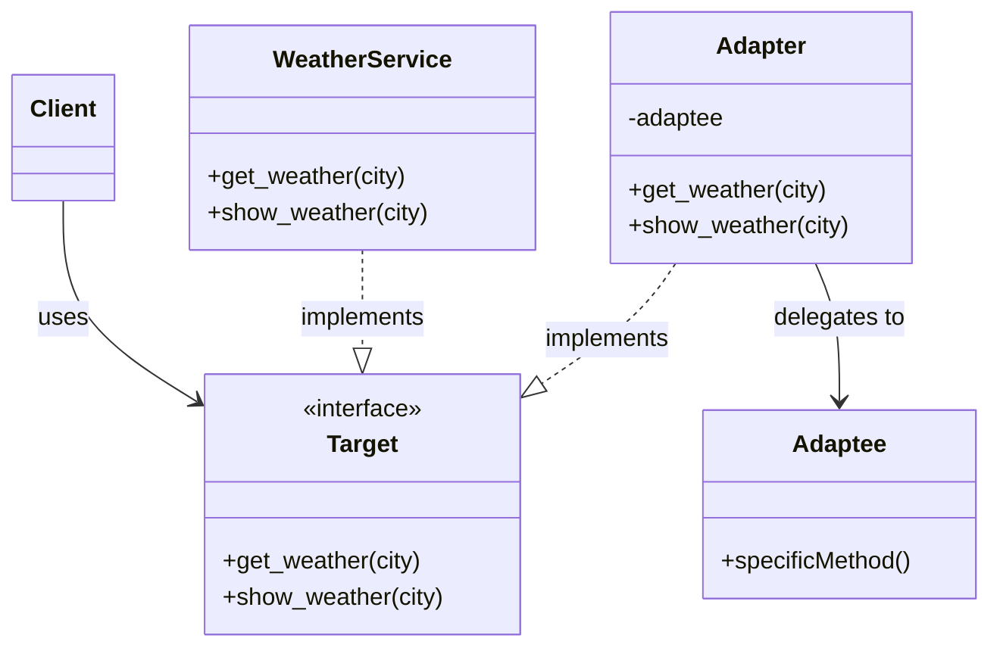

## はじめに

前回は、3つの天気サービスを橋渡しクラスで統一し、ループで処理する方法を学びました。



最終回となる今回は、これまで作成してきた「橋渡しクラス」の正体を明かします。実は、この設計手法にはAdapterパターンという名前があり、GoFデザインパターンの1つとして広く知られています。

### 前回までの振り返り

このシリーズで作成したものを振り返りましょう。

| 回 | 作成したもの | 役割 |
|---|-------------|-----|
| 第1回 | `WeatherService` | 統一インターフェースの基準 |
| 第2回 | `OldWeatherAPI` | 異なるインターフェースを持つサービス |
| 第3回 | `OldWeatherAdapter` | 橋渡しクラス（インターフェース変換） |
| 第4回 | `ForeignWeatherAdapter` | 2つ目の橋渡しクラス |

## 今回の目標

最終回となる今回は、これまで作成した設計が「Adapterパターン」であることを理解し、GoFデザインパターンとしての位置づけを学びます。

### 新しい概念: Adapterパターン

今回学ぶ新しい概念は「Adapterパターン」です。これは、互換性のないインターフェースを持つクラス同士を接続するためのデザインパターンです。

## これがAdapterパターンだ！

ここまで作成してきた「橋渡しクラス」は、実はAdapterパターンと呼ばれるデザインパターンの実装でした。

### Adapterパターンとは

Adapterパターンは、互換性のないインターフェースを持つクラスを接続するためのパターンです。電源プラグの変換アダプターをイメージするとわかりやすいでしょう。

- 日本のコンセント（2穴）と海外のプラグ（3穴）は直接接続できない
- 変換アダプターを使えば、異なる形状のプラグを接続できる
- 元のプラグもコンセントも変更する必要がない

プログラミングでも同じです。

- `WeatherService`（統一インターフェース）と `OldWeatherAPI`（異なるインターフェース）は直接互換性がない
- `OldWeatherAdapter`（橋渡しクラス = Adapter）を使えば、統一的に扱える
- 元のクラスを変更する必要がない

### GoFデザインパターン

Adapterパターンは、1994年に出版された書籍『Design Patterns』で紹介された23個のデザインパターンの1つです。著者の4人は「Gang of Four（GoF）」と呼ばれ、これらのパターンは「GoFデザインパターン」として知られています。

Adapterパターンは、GoFの分類では構造パターン（Structural Patterns）に属します。

## パターンの構造

Adapterパターンには、以下の登場人物（構成要素）があります。

| 役割 | 説明 | このシリーズでの例 |
|-----|------|-------------------|
| Target | クライアントが期待するインターフェース | `WeatherService` のインターフェース（`get_weather`, `show_weather`） |
| Adaptee | 既存のクラス（異なるインターフェース） | `OldWeatherAPI`, `ForeignWeatherService` |
| Adapter | TargetインターフェースをAdapteeに変換 | `OldWeatherAdapter`, `ForeignWeatherAdapter` |
| Client | Targetインターフェースを使用するコード | メイン処理 |

### パターン構造図（Mermaid）



この図では、ClientはTargetインターフェースのみを知っています。AdapterがAdapteeを内部に持ち、Targetインターフェースに変換しています。

### オブジェクトアダプター

このシリーズで採用した方式は「オブジェクトアダプター」と呼ばれます。Adapteeのインスタンスを保持（委譲）することでインターフェースを変換します。

```perl
package OldWeatherAdapter {
    use v5.36;
    use Moo;

    # Adaptee（OldWeatherAPI）を委譲で保持
    has 'old_api' => (
        is       => 'ro',
        required => 1,
    );

    # Targetインターフェースを実装
    sub get_weather ($self, $city) {
        # Adapteeのメソッドを呼び出し、結果を変換
        my $info = $self->old_api->fetch_weather_info($city);
        # ... 変換処理 ...
    }
}
```

Moo/Perlでは、オブジェクトアダプターが柔軟で推奨される方式です。

## Adapterパターンのメリット

Adapterパターンを使うことで、以下のメリットが得られます。

### 1. 既存コードを変更しない

```perl
# OldWeatherAPIは一切変更していない
package OldWeatherAPI {
    sub fetch_weather_info { ... }
}
```

レガシーコードに手を加えずに、新しいシステムと統合できます。

### 2. 単一責任の原則

インターフェース変換のロジックがAdapterクラスに集約されます。元のクラスは本来の責任に集中できます。

### 3. 開放閉鎖の原則

新しいサービスが追加されても、既存のコードを修正せずに、新しいAdapterを追加するだけで対応できます。

```perl
# 新しいサービスが追加されたら...
my $new_adapter = NewServiceAdapter->new(service => NewService->new);
push @services, $new_adapter;  # 既存のコードを変更せずに追加
```

## Adapterパターンの適用場面

以下のような場面でAdapterパターンが有効です。

- レガシーシステムとの統合: 古いAPIを新しいシステムで使いたい場合
- サードパーティライブラリの統合: 外部ライブラリのインターフェースを自分のシステムに合わせたい場合
- 複数サービスの統一: 異なるAPIを持つ複数のサービスを同じように扱いたい場合
- テストの容易化: 実際のサービスをモックに置き換えやすくする場合

## 応用例

Adapterパターンは、実際のシステム開発で広く使われています。

### 応用例1: データベースドライバ

異なるデータベース（MySQL、PostgreSQL、SQLite）に対して、統一されたインターフェースでアクセスするAdapterを作成できます。

### 応用例2: ログライブラリ

異なるログライブラリ（Log4perl、Log::Dispatch、独自ロガー）を統一インターフェースで扱うAdapterを作成できます。

### 応用例3: 支払いゲートウェイ

異なる決済サービス（クレジットカード、PayPal、銀行振込）を統一インターフェースで扱うAdapterを作成できます。

## 関連するデザインパターン

Adapterパターンと関連する他のパターンも紹介します。

| パターン | 目的 | Adapterとの違い |
|---------|------|----------------|
| Facade | 複雑なサブシステムに単純なインターフェースを提供 | Facadeは新しいインターフェースを定義、Adapterは既存のインターフェースに合わせる |
| Decorator | オブジェクトに動的に機能を追加 | Decoratorは同じインターフェースのまま機能追加、Adapterはインターフェースを変換 |
| Proxy | オブジェクトへのアクセスを制御 | Proxyは同じインターフェースを維持、Adapterはインターフェースを変換 |

## シリーズ全体の振り返り

このシリーズで学んだことをまとめます。

| 回 | テーマ | 学んだこと |
|---|-------|-----------|
| 第1回 | 基本クラス設計 | Mooで天気サービスクラスを作成 |
| 第2回 | 異なるインターフェース | インターフェースの不一致問題を体験 |
| 第3回 | 委譲とラッピング | 橋渡しクラスで問題を解決 |
| 第4回 | 複数サービス統一 | 多態性を活用したループ処理 |
| 第5回 | Adapterパターン | デザインパターンとしての理解 |

## 完成コード（シリーズ全体）

最終回として、シリーズ全体で作成したコードの完成版を示します。

```perl
#!/usr/bin/env perl
use v5.36;

# ============================================================
# 天気情報ツール - Adapterパターン実装例
# ============================================================

# WeatherService クラス (Target)
# 統一インターフェースの基準となるクラス
package WeatherService {
    use v5.36;
    use Moo;

    has 'name' => (is => 'ro', default => sub { '国内天気サービス' });

    sub get_weather ($self, $city) {
        my %weather_data = (
            '東京' => { condition => '晴れ', temperature => 25 },
            '大阪' => { condition => '曇り', temperature => 23 },
            '札幌' => { condition => '雨',   temperature => 18 },
        );
        return $weather_data{$city} // { condition => '不明', temperature => 0 };
    }

    sub show_weather ($self, $city) {
        my $weather = $self->get_weather($city);
        say "$city の天気: $weather->{condition}（気温: $weather->{temperature}℃）";
    }
}

# OldWeatherAPI クラス (Adaptee)
# レガシーな天気情報API
package OldWeatherAPI {
    use v5.36;
    use Moo;

    sub fetch_weather_info ($self, $location) {
        my %data = (
            '東京'   => '晴れ/25度',
            '大阪'   => '曇り/23度',
            '名古屋' => '晴れ/26度',
        );
        return $data{$location} // '情報なし';
    }
}

# OldWeatherAdapter クラス (Adapter)
# OldWeatherAPIをWeatherServiceインターフェースに変換
package OldWeatherAdapter {
    use v5.36;
    use Moo;

    has 'old_api' => (is => 'ro', required => 1);
    has 'name'    => (is => 'ro', default => sub { 'レガシー天気API' });

    sub get_weather ($self, $city) {
        my $info = $self->old_api->fetch_weather_info($city);

        if ($info eq '情報なし') {
            return { condition => '不明', temperature => 0 };
        }

        my ($condition, $temp_str) = split '/', $info;
        $temp_str =~ s/度$//;

        return {
            condition   => $condition,
            temperature => int($temp_str),
        };
    }

    sub show_weather ($self, $city) {
        my $weather = $self->get_weather($city);
        say "$city の天気: $weather->{condition}（気温: $weather->{temperature}℃）";
    }
}

# ForeignWeatherService クラス (Adaptee)
# 海外天気情報サービス
package ForeignWeatherService {
    use v5.36;
    use Moo;

    sub retrieve_conditions ($self, $city_code) {
        my %data = (
            'NYC' => ['Sunny',  20],
            'LON' => ['Cloudy', 15],
            'PAR' => ['Rainy',  12],
        );
        return $data{$city_code} // ['Unknown', 0];
    }

    sub city_codes ($self) {
        return {
            'ニューヨーク' => 'NYC',
            'ロンドン'     => 'LON',
            'パリ'         => 'PAR',
        };
    }
}

# ForeignWeatherAdapter クラス (Adapter)
# ForeignWeatherServiceをWeatherServiceインターフェースに変換
package ForeignWeatherAdapter {
    use v5.36;
    use Moo;

    has 'foreign_service' => (is => 'ro', required => 1);
    has 'name'            => (is => 'ro', default => sub { '海外天気サービス' });

    my %CONDITION_MAP = (
        'Sunny'   => '晴れ',
        'Cloudy'  => '曇り',
        'Rainy'   => '雨',
        'Unknown' => '不明',
    );

    sub get_weather ($self, $city) {
        my $codes = $self->foreign_service->city_codes;
        my $city_code = $codes->{$city};

        unless ($city_code) {
            return { condition => '不明', temperature => 0 };
        }

        my $result = $self->foreign_service->retrieve_conditions($city_code);
        my ($condition_en, $temp) = @$result;
        my $condition_ja = $CONDITION_MAP{$condition_en} // '不明';

        return {
            condition   => $condition_ja,
            temperature => $temp,
        };
    }

    sub show_weather ($self, $city) {
        my $weather = $self->get_weather($city);
        say "$city の天気: $weather->{condition}（気温: $weather->{temperature}℃）";
    }
}

# メイン処理 (Client)
package main {
    use v5.36;

    say "╔══════════════════════════════════════════════════════════╗";
    say "║     天気情報ツール - Adapterパターン実装例              ║";
    say "╚══════════════════════════════════════════════════════════╝";
    say "";

    # 3つのサービスを準備（Adapterでラップ）
    my @services = (
        WeatherService->new,
        OldWeatherAdapter->new(old_api => OldWeatherAPI->new),
        ForeignWeatherAdapter->new(foreign_service => ForeignWeatherService->new),
    );

    # 各サービスの情報を表示（統一インターフェースで処理）
    for my $service (@services) {
        say "■ " . $service->name;
        say "-" x 40;

        if ($service->name eq '海外天気サービス') {
            $service->show_weather('ニューヨーク');
            $service->show_weather('ロンドン');
            $service->show_weather('パリ');
        } else {
            $service->show_weather('東京');
            $service->show_weather('大阪');
        }

        say "";
    }

    say "━" x 60;
    say "Adapterパターンにより、異なるインターフェースを持つ";
    say "3つのサービスを統一的に扱えるようになりました。";
}
```

実行方法:

```shell
perl weather_adapter_complete.pl
```

## 次のステップ

Adapterパターンを学んだ皆さんへ、次のステップを提案します。

### 他のGoFパターンを学ぶ

- Facade パターン: 複雑なサブシステムにシンプルな窓口を提供する
- Strategy パターン: アルゴリズムをカプセル化して交換可能にする
- Observer パターン: オブジェクト間の依存関係を定義する

### 実践で使ってみる

- 実際のプロジェクトで、レガシーAPIとの統合にAdapterパターンを適用してみる
- 複数の外部サービスを統一インターフェースでラップしてみる

## まとめ

このシリーズでは、天気情報ツールを題材に、Adapterパターンを自然に学びました。

- 第1〜2回: 問題の発見（異なるインターフェースの不一致）
- 第3〜4回: 解決策の実装（橋渡しクラスによる統一）
- 第5回: パターンの理解（Adapterパターンとしての位置づけ）

Adapterパターンは、レガシーシステムとの統合や、複数サービスの統一など、実務で非常に役立つパターンです。ぜひ実際のプロジェクトで活用してみてください。

最後までお読みいただき、ありがとうございました！

## 参考資料

- 『オブジェクト指向における再利用のためのデザインパターン』（GoF本）
- 「Mooで覚えるオブジェクト指向プログラミング」シリーズ


