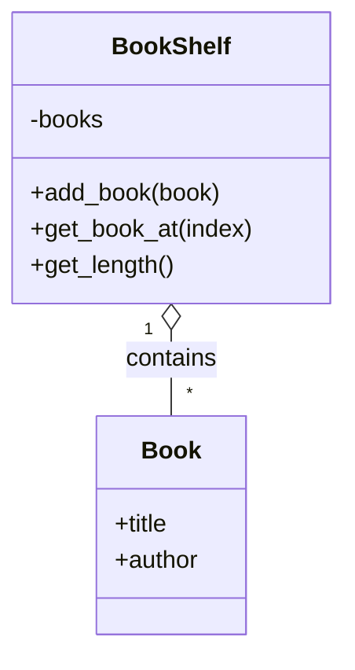

## はじめに

[@nqounet](https://x.com/nqounet)です。

新しいシリーズ「**本棚アプリで覚える集合体の巡回**」を始めます。

このシリーズでは、蔵書を管理する本棚アプリを題材に、オブジェクト指向プログラミングの実践的なテクニックを学んでいきます。単なる文法の解説ではなく、実際に動くアプリケーションを作りながら、設計の考え方を身につけることを目指します。

## このシリーズについて

### 対象読者

- Perl入学式を卒業したばかりの方
- 「Mooで覚えるオブジェクト指向プログラミング」シリーズを読了した方
- クラスの作り方は分かるが、複数のオブジェクトを効率的に扱う方法を学びたい方

### 前提知識

- Perlの基本的な文法（変数、配列、ハッシュ、サブルーチン）
- Mooを使ったクラスの定義方法（`has`、`sub`の基本）
- オブジェクトの生成と利用（`new`メソッド）

まだMooの基礎が不安な方は、先に「Mooで覚えるオブジェクト指向プログラミング」シリーズをご覧ください。

### 技術スタック

- Perl v5.36以降（signatures対応）
- Moo（CPANモジュール）

## 今回学ぶこと：集合体（Aggregate）の基本

プログラムを書いていると、同じ種類のオブジェクトを複数まとめて管理したい場面がよくあります。

今回作成するクラス構成を先に示します。



例えば、本棚には複数の本があります。音楽プレイヤーにはプレイリストがあり、その中には複数の曲が入っています。掲示板には複数の投稿があります。

このように、**複数の要素をまとめて管理するオブジェクト**のことを「集合体（Aggregate）」と呼びます。

今回は、本棚アプリを作りながら、この集合体の基本的な考え方を学んでいきます。

## Bookクラスを作る

まずは、本を表す`Book`クラスを作りましょう。本には「タイトル」と「著者」があります。

```perl
# Perl v5.36以降 / Moo
package Book {
    use Moo;

    has title  => (is => 'ro', required => 1);
    has author => (is => 'ro', required => 1);
}
```

このコードのポイントは以下の通りです。

- `is => 'ro'` — 読み取り専用（read-only）の属性を定義する。一度設定した値は変更できない
- `required => 1` — オブジェクト生成時に必ず値を指定する必要がある

本のタイトルや著者は、後から勝手に変わってほしくないですよね。そのため、`rw`（read-write）ではなく`ro`（read-only）を指定しています。

## BookShelfクラスを作る

次に、本を管理する本棚クラスを作ります。本棚は複数の本を持ち、本の追加や取得ができます。

```perl
# Perl v5.36以降 / Moo
package BookShelf {
    use Moo;

    has books => (
        is      => 'ro',
        default => sub { [] },
    );

    sub add_book ($self, $book) {
        push $self->books->@*, $book;
    }

    sub get_book_at ($self, $index) {
        return $self->books->[$index];
    }

    sub get_length ($self) {
        return scalar $self->books->@*;
    }
}
```

このコードのポイントは以下の通りです。

- `default => sub { [] }` — デフォルト値として空の配列リファレンスを設定する。`sub { ... }`で囲むのは、オブジェクトごとに新しい配列を作成するため
- `$self->books->@*` — 配列リファレンスを配列として展開する（postfix dereference記法）
- `add_book` — 本棚に本を追加するメソッド
- `get_book_at` — 指定した位置の本を取得するメソッド
- `get_length` — 本棚にある本の数を返すメソッド

`BookShelf`クラスは、内部に`books`という配列を持ち、その配列を通じて複数の`Book`オブジェクトを管理しています。これが「集合体」の基本的な形です。

## 完成コード

以上をまとめた完成コードを以下に示します。このコードを`bookshelf.pl`として保存し、実行してみましょう。

```perl
#!/usr/bin/env perl
# Perl v5.36以降 / Moo
use v5.36;

package Book {
    use Moo;

    has title  => (is => 'ro', required => 1);
    has author => (is => 'ro', required => 1);
}

package BookShelf {
    use Moo;

    has books => (
        is      => 'ro',
        default => sub { [] },
    );

    sub add_book ($self, $book) {
        push $self->books->@*, $book;
    }

    sub get_book_at ($self, $index) {
        return $self->books->[$index];
    }

    sub get_length ($self) {
        return scalar $self->books->@*;
    }
}

package main;

# 本棚を作成
my $shelf = BookShelf->new;

# 本を追加
$shelf->add_book(Book->new(title => 'すぐわかるPerl', author => '深沢千尋'));
$shelf->add_book(Book->new(title => '初めてのPerl', author => 'Randal L. Schwartz'));
$shelf->add_book(Book->new(title => 'プログラミングPerl', author => 'Larry Wall'));

# 本棚の本を確認
say "本棚には " . $shelf->get_length . " 冊の本があります。";

for my $i (0 .. $shelf->get_length - 1) {
    my $book = $shelf->get_book_at($i);
    say "[$i] " . $book->title . " / " . $book->author;
}
```

### 実行方法

```shell
cpanm Moo  # 未インストールの場合
perl bookshelf.pl
```

### 実行結果

```
本棚には 3 冊の本があります。
[0] すぐわかるPerl / 深沢千尋
[1] 初めてのPerl / Randal L. Schwartz
[2] プログラミングPerl / Larry Wall
```

## まとめ

- 集合体（Aggregate）は、複数のオブジェクトをまとめて管理するオブジェクトである
- `Book`クラスは個々の本を表し、`title`と`author`の属性を持つ
- `BookShelf`クラスは本の集合体であり、`add_book`、`get_book_at`、`get_length`メソッドを提供する
- 属性を`ro`（読み取り専用）にすることで、意図しない変更を防げる

## 次回予告

今回作った本棚アプリでは、`for`ループと`get_book_at`を使って本を順番に取り出しました。しかし、この方法には問題があります。本棚の内部構造（配列であること）を外部から知っている必要があるのです。

[次回](/2026/01/08/003031/)は、本棚の内部構造を知らなくても本を順番に取り出せる仕組みを作ります。「イテレータ」という概念を学びましょう。

お楽しみに。
