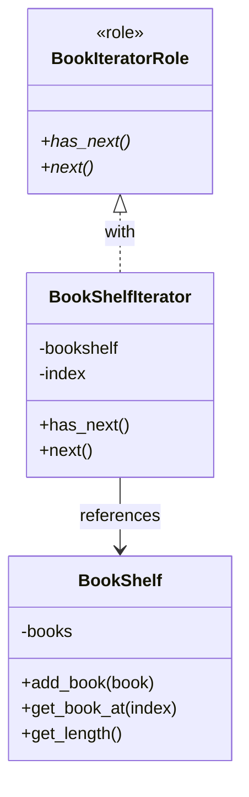

## はじめに

[@nqounet](https://x.com/nqounet)です。

シリーズ「**本棚アプリで覚える集合体の巡回**」の第3回です。

## 前回の振り返り

[前回](/2026/01/08/003031/)は、本棚のすべての本を一覧表示する機能を実装しました。その過程で、以下の問題点が明らかになりました。

- `$shelf->books->@*`のように内部の配列に直接アクセスするとカプセル化が崩れる
- `get_length`と`get_book_at`を使う方法でも、「長さがあってインデックスでアクセスできる」という実装詳細に依存している

本棚の内部構造が変更されると、それを利用するすべてのコードを修正する必要があるという問題が残っていました。

## 今回学ぶこと：Iterator（反復子）ロール

今回は、この問題を解決するために「Iterator（反復子）」という概念を導入します。

Iteratorとは、集合体の要素を順番に取り出すための専用オブジェクトです。利用者は「次の要素があるか」と「次の要素を取得する」という2つの操作だけを知っていれば、集合体の内部構造を一切知る必要がありません。

この概念を実装するために、前シリーズ「Mooで覚えるオブジェクト指向プログラミング」で学んだ`Moo::Role`を活用します。ロールを使うことで、Iteratorが持つべきインターフェース（メソッドの契約）を明確に定義できます。

## BookIteratorRoleを定義する

今回作成するクラス構成を以下に示します。



まず、Iteratorが持つべきインターフェースをロールとして定義します。

```perl
# Perl v5.36以降 / Moo
package BookIteratorRole {
    use Moo::Role;

    requires 'has_next';
    requires 'next';
}
```

このコードのポイントは以下の通りです。

- `use Moo::Role` — ロール（インターフェース）を定義するためのモジュール
- `requires 'has_next'` — このロールを適用するクラスは`has_next`メソッドを実装しなければならない
- `requires 'next'` — このロールを適用するクラスは`next`メソッドを実装しなければならない

`requires`は「このメソッドを実装することを要求する」という宣言です。ロール自体はメソッドの実装を持たず、「このメソッドが必要である」という契約だけを定義しています。

### 2つのメソッドの役割

- `has_next` — 次の要素があれば真、なければ偽を返す
- `next` — 次の要素を返し、内部の位置を進める

この2つのメソッドがあれば、利用者は以下のようなシンプルなループで全要素を処理できます。

```perl
while ($iterator->has_next) {
    my $item = $iterator->next;
    # $item を処理
}
```

本棚が配列で実装されているか、ハッシュで実装されているか、データベースから取得しているか——利用者はそれを知る必要がありません。

## BookShelfIteratorクラスを実装する

次に、`BookIteratorRole`を適用した具体的なイテレータクラスを作成します。

```perl
# Perl v5.36以降 / Moo
package BookShelfIterator {
    use Moo;

    with 'BookIteratorRole';

    has bookshelf => (is => 'ro', required => 1);
    has index     => (is => 'rw', default  => 0);

    sub has_next ($self) {
        return $self->index < $self->bookshelf->get_length;
    }

    sub next ($self) {
        my $book = $self->bookshelf->get_book_at($self->index);
        $self->index($self->index + 1);
        return $book;
    }
}
```

このコードのポイントは以下の通りです。

- `with 'BookIteratorRole'` — ロールを適用する。`has_next`と`next`の実装が必須になる
- `bookshelf` — 走査対象の本棚への参照（読み取り専用）
- `index` — 現在の走査位置（読み書き可能、初期値0）
- `has_next` — 現在位置が本棚の長さより小さければ真を返す
- `next` — 現在位置の本を取得し、位置を1つ進めて返す

### 責任の分離

ここで重要なのは、**走査のロジックがBookShelfIteratorに集約された**という点です。

- `BookShelf`クラス — 本を管理する責任を持つ
- `BookShelfIterator`クラス — 本棚を走査する責任を持つ

それぞれのクラスが単一の責任を持つことで、コードが整理され、変更にも強くなります。本棚の内部構造が変更されても、影響を受けるのは`BookShelfIterator`だけです。利用者のコードは一切変更する必要がありません。

## 完成コード

以上をまとめた完成コードを以下に示します。このコードを`bookshelf.pl`として保存し、実行してみましょう。

```perl
#!/usr/bin/env perl
# Perl v5.36以降 / Moo
use v5.36;

package Book {
    use Moo;

    has title  => (is => 'ro', required => 1);
    has author => (is => 'ro', required => 1);
}

package BookIteratorRole {
    use Moo::Role;

    requires 'has_next';
    requires 'next';
}

package BookShelf {
    use Moo;

    has books => (
        is      => 'ro',
        default => sub { [] },
    );

    sub add_book ($self, $book) {
        push $self->books->@*, $book;
    }

    sub get_book_at ($self, $index) {
        return $self->books->[$index];
    }

    sub get_length ($self) {
        return scalar $self->books->@*;
    }
}

package BookShelfIterator {
    use Moo;

    with 'BookIteratorRole';

    has bookshelf => (is => 'ro', required => 1);
    has index     => (is => 'rw', default  => 0);

    sub has_next ($self) {
        return $self->index < $self->bookshelf->get_length;
    }

    sub next ($self) {
        my $book = $self->bookshelf->get_book_at($self->index);
        $self->index($self->index + 1);
        return $book;
    }
}

package main;

# 本棚を作成
my $shelf = BookShelf->new;

# 本を追加
$shelf->add_book(Book->new(title => 'すぐわかるPerl', author => '深沢千尋'));
$shelf->add_book(Book->new(title => '初めてのPerl', author => 'Randal L. Schwartz'));
$shelf->add_book(Book->new(title => 'プログラミングPerl', author => 'Larry Wall'));

# イテレータを作成
my $iterator = BookShelfIterator->new(bookshelf => $shelf);

# イテレータを使って全ての本を表示
say "=== イテレータを使った走査 ===";
while ($iterator->has_next) {
    my $book = $iterator->next;
    say $book->title . " / " . $book->author;
}
```

### 実行方法

```shell
cpanm Moo  # 未インストールの場合
perl bookshelf.pl
```

### 実行結果

```
=== イテレータを使った走査 ===
すぐわかるPerl / 深沢千尋
初めてのPerl / Randal L. Schwartz
プログラミングPerl / Larry Wall
```

## まとめ

- Iterator（反復子）は、集合体の要素を順番に取り出すための専用オブジェクトである
- `Moo::Role`を使って`has_next`と`next`を要求するインターフェースを定義した
- `BookShelfIterator`クラスは走査のロジックを担当し、`BookShelf`から責任を分離した
- イテレータを使うと、利用者は集合体の内部構造を知らなくても全要素を処理できる

## 次回予告

今回、イテレータを作成しましたが、利用者が直接`BookShelfIterator->new(bookshelf => $shelf)`と書く必要があります。これでは、利用者がイテレータクラスの名前を知っている必要があり、まだ本棚の実装詳細への依存が残っています。

[次回](/2026/01/08/003437/)は、本棚自身がイテレータを生成する仕組みを導入します。利用者は`$shelf->iterator`と書くだけで、適切なイテレータを取得できるようになります。

お楽しみに。
