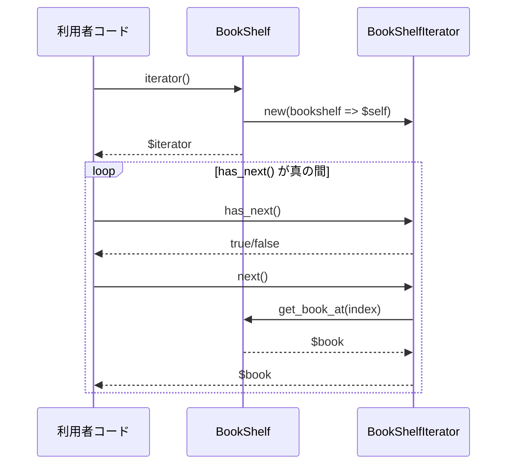

## はじめに

[@nqounet](https://x.com/nqounet)です。

シリーズ「本棚アプリで覚える集合体の巡回」の第4回です。

## 前回の振り返り

[前回](/2026/01/08/003234/)は、走査のロジックを専用クラスに分離しました。

- `BookIteratorRole` — `has_next`と`next`を要求するロールを定義した
- `BookShelfIterator` — ロールを適用し、走査の責任を持つクラスを実装した
- 責任の分離 — `BookShelf`は本の管理、`BookShelfIterator`は走査という役割分担が明確になった

しかし、利用者が走査機能を使うには、以下のように直接クラス名を指定する必要がありました。

```perl
my $iterator = BookShelfIterator->new(bookshelf => $shelf);
```

これでは、利用者が`BookShelfIterator`というクラス名を知っている必要があり、まだ本棚の実装詳細への依存が残っています。

## 今回学ぶこと：iterator()メソッドの実装

今回は、本棚自身が走査オブジェクトを生成する`iterator()`メソッドを追加します。利用者は`$shelf->iterator`と書くだけで、適切な走査オブジェクトを取得できるようになります。

これにより、以下のメリットが得られます。

- 利用者は走査用クラスの名前を知る必要がない
- 本棚の実装が変わっても、利用者のコードに影響しない
- より直感的なAPIになる

## BookShelfにiterator()メソッドを追加する

今回の変更により、以下のような関係になります。利用者は`BookShelf`の`iterator()`メソッドを呼ぶだけで、走査オブジェクトを取得できます。



`BookShelf`クラスに`iterator`メソッドを追加します。

```perl
# Perl v5.36以降 / Moo
package BookShelf {
    use Moo;

    has books => (
        is      => 'ro',
        default => sub { [] },
    );

    sub add_book ($self, $book) {
        push $self->books->@*, $book;
    }

    sub get_book_at ($self, $index) {
        return $self->books->[$index];
    }

    sub get_length ($self) {
        return scalar $self->books->@*;
    }

    sub iterator ($self) {
        return BookShelfIterator->new(bookshelf => $self);
    }
}
```

このコードのポイントは以下の通りです。

- `iterator`メソッド — 自分自身（`$self`）を`bookshelf`として渡して、`BookShelfIterator`を生成して返す
- 戻り値 — `has_next`と`next`メソッドを持つ走査オブジェクト

`iterator`メソッドを追加することで、本棚が走査オブジェクトの生成を担当するようになりました。利用者は`BookShelfIterator`というクラス名を知らなくても、`$shelf->iterator`で走査オブジェクトを取得できます。

## while文でiterator()メソッドを使った全本表示

`iterator`メソッドを使って、本棚のすべての本を表示してみましょう。

```perl
# Perl v5.36以降 / Moo
# メインコード

my $shelf = BookShelf->new;

$shelf->add_book(Book->new(title => 'すぐわかるPerl', author => '深沢千尋'));
$shelf->add_book(Book->new(title => '初めてのPerl', author => 'Randal L. Schwartz'));
$shelf->add_book(Book->new(title => 'プログラミングPerl', author => 'Larry Wall'));

# 本棚から走査オブジェクトを取得
my $iterator = $shelf->iterator;

# while文で全ての本を表示
while ($iterator->has_next) {
    my $book = $iterator->next;
    say $book->title . " / " . $book->author;
}
```

このコードのポイントは以下の通りです。

- `$shelf->iterator` — 本棚から走査オブジェクトを取得する。クラス名を直接指定しない
- `while ($iterator->has_next)` — 次の本がある限りループを続ける
- `$iterator->next` — 次の本を取得する

前回のコードと比較してみましょう。

| 比較項目 | 前回 | 今回 |
|----------|------|------|
| 走査オブジェクトの取得 | `BookShelfIterator->new(bookshelf => $shelf)` | `$shelf->iterator` |
| クラス名の知識 | 必要 | 不要 |
| 依存関係 | 利用者が走査クラスに依存 | 利用者は本棚だけに依存 |

今回の方法では、利用者は「本棚には走査オブジェクトを返すメソッドがある」ということだけを知っていれば十分です。

### なぜこれが重要なのか

将来、`BookShelfIterator`の実装が変わったり、別の走査クラスに置き換わったりしても、利用者のコードは影響を受けません。本棚が適切な走査オブジェクトを返す責任を持っているからです。

例えば、逆順に走査する`ReverseBookShelfIterator`を作った場合でも、利用者のコードは変わりません。

```perl
# 利用者のコードは変わらない
my $iterator = $shelf->iterator;  # 何が返ってくるかは本棚次第
```

## 完成コード

以上をまとめた完成コードを以下に示します。このコードを`bookshelf.pl`として保存し、実行してみましょう。

```perl
#!/usr/bin/env perl
# Perl v5.36以降 / Moo
use v5.36;

package Book {
    use Moo;

    has title  => (is => 'ro', required => 1);
    has author => (is => 'ro', required => 1);
}

package BookIteratorRole {
    use Moo::Role;

    requires 'has_next';
    requires 'next';
}

package BookShelfIterator {
    use Moo;

    with 'BookIteratorRole';

    has bookshelf => (is => 'ro', required => 1);
    has index     => (is => 'rw', default  => 0);

    sub has_next ($self) {
        return $self->index < $self->bookshelf->get_length;
    }

    sub next ($self) {
        my $book = $self->bookshelf->get_book_at($self->index);
        $self->index($self->index + 1);
        return $book;
    }
}

package BookShelf {
    use Moo;

    has books => (
        is      => 'ro',
        default => sub { [] },
    );

    sub add_book ($self, $book) {
        push $self->books->@*, $book;
    }

    sub get_book_at ($self, $index) {
        return $self->books->[$index];
    }

    sub get_length ($self) {
        return scalar $self->books->@*;
    }

    sub iterator ($self) {
        return BookShelfIterator->new(bookshelf => $self);
    }
}

package main;

# 本棚を作成
my $shelf = BookShelf->new;

# 本を追加
$shelf->add_book(Book->new(title => 'すぐわかるPerl', author => '深沢千尋'));
$shelf->add_book(Book->new(title => '初めてのPerl', author => 'Randal L. Schwartz'));
$shelf->add_book(Book->new(title => 'プログラミングPerl', author => 'Larry Wall'));

# 本棚から走査オブジェクトを取得して全ての本を表示
say "=== iterator()メソッドを使った走査 ===";
my $iterator = $shelf->iterator;
while ($iterator->has_next) {
    my $book = $iterator->next;
    say $book->title . " / " . $book->author;
}
```

### 実行方法

```shell
cpanm Moo  # 未インストールの場合
perl bookshelf.pl
```

### 実行結果

```
=== iterator()メソッドを使った走査 ===
すぐわかるPerl / 深沢千尋
初めてのPerl / Randal L. Schwartz
プログラミングPerl / Larry Wall
```

## まとめ

- `BookShelf`に`iterator()`メソッドを追加し、走査オブジェクトを取得できるようにした
- 利用者は`$shelf->iterator`で走査オブジェクトを取得できる。走査用クラスの名前を知る必要がない
- 本棚が走査オブジェクトの生成を担当することで、利用者と実装の結合度が下がった
- 将来、走査の実装が変わっても、利用者のコードへの影響を最小限に抑えられる

## 次回予告

ここまでで、本棚アプリに走査機能を追加し、利用者が本棚の内部構造を知らなくても全ての本を順番に取り出せるようになりました。

[次回](/2026/01/08/003640/)は、このシリーズの最終回として、これまで作ってきた設計を振り返り、このパターンが持つ力と応用例を探ります。

お楽しみに。
