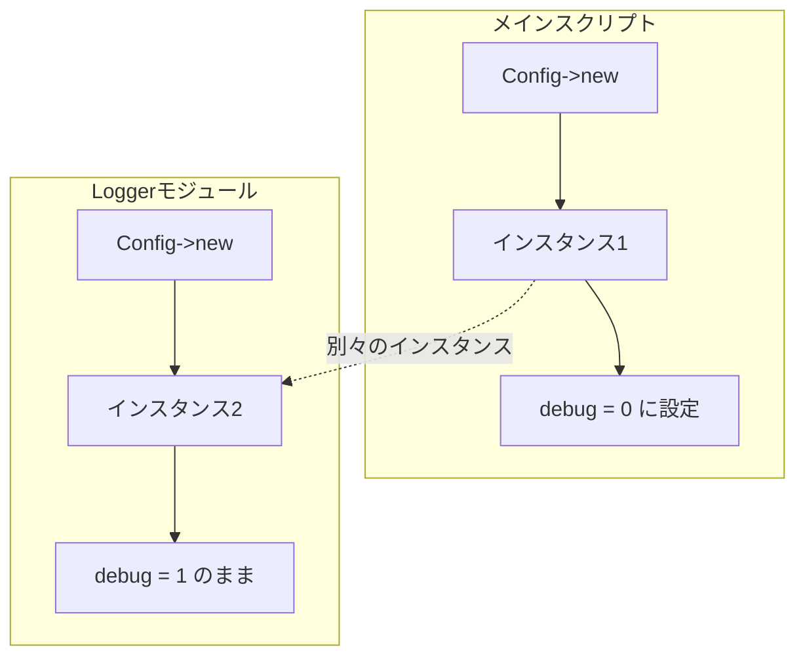

[@nqounet](https://x.com/nqounet)です。

前回は、外部の設定ファイルを読み込む機能を追加しました。



今回は、複数の場所から設定を使う方法を考えます。

## 今回のゴール

メインスクリプトと別のモジュールから、同じ設定を参照できるようにすることです。

## ミキさんの新しい悩み

ミキさんのアプリが大きくなり、機能を別のモジュールに分割することになりました。

> 「ログ出力を担当するLoggerモジュールを作ったんだけど、そこからも設定（デバッグモードとか）を参照したいんだよね」

なるほど、それなら`Logger`モジュールでも`Config`を使えばいいですね。

## Loggerモジュールを作る

デバッグモードの設定を参照して、デバッグログを出力するかどうかを判断する`Logger`モジュールを作ります。

```perl
package Logger {
    use Moo;
    use v5.36;

    sub debug ($self, $message) {
        my $config = Config->new();
        $config->load_config('config.ini');

        if ($config->get('debug')) {
            say "[DEBUG] $message";
        }
    }
};
```

`debug`メソッドの中で`Config`を`new`して、設定ファイルを読み込んでいます。

## メインスクリプトから使ってみる

メインスクリプトで設定を変更し、`Logger`を使ってみましょう。

```perl:app.pl
use v5.36;
use Moo;

package Config {
    use Moo;

    has _settings => (is => 'ro', default => sub { {} });

    sub load_config ($self, $file) {
        open my $fh, '<', $file or die "Cannot open $file: $!";
        while (my $line = <$fh>) {
            chomp $line;
            next if $line =~ /^\s*$/;
            next if $line =~ /^\s*#/;

            if ($line =~ /^\s*(\w+)\s*=\s*(.+?)\s*$/) {
                my ($key, $value) = ($1, $2);
                $self->set($key, $value);
            }
        }
        close $fh;
    }

    sub set ($self, $key, $value) {
        $self->_settings->{$key} = $value;
    }

    sub get ($self, $key) {
        return $self->_settings->{$key};
    }
};

package Logger {
    use Moo;
    use v5.36;

    sub debug ($self, $message) {
        my $config = Config->new();
        $config->load_config('config.ini');

        if ($config->get('debug')) {
            say "[DEBUG] $message";
        }
    }
};

package main;

# メインスクリプトで設定を読み込む
my $config = Config->new();
$config->load_config('config.ini');

say "アプリ名: " . $config->get('app_name');

# ここでデバッグモードをOFFに変更
$config->set('debug', 0);

say "デバッグモード（メイン側）: " . ($config->get('debug') ? 'ON' : 'OFF');

# Loggerを使ってデバッグログを出力
my $logger = Logger->new();
$logger->debug("処理を開始します");
```

`config.ini`は前回と同じものを使います。

```ini:config.ini
# アプリケーション設定
app_name = MyApp
version = 1.0.0
debug = 1
```

## 実行してみよう

```
アプリ名: MyApp
デバッグモード（メイン側）: OFF
[DEBUG] 処理を開始します
```

あれ？おかしいですね。

メイン側ではデバッグモードを`OFF`に設定したのに、`Logger`はデバッグログを出力しています。

## 何が起きているのか？

図で見てみましょう。



問題は、メインスクリプトとLoggerで、それぞれ別の`Config`インスタンスを作っていることです。

- メインスクリプトの`Config`インスタンス: `debug = 0`に変更
- Loggerの`Config`インスタンス: `debug = 1`のまま（設定ファイルから再読み込み）

`new`するたびに新しいインスタンスが作られるので、設定の変更が他の場所に反映されないのです。

## ミキさんの反応

> 「え、設定を変更したのに反映されないって、これじゃ困る！どうすればいいの？」

確かに、これは困りますね。

ちなみに、今の実装では`debug()`を呼ぶたびに設定ファイルを読み込んでいるため、非常に非効率です。でも、これは次回で解決します。

## 考えられる解決策

いくつかの方法が考えられます。

### 方法1: インスタンスを引数で渡す

```perl
my $config = Config->new();
my $logger = Logger->new(config => $config);
```

動きますが、すべての場所で`$config`を渡し続ける必要があり、コードが煩雑になります。

### 方法2: グローバル変数を使う

```perl
our $CONFIG = Config->new();
```

シンプルですが、グローバル変数は予期しない副作用を起こしやすく、推奨されません。

### 方法3: ???

もっと良い方法があるはずです...。

## 第3回 完成コード

今回は「問題が発覚する」ことがゴールなので、問題のあるコードが完成コードです。

ファイル構成

```
.
├── app.pl
└── config.ini
```

app.pl

```perl:app.pl
use v5.36;
use Moo;

package Config {
    use Moo;

    has _settings => (is => 'ro', default => sub { {} });

    sub load_config ($self, $file) {
        open my $fh, '<', $file or die "Cannot open $file: $!";
        while (my $line = <$fh>) {
            chomp $line;
            next if $line =~ /^\s*$/;
            next if $line =~ /^\s*#/;

            if ($line =~ /^\s*(\w+)\s*=\s*(.+?)\s*$/) {
                my ($key, $value) = ($1, $2);
                $self->set($key, $value);
            }
        }
        close $fh;
    }

    sub set ($self, $key, $value) {
        $self->_settings->{$key} = $value;
    }

    sub get ($self, $key) {
        return $self->_settings->{$key};
    }
};

package Logger {
    use Moo;
    use v5.36;

    sub debug ($self, $message) {
        my $config = Config->new();
        $config->load_config('config.ini');

        if ($config->get('debug')) {
            say "[DEBUG] $message";
        }
    }
};

package main;

my $config = Config->new();
$config->load_config('config.ini');

say "アプリ名: " . $config->get('app_name');

$config->set('debug', 0);

say "デバッグモード（メイン側）: " . ($config->get('debug') ? 'ON' : 'OFF');

my $logger = Logger->new();
$logger->debug("処理を開始します");
# => デバッグログが出力されてしまう！（期待はOFFなのに）
```

config.ini

```ini:config.ini
# アプリケーション設定
app_name = MyApp
version = 1.0.0
debug = 1
```

## まとめ

- 複数の場所から設定を使おうとして、問題が発覚した
- `new`するたびに新しいインスタンスが作られる
- 設定の変更が他の場所に反映されない
- インスタンスを渡し続けるのは煩雑
- グローバル変数は副作用が心配

## 次回予告

この問題を解決する方法を考えます。

> 「インスタンスを1つだけにできれば、どこからでも同じ設定が使えるんじゃない？」

次回は、クラス変数と`instance()`メソッドを使って、インスタンスを1つに統一する方法を学びます。
