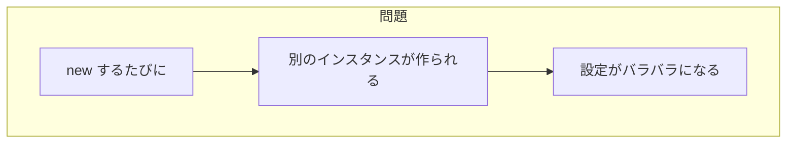
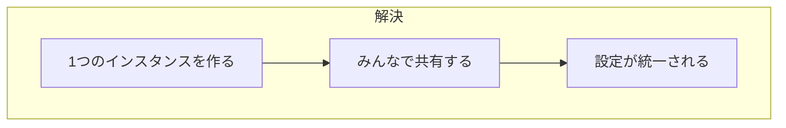
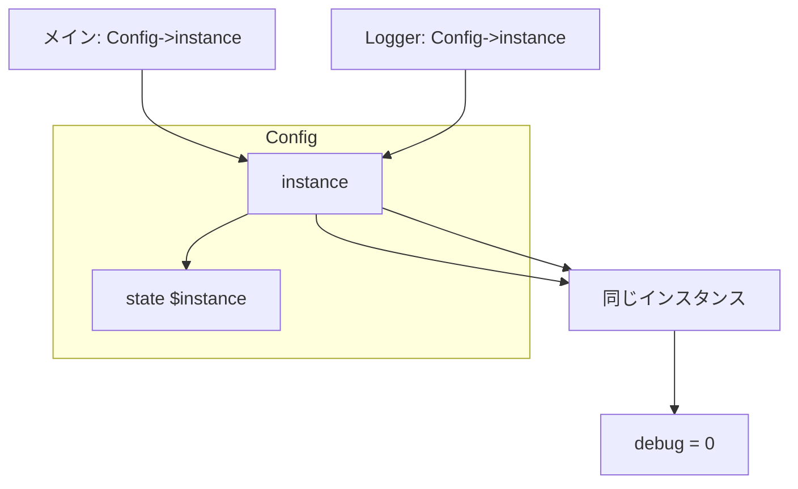

[@nqounet](https://x.com/nqounet)です。

前回は、複数の場所から設定を使おうとして、設定が反映されない問題に遭遇しました。



今回は、インスタンスを1つに統一することで、この問題を解決します。

## 今回のゴール

クラス変数と`instance()`メソッドを使って、`Config`のインスタンスを1つだけに保つ仕組みを作ることです。

## アイデア

前回の問題を振り返ってみましょう。



解決策は単純です。インスタンスを1つだけにして、みんなで共有すればいいのです。



## クラス変数でインスタンスを保持する

Perlでは、`state`変数を使ってクラス全体で共有する値を保持できます。

```perl
sub instance ($class) {
    state $instance;
    if (!$instance) {
        $instance = $class->new();
    }
    return $instance;
}
```

ポイントを見てみましょう。

### state変数

`state $instance;`は、サブルーチンの呼び出しをまたいで値を保持する変数です。一度値を設定すると、次回呼び出しても同じ値が残っています。

### インスタンスの作成と再利用

```perl
if (!$instance) {
    $instance = $class->new();
}
return $instance;
```

- 初回呼び出し: `$instance`は未定義なので、`new`でインスタンスを作成
- 2回目以降: すでにインスタンスがあるので、それをそのまま返す

## instance()メソッドの実装

`Config`クラスに`instance()`メソッドを追加しましょう。

```perl
package Config {
    use Moo;

    has _settings => (is => 'ro', default => sub { {} });

    # クラスメソッド: 単一インスタンスを返す
    sub instance ($class) {
        state $instance;
        if (!$instance) {
            $instance = $class->new();
        }
        return $instance;
    }

    # 以下、既存のメソッド...
};
```

## 使い方の変更

これまでは`new`でインスタンスを作っていましたが、今後は`instance()`を使います。

```perl
# 変更前
my $config = Config->new();

# 変更後
my $config = Config->instance();
```

どこで呼び出しても、同じインスタンスが返ってきます。

## Loggerモジュールの修正

`Logger`モジュールも`instance()`を使うように修正します。

```perl
package Logger {
    use Moo;
    use v5.36;

    sub debug ($self, $message) {
        my $config = Config->instance();  # instance() を使う

        if ($config->get('debug')) {
            say "[DEBUG] $message";
        }
    }
};
```

`load_config`は、メインスクリプトで一度だけ呼べばOKです。

## 完成したコード

動作を確認してみましょう。

```perl:app.pl
use v5.36;
use Moo;

package Config {
    use Moo;

    has _settings => (is => 'ro', default => sub { {} });

    sub instance ($class) {
        state $instance;
        if (!$instance) {
            $instance = $class->new();
        }
        return $instance;
    }

    sub load_config ($self, $file) {
        open my $fh, '<', $file or die "Cannot open $file: $!";
        while (my $line = <$fh>) {
            chomp $line;
            next if $line =~ /^\s*$/;
            next if $line =~ /^\s*#/;

            if ($line =~ /^\s*(\w+)\s*=\s*(.+?)\s*$/) {
                my ($key, $value) = ($1, $2);
                $self->set($key, $value);
            }
        }
        close $fh;
    }

    sub set ($self, $key, $value) {
        $self->_settings->{$key} = $value;
    }

    sub get ($self, $key) {
        return $self->_settings->{$key};
    }
};

package Logger {
    use Moo;
    use v5.36;

    sub debug ($self, $message) {
        my $config = Config->instance();

        if ($config->get('debug')) {
            say "[DEBUG] $message";
        }
    }
};

package main;

# instance() でConfigを取得し、設定を読み込む
my $config = Config->instance();
$config->load_config('config.ini');

say "アプリ名: " . $config->get('app_name');

# デバッグモードをOFFに変更
$config->set('debug', 0);

say "デバッグモード（メイン側）: " . ($config->get('debug') ? 'ON' : 'OFF');

# Loggerでデバッグログを出力（OFFなので出力されないはず）
my $logger = Logger->new();
$logger->debug("処理を開始します");

say "デバッグログは出力されませんでした";
```

## 実行結果

```
アプリ名: MyApp
デバッグモード（メイン側）: OFF
デバッグログは出力されませんでした
```

設定の変更が、`Logger`にも正しく反映されました！

## 動作の仕組み

図で確認してみましょう。



`instance()`を使うことで、メインスクリプトも`Logger`も、同じ`Config`インスタンスを参照します。だから、設定の変更がどこからでも見えるようになったのです。

## 第4回 完成コード

ファイル構成

```
.
├── app.pl
└── config.ini
```

app.pl

```perl:app.pl
use v5.36;
use Moo;

package Config {
    use Moo;

    has _settings => (is => 'ro', default => sub { {} });

    sub instance ($class) {
        state $instance;
        if (!$instance) {
            $instance = $class->new();
        }
        return $instance;
    }

    sub load_config ($self, $file) {
        open my $fh, '<', $file or die "Cannot open $file: $!";
        while (my $line = <$fh>) {
            chomp $line;
            next if $line =~ /^\s*$/;
            next if $line =~ /^\s*#/;

            if ($line =~ /^\s*(\w+)\s*=\s*(.+?)\s*$/) {
                my ($key, $value) = ($1, $2);
                $self->set($key, $value);
            }
        }
        close $fh;
    }

    sub set ($self, $key, $value) {
        $self->_settings->{$key} = $value;
    }

    sub get ($self, $key) {
        return $self->_settings->{$key};
    }
};

package Logger {
    use Moo;
    use v5.36;

    sub debug ($self, $message) {
        my $config = Config->instance();

        if ($config->get('debug')) {
            say "[DEBUG] $message";
        }
    }
};

package main;

my $config = Config->instance();
$config->load_config('config.ini');

say "アプリ名: " . $config->get('app_name');

$config->set('debug', 0);

say "デバッグモード（メイン側）: " . ($config->get('debug') ? 'ON' : 'OFF');

my $logger = Logger->new();
$logger->debug("処理を開始します");

say "デバッグログは出力されませんでした";
```

config.ini

```ini:config.ini
# アプリケーション設定
app_name = MyApp
version = 1.0.0
debug = 1
```

## まとめ

- `state`変数を使って、クラス全体で共有するインスタンスを保持した
- `instance()`メソッドで、常に同じインスタンスを返すようにした
- `new`の代わりに`instance()`を使うことで、設定が統一された
- どこから設定を変更しても、全体に反映されるようになった

## 次回予告

ミキさんが喜んでいます。

> 「これで設定管理がうまくいくようになった！でも、この仕組みって何か名前があるの？」

次回は、今回実装した仕組みが「デザインパターン」と呼ばれるものの1つであることを解説します。
