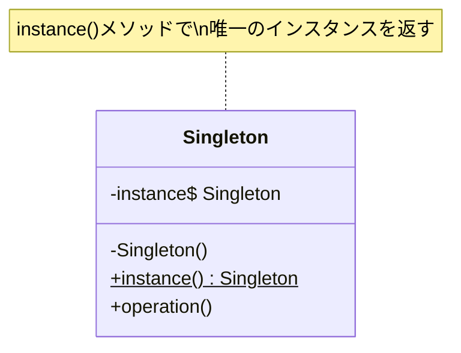

[@nqounet](https://x.com/nqounet)です。

前回は、`instance()`メソッドを実装して、インスタンスを1つに統一する仕組みを作りました。



今回は、この仕組みが何と呼ばれるのかを解説します。

## ミキさんの疑問

ミキさんが聞いてきました。

> 「`instance()`メソッドで1つのインスタンスを共有する仕組み、すごく便利だね！これって何か名前があるの？」

はい、あります。これは**Singletonパターン**（シングルトンパターン）と呼ばれる、有名なデザインパターンの1つです。

## デザインパターンとは

デザインパターンとは、ソフトウェア設計における「よくある問題」と「その解決策」をパターン化したものです。

1994年に出版された「Design Patterns: Elements of Reusable Object-Oriented Software」という書籍で、23のパターンが紹介されました。著者4人は「Gang of Four（GoF）」と呼ばれ、これらのパターンは「GoFのデザインパターン」として広く知られています。

## Singletonパターンの定義

Singletonパターンは、GoFの23パターンの1つで、以下のように定義されています。

> **クラスのインスタンスが1つだけ存在することを保証し、そのインスタンスへのグローバルなアクセスポイントを提供する**

まさに、私たちが前回実装した`Config`クラスの仕組みですね！

## Singletonパターンの構造

Singletonパターンの構造を図で見てみましょう。



構成要素を確認しましょう。

| 要素 | 役割 | 私たちの実装 |
|------|------|-------------|
| `instance`（クラス変数） | 唯一のインスタンスを保持 | `state $instance` |
| `instance()`メソッド | インスタンスを返す（なければ作成） | `sub instance` |
| プライベートコンストラクタ | 外部からの`new`を防ぐ | （未実装） |

## 私たちの実装を振り返る

私たちが実装した`Config`クラスを見てみましょう。

```perl
package Config {
    use Moo;

    has _settings => (is => 'ro', default => sub { {} });

    # Singletonパターンの核心部分
    sub instance ($class) {
        state $instance;
        if (!$instance) {
            $instance = $class->new();
        }
        return $instance;
    }

    # 以下、設定管理のメソッド...
};
```

この`instance()`メソッドが、Singletonパターンの核心です。

1. `state $instance`で唯一のインスタンスを保持
2. 初回呼び出し時に`new`でインスタンスを作成
3. 2回目以降は既存のインスタンスを返す

## Singletonパターンの利点

### 1. インスタンスが1つだけであることを保証

設定やログなど、アプリケーション全体で共有すべきリソースを確実に1つに保てます。

### 2. グローバルアクセスポイントの提供

どこからでも`Config->instance()`で同じインスタンスにアクセスできます。引数で渡し続ける必要がありません。

### 3. 遅延初期化

`instance()`が初めて呼ばれるまでインスタンスは作成されません。リソースを節約できます。

## Singletonパターンの注意点

Singletonパターンは便利ですが、注意点もあります。

### 1. テストが難しくなる場合がある

グローバルな状態を持つため、テスト間で状態がリセットされないことがあります。テスト用に設定をクリアするメソッドを用意するなどの工夫が必要です。

```perl
# テスト用に設定をクリアする例
sub clear_settings ($self) {
    %{$self->_settings} = ();
}
```

### 2. 依存関係が見えにくくなる

`Config->instance()`を直接呼ぶと、クラス間の依存関係がコードから読み取りにくくなります。

### 3. 過度な使用は避ける

「便利だから」という理由で何でもSingletonにすると、設計が複雑になります。本当に1つだけのインスタンスが必要な場合に限定しましょう。

## Singletonパターンが適している場面

Singletonパターンは、以下のような場面で使うと効果的です。

| 場面 | 理由 |
|------|------|
| 設定管理（Config） | アプリ全体で同じ設定を共有したい |
| ログ出力（Logger） | ログファイルのハンドルを1つにしたい |
| データベース接続（DB） | コネクションを使い回したい |
| キャッシュ（Cache） | キャッシュデータを共有したい |

## シリーズを振り返る

全5回のシリーズを振り返ってみましょう。

| 回 | 学んだこと |
|---|-----------|
| 第1回 | ハードコードされた設定値をクラスで管理 |
| 第2回 | 外部ファイルから設定を読み込む |
| 第3回 | 複数箇所から設定を使う問題が発覚 |
| 第4回 | `instance()`メソッドで問題を解決 |
| 第5回 | これがSingletonパターンだ！ |

普通にプログラムを作っていたら、自然とデザインパターンにたどり着きました。デザインパターンは、先人たちが試行錯誤の末に見つけた「良い設計」のエッセンスなのです。

## 第5回 完成コード

最終的な完成コードは、第4回と同じです。

**ファイル構成**

```
.
├── app.pl
└── config.ini
```

**app.pl**

```perl:app.pl
use v5.36;
use Moo;

package Config {
    use Moo;

    has _settings => (is => 'ro', default => sub { {} });

    # Singletonパターン: instance()メソッド
    sub instance ($class) {
        state $instance;
        if (!$instance) {
            $instance = $class->new();
        }
        return $instance;
    }

    sub load_config ($self, $file) {
        open my $fh, '<', $file or die "Cannot open $file: $!";
        while (my $line = <$fh>) {
            chomp $line;
            next if $line =~ /^\s*$/;
            next if $line =~ /^\s*#/;

            if ($line =~ /^\s*(\w+)\s*=\s*(.+?)\s*$/) {
                my ($key, $value) = ($1, $2);
                $self->set($key, $value);
            }
        }
        close $fh;
    }

    sub set ($self, $key, $value) {
        $self->_settings->{$key} = $value;
    }

    sub get ($self, $key) {
        return $self->_settings->{$key};
    }
};

package Logger {
    use Moo;
    use v5.36;

    sub debug ($self, $message) {
        my $config = Config->instance();

        if ($config->get('debug')) {
            say "[DEBUG] $message";
        }
    }
};

package main;

my $config = Config->instance();
$config->load_config('config.ini');

say "アプリ名: " . $config->get('app_name');

$config->set('debug', 0);

say "デバッグモード（メイン側）: " . ($config->get('debug') ? 'ON' : 'OFF');

my $logger = Logger->new();
$logger->debug("処理を開始します");

say "デバッグログは出力されませんでした";
```

**config.ini**

```ini:config.ini
# アプリケーション設定
app_name = MyApp
version = 1.0.0
debug = 1
```

## まとめ

- 前回実装した仕組みは「Singletonパターン」と呼ばれるデザインパターン
- Singletonパターンは、クラスのインスタンスを1つに保証する
- GoF（Gang of Four）の23のデザインパターンの1つ
- 設定管理、ログ出力、DB接続など「1つだけ」が必要な場面で使う
- 便利だが、テストの難しさなど注意点もある

## 次のステップへ

Singletonパターンを学んだ皆さんは、他のデザインパターンにも挑戦してみてください。

- **Facadeパターン**: 複雑なシステムへのシンプルなインターフェースを提供
- **Adapterパターン**: 互換性のないインターフェースを接続
- **Iteratorパターン**: コレクションの要素に順番にアクセス

デザインパターンを学ぶことで、より良い設計ができるようになります。ミキさんと一緒に、これからも学び続けましょう！

## ミキさんの感想

> 「デザインパターンって難しそうだと思ってたけど、自然に使えるようになってたんだね。他のパターンも勉強してみたい！」

その意気です！次のシリーズでお会いしましょう。
