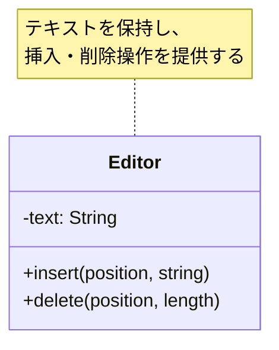
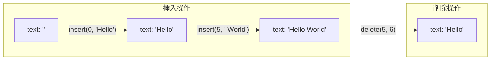

[@nqounet](https://x.com/nqounet)です。

今回から、新シリーズ「Mooで作る簡易テキストエディタ」を始めます。

## シリーズの紹介

このシリーズでは、PerlとMooを使って**Undo/Redo機能付きの簡易テキストエディタ**を作成します。全10回を通して、テキストエディタを段階的に機能拡張していきます。

最終的には、以下のような機能を持つエディタが完成します。

- テキストの挿入・削除
- 操作を元に戻す（Undo）
- やり直し（Redo）
- 複数の操作をまとめて実行（マクロ）

これらの機能を実装する過程で、オブジェクト指向設計の重要な考え方を自然に学んでいきます。

## 前提知識

このシリーズは、「Mooで覚えるオブジェクト指向プログラミング」シリーズ（全12回）を読了している方を対象としています。



具体的には、以下の知識を前提としています。

- `has`による属性定義
- `is => 'ro'` / `is => 'rw'`の使い分け
- `required`と`default`オプション
- `Moo::Role`によるロール定義
- `with`によるロールの適用

まだ読んでいない方は、先に上記シリーズをご覧ください。

## 今回のゴール

今回は、シリーズの第1回として、**テキストを追加・削除できる最小限のエディタ**を作成します。

まずは動くものを作ることを優先し、設計はシンプルに保ちます。今回作成するエディタには「元に戻す」機能はまだありません。それは次回以降で追加していきます。

## Editorクラスを作る

まず、今回作成する`Editor`クラスの構造を確認しましょう。



では、テキストを編集するための`Editor`クラスを作成しましょう。

```perl
# Perl v5.36 以降
# 外部依存: Moo

package Editor {
    use Moo;
    use v5.36;

    has text => (
        is      => 'rw',
        default => '',
    );

    sub insert ($self, $position, $string) {
        my $current = $self->text;
        my $new_text = substr($current, 0, $position) 
                     . $string 
                     . substr($current, $position);
        $self->text($new_text);
    }

    sub delete ($self, $position, $length) {
        my $current = $self->text;
        my $new_text = substr($current, 0, $position) 
                     . substr($current, $position + $length);
        $self->text($new_text);
    }
};
```

このEditorクラスは、2つのメソッドを持っています。

- `insert($position, $string)` — 指定した位置に文字列を挿入する
- `delete($position, $length)` — 指定した位置から指定した長さの文字を削除する

`text`属性には、エディタで編集中のテキストが格納されます。初期値は空文字列です。

## 動作確認

以下のフローで、テキストの挿入と削除がどのように動作するか見てみましょう。



このEditorクラスを使って、実際にテキストを編集してみましょう。

```perl
# Perl v5.36 以降
# 外部依存: Moo

use v5.36;

package Editor {
    use Moo;

    has text => (
        is      => 'rw',
        default => '',
    );

    sub insert ($self, $position, $string) {
        my $current = $self->text;
        my $new_text = substr($current, 0, $position) 
                     . $string 
                     . substr($current, $position);
        $self->text($new_text);
    }

    sub delete ($self, $position, $length) {
        my $current = $self->text;
        my $new_text = substr($current, 0, $position) 
                     . substr($current, $position + $length);
        $self->text($new_text);
    }
};

# メイン処理
my $editor = Editor->new;

# テキストを挿入
$editor->insert(0, 'Hello');
say "挿入後: " . $editor->text;  # Hello

# さらにテキストを追加
$editor->insert(5, ' World');
say "追加後: " . $editor->text;  # Hello World

# 一部を削除
$editor->delete(5, 6);  # ' World'を削除
say "削除後: " . $editor->text;  # Hello
```

実行結果は以下のようになります。

```
挿入後: Hello
追加後: Hello World
削除後: Hello
```

テキストの挿入と削除が正しく動作していることが確認できます。

## 今回作成した完成コード

以下が今回作成した完成コードです。1つのスクリプトファイルとして動作します。

```perl
#!/usr/bin/env perl
# Perl v5.36 以降
# 外部依存: Moo

use v5.36;

package Editor {
    use Moo;

    has text => (
        is      => 'rw',
        default => '',
    );

    sub insert ($self, $position, $string) {
        my $current = $self->text;
        my $new_text = substr($current, 0, $position) 
                     . $string 
                     . substr($current, $position);
        $self->text($new_text);
    }

    sub delete ($self, $position, $length) {
        my $current = $self->text;
        my $new_text = substr($current, 0, $position) 
                     . substr($current, $position + $length);
        $self->text($new_text);
    }
};

# 動作確認
my $editor = Editor->new;

$editor->insert(0, 'Hello');
say "挿入後: " . $editor->text;

$editor->insert(5, ' World');
say "追加後: " . $editor->text;

$editor->delete(5, 6);
say "削除後: " . $editor->text;
```

## まとめ

- `Editor`クラスを作成し、`text`属性でテキストを保持する
- `insert`メソッドで指定位置に文字列を挿入できる
- `delete`メソッドで指定位置から文字を削除できる
- まずは動くものを作り、段階的に機能を追加していく

## 次回予告

今回作成したエディタには、**「元に戻す」機能がありません**。

たとえば、「Hello World」から「 World」を誤って削除してしまった場合、どうすれば元に戻せるでしょうか？

次回は、この「元に戻したい！」という問題に取り組みます。単純な方法では難しいことに気づき、操作履歴の必要性を理解していきます。

お楽しみに。
