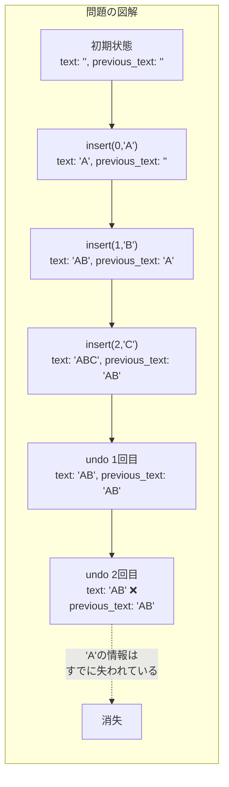
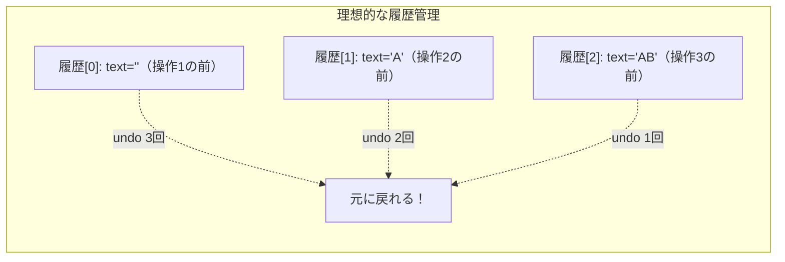

[@nqounet](https://x.com/nqounet)です。

シリーズ「Mooで作る簡易テキストエディタ」の第2回です。

## 前回の振り返り

前回は、テキストを追加・削除できる`Editor`クラスを作成しました。



`insert`メソッドで文字を挿入し、`delete`メソッドで文字を削除できる、シンプルなエディタでした。

```perl
my $editor = Editor->new;
$editor->insert(0, 'Hello');
$editor->insert(5, ' World');
$editor->delete(5, 6);  # ' World'を削除
say $editor->text;  # Hello
```

しかし、このエディタには重大な問題があります。間違って削除してしまった文字を元に戻せないのです。

## 問題：元に戻したい！

テキストエディタを使っていると、誤って文字を削除してしまうことがあります。

たとえば、「Hello World」と入力した後、「 World」を間違って削除してしまったとします。

```perl
my $editor = Editor->new;
$editor->insert(0, 'Hello');
$editor->insert(5, ' World');
say $editor->text;  # Hello World

# 間違って削除してしまった！
$editor->delete(5, 6);
say $editor->text;  # Hello

# ...「 World」を戻したい！
```

この状況で、どうすれば「 World」を元に戻せるでしょうか？

もちろん、もう一度`insert`を呼べば戻せます。

```perl
$editor->insert(5, ' World');  # 手動で戻す
```

しかし、これでは使い勝手が悪すぎます。普段使っているテキストエディタには、Ctrl+Z（または⌘+Z）で「元に戻す」機能がありますよね。

同じように、私たちのエディタにも「Undo」機能を実装したいのです。

## 単純な解決策：直前の状態を保存する

「元に戻す」ためには、直前の状態を覚えておく必要があります。

最も単純な方法は、操作の直前にテキストを保存しておくことです。

```perl
# Perl v5.36 以降
# 外部依存: Moo

use v5.36;

package Editor {
    use Moo;

    has text => (
        is      => 'rw',
        default => '',
    );

    has previous_text => (
        is      => 'rw',
        default => '',
    );

    sub insert ($self, $position, $string) {
        # 操作前のテキストを保存
        $self->previous_text($self->text);

        my $current = $self->text;
        my $new_text = substr($current, 0, $position) 
                     . $string 
                     . substr($current, $position);
        $self->text($new_text);
    }

    sub delete ($self, $position, $length) {
        # 操作前のテキストを保存
        $self->previous_text($self->text);

        my $current = $self->text;
        my $new_text = substr($current, 0, $position) 
                     . substr($current, $position + $length);
        $self->text($new_text);
    }

    sub undo ($self) {
        # 直前の状態に戻す
        $self->text($self->previous_text);
    }
};
```

`previous_text`属性を追加し、各操作の直前に現在のテキストを保存するようにしました。`undo`メソッドを呼ぶと、直前の状態に戻ります。

動作確認してみましょう。

```perl
my $editor = Editor->new;
$editor->insert(0, 'Hello');
say "挿入後: " . $editor->text;  # Hello

$editor->insert(5, ' World');
say "追加後: " . $editor->text;  # Hello World

$editor->delete(5, 6);
say "削除後: " . $editor->text;  # Hello

# Undo！
$editor->undo;
say "Undo後: " . $editor->text;  # Hello World
```

一見、うまく動いているように見えます。

## 問題発覚：複数回の操作で破綻する

ところが、このシンプルな実装には致命的な問題があります。

Undoを2回実行するとどうなるでしょうか？

```perl
# Perl v5.36 以降
# 外部依存: Moo

use v5.36;

package Editor {
    use Moo;

    has text => (
        is      => 'rw',
        default => '',
    );

    has previous_text => (
        is      => 'rw',
        default => '',
    );

    sub insert ($self, $position, $string) {
        $self->previous_text($self->text);

        my $current = $self->text;
        my $new_text = substr($current, 0, $position) 
                     . $string 
                     . substr($current, $position);
        $self->text($new_text);
    }

    sub delete ($self, $position, $length) {
        $self->previous_text($self->text);

        my $current = $self->text;
        my $new_text = substr($current, 0, $position) 
                     . substr($current, $position + $length);
        $self->text($new_text);
    }

    sub undo ($self) {
        $self->text($self->previous_text);
    }
};

# 動作確認
my $editor = Editor->new;
$editor->insert(0, 'A');
say "操作1後: " . $editor->text;  # A

$editor->insert(1, 'B');
say "操作2後: " . $editor->text;  # AB

$editor->insert(2, 'C');
say "操作3後: " . $editor->text;  # ABC

# Undoを2回実行
$editor->undo;
say "Undo1回後: " . $editor->text;  # AB ← ここまでは正しい

$editor->undo;
say "Undo2回後: " . $editor->text;  # AB ← あれ？Aに戻らない！
```

実行結果を見てみましょう。

```
操作1後: A
操作2後: AB
操作3後: ABC
Undo1回後: AB
Undo2回後: AB
```

2回目の`undo`を実行しても、「A」には戻りません。「AB」のままです。

なぜでしょうか？

## なぜ破綻するのか

`previous_text`には、直前の1回分の状態しか保存されていないからです。

操作の流れを追ってみましょう。



| 操作 | text | previous_text |
|------|------|---------------|
| 初期状態 | '' | '' |
| insert(0, 'A') | 'A' | '' |
| insert(1, 'B') | 'AB' | 'A' |
| insert(2, 'C') | 'ABC' | 'AB' |
| 1回目のundo | 'AB' | 'AB' |
| 2回目のundo | 'AB' | 'AB' |

3回目の操作（insert C）で`previous_text`に「AB」が保存されます。しかし、それ以前の「A」や「」（空文字列）は失われています。

1回目の`undo`を実行すると、`text`が「AB」になります。しかし`previous_text`はそのまま「AB」のままです。

そのため、2回目の`undo`を実行しても、「AB」に戻るだけで、それ以前の状態には戻れないのです。

## 考察：何が足りないのか

この問題を解決するには、すべての操作の履歴を保存する必要があります。



直前の状態だけでなく、操作の順番に応じて過去の状態を遡れるようにしなければなりません。

たとえば、以下のような履歴が必要です。

| 操作番号 | 操作内容 | 操作前のtext |
|----------|----------|--------------|
| 1 | insert(0, 'A') | '' |
| 2 | insert(1, 'B') | 'A' |
| 3 | insert(2, 'C') | 'AB' |

この履歴を使えば、`undo`を3回実行すれば、最初の空文字列の状態まで戻れます。

しかし、単に「操作前のtext」を配列に保存するだけで良いのでしょうか？

それとも、もっと賢い方法があるのでしょうか？

## 今回作成した完成コード

以下が今回作成した完成コードです。複数回のUndoで破綻することを確認できます。

```perl
#!/usr/bin/env perl
# Perl v5.36 以降
# 外部依存: Moo

use v5.36;

package Editor {
    use Moo;

    has text => (
        is      => 'rw',
        default => '',
    );

    has previous_text => (
        is      => 'rw',
        default => '',
    );

    sub insert ($self, $position, $string) {
        $self->previous_text($self->text);

        my $current = $self->text;
        my $new_text = substr($current, 0, $position) 
                     . $string 
                     . substr($current, $position);
        $self->text($new_text);
    }

    sub delete ($self, $position, $length) {
        $self->previous_text($self->text);

        my $current = $self->text;
        my $new_text = substr($current, 0, $position) 
                     . substr($current, $position + $length);
        $self->text($new_text);
    }

    sub undo ($self) {
        $self->text($self->previous_text);
    }
};

# 動作確認
my $editor = Editor->new;
$editor->insert(0, 'A');
say "操作1後: " . $editor->text;

$editor->insert(1, 'B');
say "操作2後: " . $editor->text;

$editor->insert(2, 'C');
say "操作3後: " . $editor->text;

# Undoを2回実行
$editor->undo;
say "Undo1回後: " . $editor->text;

$editor->undo;
say "Undo2回後: " . $editor->text;  # ABのままで、Aには戻らない
```

## まとめ

- 誤って削除した文字を戻すために「Undo」機能が必要である
- 直前の状態（previous_text）を保存する方法は、1回のUndoには対応できる
- しかし、複数回のUndoには対応できない（履歴が1つしかないため）
- すべての操作の履歴を保存する必要がある

## 次回予告

今回、「直前の状態を保存する」だけでは、複数回のUndoに対応できないことがわかりました。

では、どうすれば複数回のUndoができるようになるでしょうか？

単に過去のテキストを配列で保存するだけでも、ある程度は動きそうです。しかし、テキストが長くなると、同じ内容をたくさんコピーして保存することになり、メモリの無駄遣いになります。

次回は、「何をしたか」を記録するという発想の転換をします。操作そのものをオブジェクトとして記録することで、効率的かつ柔軟なUndo機能を実現します。

お楽しみに。
