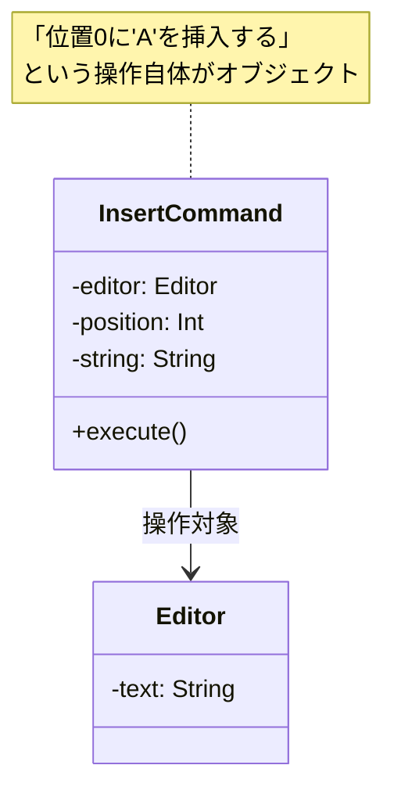
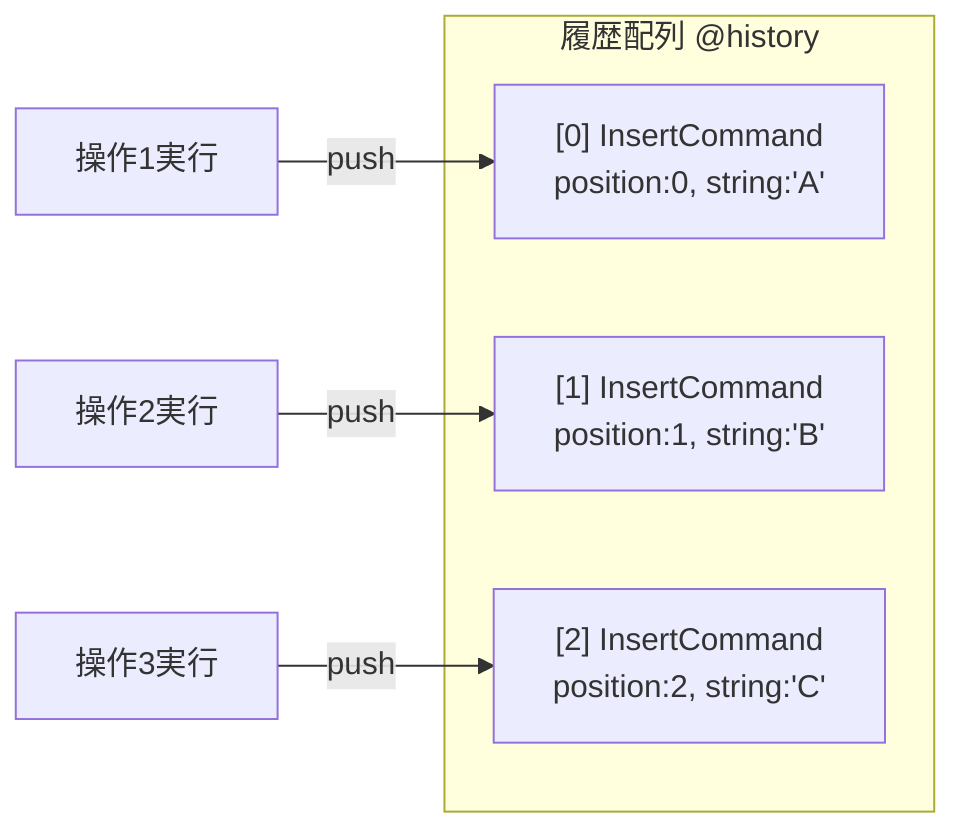

[@nqounet](https://x.com/nqounet)です。

シリーズ「Mooで作る簡易テキストエディタ」の第3回です。

## 前回の振り返り

前回は、「元に戻す」機能を実装しようとして、直前の状態を保存する方法を試しました。



しかし、この方法には問題がありました。`previous_text`には直前の1回分の状態しか保存されていないため、複数回のUndoに対応できないのです。

```perl
$editor->insert(0, 'A');   # text: 'A'
$editor->insert(1, 'B');   # text: 'AB'
$editor->insert(2, 'C');   # text: 'ABC'

$editor->undo;  # text: 'AB' ← 正しい
$editor->undo;  # text: 'AB' ← あれ？'A'に戻らない！
```

すべての操作履歴を保存する必要があることがわかりました。では、どうすればよいでしょうか？

## テキストを全部保存する？

最も単純な方法は、操作のたびにテキスト全体を配列に保存することです。

```perl
my @history = ('', 'A', 'AB', 'ABC');
```

Undoするたびに配列から1つ前の状態を取り出せば、何回でも元に戻せます。

しかし、この方法には問題があります。

テキストが長くなると、同じ内容をたくさんコピーして保存することになり、メモリの無駄遣いになります。たとえば、1万文字のテキストに1文字追加するたびに、1万文字をまるごとコピーするのは非効率です。

もっと賢い方法はないでしょうか？

## 発想の転換：「何をしたか」を記録する

ここで発想を転換します。

テキスト全体を保存するのではなく、「何をしたか」だけを記録するのです。

たとえば、「位置0に'A'を挿入した」「位置1に'B'を挿入した」という操作そのものを記録します。

```
操作1: insert(0, 'A')
操作2: insert(1, 'B')
操作3: insert(2, 'C')
```

この情報があれば、元のテキストから順番に操作を再現できます。そして、元に戻すときは逆の操作を行えばよいのです。

でも、「操作を記録する」とは、具体的にどうすればよいのでしょうか？

## 操作をオブジェクトにする

ここで、オブジェクト指向の考え方が役立ちます。

操作そのものをオブジェクト（クラスのインスタンス）として扱うのです。



「位置0に'A'を挿入する」という操作を、1つのオブジェクトとして表現します。このオブジェクトは、以下の情報を持ちます。

- どの位置に挿入するか（`position`）
- 何を挿入するか（`string`）
- どのエディタに対して操作するか（`editor`）

そして、`execute`メソッドを呼ぶと、実際に挿入操作を実行します。

## InsertCommandクラスを作る

では、挿入操作を表す`InsertCommand`クラスを作成しましょう。

```perl
# Perl v5.36 以降
# 外部依存: Moo

package InsertCommand {
    use Moo;
    use v5.36;

    has editor => (
        is       => 'ro',
        required => 1,
    );

    has position => (
        is       => 'ro',
        required => 1,
    );

    has string => (
        is       => 'ro',
        required => 1,
    );

    sub execute ($self) {
        my $editor   = $self->editor;
        my $position = $self->position;
        my $string   = $self->string;

        my $current  = $editor->text;
        my $new_text = substr($current, 0, $position) 
                     . $string 
                     . substr($current, $position);
        $editor->text($new_text);
    }
};
```

このクラスの特徴を見てみましょう。

- `editor` — 操作対象のエディタオブジェクトを保持する
- `position` — 挿入位置を保持する
- `string` — 挿入する文字列を保持する
- `execute` — 実際に挿入操作を実行するメソッド

すべての属性を`is => 'ro'`（読み取り専用）にしています。一度作成した操作オブジェクトは、後から変更できないようにするためです。

## InsertCommandを使ってみる

`InsertCommand`クラスを使って、テキストを挿入してみましょう。

```perl
# Perl v5.36 以降
# 外部依存: Moo

use v5.36;

package Editor {
    use Moo;

    has text => (
        is      => 'rw',
        default => '',
    );
};

package InsertCommand {
    use Moo;

    has editor => (
        is       => 'ro',
        required => 1,
    );

    has position => (
        is       => 'ro',
        required => 1,
    );

    has string => (
        is       => 'ro',
        required => 1,
    );

    sub execute ($self) {
        my $editor   = $self->editor;
        my $position = $self->position;
        my $string   = $self->string;

        my $current  = $editor->text;
        my $new_text = substr($current, 0, $position) 
                     . $string 
                     . substr($current, $position);
        $editor->text($new_text);
    }
};

# メイン処理
my $editor = Editor->new;

# InsertCommandオブジェクトを作成
my $cmd1 = InsertCommand->new(
    editor   => $editor,
    position => 0,
    string   => 'Hello',
);

# executeメソッドで操作を実行
$cmd1->execute;
say "操作1後: " . $editor->text;  # Hello

# 2つ目の操作
my $cmd2 = InsertCommand->new(
    editor   => $editor,
    position => 5,
    string   => ' World',
);
$cmd2->execute;
say "操作2後: " . $editor->text;  # Hello World
```

実行結果は以下のようになります。

```
操作1後: Hello
操作2後: Hello World
```

操作をオブジェクトとして作成し、`execute`メソッドで実行できることが確認できました。

## 操作を配列に保存する

操作をオブジェクトにしたことで、操作を配列に保存できるようになりました。



```perl
# Perl v5.36 以降
# 外部依存: Moo

use v5.36;

package Editor {
    use Moo;

    has text => (
        is      => 'rw',
        default => '',
    );
};

package InsertCommand {
    use Moo;

    has editor => (
        is       => 'ro',
        required => 1,
    );

    has position => (
        is       => 'ro',
        required => 1,
    );

    has string => (
        is       => 'ro',
        required => 1,
    );

    sub execute ($self) {
        my $editor   = $self->editor;
        my $position = $self->position;
        my $string   = $self->string;

        my $current  = $editor->text;
        my $new_text = substr($current, 0, $position) 
                     . $string 
                     . substr($current, $position);
        $editor->text($new_text);
    }
};

# メイン処理
my $editor = Editor->new;
my @history;  # 操作履歴を保存する配列

# 操作1: 'A'を挿入
my $cmd1 = InsertCommand->new(
    editor   => $editor,
    position => 0,
    string   => 'A',
);
$cmd1->execute;
push @history, $cmd1;  # 履歴に保存
say "操作1後: " . $editor->text;

# 操作2: 'B'を挿入
my $cmd2 = InsertCommand->new(
    editor   => $editor,
    position => 1,
    string   => 'B',
);
$cmd2->execute;
push @history, $cmd2;  # 履歴に保存
say "操作2後: " . $editor->text;

# 操作3: 'C'を挿入
my $cmd3 = InsertCommand->new(
    editor   => $editor,
    position => 2,
    string   => 'C',
);
$cmd3->execute;
push @history, $cmd3;  # 履歴に保存
say "操作3後: " . $editor->text;

# 履歴の確認
say "";
say "--- 操作履歴 ---";
for my $i (0 .. $#history) {
    my $cmd = $history[$i];
    say "操作" . ($i + 1) . ": insert(" 
        . $cmd->position . ", '" . $cmd->string . "')";
}
```

実行結果は以下のようになります。

```
操作1後: A
操作2後: AB
操作3後: ABC

--- 操作履歴 ---
操作1: insert(0, 'A')
操作2: insert(1, 'B')
操作3: insert(2, 'C')
```

操作履歴が配列に保存され、後から参照できることが確認できました。

## 何が変わったのか

ここで、何が変わったのかを整理しましょう。

前回までのアプローチ:
- `previous_text`にテキスト全体を1つだけ保存
- 複数回のUndoに対応できない

今回のアプローチ:
- 操作（InsertCommand）をオブジェクトとして作成
- 操作オブジェクトを配列（@history）に保存
- 「何をしたか」の情報を保持している

操作をオブジェクトにしたことで、以下のメリットが生まれました。

- 操作を配列やスタックに保存できる
- 操作の情報（position, string）を後から参照できる
- 操作を再実行したり、逆の操作をしたりできる可能性が開ける

## 今回作成した完成コード

以下が今回作成した完成コードです。操作をオブジェクト化し、配列に保存する仕組みを確認できます。

```perl
#!/usr/bin/env perl
# Perl v5.36 以降
# 外部依存: Moo

use v5.36;

package Editor {
    use Moo;

    has text => (
        is      => 'rw',
        default => '',
    );
};

package InsertCommand {
    use Moo;

    has editor => (
        is       => 'ro',
        required => 1,
    );

    has position => (
        is       => 'ro',
        required => 1,
    );

    has string => (
        is       => 'ro',
        required => 1,
    );

    sub execute ($self) {
        my $editor   = $self->editor;
        my $position = $self->position;
        my $string   = $self->string;

        my $current  = $editor->text;
        my $new_text = substr($current, 0, $position) 
                     . $string 
                     . substr($current, $position);
        $editor->text($new_text);
    }
};

# メイン処理
my $editor = Editor->new;
my @history;

# 操作1
my $cmd1 = InsertCommand->new(
    editor   => $editor,
    position => 0,
    string   => 'A',
);
$cmd1->execute;
push @history, $cmd1;
say "操作1後: " . $editor->text;

# 操作2
my $cmd2 = InsertCommand->new(
    editor   => $editor,
    position => 1,
    string   => 'B',
);
$cmd2->execute;
push @history, $cmd2;
say "操作2後: " . $editor->text;

# 操作3
my $cmd3 = InsertCommand->new(
    editor   => $editor,
    position => 2,
    string   => 'C',
);
$cmd3->execute;
push @history, $cmd3;
say "操作3後: " . $editor->text;

# 履歴の確認
say "";
say "--- 操作履歴 ---";
for my $i (0 .. $#history) {
    my $cmd = $history[$i];
    say "操作" . ($i + 1) . ": insert(" 
        . $cmd->position . ", '" . $cmd->string . "')";
}
```

## まとめ

- テキスト全体を保存するのはメモリの無駄になる
- 「何をしたか」（操作）を記録するアイデアに転換する
- 操作をオブジェクト（InsertCommandクラス）として表現する
- 操作オブジェクトを配列に保存することで、履歴を管理できる
- `execute`メソッドで操作を実行する

## 次回予告

今回、操作をオブジェクトにして履歴を保存できるようになりました。

しかし、まだUndo機能は実装されていません。履歴があっても、「元に戻す」操作ができないのです。

たとえば、「位置0に'A'を挿入した」操作を元に戻すには、「位置0から1文字を削除する」という逆の操作が必要です。

次回は、各操作クラスに`undo`メソッドを追加して、実際にUndoできるようにします。

お楽しみに。
