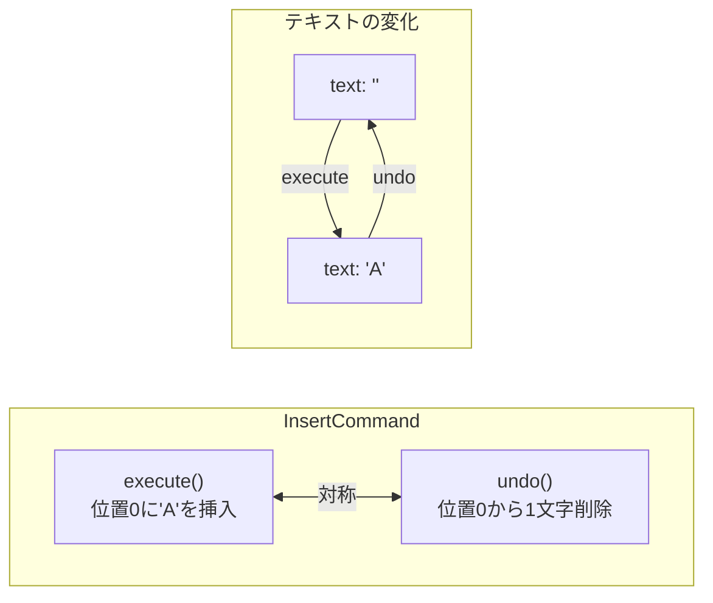
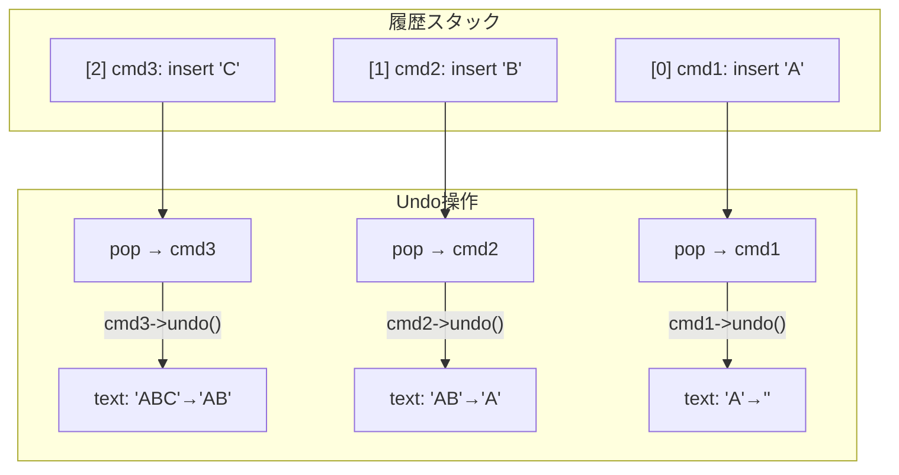

[@nqounet](https://x.com/nqounet)です。

シリーズ「Mooで作る簡易テキストエディタ」の第4回です。

## 前回の振り返り

前回は、「何をしたか」を記録するために、操作そのものをオブジェクトにするアイデアを学びました。



`InsertCommand`クラスを作成し、`execute`メソッドで挿入操作を実行できるようにしました。そして、操作オブジェクトを配列（履歴）に保存することで、「何をしたか」を記録できるようになりました。

```perl
my $cmd = InsertCommand->new(
    editor   => $editor,
    position => 0,
    string   => 'Hello',
);
$cmd->execute;          # 挿入を実行
push @history, $cmd;    # 履歴に保存
```

しかし、まだ**Undo機能は実装されていません**。履歴があっても、「元に戻す」操作ができないのです。

今回は、各操作クラスに`undo`メソッドを追加して、実際にUndoできるようにします。

## executeとundoの対称性

Undoを実現するための考え方はシンプルです。

**各操作には「逆の操作」がある**のです。

- 「挿入」の逆は「削除」
- 「削除」の逆は「挿入」



たとえば、「位置0に'A'を挿入した」操作を元に戻すには、「位置0から1文字を削除する」という逆の操作を実行すればよいのです。

```
execute: 位置0に'A'を挿入  →  text: '' → 'A'
undo:    位置0から1文字削除 →  text: 'A' → ''
```

この「execute」と「undo」は対になっています。executeで行った操作を、undoで元に戻す。この対称的な構造が、Commandパターンの美しさです。

## InsertCommandにundoメソッドを追加

では、`InsertCommand`クラスに`undo`メソッドを追加しましょう。

```perl
# Perl v5.36 以降
# 外部依存: Moo

package InsertCommand {
    use Moo;
    use v5.36;

    has editor => (
        is       => 'ro',
        required => 1,
    );

    has position => (
        is       => 'ro',
        required => 1,
    );

    has string => (
        is       => 'ro',
        required => 1,
    );

    sub execute ($self) {
        my $editor   = $self->editor;
        my $position = $self->position;
        my $string   = $self->string;

        my $current  = $editor->text;
        my $new_text = substr($current, 0, $position) 
                     . $string 
                     . substr($current, $position);
        $editor->text($new_text);
    }

    sub undo ($self) {
        my $editor   = $self->editor;
        my $position = $self->position;
        my $length   = length($self->string);

        my $current  = $editor->text;
        my $new_text = substr($current, 0, $position) 
                     . substr($current, $position + $length);
        $editor->text($new_text);
    }
};
```

`undo`メソッドでは、`execute`で挿入した文字列を削除しています。

- 挿入した位置（`$position`）から
- 挿入した文字列の長さ（`$length`）分だけ削除する

これで、`execute`で挿入した操作を`undo`で元に戻せるようになりました。

## InsertCommandのundoを試す

実際に`undo`メソッドが動作するか確認してみましょう。

```perl
# Perl v5.36 以降
# 外部依存: Moo

use v5.36;

package Editor {
    use Moo;

    has text => (
        is      => 'rw',
        default => '',
    );
};

package InsertCommand {
    use Moo;

    has editor => (
        is       => 'ro',
        required => 1,
    );

    has position => (
        is       => 'ro',
        required => 1,
    );

    has string => (
        is       => 'ro',
        required => 1,
    );

    sub execute ($self) {
        my $editor   = $self->editor;
        my $position = $self->position;
        my $string   = $self->string;

        my $current  = $editor->text;
        my $new_text = substr($current, 0, $position) 
                     . $string 
                     . substr($current, $position);
        $editor->text($new_text);
    }

    sub undo ($self) {
        my $editor   = $self->editor;
        my $position = $self->position;
        my $length   = length($self->string);

        my $current  = $editor->text;
        my $new_text = substr($current, 0, $position) 
                     . substr($current, $position + $length);
        $editor->text($new_text);
    }
};

# メイン処理
my $editor = Editor->new;

my $cmd = InsertCommand->new(
    editor   => $editor,
    position => 0,
    string   => 'Hello',
);

$cmd->execute;
say "execute後: " . $editor->text;  # Hello

$cmd->undo;
say "undo後: " . $editor->text;     # (空文字列)
```

実行結果は以下のようになります。

```
execute後: Hello
undo後: 
```

`execute`で挿入した「Hello」が、`undo`で削除されて空文字列に戻りました。

## DeleteCommandクラスを作る

次に、削除操作を表す`DeleteCommand`クラスを作成しましょう。

削除操作の場合、undoでは「削除した文字列を元の位置に挿入」することで元に戻せます。

ただし、ここで1つ注意があります。**削除した文字列を覚えておく必要がある**のです。

そのため、`execute`メソッドの中で、削除する前に文字列を保存しておきます。

```perl
# Perl v5.36 以降
# 外部依存: Moo

package DeleteCommand {
    use Moo;
    use v5.36;

    has editor => (
        is       => 'ro',
        required => 1,
    );

    has position => (
        is       => 'ro',
        required => 1,
    );

    has length => (
        is       => 'ro',
        required => 1,
    );

    has _deleted_string => (
        is      => 'rw',
        default => '',
    );

    sub execute ($self) {
        my $editor   = $self->editor;
        my $position = $self->position;
        my $length   = $self->length;

        my $current = $editor->text;

        # 削除する文字列を保存しておく
        my $deleted = substr($current, $position, $length);
        $self->_deleted_string($deleted);

        my $new_text = substr($current, 0, $position) 
                     . substr($current, $position + $length);
        $editor->text($new_text);
    }

    sub undo ($self) {
        my $editor   = $self->editor;
        my $position = $self->position;
        my $deleted  = $self->_deleted_string;

        my $current  = $editor->text;
        my $new_text = substr($current, 0, $position) 
                     . $deleted 
                     . substr($current, $position);
        $editor->text($new_text);
    }
};
```

`DeleteCommand`クラスの特徴を見てみましょう。

- `position` — 削除開始位置
- `length` — 削除する文字数
- `_deleted_string` — 削除した文字列を保存する内部属性（`_`で始まる）
- `execute` — 文字列を削除する前に`_deleted_string`に保存してから削除
- `undo` — 保存しておいた文字列を元の位置に挿入

`_deleted_string`属性は`is => 'rw'`にしています。これは、`execute`メソッドの中で値を設定する必要があるためです。アンダースコア（`_`）で始めているのは、「外部から直接触らない内部属性」であることを示す慣習です。

## DeleteCommandのundoを試す

`DeleteCommand`のundoが正しく動作するか確認してみましょう。

```perl
# Perl v5.36 以降
# 外部依存: Moo

use v5.36;

package Editor {
    use Moo;

    has text => (
        is      => 'rw',
        default => '',
    );
};

package DeleteCommand {
    use Moo;

    has editor => (
        is       => 'ro',
        required => 1,
    );

    has position => (
        is       => 'ro',
        required => 1,
    );

    has length => (
        is       => 'ro',
        required => 1,
    );

    has _deleted_string => (
        is      => 'rw',
        default => '',
    );

    sub execute ($self) {
        my $editor   = $self->editor;
        my $position = $self->position;
        my $length   = $self->length;

        my $current = $editor->text;
        my $deleted = substr($current, $position, $length);
        $self->_deleted_string($deleted);

        my $new_text = substr($current, 0, $position) 
                     . substr($current, $position + $length);
        $editor->text($new_text);
    }

    sub undo ($self) {
        my $editor   = $self->editor;
        my $position = $self->position;
        my $deleted  = $self->_deleted_string;

        my $current  = $editor->text;
        my $new_text = substr($current, 0, $position) 
                     . $deleted 
                     . substr($current, $position);
        $editor->text($new_text);
    }
};

# メイン処理
my $editor = Editor->new;
$editor->text('Hello World');  # 初期テキストを設定

say "初期状態: " . $editor->text;  # Hello World

my $cmd = DeleteCommand->new(
    editor   => $editor,
    position => 5,
    length   => 6,
);

$cmd->execute;
say "execute後: " . $editor->text;  # Hello

$cmd->undo;
say "undo後: " . $editor->text;     # Hello World
```

実行結果は以下のようになります。

```
初期状態: Hello World
execute後: Hello
undo後: Hello World
```

「 World」を削除した後、undoで元に戻すことができました。

## 履歴を使ったUndo

これで`InsertCommand`と`DeleteCommand`の両方に`undo`メソッドが追加されました。

履歴配列から操作を取り出して`undo`を呼べば、複数回のUndoができるはずです。



```perl
# Perl v5.36 以降
# 外部依存: Moo

use v5.36;

package Editor {
    use Moo;

    has text => (
        is      => 'rw',
        default => '',
    );
};

package InsertCommand {
    use Moo;

    has editor => (
        is       => 'ro',
        required => 1,
    );

    has position => (
        is       => 'ro',
        required => 1,
    );

    has string => (
        is       => 'ro',
        required => 1,
    );

    sub execute ($self) {
        my $editor   = $self->editor;
        my $position = $self->position;
        my $string   = $self->string;

        my $current  = $editor->text;
        my $new_text = substr($current, 0, $position) 
                     . $string 
                     . substr($current, $position);
        $editor->text($new_text);
    }

    sub undo ($self) {
        my $editor   = $self->editor;
        my $position = $self->position;
        my $length   = length($self->string);

        my $current  = $editor->text;
        my $new_text = substr($current, 0, $position) 
                     . substr($current, $position + $length);
        $editor->text($new_text);
    }
};

# メイン処理
my $editor = Editor->new;
my @history;

# 操作1: 'A'を挿入
my $cmd1 = InsertCommand->new(
    editor   => $editor,
    position => 0,
    string   => 'A',
);
$cmd1->execute;
push @history, $cmd1;
say "操作1後: " . $editor->text;  # A

# 操作2: 'B'を挿入
my $cmd2 = InsertCommand->new(
    editor   => $editor,
    position => 1,
    string   => 'B',
);
$cmd2->execute;
push @history, $cmd2;
say "操作2後: " . $editor->text;  # AB

# 操作3: 'C'を挿入
my $cmd3 = InsertCommand->new(
    editor   => $editor,
    position => 2,
    string   => 'C',
);
$cmd3->execute;
push @history, $cmd3;
say "操作3後: " . $editor->text;  # ABC

say "";
say "--- Undo開始 ---";

# Undo1: 履歴から最後の操作を取り出してundo
my $undo1 = pop @history;
$undo1->undo;
say "Undo1後: " . $editor->text;  # AB

# Undo2: 履歴から最後の操作を取り出してundo
my $undo2 = pop @history;
$undo2->undo;
say "Undo2後: " . $editor->text;  # A

# Undo3: 履歴から最後の操作を取り出してundo
my $undo3 = pop @history;
$undo3->undo;
say "Undo3後: " . $editor->text;  # (空文字列)
```

実行結果は以下のようになります。

```
操作1後: A
操作2後: AB
操作3後: ABC

--- Undo開始 ---
Undo1後: AB
Undo2後: A
Undo3後: 
```

複数回のUndoが正しく動作しています。

履歴配列から`pop`で最後の操作を取り出し、その`undo`メソッドを呼ぶことで、逆順に操作を元に戻しています。これは**スタック（LIFO: Last In, First Out）**の動作です。

## 何が実現できたのか

ここで、何が実現できたのかを整理しましょう。

**第2回で抱えていた問題**:
- 直前の状態（previous_text）を1つだけ保存する方法では、複数回のUndoに対応できない

**今回実現したこと**:
- 各操作クラス（InsertCommand, DeleteCommand）に`undo`メソッドを追加
- `undo`メソッドは`execute`の逆操作を実行する
- 履歴配列から操作を取り出して`undo`を呼ぶことで、何回でもUndoできる

操作をオブジェクトにして、`execute`と`undo`のペアを持たせることで、複数回のUndo問題を解決できました。

## 今回作成した完成コード

以下が今回作成した完成コードです。`InsertCommand`と`DeleteCommand`の両方に`undo`メソッドがあり、履歴を使った複数回Undoを確認できます。

```perl
#!/usr/bin/env perl
# Perl v5.36 以降
# 外部依存: Moo

use v5.36;

package Editor {
    use Moo;

    has text => (
        is      => 'rw',
        default => '',
    );
};

package InsertCommand {
    use Moo;

    has editor => (
        is       => 'ro',
        required => 1,
    );

    has position => (
        is       => 'ro',
        required => 1,
    );

    has string => (
        is       => 'ro',
        required => 1,
    );

    sub execute ($self) {
        my $editor   = $self->editor;
        my $position = $self->position;
        my $string   = $self->string;

        my $current  = $editor->text;
        my $new_text = substr($current, 0, $position) 
                     . $string 
                     . substr($current, $position);
        $editor->text($new_text);
    }

    sub undo ($self) {
        my $editor   = $self->editor;
        my $position = $self->position;
        my $length   = length($self->string);

        my $current  = $editor->text;
        my $new_text = substr($current, 0, $position) 
                     . substr($current, $position + $length);
        $editor->text($new_text);
    }
};

package DeleteCommand {
    use Moo;

    has editor => (
        is       => 'ro',
        required => 1,
    );

    has position => (
        is       => 'ro',
        required => 1,
    );

    has length => (
        is       => 'ro',
        required => 1,
    );

    has _deleted_string => (
        is      => 'rw',
        default => '',
    );

    sub execute ($self) {
        my $editor   = $self->editor;
        my $position = $self->position;
        my $length   = $self->length;

        my $current = $editor->text;
        my $deleted = substr($current, $position, $length);
        $self->_deleted_string($deleted);

        my $new_text = substr($current, 0, $position) 
                     . substr($current, $position + $length);
        $editor->text($new_text);
    }

    sub undo ($self) {
        my $editor   = $self->editor;
        my $position = $self->position;
        my $deleted  = $self->_deleted_string;

        my $current  = $editor->text;
        my $new_text = substr($current, 0, $position) 
                     . $deleted 
                     . substr($current, $position);
        $editor->text($new_text);
    }
};

# メイン処理
my $editor = Editor->new;
my @history;

# 操作1: 'Hello'を挿入
my $cmd1 = InsertCommand->new(
    editor   => $editor,
    position => 0,
    string   => 'Hello',
);
$cmd1->execute;
push @history, $cmd1;
say "操作1後: " . $editor->text;

# 操作2: ' World'を挿入
my $cmd2 = InsertCommand->new(
    editor   => $editor,
    position => 5,
    string   => ' World',
);
$cmd2->execute;
push @history, $cmd2;
say "操作2後: " . $editor->text;

# 操作3: ' World'を削除
my $cmd3 = DeleteCommand->new(
    editor   => $editor,
    position => 5,
    length   => 6,
);
$cmd3->execute;
push @history, $cmd3;
say "操作3後: " . $editor->text;

say "";
say "--- Undo開始 ---";

# Undo
while (my $cmd = pop @history) {
    $cmd->undo;
    say "Undo後: " . $editor->text;
}
```

## まとめ

- 各操作には「逆の操作」がある（挿入↔削除）
- `execute`メソッドと対になる`undo`メソッドを追加する
- `InsertCommand.undo`は挿入した文字列を削除する
- `DeleteCommand.undo`は削除した文字列を元の位置に挿入する（削除前に保存が必要）
- 履歴配列から`pop`して`undo`を呼ぶことで、複数回のUndoが可能

## 次回予告

今回、`InsertCommand`と`DeleteCommand`にそれぞれ`execute`と`undo`メソッドを追加しました。

しかし、ここで疑問が生じます。**「すべてのコマンドクラスが同じメソッドを持つべき」という約束を、どう保証するのでしょうか？**

もし、新しいコマンドクラスを追加する際に`undo`メソッドを実装し忘れたら、Undo機能が壊れてしまいます。

次回は、`Moo::Role`を使って**共通のインターフェース**を定義し、すべてのコマンドクラスが必ず`execute`と`undo`メソッドを持つことを保証します。

お楽しみに。
