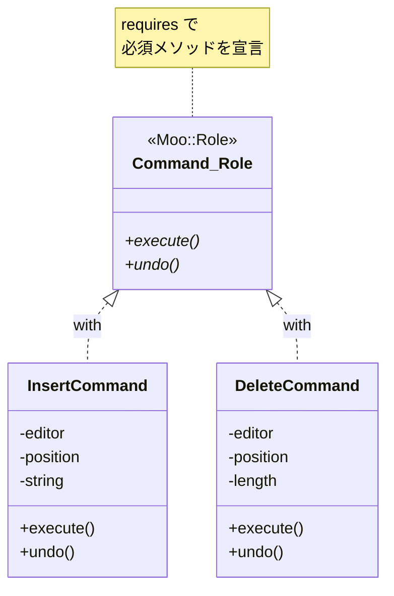

[@nqounet](https://x.com/nqounet)です。

シリーズ「Mooで作る簡易テキストエディタ」の第5回です。

## 前回の振り返り

前回は、`InsertCommand`と`DeleteCommand`にそれぞれ`undo`メソッドを追加し、履歴を使った複数回Undoを実現しました。



これで、操作を実行する`execute`メソッドと、それを元に戻す`undo`メソッドの対が揃いました。履歴配列から操作を取り出して`undo`を呼ぶことで、何回でもUndoできるようになりました。

```perl
# 履歴から最後の操作を取り出してundo
my $cmd = pop @history;
$cmd->undo;
```

しかし、ここで1つ不安が残ります。

## 問題：メソッドの実装を保証できない

現在、`InsertCommand`と`DeleteCommand`はたまたま同じメソッド（`execute`と`undo`）を持っています。しかし、これは「約束」ではありません。

たとえば、新しいコマンドクラス`ReplaceCommand`を追加するとします。

```perl
package ReplaceCommand {
    use Moo;

    has editor   => (is => 'ro', required => 1);
    has position => (is => 'ro', required => 1);
    has length   => (is => 'ro', required => 1);
    has string   => (is => 'ro', required => 1);

    sub execute ($self) {
        # 置換処理...
    }

    # undoメソッドを実装し忘れた！
};
```

`undo`メソッドを実装し忘れても、Perlはエラーを出しません。問題に気づくのは、実際にUndoしようとしたときです。

```perl
my $cmd = ReplaceCommand->new(...);
$cmd->execute;
push @history, $cmd;

# 後で...
my $undo_cmd = pop @history;
$undo_cmd->undo;  # ここでエラー！「Can't locate object method "undo"」
```

このエラーは実行時に発生します。テストで見逃すと、本番環境で問題が起きる可能性があります。

「すべてのコマンドは`execute`と`undo`を持つべき」という約束を、コードで保証したいのです。

## 解決策：Moo::Roleでインターフェースを定義する

この問題を解決するのが`Moo::Role`の`requires`機能です。



`Moo::Role`については、前シリーズで詳しく解説しました。



前シリーズでは、ロールを使って属性やメソッドを提供する例を紹介しました。今回は、ロールを使ってメソッドの実装を要求する使い方を学びます。

## Command::Roleを作成する

では、コマンドクラス用のロール`Command::Role`を作成しましょう。

```perl
# Perl v5.36 以降
# 外部依存: Moo

package Command::Role {
    use Moo::Role;
    use v5.36;

    requires 'execute';
    requires 'undo';
};
```

`requires 'execute'`と`requires 'undo'`が重要です。

これは「このロールを適用するクラスは、`execute`と`undo`メソッドを実装しなければならない」という約束を宣言しています。

`requires`で指定されたメソッドを実装していないクラスにロールを適用しようとすると、コンパイル時にエラーになります。

## 各コマンドにwithで適用する

`InsertCommand`と`DeleteCommand`に`Command::Role`を適用してみましょう。

```perl
# Perl v5.36 以降
# 外部依存: Moo

package Command::Role {
    use Moo::Role;
    use v5.36;

    requires 'execute';
    requires 'undo';
};

package InsertCommand {
    use Moo;
    use v5.36;
    with 'Command::Role';  # ロールを適用

    has editor   => (is => 'ro', required => 1);
    has position => (is => 'ro', required => 1);
    has string   => (is => 'ro', required => 1);

    sub execute ($self) {
        my $editor   = $self->editor;
        my $position = $self->position;
        my $string   = $self->string;

        my $current  = $editor->text;
        my $new_text = substr($current, 0, $position) 
                     . $string 
                     . substr($current, $position);
        $editor->text($new_text);
    }

    sub undo ($self) {
        my $editor   = $self->editor;
        my $position = $self->position;
        my $length   = length($self->string);

        my $current  = $editor->text;
        my $new_text = substr($current, 0, $position) 
                     . substr($current, $position + $length);
        $editor->text($new_text);
    }
};

package DeleteCommand {
    use Moo;
    use v5.36;
    with 'Command::Role';  # ロールを適用

    has editor          => (is => 'ro', required => 1);
    has position        => (is => 'ro', required => 1);
    has length          => (is => 'ro', required => 1);
    has _deleted_string => (is => 'rw', default => '');

    sub execute ($self) {
        my $editor   = $self->editor;
        my $position = $self->position;
        my $length   = $self->length;

        my $current = $editor->text;
        my $deleted = substr($current, $position, $length);
        $self->_deleted_string($deleted);

        my $new_text = substr($current, 0, $position) 
                     . substr($current, $position + $length);
        $editor->text($new_text);
    }

    sub undo ($self) {
        my $editor   = $self->editor;
        my $position = $self->position;
        my $deleted  = $self->_deleted_string;

        my $current  = $editor->text;
        my $new_text = substr($current, 0, $position) 
                     . $deleted 
                     . substr($current, $position);
        $editor->text($new_text);
    }
};
```

各クラスに`with 'Command::Role'`を追加するだけです。

`InsertCommand`も`DeleteCommand`も、`execute`と`undo`の両方を実装しているので、問題なくロールが適用されます。

## undoを実装し忘れるとどうなるか

試しに、`undo`メソッドを実装し忘れたクラスを作ってみましょう。

```perl
# Perl v5.36 以降
# 外部依存: Moo

use v5.36;

package Command::Role {
    use Moo::Role;

    requires 'execute';
    requires 'undo';
};

package BrokenCommand {
    use Moo;
    with 'Command::Role';  # ロールを適用

    has editor => (is => 'ro', required => 1);

    sub execute ($self) {
        # 何かの処理...
    }

    # undoメソッドがない！
};
```

このコードを実行しようとすると、以下のエラーが発生します。

```
Can't apply Command::Role to BrokenCommand - missing undo at ...
```

コンパイル時にエラーが発生しています。実行される前に問題を検出できるのです。

これは非常に重要な利点です。

- 新しいコマンドクラスを追加するとき、`undo`を忘れるとすぐにエラーになる
- テストを実行する前に問題を発見できる
- 「すべてのコマンドは`execute`と`undo`を持つ」という設計意図がコードで表現される

## ロールを適用する利点

`Command::Role`を適用することで、以下の利点が得られます。

1. コンパイル時チェック — 必須メソッドの実装漏れを早期に検出できる
2. 設計意図の明示 — 「コマンドは何をすべきか」がコードで表現される
3. 型の代わり — Perlには静的型がないが、ロールで「このオブジェクトは〜できる」を表現できる
4. ドキュメント効果 — 新しい開発者がコマンドクラスを追加するとき、何を実装すべきかが明確

## 今回作成した完成コード

以下が今回作成した完成コードです。`Command::Role`を定義し、`InsertCommand`と`DeleteCommand`に適用しています。

```perl
#!/usr/bin/env perl
# Perl v5.36 以降
# 外部依存: Moo

use v5.36;

package Editor {
    use Moo;

    has text => (
        is      => 'rw',
        default => '',
    );
};

package Command::Role {
    use Moo::Role;

    requires 'execute';
    requires 'undo';
};

package InsertCommand {
    use Moo;
    with 'Command::Role';

    has editor => (
        is       => 'ro',
        required => 1,
    );

    has position => (
        is       => 'ro',
        required => 1,
    );

    has string => (
        is       => 'ro',
        required => 1,
    );

    sub execute ($self) {
        my $editor   = $self->editor;
        my $position = $self->position;
        my $string   = $self->string;

        my $current  = $editor->text;
        my $new_text = substr($current, 0, $position) 
                     . $string 
                     . substr($current, $position);
        $editor->text($new_text);
    }

    sub undo ($self) {
        my $editor   = $self->editor;
        my $position = $self->position;
        my $length   = length($self->string);

        my $current  = $editor->text;
        my $new_text = substr($current, 0, $position) 
                     . substr($current, $position + $length);
        $editor->text($new_text);
    }
};

package DeleteCommand {
    use Moo;
    with 'Command::Role';

    has editor => (
        is       => 'ro',
        required => 1,
    );

    has position => (
        is       => 'ro',
        required => 1,
    );

    has length => (
        is       => 'ro',
        required => 1,
    );

    has _deleted_string => (
        is      => 'rw',
        default => '',
    );

    sub execute ($self) {
        my $editor   = $self->editor;
        my $position = $self->position;
        my $length   = $self->length;

        my $current = $editor->text;
        my $deleted = substr($current, $position, $length);
        $self->_deleted_string($deleted);

        my $new_text = substr($current, 0, $position) 
                     . substr($current, $position + $length);
        $editor->text($new_text);
    }

    sub undo ($self) {
        my $editor   = $self->editor;
        my $position = $self->position;
        my $deleted  = $self->_deleted_string;

        my $current  = $editor->text;
        my $new_text = substr($current, 0, $position) 
                     . $deleted 
                     . substr($current, $position);
        $editor->text($new_text);
    }
};

# メイン処理
my $editor = Editor->new;
my @history;

# 操作1: 'Hello'を挿入
my $cmd1 = InsertCommand->new(
    editor   => $editor,
    position => 0,
    string   => 'Hello',
);
$cmd1->execute;
push @history, $cmd1;
say "操作1後: " . $editor->text;

# 操作2: ' World'を挿入
my $cmd2 = InsertCommand->new(
    editor   => $editor,
    position => 5,
    string   => ' World',
);
$cmd2->execute;
push @history, $cmd2;
say "操作2後: " . $editor->text;

# 操作3: ' World'を削除
my $cmd3 = DeleteCommand->new(
    editor   => $editor,
    position => 5,
    length   => 6,
);
$cmd3->execute;
push @history, $cmd3;
say "操作3後: " . $editor->text;

say "";
say "--- Undo開始 ---";

# Undo
while (my $cmd = pop @history) {
    $cmd->undo;
    say "Undo後: " . $editor->text;
}
```

実行結果は前回と同じです。

```
操作1後: Hello
操作2後: Hello World
操作3後: Hello
```

```
--- Undo開始 ---
Undo後: Hello World
Undo後: Hello
Undo後: 
```

違いは見た目ではわかりませんが、設計の安全性が向上しています。

## まとめ

- `Moo::Role`の`requires`で必須メソッドを宣言できる
- `with 'RoleName'`でロールを適用すると、`requires`のメソッドがなければコンパイル時エラーになる
- これにより「すべてのコマンドは`execute`と`undo`を持つ」という約束をコードで保証できる
- 新しいコマンドクラスを追加するときも、必須メソッドの実装漏れを早期に検出できる

## 次回予告

今回、`Command::Role`を導入してコマンドクラスのインターフェースを保証しました。

しかし、現在のコードでは履歴管理がメイン処理に直接書かれています。`@history`配列への`push`や`pop`がメイン処理に散らばっていて、コードが複雑になっています。

```perl
push @history, $cmd;  # メイン処理に散らばっている
my $cmd = pop @history;
```

次回は、履歴管理を専門に行う`History`クラスを作成し、Undo操作をカプセル化します。

お楽しみに。
