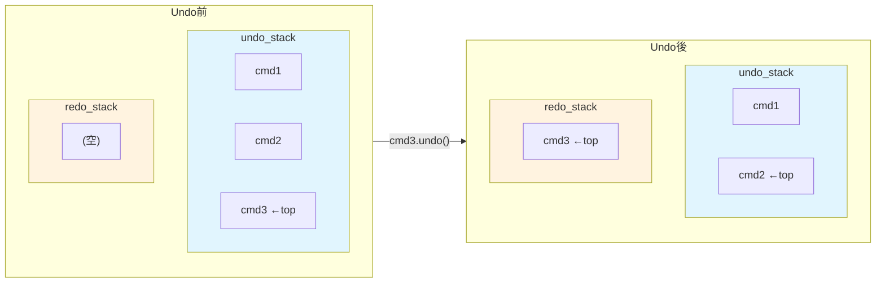
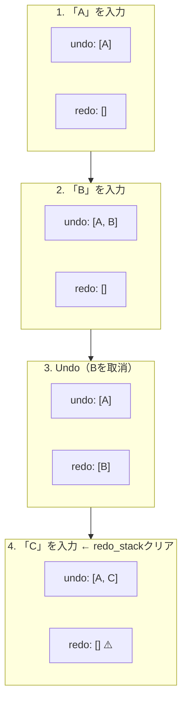

[@nqounet](https://x.com/nqounet)です。

シリーズ「Mooで作る簡易テキストエディタ」の第6回です。

## 前回の振り返り

前回は、`Moo::Role`の`requires`機能を使って、`Command::Role`を作成しました。



これにより、すべてのコマンドクラスが`execute`と`undo`メソッドを持つことを**コンパイル時に保証**できるようになりました。新しいコマンドクラスを追加する際に、必須メソッドの実装漏れを早期に検出できます。

```perl
package Command::Role {
    use Moo::Role;

    requires 'execute';
    requires 'undo';
};

package InsertCommand {
    use Moo;
    with 'Command::Role';  # executeとundoがないとエラー

    # ...
};
```

しかし、前回のコードを見返すと、気になる点があります。

## 問題：履歴管理がメイン処理に散らばっている

前回の完成コードでは、履歴管理がメイン処理に直接書かれています。

```perl
# メイン処理
my $editor = Editor->new;
my @history;  # ここで履歴配列を管理

# 操作1: 'Hello'を挿入
my $cmd1 = InsertCommand->new(
    editor   => $editor,
    position => 0,
    string   => 'Hello',
);
$cmd1->execute;
push @history, $cmd1;  # 履歴に追加

# ...（他の操作も同様）

# Undo
while (my $cmd = pop @history) {  # 履歴から取り出し
    $cmd->undo;
}
```

このコードには、いくつかの問題があります。

1. **履歴操作が分散している** — `push @history, $cmd`や`pop @history`がメイン処理のあちこちに散らばっている
2. **Redo機能を追加しにくい** — Undoした操作をRedoするには、別のスタックが必要。このままでは実装が複雑になる
3. **再利用が難しい** — 履歴管理のロジックを別のアプリケーションで使いたくても、切り出しにくい

**履歴管理を専門に行うクラスがあれば、これらの問題を解決できます。**

## 解決策：Historyクラスを作成する

履歴管理を担当する`History`クラスを作成しましょう。

```perl
# Perl v5.36 以降
# 外部依存: Moo

package History {
    use Moo;
    use v5.36;

    has undo_stack => (
        is      => 'ro',
        default => sub { [] },
    );

    has redo_stack => (
        is      => 'ro',
        default => sub { [] },
    );
};
```

`History`クラスには2つの属性があります。

- `undo_stack` — 実行したコマンドを積み上げるスタック（Undo用）
- `redo_stack` — Undoしたコマンドを積み上げるスタック（Redo用）

どちらも配列リファレンスで、スタック（後入れ先出し：LIFO）として使います。

**なぜ2つのスタックが必要なのでしょうか？**

Undo/Redo機能を実現するには、以下の動作が必要です。

- **Undo** — 最後に実行した操作を取り消す
- **Redo** — Undoした操作をやり直す

Undoした操作を覚えておかないと、Redoできません。そのため、`redo_stack`が必要になります。



```
execute_command → undo_stackにpush
undo           → undo_stackからpop → redo_stackにpush
redo           → redo_stackからpop → undo_stackにpush
```

今回は`undo_stack`と`redo_stack`の準備、そして`execute_command`と`undo`メソッドを実装します。`redo`メソッドは次回詳しく扱います。

## execute_commandメソッドを実装する

まず、コマンドを実行して履歴に追加する`execute_command`メソッドを実装しましょう。

```perl
# Perl v5.36 以降
# 外部依存: Moo

package History {
    use Moo;
    use v5.36;

    has undo_stack => (
        is      => 'ro',
        default => sub { [] },
    );

    has redo_stack => (
        is      => 'ro',
        default => sub { [] },
    );

    sub execute_command ($self, $command) {
        $command->execute;
        push $self->undo_stack->@*, $command;

        # 新しい操作を実行したら、redo_stackをクリア
        $self->redo_stack->@* = ();
    }
};
```

`execute_command`メソッドは、以下の処理を行います。

1. コマンドの`execute`メソッドを呼び出す
2. 実行したコマンドを`undo_stack`に`push`する
3. `redo_stack`をクリアする（重要）

**なぜ`redo_stack`をクリアするのでしょうか？**

これは、エディタの一般的な動作に合わせています。多くのエディタでは、Undoした後に新しい操作を行うと、Redo履歴がクリアされます。

たとえば、以下のシナリオを考えてみましょう。



1. 「A」を入力 → undo_stack: [A]
2. 「B」を入力 → undo_stack: [A, B]
3. Undo（「B」を取り消し）→ undo_stack: [A], redo_stack: [B]
4. 「C」を入力 → undo_stack: [A, C], redo_stack: []（クリア）

ステップ4で新しい操作「C」を実行したので、「B」のRedo履歴は意味がなくなります。そのため、`redo_stack`をクリアしています。

## undoメソッドを実装する

次に、最後の操作を取り消す`undo`メソッドを実装しましょう。

```perl
# Perl v5.36 以降
# 外部依存: Moo

package History {
    use Moo;
    use v5.36;

    has undo_stack => (
        is      => 'ro',
        default => sub { [] },
    );

    has redo_stack => (
        is      => 'ro',
        default => sub { [] },
    );

    sub execute_command ($self, $command) {
        $command->execute;
        push $self->undo_stack->@*, $command;
        $self->redo_stack->@* = ();
    }

    sub undo ($self) {
        return unless $self->undo_stack->@*;  # スタックが空なら何もしない

        my $command = pop $self->undo_stack->@*;
        $command->undo;
        push $self->redo_stack->@*, $command;
    }
};
```

`undo`メソッドは、以下の処理を行います。

1. `undo_stack`が空なら、何もせずにreturnする
2. `undo_stack`から最後のコマンドを`pop`する
3. コマンドの`undo`メソッドを呼び出す
4. Undoしたコマンドを`redo_stack`に`push`する（Redo用に保存）

最初の`return unless ...`は**ガード節**です。Undoする操作がない場合にエラーにならないよう、早期リターンしています。

## Historyクラスを使ってみる

では、`History`クラスを使って、履歴管理をカプセル化してみましょう。

```perl
# Perl v5.36 以降
# 外部依存: Moo

use v5.36;

package Editor {
    use Moo;

    has text => (
        is      => 'rw',
        default => '',
    );
};

package Command::Role {
    use Moo::Role;

    requires 'execute';
    requires 'undo';
};

package InsertCommand {
    use Moo;
    with 'Command::Role';

    has editor   => (is => 'ro', required => 1);
    has position => (is => 'ro', required => 1);
    has string   => (is => 'ro', required => 1);

    sub execute ($self) {
        my $editor   = $self->editor;
        my $position = $self->position;
        my $string   = $self->string;

        my $current  = $editor->text;
        my $new_text = substr($current, 0, $position) 
                     . $string 
                     . substr($current, $position);
        $editor->text($new_text);
    }

    sub undo ($self) {
        my $editor   = $self->editor;
        my $position = $self->position;
        my $length   = length($self->string);

        my $current  = $editor->text;
        my $new_text = substr($current, 0, $position) 
                     . substr($current, $position + $length);
        $editor->text($new_text);
    }
};

package History {
    use Moo;

    has undo_stack => (
        is      => 'ro',
        default => sub { [] },
    );

    has redo_stack => (
        is      => 'ro',
        default => sub { [] },
    );

    sub execute_command ($self, $command) {
        $command->execute;
        push $self->undo_stack->@*, $command;
        $self->redo_stack->@* = ();
    }

    sub undo ($self) {
        return unless $self->undo_stack->@*;

        my $command = pop $self->undo_stack->@*;
        $command->undo;
        push $self->redo_stack->@*, $command;
    }
};

# メイン処理
my $editor  = Editor->new;
my $history = History->new;

# 操作1: 'Hello'を挿入
my $cmd1 = InsertCommand->new(
    editor   => $editor,
    position => 0,
    string   => 'Hello',
);
$history->execute_command($cmd1);
say "操作1後: " . $editor->text;

# 操作2: ' World'を挿入
my $cmd2 = InsertCommand->new(
    editor   => $editor,
    position => 5,
    string   => ' World',
);
$history->execute_command($cmd2);
say "操作2後: " . $editor->text;

say "";
say "--- Undo開始 ---";

# Undo
$history->undo;
say "Undo1後: " . $editor->text;

$history->undo;
say "Undo2後: " . $editor->text;
```

実行結果は以下のようになります。

```
操作1後: Hello
操作2後: Hello World

--- Undo開始 ---
Undo1後: Hello
Undo2後: 
```

前回と同じ結果ですが、**メイン処理がシンプルになりました**。

### 変更前（前回のコード）

```perl
my @history;  # 配列を直接管理

$cmd1->execute;
push @history, $cmd1;  # 手動でpush

my $cmd = pop @history;  # 手動でpop
$cmd->undo;
```

### 変更後（今回のコード）

```perl
my $history = History->new;  # Historyオブジェクトに任せる

$history->execute_command($cmd1);  # 実行と履歴追加を一括

$history->undo;  # Undo操作もメソッド呼び出しだけ
```

履歴管理のロジックが`History`クラスにカプセル化されたため、メイン処理は「何をするか」に集中できるようになりました。

## Historyクラスを導入する利点

`History`クラスを導入することで、以下の利点が得られます。

1. **履歴操作の集中管理** — `push`/`pop`のロジックがHistoryクラス内に閉じ込められる
2. **Redo機能の準備** — `redo_stack`が用意され、次回のRedo実装がスムーズに行える
3. **再利用性の向上** — Historyクラスを別のアプリケーションでも使い回せる
4. **テストしやすさ** — 履歴管理のテストをHistoryクラス単体で行える

また、`execute_command`メソッドで`redo_stack`をクリアする処理も、適切な場所（Historyクラス内）で行われています。この処理をメイン処理に書いていたら、忘れてバグになる可能性がありました。

## 今回作成した完成コード

以下が今回作成した完成コードです。`History`クラスを定義し、`execute_command`と`undo`メソッドで履歴管理を行っています。

```perl
#!/usr/bin/env perl
# Perl v5.36 以降
# 外部依存: Moo

use v5.36;

package Editor {
    use Moo;

    has text => (
        is      => 'rw',
        default => '',
    );
};

package Command::Role {
    use Moo::Role;

    requires 'execute';
    requires 'undo';
};

package InsertCommand {
    use Moo;
    with 'Command::Role';

    has editor => (
        is       => 'ro',
        required => 1,
    );

    has position => (
        is       => 'ro',
        required => 1,
    );

    has string => (
        is       => 'ro',
        required => 1,
    );

    sub execute ($self) {
        my $editor   = $self->editor;
        my $position = $self->position;
        my $string   = $self->string;

        my $current  = $editor->text;
        my $new_text = substr($current, 0, $position) 
                     . $string 
                     . substr($current, $position);
        $editor->text($new_text);
    }

    sub undo ($self) {
        my $editor   = $self->editor;
        my $position = $self->position;
        my $length   = length($self->string);

        my $current  = $editor->text;
        my $new_text = substr($current, 0, $position) 
                     . substr($current, $position + $length);
        $editor->text($new_text);
    }
};

package DeleteCommand {
    use Moo;
    with 'Command::Role';

    has editor => (
        is       => 'ro',
        required => 1,
    );

    has position => (
        is       => 'ro',
        required => 1,
    );

    has length => (
        is       => 'ro',
        required => 1,
    );

    has _deleted_string => (
        is      => 'rw',
        default => '',
    );

    sub execute ($self) {
        my $editor   = $self->editor;
        my $position = $self->position;
        my $length   = $self->length;

        my $current = $editor->text;
        my $deleted = substr($current, $position, $length);
        $self->_deleted_string($deleted);

        my $new_text = substr($current, 0, $position) 
                     . substr($current, $position + $length);
        $editor->text($new_text);
    }

    sub undo ($self) {
        my $editor   = $self->editor;
        my $position = $self->position;
        my $deleted  = $self->_deleted_string;

        my $current  = $editor->text;
        my $new_text = substr($current, 0, $position) 
                     . $deleted 
                     . substr($current, $position);
        $editor->text($new_text);
    }
};

package History {
    use Moo;

    has undo_stack => (
        is      => 'ro',
        default => sub { [] },
    );

    has redo_stack => (
        is      => 'ro',
        default => sub { [] },
    );

    sub execute_command ($self, $command) {
        $command->execute;
        push $self->undo_stack->@*, $command;
        $self->redo_stack->@* = ();
    }

    sub undo ($self) {
        return unless $self->undo_stack->@*;

        my $command = pop $self->undo_stack->@*;
        $command->undo;
        push $self->redo_stack->@*, $command;
    }
};

# メイン処理
my $editor  = Editor->new;
my $history = History->new;

# 操作1: 'Hello'を挿入
my $cmd1 = InsertCommand->new(
    editor   => $editor,
    position => 0,
    string   => 'Hello',
);
$history->execute_command($cmd1);
say "操作1後: " . $editor->text;

# 操作2: ' World'を挿入
my $cmd2 = InsertCommand->new(
    editor   => $editor,
    position => 5,
    string   => ' World',
);
$history->execute_command($cmd2);
say "操作2後: " . $editor->text;

# 操作3: ' World'を削除
my $cmd3 = DeleteCommand->new(
    editor   => $editor,
    position => 5,
    length   => 6,
);
$history->execute_command($cmd3);
say "操作3後: " . $editor->text;

say "";
say "--- Undo開始 ---";

# Undo
$history->undo;
say "Undo1後: " . $editor->text;

$history->undo;
say "Undo2後: " . $editor->text;

$history->undo;
say "Undo3後: " . $editor->text;
```

実行結果は以下のようになります。

```
操作1後: Hello
操作2後: Hello World
操作3後: Hello

--- Undo開始 ---
Undo1後: Hello World
Undo2後: Hello
Undo3後: 
```

## まとめ

- 履歴管理をメイン処理から分離し、`History`クラスにカプセル化した
- `undo_stack`は実行したコマンドを積み上げ、Undo時に取り出す
- `redo_stack`はUndoしたコマンドを積み上げ、Redo用に保存する
- `execute_command`メソッドは、コマンドを実行し、`undo_stack`に追加し、`redo_stack`をクリアする
- `undo`メソッドは、`undo_stack`からコマンドを取り出し、`undo`を呼び、`redo_stack`に保存する

## 次回予告

今回、`History`クラスを作成して履歴管理をカプセル化しました。`redo_stack`も用意しましたが、まだ`redo`メソッドは実装していません。

```perl
# 今回作成したもの
$history->execute_command($cmd);  # ✅ 実装済み
$history->undo;                   # ✅ 実装済み
# $history->redo;                 # ❌ 未実装
```

次回は、Undoした操作をやり直す**Redo機能**を実装します。`undo_stack`と`redo_stack`の間でコマンドがどのように移動するかを理解し、Undo/Redoの連続操作を可能にします。

お楽しみに。
