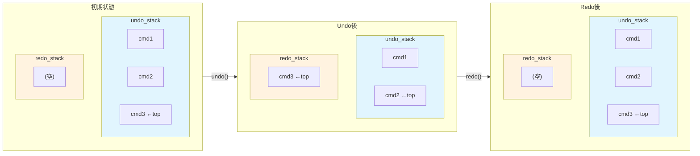

[@nqounet](https://x.com/nqounet)です。

シリーズ「Mooで作る簡易テキストエディタ」の第7回です。

## 前回の振り返り

前回は、履歴管理を専門に行う`History`クラスを作成しました。



`History`クラスには2つのスタックがあります。

- `undo_stack` — 実行したコマンドを積み上げる
- `redo_stack` — Undoしたコマンドを積み上げる（Redo用）

そして、`execute_command`と`undo`メソッドを実装しました。

```perl
package History {
    use Moo;

    has undo_stack => (is => 'ro', default => sub { [] });
    has redo_stack => (is => 'ro', default => sub { [] });

    sub execute_command ($self, $command) {
        $command->execute;
        push $self->undo_stack->@*, $command;
        $self->redo_stack->@* = ();  # 新規操作でredo_stackをクリア
    }

    sub undo ($self) {
        return unless $self->undo_stack->@*;

        my $command = pop $self->undo_stack->@*;
        $command->undo;
        push $self->redo_stack->@*, $command;  # Redo用に保存
    }

    # sub redo ($self) { ... }  # ← 未実装
};
```

`undo`メソッドでは、コマンドを`undo_stack`から取り出し、`redo_stack`に移動しています。これは、後でRedoできるようにするためです。

今回は、いよいよ`redo`メソッドを実装します。

## Redo機能とは

Redo機能は、Undoした操作をやり直す機能です。

たとえば、以下のシナリオを考えてみましょう。

1. 「Hello」を入力
2. Undo（「Hello」を取り消し）
3. 「やっぱり『Hello』が必要だった！」

ステップ3で、Undoした操作をやり直したくなることがあります。これがRedo機能です。

多くのエディタでは、`Ctrl+Z`でUndo、`Ctrl+Y`または`Ctrl+Shift+Z`でRedoができます。

## スタック間のコマンド移動を理解する

Undo/Redoの動作を図で理解しましょう。



コマンドの移動をまとめると、以下のようになります。

| 操作 | undo_stack | redo_stack |
|:-----|:-----------|:-----------|
| execute_command | push | クリア |
| undo | pop → | → push |
| redo | push ← | ← pop |

`undo`と`redo`は、対称的な操作です。

- `undo` — `undo_stack`からpop → コマンドの`undo`を呼ぶ → `redo_stack`にpush
- `redo` — `redo_stack`からpop → コマンドの`execute`を呼ぶ → `undo_stack`にpush

## redoメソッドを実装する

では、`redo`メソッドを実装しましょう。

```perl
# Perl v5.36 以降
# 外部依存: Moo

package History {
    use Moo;
    use v5.36;

    has undo_stack => (
        is      => 'ro',
        default => sub { [] },
    );

    has redo_stack => (
        is      => 'ro',
        default => sub { [] },
    );

    sub execute_command ($self, $command) {
        $command->execute;
        push $self->undo_stack->@*, $command;
        $self->redo_stack->@* = ();
    }

    sub undo ($self) {
        return unless $self->undo_stack->@*;

        my $command = pop $self->undo_stack->@*;
        $command->undo;
        push $self->redo_stack->@*, $command;
    }

    sub redo ($self) {
        return unless $self->redo_stack->@*;

        my $command = pop $self->redo_stack->@*;
        $command->execute;
        push $self->undo_stack->@*, $command;
    }
};
```

`redo`メソッドは、以下の処理を行います。

1. `redo_stack`が空なら、何もせずにreturnする
2. `redo_stack`から最後のコマンドを`pop`する
3. コマンドの`execute`メソッドを呼び出す（やり直す）
4. 実行したコマンドを`undo_stack`に`push`する（再度Undo可能にする）

`undo`メソッドと比較してみましょう。

| メソッド | popするスタック | 呼び出すメソッド | pushするスタック |
|:---------|:----------------|:-----------------|:-----------------|
| undo | undo_stack | `$command->undo` | redo_stack |
| redo | redo_stack | `$command->execute` | undo_stack |

対称的な構造になっていることがわかります。

## Undo/Redoの連続操作をデモする

では、`redo`メソッドを使って、Undo/Redoの連続操作をデモしましょう。

```perl
# Perl v5.36 以降
# 外部依存: Moo

use v5.36;

package Editor {
    use Moo;

    has text => (
        is      => 'rw',
        default => '',
    );
};

package Command::Role {
    use Moo::Role;

    requires 'execute';
    requires 'undo';
};

package InsertCommand {
    use Moo;
    with 'Command::Role';

    has editor   => (is => 'ro', required => 1);
    has position => (is => 'ro', required => 1);
    has string   => (is => 'ro', required => 1);

    sub execute ($self) {
        my $editor   = $self->editor;
        my $position = $self->position;
        my $string   = $self->string;

        my $current  = $editor->text;
        my $new_text = substr($current, 0, $position) 
                     . $string 
                     . substr($current, $position);
        $editor->text($new_text);
    }

    sub undo ($self) {
        my $editor   = $self->editor;
        my $position = $self->position;
        my $length   = length($self->string);

        my $current  = $editor->text;
        my $new_text = substr($current, 0, $position) 
                     . substr($current, $position + $length);
        $editor->text($new_text);
    }
};

package History {
    use Moo;

    has undo_stack => (
        is      => 'ro',
        default => sub { [] },
    );

    has redo_stack => (
        is      => 'ro',
        default => sub { [] },
    );

    sub execute_command ($self, $command) {
        $command->execute;
        push $self->undo_stack->@*, $command;
        $self->redo_stack->@* = ();
    }

    sub undo ($self) {
        return unless $self->undo_stack->@*;

        my $command = pop $self->undo_stack->@*;
        $command->undo;
        push $self->redo_stack->@*, $command;
    }

    sub redo ($self) {
        return unless $self->redo_stack->@*;

        my $command = pop $self->redo_stack->@*;
        $command->execute;
        push $self->undo_stack->@*, $command;
    }
};

# メイン処理
my $editor  = Editor->new;
my $history = History->new;

# 操作1: 'Hello'を挿入
$history->execute_command(InsertCommand->new(
    editor   => $editor,
    position => 0,
    string   => 'Hello',
));
say "操作1後: '" . $editor->text . "'";

# 操作2: ' World'を挿入
$history->execute_command(InsertCommand->new(
    editor   => $editor,
    position => 5,
    string   => ' World',
));
say "操作2後: '" . $editor->text . "'";

say "";
say "--- Undo/Redo デモ ---";

# Undo: ' World'を取り消し
$history->undo;
say "Undo後:  '" . $editor->text . "'";

# Redo: ' World'をやり直し
$history->redo;
say "Redo後:  '" . $editor->text . "'";

# もう一度Undo
$history->undo;
say "Undo後:  '" . $editor->text . "'";

# さらにUndo: 'Hello'も取り消し
$history->undo;
say "Undo後:  '" . $editor->text . "'";

# Redo: 'Hello'をやり直し
$history->redo;
say "Redo後:  '" . $editor->text . "'";

# Redo: ' World'もやり直し
$history->redo;
say "Redo後:  '" . $editor->text . "'";
```

実行結果は以下のようになります。

```
操作1後: 'Hello'
操作2後: 'Hello World'

--- Undo/Redo デモ ---
Undo後:  'Hello'
Redo後:  'Hello World'
Undo後:  'Hello'
Undo後:  ''
Redo後:  'Hello'
Redo後:  'Hello World'
```

Undo/Redoを何度でも繰り返せることが確認できました。

## 新規操作でredo_stackがクリアされることを確認する

前回説明したように、新しい操作を実行すると`redo_stack`がクリアされます。これは多くのエディタの動作と同じです。

```perl
# 操作1: 'A'を挿入
$history->execute_command(InsertCommand->new(
    editor   => $editor,
    position => 0,
    string   => 'A',
));
say "操作1後: '" . $editor->text . "'";

# 操作2: 'B'を挿入
$history->execute_command(InsertCommand->new(
    editor   => $editor,
    position => 1,
    string   => 'B',
));
say "操作2後: '" . $editor->text . "'";

# Undo: 'B'を取り消し
$history->undo;
say "Undo後:  '" . $editor->text . "'";
say "redo_stackにBがある: " . ($history->redo_stack->@* ? "はい" : "いいえ");

# 新規操作: 'C'を挿入（redo_stackがクリアされる）
$history->execute_command(InsertCommand->new(
    editor   => $editor,
    position => 1,
    string   => 'C',
));
say "操作3後: '" . $editor->text . "'";
say "redo_stackにBがある: " . ($history->redo_stack->@* ? "はい" : "いいえ");

# Redoしようとしても何も起きない
$history->redo;
say "Redo後:  '" . $editor->text . "'";
```

実行結果は以下のようになります。

```
操作1後: 'A'
操作2後: 'AB'
Undo後:  'A'
redo_stackにBがある: はい
操作3後: 'AC'
redo_stackにBがある: いいえ
Redo後:  'AC'
```

Undoした後に新しい操作を実行すると、Redo履歴がクリアされることが確認できました。

## 今回作成した完成コード

以下が今回作成した完成コードです。`History`クラスに`redo`メソッドを追加し、Undo/Redoの連続操作を可能にしました。

```perl
#!/usr/bin/env perl
# Perl v5.36 以降
# 外部依存: Moo

use v5.36;

package Editor {
    use Moo;

    has text => (
        is      => 'rw',
        default => '',
    );
};

package Command::Role {
    use Moo::Role;

    requires 'execute';
    requires 'undo';
};

package InsertCommand {
    use Moo;
    with 'Command::Role';

    has editor => (
        is       => 'ro',
        required => 1,
    );

    has position => (
        is       => 'ro',
        required => 1,
    );

    has string => (
        is       => 'ro',
        required => 1,
    );

    sub execute ($self) {
        my $editor   = $self->editor;
        my $position = $self->position;
        my $string   = $self->string;

        my $current  = $editor->text;
        my $new_text = substr($current, 0, $position) 
                     . $string 
                     . substr($current, $position);
        $editor->text($new_text);
    }

    sub undo ($self) {
        my $editor   = $self->editor;
        my $position = $self->position;
        my $length   = length($self->string);

        my $current  = $editor->text;
        my $new_text = substr($current, 0, $position) 
                     . substr($current, $position + $length);
        $editor->text($new_text);
    }
};

package DeleteCommand {
    use Moo;
    with 'Command::Role';

    has editor => (
        is       => 'ro',
        required => 1,
    );

    has position => (
        is       => 'ro',
        required => 1,
    );

    has length => (
        is       => 'ro',
        required => 1,
    );

    has _deleted_string => (
        is      => 'rw',
        default => '',
    );

    sub execute ($self) {
        my $editor   = $self->editor;
        my $position = $self->position;
        my $length   = $self->length;

        my $current = $editor->text;
        my $deleted = substr($current, $position, $length);
        $self->_deleted_string($deleted);

        my $new_text = substr($current, 0, $position) 
                     . substr($current, $position + $length);
        $editor->text($new_text);
    }

    sub undo ($self) {
        my $editor   = $self->editor;
        my $position = $self->position;
        my $deleted  = $self->_deleted_string;

        my $current  = $editor->text;
        my $new_text = substr($current, 0, $position) 
                     . $deleted 
                     . substr($current, $position);
        $editor->text($new_text);
    }
};

package History {
    use Moo;

    has undo_stack => (
        is      => 'ro',
        default => sub { [] },
    );

    has redo_stack => (
        is      => 'ro',
        default => sub { [] },
    );

    sub execute_command ($self, $command) {
        $command->execute;
        push $self->undo_stack->@*, $command;
        $self->redo_stack->@* = ();
    }

    sub undo ($self) {
        return unless $self->undo_stack->@*;

        my $command = pop $self->undo_stack->@*;
        $command->undo;
        push $self->redo_stack->@*, $command;
    }

    sub redo ($self) {
        return unless $self->redo_stack->@*;

        my $command = pop $self->redo_stack->@*;
        $command->execute;
        push $self->undo_stack->@*, $command;
    }
};

# メイン処理
my $editor  = Editor->new;
my $history = History->new;

# 操作1: 'Hello'を挿入
$history->execute_command(InsertCommand->new(
    editor   => $editor,
    position => 0,
    string   => 'Hello',
));
say "操作1後: '" . $editor->text . "'";

# 操作2: ' World'を挿入
$history->execute_command(InsertCommand->new(
    editor   => $editor,
    position => 5,
    string   => ' World',
));
say "操作2後: '" . $editor->text . "'";

# 操作3: '!'を挿入
$history->execute_command(InsertCommand->new(
    editor   => $editor,
    position => 11,
    string   => '!',
));
say "操作3後: '" . $editor->text . "'";

say "";
say "--- Undo/Redo デモ ---";

# Undo×2
$history->undo;
say "Undo後:  '" . $editor->text . "'";

$history->undo;
say "Undo後:  '" . $editor->text . "'";

# Redo×2
$history->redo;
say "Redo後:  '" . $editor->text . "'";

$history->redo;
say "Redo後:  '" . $editor->text . "'";
```

実行結果は以下のようになります。

```
操作1後: 'Hello'
操作2後: 'Hello World'
操作3後: 'Hello World!'

--- Undo/Redo デモ ---
Undo後:  'Hello World'
Undo後:  'Hello'
Redo後:  'Hello World'
Redo後:  'Hello World!'
```

## まとめ

- `redo`メソッドは`undo`メソッドの対称的な操作である
- `redo`は`redo_stack`からpop → コマンドの`execute`を呼ぶ → `undo_stack`にpush
- Undo/Redoは何度でも繰り返せる
- 新規操作を実行すると`redo_stack`はクリアされる

## 次回予告

Undo/Redo機能が完成しました。これで操作の取り消しとやり直しが自由にできるようになりました。

しかし、「複数の操作をまとめて実行・Undoしたい」場面があります。たとえば、「検索と置換」機能では、複数の置換操作を1つのUndoで元に戻したいことがあります。

```perl
# 今の実装
$history->execute_command($replace1);
$history->execute_command($replace2);
$history->execute_command($replace3);

# Undoすると1回の置換しか戻らない
$history->undo;  # $replace3だけが戻る
```

次回は、複数の操作を1つにまとめるマクロ機能（`MacroCommand`）を実装します。

お楽しみに。
