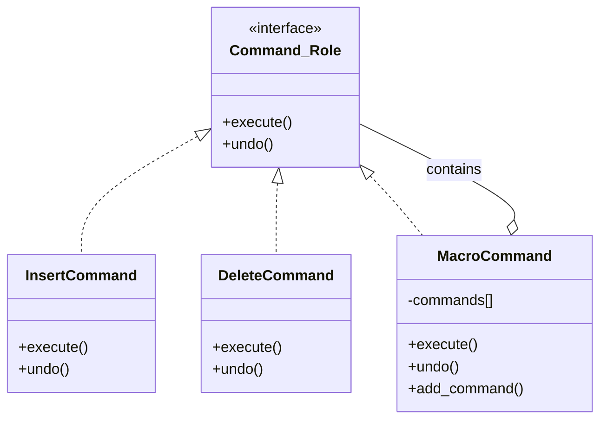
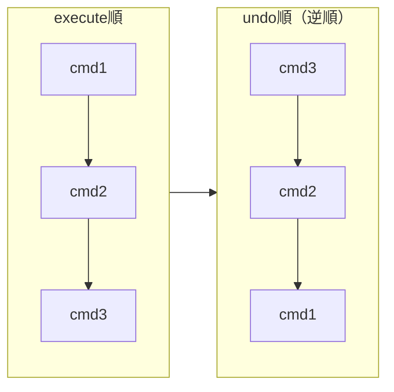
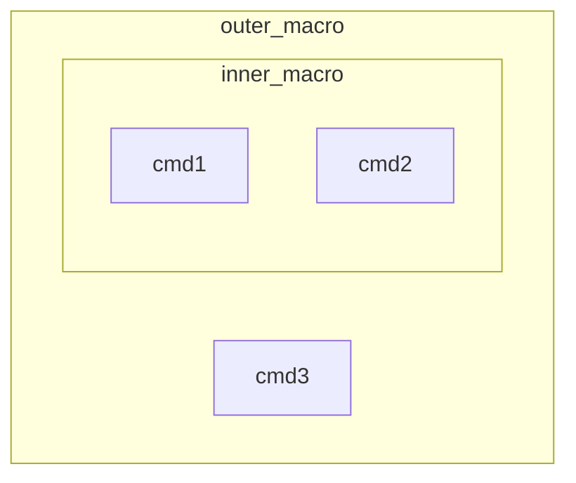

[@nqounet](https://x.com/nqounet)です。

シリーズ「Mooで作る簡易テキストエディタ」の第8回です。

## 前回の振り返り

前回は、`History`クラスに`redo`メソッドを実装しました。



これにより、Undoした操作をRedoでやり直せるようになりました。`undo_stack`と`redo_stack`の間でコマンドが移動する仕組みを理解しました。

```perl
sub redo ($self) {
    return unless $self->redo_stack->@*;

    my $command = pop $self->redo_stack->@*;
    $command->execute;
    push $self->undo_stack->@*, $command;
}
```

今回は、複数の操作を1つにまとめるマクロ機能を実装します。

## 問題：複数操作を1つのUndoで戻したい

「検索と置換」機能を考えてみましょう。テキスト内の「foo」を「bar」に置換する場合、複数箇所を一括で置換することがあります。

```perl
# 3箇所の「foo」を「bar」に置換
$history->execute_command($replace1);  # 1箇所目
$history->execute_command($replace2);  # 2箇所目
$history->execute_command($replace3);  # 3箇所目
```

この場合、Undoすると1回の置換しか戻りません。

```perl
$history->undo;  # $replace3だけが戻る
$history->undo;  # $replace2だけが戻る
$history->undo;  # $replace1だけが戻る
```

ユーザーとしては、「置換を全部元に戻す」という操作を1回のUndoでやりたいのではないでしょうか。

## 解決策：MacroCommandを作成する

この問題を解決するのが`MacroCommand`です。複数のコマンドを1つのコマンドとしてまとめます。



`MacroCommand`は`Command::Role`を適用しているため、通常のコマンドと同じように扱えます。内部に複数のコマンドを持ち、`execute`で全部実行、`undo`で全部取り消します。

これはCompositeパターンと呼ばれるデザインパターンの一種です。

## MacroCommandクラスを実装する

では、`MacroCommand`クラスを実装しましょう。

```perl
# Perl v5.36 以降
# 外部依存: Moo

package MacroCommand {
    use Moo;
    use v5.36;
    with 'Command::Role';

    has commands => (
        is      => 'ro',
        default => sub { [] },
    );

    sub add_command ($self, $command) {
        push $self->commands->@*, $command;
    }

    sub execute ($self) {
        for my $cmd ($self->commands->@*) {
            $cmd->execute;
        }
    }

    sub undo ($self) {
        for my $cmd (reverse $self->commands->@*) {
            $cmd->undo;
        }
    }
};
```

`MacroCommand`クラスのポイントを見ていきましょう。

### commandsで子コマンドを保持

```perl
has commands => (
    is      => 'ro',
    default => sub { [] },
);
```

`commands`属性は、子コマンドを配列リファレンスで保持します。

### add_commandでコマンドを追加

```perl
sub add_command ($self, $command) {
    push $self->commands->@*, $command;
}
```

`add_command`メソッドで、子コマンドを追加します。

### executeで全コマンドを順番に実行

```perl
sub execute ($self) {
    for my $cmd ($self->commands->@*) {
        $cmd->execute;
    }
}
```

`execute`メソッドは、登録されたすべてのコマンドを順番に実行します。

### undoで全コマンドを逆順に取り消す

```perl
sub undo ($self) {
    for my $cmd (reverse $self->commands->@*) {
        $cmd->undo;
    }
}
```

`undo`メソッドは、登録されたすべてのコマンドを逆順に取り消します。

なぜ逆順なのでしょうか？

操作を元に戻すときは、最後に実行した操作から順に戻す必要があります。



たとえば、「位置0に'A'を挿入」→「位置1に'B'を挿入」という操作を考えます。

- execute順: 'A'挿入 → 'B'挿入 → 結果: "AB"
- undo順: 'B'削除 → 'A'削除 → 結果: ""

もしundo順を逆にしなかったら、以下のようになってしまいます。

- 誤ったundo順: 'A'削除（位置0を削除）→ 'B'削除（位置1を削除）
- 最初に'A'を削除すると、テキストは"B"になり、位置1には何もない！

このように、undoは逆順で行う必要があります。

## 複数操作の一括Undoをデモする

では、`MacroCommand`を使って複数操作の一括Undoをデモしましょう。

```perl
# Perl v5.36 以降
# 外部依存: Moo

use v5.36;

package Editor {
    use Moo;

    has text => (
        is      => 'rw',
        default => '',
    );
};

package Command::Role {
    use Moo::Role;

    requires 'execute';
    requires 'undo';
};

package InsertCommand {
    use Moo;
    with 'Command::Role';

    has editor   => (is => 'ro', required => 1);
    has position => (is => 'ro', required => 1);
    has string   => (is => 'ro', required => 1);

    sub execute ($self) {
        my $editor   = $self->editor;
        my $position = $self->position;
        my $string   = $self->string;

        my $current  = $editor->text;
        my $new_text = substr($current, 0, $position) 
                     . $string 
                     . substr($current, $position);
        $editor->text($new_text);
    }

    sub undo ($self) {
        my $editor   = $self->editor;
        my $position = $self->position;
        my $length   = length($self->string);

        my $current  = $editor->text;
        my $new_text = substr($current, 0, $position) 
                     . substr($current, $position + $length);
        $editor->text($new_text);
    }
};

package MacroCommand {
    use Moo;
    with 'Command::Role';

    has commands => (
        is      => 'ro',
        default => sub { [] },
    );

    sub add_command ($self, $command) {
        push $self->commands->@*, $command;
    }

    sub execute ($self) {
        for my $cmd ($self->commands->@*) {
            $cmd->execute;
        }
    }

    sub undo ($self) {
        for my $cmd (reverse $self->commands->@*) {
            $cmd->undo;
        }
    }
};

package History {
    use Moo;

    has undo_stack => (
        is      => 'ro',
        default => sub { [] },
    );

    has redo_stack => (
        is      => 'ro',
        default => sub { [] },
    );

    sub execute_command ($self, $command) {
        $command->execute;
        push $self->undo_stack->@*, $command;
        $self->redo_stack->@* = ();
    }

    sub undo ($self) {
        return unless $self->undo_stack->@*;

        my $command = pop $self->undo_stack->@*;
        $command->undo;
        push $self->redo_stack->@*, $command;
    }

    sub redo ($self) {
        return unless $self->redo_stack->@*;

        my $command = pop $self->redo_stack->@*;
        $command->execute;
        push $self->undo_stack->@*, $command;
    }
};

# メイン処理
my $editor  = Editor->new;
my $history = History->new;

# まず通常の操作
$history->execute_command(InsertCommand->new(
    editor   => $editor,
    position => 0,
    string   => 'foo foo foo',
));
say "初期状態: '" . $editor->text . "'";

say "";
say "--- マクロで一括置換 ---";

# MacroCommandで複数の置換操作をまとめる
# 簡易的に「foo」→「bar」の置換をシミュレート
# 実際には「削除して挿入」の組み合わせ

my $macro = MacroCommand->new;

# 1つ目の「foo」(位置0-2)を「bar」に置換
$macro->add_command(InsertCommand->new(
    editor   => $editor,
    position => 0,
    string   => 'bar',
));

# 2つ目の「foo」(位置7-9、barを挿入後は位置7)を「bar」に置換
$macro->add_command(InsertCommand->new(
    editor   => $editor,
    position => 7,
    string   => 'bar',
));

# 3つ目の「foo」(位置14-16、2回挿入後は位置14)を「bar」に置換
$macro->add_command(InsertCommand->new(
    editor   => $editor,
    position => 14,
    string   => 'bar',
));

# マクロを実行（3つの操作が一括で実行される）
$history->execute_command($macro);
say "マクロ実行後: '" . $editor->text . "'";

say "";
say "--- 1回のUndoで全部戻る ---";

# 1回のUndoで3つの操作が全部戻る
$history->undo;
say "Undo後: '" . $editor->text . "'";

say "";
say "--- 1回のRedoで全部やり直す ---";

# 1回のRedoで3つの操作が全部やり直される
$history->redo;
say "Redo後: '" . $editor->text . "'";
```

実行結果は以下のようになります。

```
初期状態: 'foo foo foo'

--- マクロで一括置換 ---
マクロ実行後: 'barfoo barfoo barfoo'

--- 1回のUndoで全部戻る ---
Undo後: 'foo foo foo'

--- 1回のRedoで全部やり直す ---
Redo後: 'barfoo barfoo barfoo'
```

3つの挿入操作が、1回のUndo/Redoでまとめて処理されていることが確認できました。

## Compositeパターンの力

`MacroCommand`が強力なのは、MacroCommandの中にMacroCommandを入れられることです。

```perl
my $inner_macro = MacroCommand->new;
$inner_macro->add_command($cmd1);
$inner_macro->add_command($cmd2);

my $outer_macro = MacroCommand->new;
$outer_macro->add_command($inner_macro);  # マクロの中にマクロ
$outer_macro->add_command($cmd3);
```

これは再帰的な構造であり、Compositeパターンの特徴です。



`outer_macro->execute`を呼ぶと、以下の順で実行されます。

1. `inner_macro->execute` → `cmd1->execute` → `cmd2->execute`
2. `cmd3->execute`

`History`クラスは`MacroCommand`を通常のコマンドと同じように扱えるため、複雑なマクロも問題なく履歴管理できます。

## 今回作成した完成コード

以下が今回作成した完成コードです。`MacroCommand`クラスを追加し、複数操作の一括実行・Undoを可能にしました。

```perl
#!/usr/bin/env perl
# Perl v5.36 以降
# 外部依存: Moo

use v5.36;

package Editor {
    use Moo;

    has text => (
        is      => 'rw',
        default => '',
    );
};

package Command::Role {
    use Moo::Role;

    requires 'execute';
    requires 'undo';
};

package InsertCommand {
    use Moo;
    with 'Command::Role';

    has editor => (
        is       => 'ro',
        required => 1,
    );

    has position => (
        is       => 'ro',
        required => 1,
    );

    has string => (
        is       => 'ro',
        required => 1,
    );

    sub execute ($self) {
        my $editor   = $self->editor;
        my $position = $self->position;
        my $string   = $self->string;

        my $current  = $editor->text;
        my $new_text = substr($current, 0, $position) 
                     . $string 
                     . substr($current, $position);
        $editor->text($new_text);
    }

    sub undo ($self) {
        my $editor   = $self->editor;
        my $position = $self->position;
        my $length   = length($self->string);

        my $current  = $editor->text;
        my $new_text = substr($current, 0, $position) 
                     . substr($current, $position + $length);
        $editor->text($new_text);
    }
};

package DeleteCommand {
    use Moo;
    with 'Command::Role';

    has editor => (
        is       => 'ro',
        required => 1,
    );

    has position => (
        is       => 'ro',
        required => 1,
    );

    has length => (
        is       => 'ro',
        required => 1,
    );

    has _deleted_string => (
        is      => 'rw',
        default => '',
    );

    sub execute ($self) {
        my $editor   = $self->editor;
        my $position = $self->position;
        my $length   = $self->length;

        my $current = $editor->text;
        my $deleted = substr($current, $position, $length);
        $self->_deleted_string($deleted);

        my $new_text = substr($current, 0, $position) 
                     . substr($current, $position + $length);
        $editor->text($new_text);
    }

    sub undo ($self) {
        my $editor   = $self->editor;
        my $position = $self->position;
        my $deleted  = $self->_deleted_string;

        my $current  = $editor->text;
        my $new_text = substr($current, 0, $position) 
                     . $deleted 
                     . substr($current, $position);
        $editor->text($new_text);
    }
};

package MacroCommand {
    use Moo;
    with 'Command::Role';

    has commands => (
        is      => 'ro',
        default => sub { [] },
    );

    sub add_command ($self, $command) {
        push $self->commands->@*, $command;
    }

    sub execute ($self) {
        for my $cmd ($self->commands->@*) {
            $cmd->execute;
        }
    }

    sub undo ($self) {
        for my $cmd (reverse $self->commands->@*) {
            $cmd->undo;
        }
    }
};

package History {
    use Moo;

    has undo_stack => (
        is      => 'ro',
        default => sub { [] },
    );

    has redo_stack => (
        is      => 'ro',
        default => sub { [] },
    );

    sub execute_command ($self, $command) {
        $command->execute;
        push $self->undo_stack->@*, $command;
        $self->redo_stack->@* = ();
    }

    sub undo ($self) {
        return unless $self->undo_stack->@*;

        my $command = pop $self->undo_stack->@*;
        $command->undo;
        push $self->redo_stack->@*, $command;
    }

    sub redo ($self) {
        return unless $self->redo_stack->@*;

        my $command = pop $self->redo_stack->@*;
        $command->execute;
        push $self->undo_stack->@*, $command;
    }
};

# メイン処理
my $editor  = Editor->new;
my $history = History->new;

say "=== 通常操作のデモ ===";

# 操作1: 'Hello'を挿入
$history->execute_command(InsertCommand->new(
    editor   => $editor,
    position => 0,
    string   => 'Hello',
));
say "操作1後: '" . $editor->text . "'";

# 操作2: ' World'を挿入
$history->execute_command(InsertCommand->new(
    editor   => $editor,
    position => 5,
    string   => ' World',
));
say "操作2後: '" . $editor->text . "'";

say "";
say "=== マクロ操作のデモ ===";

# マクロを作成
my $macro = MacroCommand->new;

# マクロに複数の操作を追加
$macro->add_command(InsertCommand->new(
    editor   => $editor,
    position => 11,
    string   => '!',
));

$macro->add_command(InsertCommand->new(
    editor   => $editor,
    position => 0,
    string   => '>>> ',
));

$macro->add_command(InsertCommand->new(
    editor   => $editor,
    position => 19,
    string   => ' <<<',
));

# マクロを実行（3つの操作が一括で実行される）
$history->execute_command($macro);
say "マクロ実行後: '" . $editor->text . "'";

say "";
say "=== Undo/Redo デモ ===";

# 1回のUndoで3つの操作が全部戻る
$history->undo;
say "Undo後: '" . $editor->text . "'";

# 通常操作もUndo
$history->undo;
say "Undo後: '" . $editor->text . "'";

# Redoで戻す
$history->redo;
say "Redo後: '" . $editor->text . "'";

# マクロもRedoできる
$history->redo;
say "Redo後: '" . $editor->text . "'";
```

実行結果は以下のようになります。

```
=== 通常操作のデモ ===
操作1後: 'Hello'
操作2後: 'Hello World'

=== マクロ操作のデモ ===
マクロ実行後: '>>> Hello World! <<<'

=== Undo/Redo デモ ===
Undo後: 'Hello World'
Undo後: 'Hello'
Redo後: 'Hello World'
Redo後: '>>> Hello World! <<<'
```

## まとめ

- `MacroCommand`は複数のコマンドを1つにまとめる
- `execute`で全コマンドを順番に実行、`undo`で逆順に取り消す
- `MacroCommand`も`Command::Role`を適用しているため、通常のコマンドと同じように扱える
- これはCompositeパターンの一種である
- マクロの中にマクロを入れることも可能（再帰的な構造）

## 次回予告

これで、エディタに必要な主要機能が揃いました。

- Editor — テキストを保持
- InsertCommand / DeleteCommand — 操作をオブジェクト化
- Command::Role — 共通インターフェースを保証
- History — Undo/Redo機能
- MacroCommand — 複数操作をまとめる

次回は、これらの機能を統合し、対話的に操作できる簡易エディタを完成させます。

お楽しみに。
