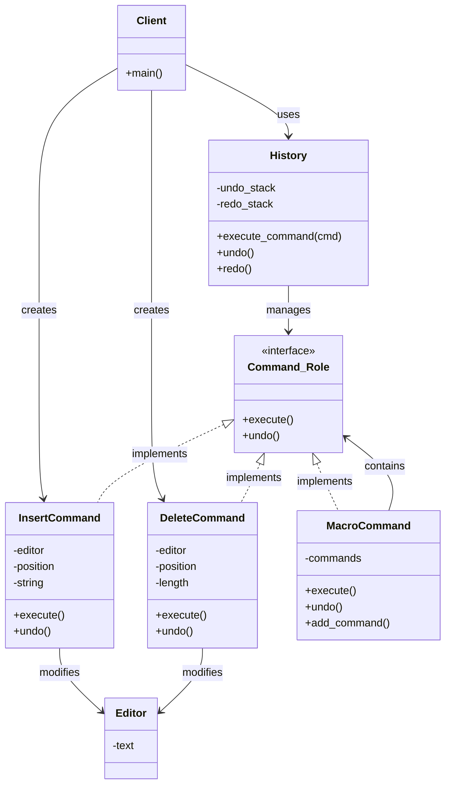

[@nqounet](https://x.com/nqounet)です。

シリーズ「Mooで作る簡易テキストエディタ」の最終回です。

前回、私たちはついに対話型インターフェースを持つ簡易テキストエディタを完成させました。



今回は、シリーズを締めくくるにあたって、ある驚きの事実をお伝えします。

## 実は…これはデザインパターンだった！

9回にわたってコードを書いてきた皆さん、お気づきでしょうか。

私たちが作ったエディタは、Commandパターンと呼ばれるデザインパターンの実装だったのです。

「デザインパターン」とは、ソフトウェア設計における定石やお約束のことです。将棋や囲碁に定石があるように、プログラミングにも「こういう問題にはこう設計するとうまくいく」というパターンがあります。

1994年に出版された『オブジェクト指向における再利用のためのデザインパターン』（通称：GoF本）で、23のデザインパターンが体系化されました。Commandパターンはその1つです。



## Commandパターンとは

GoF本による定義は以下の通りです。

> 要求をオブジェクトとしてカプセル化することで、さまざまな要求によるクライアントのパラメータ化、要求のキューイングやロギング、取り消し可能な操作のサポートを可能にする。

難しそうに聞こえますが、私たちがやってきたことを振り返れば、自然に理解できます。

「操作をオブジェクトにする」——これがCommandパターンの本質です。

私たちは、「テキストを挿入する」「テキストを削除する」という操作そのものを、`InsertCommand`や`DeleteCommand`というオブジェクトにしました。操作をオブジェクトにすることで、以下のことが可能になりました。

- 操作を履歴として保存できる
- 操作を取り消す（Undo）ことができる
- 操作をやり直す（Redo）ことができる
- 複数の操作をまとめて実行できる

## Commandパターンの構成要素

Commandパターンは、5つの役割で構成されています。私たちが作ったクラスと対応させてみましょう。

| GoFの用語 | 役割 | 私たちが作ったもの |
|:----------|:-----|:-------------------|
| Command（インターフェース） | 操作の共通インターフェース | `Command::Role` |
| ConcreteCommand（具象コマンド） | 具体的な操作 | `InsertCommand`, `DeleteCommand`, `MacroCommand` |
| Invoker（呼び出し元） | コマンドを実行・管理する | `History` |
| Receiver（受信者） | 実際にデータを操作される対象 | `Editor` |
| Client（クライアント） | コマンドを生成し、Invokerに渡す | メインスクリプト |

それぞれの役割を詳しく見ていきましょう。

### Command（インターフェース）: Command::Role

```perl
package Command::Role {
    use Moo::Role;

    requires 'execute';
    requires 'undo';
};
```

すべてのコマンドが持つべきメソッド（`execute`と`undo`）を定義しています。これにより、`History`クラスは具体的なコマンドの種類を知らなくても、統一的に扱えます。

### ConcreteCommand（具象コマンド）: InsertCommand, DeleteCommand

```perl
package InsertCommand {
    use Moo;
    with 'Command::Role';

    has editor   => ( is => 'ro', required => 1 );
    has position => ( is => 'ro', required => 1 );
    has string   => ( is => 'ro', required => 1 );

    sub execute ($self) { ... }
    sub undo ($self) { ... }
};
```

具体的な操作を実装するクラスです。各コマンドは、自分自身を「実行する」方法と「元に戻す」方法を知っています。

### Invoker（呼び出し元）: History

```perl
package History {
    use Moo;

    has undo_stack => ( is => 'ro', default => sub { [] } );
    has redo_stack => ( is => 'ro', default => sub { [] } );

    sub execute_command ($self, $command) { ... }
    sub undo ($self) { ... }
    sub redo ($self) { ... }
};
```

コマンドを実行し、履歴を管理します。どのコマンドが実行されたかを記憶し、Undo/Redoを可能にします。

### Receiver（受信者）: Editor

```perl
package Editor {
    use Moo;

    has text => ( is => 'rw', default => '' );
};
```

コマンドによって操作される対象です。コマンド自身がReceiverへの参照を持ち、`execute`時に操作を行います。

### Client（クライアント）: メインスクリプト

```perl
my $editor  = Editor->new;
my $history = History->new;

my $cmd = InsertCommand->new(
    editor   => $editor,
    position => 0,
    string   => 'Hello',
);
$history->execute_command($cmd);
```

コマンドを生成し、必要なパラメータを設定して、Invokerに渡します。

## クラス図で見るCommandパターン

Mermaidでクラス図を描いてみましょう。



この図を見ると、各クラスの関係が一目でわかります。

## Commandパターンの利点

改めて、Commandパターンがもたらす利点をまとめます。

- Undo/Redoが自然に実装できる: 各コマンドが自分自身の`undo`を知っている
- 操作の履歴が取れる: 実行したコマンドをスタックに積むだけ
- マクロ機能が簡単: 複数のコマンドを1つにまとめるだけ（Compositeパターンとの組み合わせ）
- 操作のキューイング: コマンドをキューに入れて、後から順番に実行できる
- 操作のログ: コマンドを記録しておけば、何が行われたか追跡できる
- 操作の遅延実行: コマンドを生成しておいて、後から実行できる

## Commandパターンの応用例

Commandパターンは、テキストエディタ以外にも多くの場面で活用されています。

### CLIツール

コマンドラインツールでは、各サブコマンド（`git commit`, `git push`など）をCommandパターンで実装できます。

```perl
# 概念的なコード
my $command = $commands{$ARGV[0]};  # 'commit' => CommitCommand
$command->execute(@ARGV[1..$#ARGV]);
```

### ジョブキュー

バックグラウンドで処理するジョブをCommandオブジェクトとしてキューに入れ、ワーカーが順番に実行します。

```perl
# 概念的なコード
$queue->enqueue(SendEmailCommand->new(to => 'user@example.com'));
$queue->enqueue(ResizeImageCommand->new(path => 'image.jpg'));

# ワーカー側
while (my $cmd = $queue->dequeue) {
    $cmd->execute;
}
```

### マクロ記録

ユーザーの操作を記録しておき、後から再生する機能もCommandパターンで実現できます。

```perl
# 記録モード
push @recorded_commands, $cmd;
$cmd->execute;

# 再生モード
$_->execute for @recorded_commands;
```

## Strategyパターンとの比較

以前のシリーズ「Mooを使ってディスパッチャーを作ってみよう」では、Strategyパターンを学びました。



両者の違いを整理しておきましょう。

| 観点 | Commandパターン | Strategyパターン |
|:-----|:----------------|:-----------------|
| 目的 | 操作をオブジェクト化して履歴管理 | アルゴリズムを交換可能にする |
| Undo | サポートしやすい | 通常はサポートしない |
| 履歴 | 保存が前提 | 通常は保存しない |
| 用途 | エディタ、トランザクション | ルーティング、ソートアルゴリズム切り替え |

どちらも「振る舞いをオブジェクトにする」という点では共通していますが、目的が異なります。

## シリーズ全体の振り返り

全10回を通じて、私たちは以下のことを学びました。

| 回 | テーマ | 学んだこと |
|:---|:-------|:-----------|
| 第1回 | Editor | テキストを保持するクラスを作る |
| 第2回 | 履歴の必要性 | 単純な方法では履歴が取れない問題を認識 |
| 第3回 | InsertCommand | 操作をオブジェクトにする発想 |
| 第4回 | Command::Role | 共通インターフェースを定義する |
| 第5回 | DeleteCommand | 削除操作もコマンドにする |
| 第6回 | History | Undo機能を実装する |
| 第7回 | Redo | Redo機能を追加する |
| 第8回 | MacroCommand | 複数操作をまとめる（Compositeパターン） |
| 第9回 | 統合 | 対話型エディタを完成させる |
| 第10回 | デザインパターン | これがCommandパターンだったと知る |

最初は「テキストを編集するだけ」のシンプルなクラスから始まり、問題を解決するために自然とクラスを増やしていった結果、GoFのCommandパターンに辿り着いたのです。

## 次のステップへ

Commandパターンを学んだ今、次に学ぶとよいデザインパターンを紹介します。

- Factory Method: オブジェクトの生成をサブクラスに任せる
- Observer: オブジェクトの状態変化を通知する
- Decorator: オブジェクトに動的に機能を追加する
- Chain of Responsibility: 処理を連鎖させる

また、Mooの機能をさらに深く学びたい方は、「Mooで覚えるオブジェクト指向プログラミング」シリーズもおすすめです。



## おわりに

「気がつけばデザインパターンだった」——これが本シリーズの目標でした。

デザインパターンは、暗記するものではありません。問題を解決しようと試行錯誤するうちに、自然と辿り着くものです。

皆さんが次に「操作を履歴に残したい」「Undoを実装したい」という場面に出会ったとき、「ああ、Commandパターンだ！」と気づけるようになっているはずです。

全10回にわたるシリーズをお読みいただき、ありがとうございました。

## 関連記事

### このシリーズの記事

- 第1回〜第9回は「moo-text-editor」タグから参照できます

### 関連シリーズ

- 「Mooで覚えるオブジェクト指向プログラミング」シリーズ



- 「Mooを使ってディスパッチャーを作ってみよう」シリーズ（Strategyパターン）



### 参考書籍


