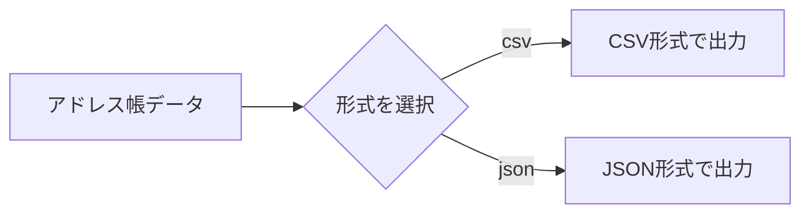
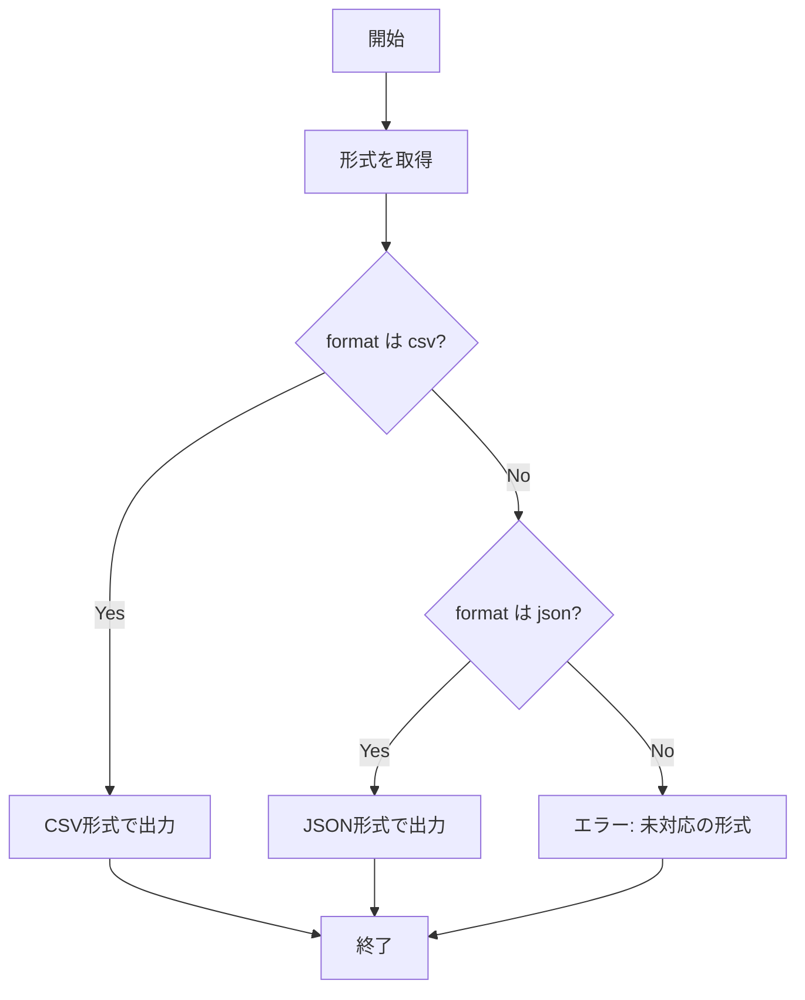

[@nqounet](https://x.com/nqounet)です。

新シリーズ「Mooを使ってデータエクスポーターを作ってみよう」を始めます！

このシリーズでは、アドレス帳のデータを様々な形式（CSV、JSON、YAMLなど）で出力できる「データエクスポーター」を作っていきます。

最初はシンプルな実装から始めて、少しずつ改良を加えながら、より良い設計へと進化させていきましょう。

## 今回作るもの

アドレス帳のデータを持っていて、これをCSVファイルやJSONファイルで保存したいと思います。

保存形式は実行時に選べるようにしたいです。

まずは素朴に「if/elseで形式を切り替える」という実装をしてみましょう。



## アドレス帳データを用意する

まずはエクスポートするデータを用意します。今回は3人分のシンプルなアドレス帳データを使います。

```perl
use v5.36;

my @contacts = (
    { name => '田中太郎', email => 'tanaka@example.com', phone => '090-1234-5678' },
    { name => '鈴木花子', email => 'suzuki@example.com', phone => '080-2345-6789' },
    { name => '佐藤次郎', email => 'sato@example.com',   phone => '070-3456-7890' },
);
```

このデータをCSV形式とJSON形式の両方で出力できるようにします。

## if/elseで形式を切り替える

出力形式を引数で受け取り、if/elseで処理を分岐させます。



```perl
#!/usr/bin/env perl
use v5.36;
use JSON::PP;

# アドレス帳データ
my @contacts = (
    { name => '田中太郎', email => 'tanaka@example.com', phone => '090-1234-5678' },
    { name => '鈴木花子', email => 'suzuki@example.com', phone => '080-2345-6789' },
    { name => '佐藤次郎', email => 'sato@example.com',   phone => '070-3456-7890' },
);

# コマンドライン引数から形式を取得（デフォルトはcsv）
my $format = $ARGV[0] // 'csv';

# 形式に応じて出力を切り替え
if ($format eq 'csv') {
    # CSV形式で出力
    say "name,email,phone";
    for my $contact (@contacts) {
        say "$contact->{name},$contact->{email},$contact->{phone}";
    }
}
elsif ($format eq 'json') {
    # JSON形式で出力
    my $json = JSON::PP->new->pretty->encode(\@contacts);
    print $json;
}
else {
    die "未対応の形式です: $format\n";
}
```

## 実行してみよう

このスクリプトを`exporter.pl`として保存し、実行してみましょう。

CSV形式で出力する場合：

```shell
perl exporter.pl csv
```

出力結果：

```
name,email,phone
田中太郎,tanaka@example.com,090-1234-5678
鈴木花子,suzuki@example.com,080-2345-6789
佐藤次郎,sato@example.com,070-3456-7890
```

JSON形式で出力する場合：

```shell
perl exporter.pl json
```

出力結果：

```json
[
   {
      "email" : "tanaka@example.com",
      "name" : "田中太郎",
      "phone" : "090-1234-5678"
   },
   {
      "email" : "suzuki@example.com",
      "name" : "鈴木花子",
      "phone" : "080-2345-6789"
   },
   {
      "email" : "sato@example.com",
      "name" : "佐藤次郎",
      "phone" : "070-3456-7890"
   }
]
```

うまく動きましたね！

## 今回のポイント

今回は、if/elseを使ってCSVとJSONの2つの形式を切り替える実装をしました。

**if/else文**は、条件に応じて処理を分岐させる基本的な構文です。今回は`$format`の値に応じて、CSV出力とJSON出力を切り替えています。

この方法はシンプルでわかりやすいですが、形式が増えるとどうなるでしょうか？

次回は、YAML形式やXML形式を追加したときに何が起こるか見ていきましょう。

## 今回の完成コード

```perl
#!/usr/bin/env perl
use v5.36;
use JSON::PP;

# アドレス帳データ
my @contacts = (
    { name => '田中太郎', email => 'tanaka@example.com', phone => '090-1234-5678' },
    { name => '鈴木花子', email => 'suzuki@example.com', phone => '080-2345-6789' },
    { name => '佐藤次郎', email => 'sato@example.com',   phone => '070-3456-7890' },
);

# コマンドライン引数から形式を取得（デフォルトはcsv）
my $format = $ARGV[0] // 'csv';

# 形式に応じて出力を切り替え
if ($format eq 'csv') {
    # CSV形式で出力
    say "name,email,phone";
    for my $contact (@contacts) {
        say "$contact->{name},$contact->{email},$contact->{phone}";
    }
}
elsif ($format eq 'json') {
    # JSON形式で出力
    my $json = JSON::PP->new->pretty->encode(\@contacts);
    print $json;
}
else {
    die "未対応の形式です: $format\n";
}
```

## まとめ

- アドレス帳データをCSVとJSONで出力できるようになりました
- if/elseで出力形式を切り替える素朴な実装を行いました
- `JSON::PP`モジュールを使ってPerlのデータ構造をJSONに変換しました

次回「[第2回-新しい形式を追加すると大変！条件分岐の悩み](/2026/01/09/003703/)」では、新しい形式を追加するとコードがどうなるか見ていきます。お楽しみに！
