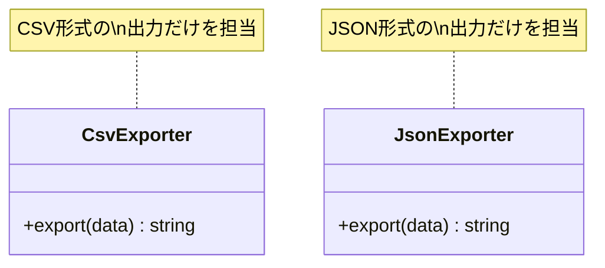

[@nqounet](https://x.com/nqounet)です。

前回は、if/elseが肥大化する問題を体験しました。形式が増えるとコードが複雑になり、保守が難しくなるのでしたね。



今回は、この問題を解決するために「出力処理を専用クラスに分ける」というアプローチを取ります。

## 責務分離という考え方

**責務分離（Separation of Concerns）**とは、1つのクラスや関数は1つのことだけを担当すべき、という考え方です。

前回のコードでは、1つのスクリプトが以下のすべてを担当していました：

- CSV形式での出力
- JSON形式での出力
- YAML形式での出力
- XML形式での出力

これを、形式ごとに専用のクラスを作って分離しましょう。

```
Before: 1つのファイルに全部入り
┌───────────────────────────────────┐
│            exporter.pl            │
│  ┌─────────────────────────────┐  │
│  │ CSV出力  │ JSON出力         │  │
│  ├──────────┼──────────────────┤  │
│  │ YAML出力 │ XML出力          │  │
│  └─────────────────────────────┘  │
└───────────────────────────────────┘

After: クラスごとに分離
┌─────────────┐  ┌──────────────┐
│ CsvExporter │  │ JsonExporter │
│ (CSV出力)   │  │ (JSON出力)   │
└─────────────┘  └──────────────┘
┌──────────────┐  ┌─────────────┐
│ YamlExporter │  │ XmlExporter │
│ (YAML出力)   │  │ (XML出力)   │
└──────────────┘  └─────────────┘
```

## CsvExporterクラスを作る

まずはCSV出力を担当するクラスを作ります。

```perl
package CsvExporter {
    use Moo;
    use v5.36;

    sub export ($self, $data) {
        my $output = "name,email,phone\n";
        for my $contact (@$data) {
            $output .= "$contact->{name},$contact->{email},$contact->{phone}\n";
        }
        return $output;
    }
}
```

このクラスは「CSV形式でデータを出力する」という1つのことだけを担当します。

`export`メソッドは、データ（配列リファレンス）を受け取り、CSV形式の文字列を返します。

## JsonExporterクラスを作る

同様に、JSON出力を担当するクラスも作ります。

```perl
package JsonExporter {
    use Moo;
    use v5.36;
    use JSON::PP;

    sub export ($self, $data) {
        return JSON::PP->new->pretty->encode($data);
    }
}
```

こちらも「JSON形式でデータを出力する」という1つのことだけを担当します。

## クラスを使って出力する

作成したクラスを使って、メインのスクリプトを書き直しましょう。

```perl
#!/usr/bin/env perl
use v5.36;
use JSON::PP;

# ========================================
# CsvExporterクラス
# ========================================
package CsvExporter {
    use Moo;
    use v5.36;

    sub export ($self, $data) {
        my $output = "name,email,phone\n";
        for my $contact (@$data) {
            $output .= "$contact->{name},$contact->{email},$contact->{phone}\n";
        }
        return $output;
    }
}

# ========================================
# JsonExporterクラス
# ========================================
package JsonExporter {
    use Moo;
    use v5.36;
    use JSON::PP;

    sub export ($self, $data) {
        return JSON::PP->new->pretty->encode($data);
    }
}

# ========================================
# メイン処理
# ========================================
package main;

# アドレス帳データ
my @contacts = (
    { name => '田中太郎', email => 'tanaka@example.com', phone => '090-1234-5678' },
    { name => '鈴木花子', email => 'suzuki@example.com', phone => '080-2345-6789' },
    { name => '佐藤次郎', email => 'sato@example.com',   phone => '070-3456-7890' },
);

# コマンドライン引数から形式を取得
my $format = $ARGV[0] // 'csv';

# 形式に応じてエクスポーターを選択
my $exporter;
if ($format eq 'csv') {
    $exporter = CsvExporter->new;
}
elsif ($format eq 'json') {
    $exporter = JsonExporter->new;
}
else {
    die "未対応の形式です: $format\n";
}

# エクスポーターを使って出力
print $exporter->export(\@contacts);
```

## 何が良くなったのか？

### 1. 各クラスが1つのことだけを担当

`CsvExporter`はCSV出力だけ、`JsonExporter`はJSON出力だけを担当するようになりました。



### 2. 変更時の影響範囲が限定される

CSV出力の処理を修正したい場合、`CsvExporter`クラスだけを見ればOKです。JSON出力のコードを壊す心配がありません。

### 3. テストが容易になる

各エクスポーターを個別にテストできます。

```perl
my $csv = CsvExporter->new;
my $result = $csv->export([{ name => 'テスト', email => 'test@example.com', phone => '000' }]);
# $result をチェック
```

## まだ残っている問題

メインのif/elseは残っています。でも、各形式の「処理内容」はクラスに分離できました。

次回は、これらのエクスポータークラスに「共通の約束（インターフェース）」を定義して、より統一的に扱えるようにします。

## 今回の完成コード

```perl
#!/usr/bin/env perl
use v5.36;
use JSON::PP;

# ========================================
# CsvExporterクラス
# ========================================
package CsvExporter {
    use Moo;
    use v5.36;

    sub export ($self, $data) {
        my $output = "name,email,phone\n";
        for my $contact (@$data) {
            $output .= "$contact->{name},$contact->{email},$contact->{phone}\n";
        }
        return $output;
    }
}

# ========================================
# JsonExporterクラス
# ========================================
package JsonExporter {
    use Moo;
    use v5.36;
    use JSON::PP;

    sub export ($self, $data) {
        return JSON::PP->new->pretty->encode($data);
    }
}

# ========================================
# メイン処理
# ========================================
package main;

# アドレス帳データ
my @contacts = (
    { name => '田中太郎', email => 'tanaka@example.com', phone => '090-1234-5678' },
    { name => '鈴木花子', email => 'suzuki@example.com', phone => '080-2345-6789' },
    { name => '佐藤次郎', email => 'sato@example.com',   phone => '070-3456-7890' },
);

# コマンドライン引数から形式を取得
my $format = $ARGV[0] // 'csv';

# 形式に応じてエクスポーターを選択
my $exporter;
if ($format eq 'csv') {
    $exporter = CsvExporter->new;
}
elsif ($format eq 'json') {
    $exporter = JsonExporter->new;
}
else {
    die "未対応の形式です: $format\n";
}

# エクスポーターを使って出力
print $exporter->export(\@contacts);
```

## まとめ

- 出力処理を専用クラス（CsvExporter、JsonExporter）に分離しました
- 「責務分離」の考え方を学びました
- 各クラスが1つのことだけを担当することで、保守性とテスト容易性が向上しました
- どのエクスポーターも同じ`export`メソッドを持っています

次回「[第4回-Moo::Roleで共通の約束を決めよう](/2026/01/09/004109/)」では、Moo::Roleを使って「共通の約束」を明確に定義します。お楽しみに！
