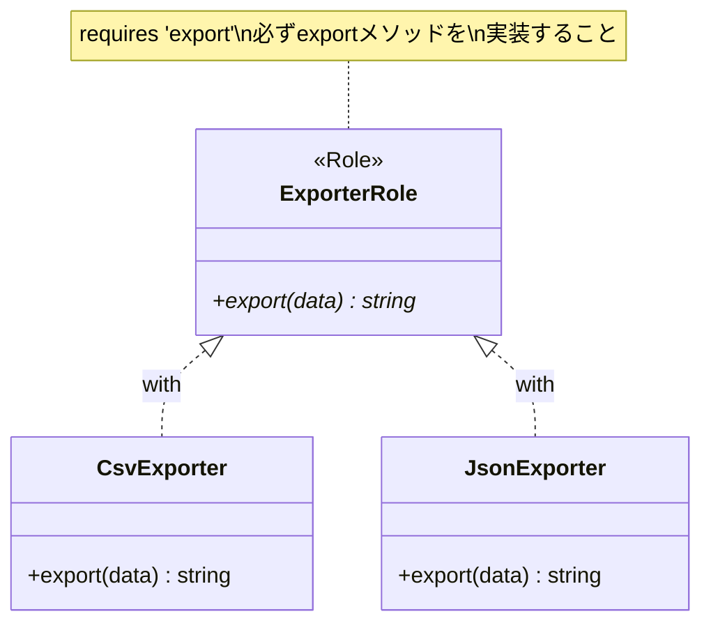

[@nqounet](https://x.com/nqounet)です。

前回は、CSV出力とJSON出力をそれぞれ専用のクラスに分離しました。どちらのクラスも`export`メソッドを持っていましたね。



今回は、この「exportメソッドを持つ」という約束をMoo::Roleを使って明確に定義します。

## なぜ「約束」が必要なのか？

前回作った`CsvExporter`と`JsonExporter`は、どちらも`export`メソッドを持っています。しかし、これは「たまたまそうなっている」だけです。

新しい開発者が`YamlExporter`を作るとき、メソッド名を`output`にしてしまうかもしれません。

```perl
# 間違った実装例
package YamlExporter {
    use Moo;
    sub output ($self, $data) { ... }  # exportではなくoutputにしてしまった！
}
```

このような間違いを防ぐために、「エクスポーターは必ずexportメソッドを持つ」という約束を明文化しましょう。

## Moo::Roleでインターフェースを定義する

Moo::Roleを使うと、クラスが実装すべきメソッドを定義できます。これをインターフェースと呼びます。



```perl
package ExporterRole {
    use Moo::Role;
    
    requires 'export';  # このRoleを使うクラスは、必ずexportメソッドを実装すること
}
```

`requires 'export'`は、「このRoleを使うクラスは、必ず`export`メソッドを持っていなければならない」という約束を定義しています。

## エクスポータークラスにRoleを適用する

各エクスポータークラスに`with 'ExporterRole'`を追加して、この約束に従うことを宣言します。

```perl
package CsvExporter {
    use Moo;
    use v5.36;
    with 'ExporterRole';  # ExporterRoleの約束に従います

    sub export ($self, $data) {
        my $output = "name,email,phone\n";
        for my $contact (@$data) {
            $output .= "$contact->{name},$contact->{email},$contact->{phone}\n";
        }
        return $output;
    }
}

package JsonExporter {
    use Moo;
    use v5.36;
    use JSON::PP;
    with 'ExporterRole';  # ExporterRoleの約束に従います

    sub export ($self, $data) {
        return JSON::PP->new->pretty->encode($data);
    }
}
```

## 約束を破るとエラーになる

もし`export`メソッドを実装し忘れると、プログラム起動時にエラーが発生します。

```
約束を破った場合の動作

┌──────────────────────────────┐
│       BrokenExporter         │
│   (exportメソッドがない！)    │
└──────────────────────────────┘
            │
            │ with 'ExporterRole'
            ▼
┌──────────────────────────────┐
│       ExporterRole           │
│    requires 'export'         │
└──────────────────────────────┘
            │
            ▼
    ╔═══════════════════════════════════════════════════════════╗
    ║  ❌ エラー！                                              ║
    ║  Can't apply ExporterRole to BrokenExporter               ║
    ║  - missing export                                         ║
    ╚═══════════════════════════════════════════════════════════╝
```

```perl
# exportメソッドを忘れた場合
package BrokenExporter {
    use Moo;
    with 'ExporterRole';  # exportメソッドがない！
}
```

エラーメッセージ：

```
Can't apply ExporterRole to BrokenExporter - missing export
```

このおかげで、「exportメソッドを実装し忘れる」というミスを早期に発見できます。

## 完成したコード

Role定義を追加した完成コードはこちらです。

```perl
#!/usr/bin/env perl
use v5.36;
use JSON::PP;

# ========================================
# ExporterRole - エクスポーターの約束
# ========================================
package ExporterRole {
    use Moo::Role;
    
    requires 'export';  # 必ずexportメソッドを実装すること
}

# ========================================
# CsvExporterクラス
# ========================================
package CsvExporter {
    use Moo;
    use v5.36;
    with 'ExporterRole';

    sub export ($self, $data) {
        my $output = "name,email,phone\n";
        for my $contact (@$data) {
            $output .= "$contact->{name},$contact->{email},$contact->{phone}\n";
        }
        return $output;
    }
}

# ========================================
# JsonExporterクラス
# ========================================
package JsonExporter {
    use Moo;
    use v5.36;
    use JSON::PP;
    with 'ExporterRole';

    sub export ($self, $data) {
        return JSON::PP->new->pretty->encode($data);
    }
}

# ========================================
# メイン処理
# ========================================
package main;

# アドレス帳データ
my @contacts = (
    { name => '田中太郎', email => 'tanaka@example.com', phone => '090-1234-5678' },
    { name => '鈴木花子', email => 'suzuki@example.com', phone => '080-2345-6789' },
    { name => '佐藤次郎', email => 'sato@example.com',   phone => '070-3456-7890' },
);

# コマンドライン引数から形式を取得
my $format = $ARGV[0] // 'csv';

# 形式に応じてエクスポーターを選択
my $exporter;
if ($format eq 'csv') {
    $exporter = CsvExporter->new;
}
elsif ($format eq 'json') {
    $exporter = JsonExporter->new;
}
else {
    die "未対応の形式です: $format\n";
}

# エクスポーターを使って出力
print $exporter->export(\@contacts);
```

## Roleを使うメリット

### 1. 約束が明文化される

`requires 'export'`により、「エクスポーターはexportメソッドを持つ」という約束がコードとして表現されます。

### 2. 実装漏れを早期に発見できる

メソッドを実装し忘れると、プログラム起動時にエラーになります。実行してから気づくのではなく、起動時に気づけるのは大きなメリットです。

### 3. 新しいエクスポーターを追加しやすい

YAML形式を追加したい場合、`ExporterRole`の約束に従えばOKです。

```perl
package YamlExporter {
    use Moo;
    use v5.36;
    use YAML::Tiny;
    with 'ExporterRole';

    sub export ($self, $data) {
        return YAML::Tiny->new($data)->write_string;
    }
}
```

## 今回のポイント

今回学んだMoo::Roleは、「Mooで覚えるオブジェクト指向プログラミング」シリーズの第10回でも詳しく解説しています。復習したい方はそちらもご覧ください。

## まとめ

- Moo::Roleを使って「exportメソッドを持つ」という約束を定義しました
- `requires`で必須メソッドを宣言できます
- `with`でRoleをクラスに適用します
- 約束を破る（メソッドを実装し忘れる）とエラーになります

次回「[第5回-エクスポーターを管理するクラスを作ろう](/2026/01/09/004312/)」では、エクスポーターを管理するクラスを作って、さらに使いやすい設計にしていきます。お楽しみに！
