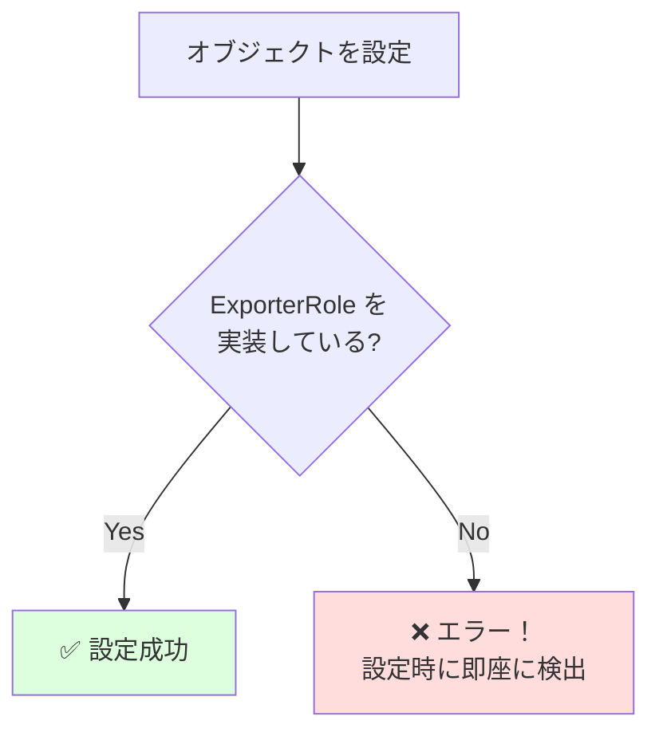

[@nqounet](https://twitter.com/nqounet)です。

前回は、`is => 'rw'`を使ってエクスポーターを動的に切り替えられるようにしました。



しかし、間違ったオブジェクトを設定できてしまう問題がありましたね。今回は、この問題を解決します。

## 問題の再確認

現在のコードでは、こんな間違いが起こり得ます。

```perl
# 文字列を設定してしまった
$data_exporter->exporter("これはエクスポーターではない");
$data_exporter->export_data(\@contacts);  # エラー！
```

```
問題: 設定時にはエラーにならない

┌────────────────┐      ┌────────────────────────────────┐
│  DataExporter  │  ←   │ "これはエクスポーターではない" │
│  ┌──────────┐  │      │        (ただの文字列)           │
│  │ ???????? │  │      └────────────────────────────────┘
│  └──────────┘  │
└────────────────┘
        │
        │ export_data() を呼び出すと...
        ▼
    ╔══════════════════════════════════════════════════════════╗
    ║  ❌ エラー！（ここで初めて気づく）                       ║
    ║  Can't locate object method "export"                     ║
    ╚══════════════════════════════════════════════════════════╝
```

実行すると：

```
Can't locate object method "export" via package "これはエクスポーターではない"
```

問題は、`export_data`メソッドを呼び出したときに初めてエラーになることです。設定した時点でエラーになってくれれば、もっと早く問題に気づけます。

## does制約を追加する

Mooの`does`オプションを使うと、「この属性にはExporterRoleを実装したオブジェクトのみ設定できる」という制約を追加できます。



```perl
package DataExporter {
    use Moo;
    use v5.36;

    has exporter => (
        is       => 'rw',
        required => 1,
        does     => 'ExporterRole',  # ExporterRoleを実装していること
    );

    sub export_data ($self, $data) {
        return $self->exporter->export($data);
    }
}
```

`does => 'ExporterRole'`と書くことで、`exporter`属性には`ExporterRole`を実装したオブジェクトしか設定できなくなります。

## 型チェックが効く様子を確認

間違ったオブジェクトを設定しようとすると、**設定した時点で**エラーになります。

```perl
# 間違ったオブジェクトを設定しようとする
my $data_exporter = DataExporter->new(exporter => "文字列");
```

エラーメッセージ：

```
isa check for "exporter" failed: "文字列" doesn't do ExporterRole
```

これで、「設定時にエラーがわかる」ようになりました！

## 完成したコード

does制約を追加した完成コードです。

```perl
#!/usr/bin/env perl
use v5.36;
use JSON::PP;

# ========================================
# ExporterRole - エクスポーターの約束
# ========================================
package ExporterRole {
    use Moo::Role;
    requires 'export';
}

# ========================================
# CsvExporterクラス
# ========================================
package CsvExporter {
    use Moo;
    use v5.36;
    with 'ExporterRole';

    sub export ($self, $data) {
        my $output = "name,email,phone\n";
        for my $contact (@$data) {
            $output .= "$contact->{name},$contact->{email},$contact->{phone}\n";
        }
        return $output;
    }
}

# ========================================
# JsonExporterクラス
# ========================================
package JsonExporter {
    use Moo;
    use v5.36;
    use JSON::PP;
    with 'ExporterRole';

    sub export ($self, $data) {
        return JSON::PP->new->pretty->encode($data);
    }
}

# ========================================
# DataExporterクラス（エクスポーター管理）
# ========================================
package DataExporter {
    use Moo;
    use v5.36;

    has exporter => (
        is       => 'rw',
        required => 1,
        does     => 'ExporterRole',  # 型チェック追加
    );

    sub export_data ($self, $data) {
        return $self->exporter->export($data);
    }
}

# ========================================
# メイン処理
# ========================================
package main;

# アドレス帳データ
my @contacts = (
    { name => '田中太郎', email => 'tanaka@example.com', phone => '090-1234-5678' },
    { name => '鈴木花子', email => 'suzuki@example.com', phone => '080-2345-6789' },
    { name => '佐藤次郎', email => 'sato@example.com',   phone => '070-3456-7890' },
);

# 正しいエクスポーターを設定
my $data_exporter = DataExporter->new(exporter => CsvExporter->new);
say "=== CSV形式 ===";
print $data_exporter->export_data(\@contacts);

# JSON形式に切り替え（これもOK）
$data_exporter->exporter(JsonExporter->new);
say "\n=== JSON形式 ===";
print $data_exporter->export_data(\@contacts);

# 以下はエラーになる（コメントアウトして試してみてください）
# $data_exporter->exporter("文字列");  # エラー！
```

## does制約のメリット

### 1. 早期発見

問題を設定時に発見できるため、デバッグが容易になります。

### 2. ドキュメント効果

コードを読むだけで「この属性にはExporterRoleを実装したオブジェクトが入る」とわかります。

### 3. 安全な動的切り替え

`is => 'rw'`で動的に切り替えても、型チェックが効くので安心です。

## 今回のポイント

今回学んだ`does`制約は、「Mooで覚えるオブジェクト指向プログラミング」シリーズの第12回でも詳しく解説しています。

`does`はRoleを実装しているかをチェックします。クラスをチェックしたい場合は`isa`を使います。

## まとめ

- `does`制約でRoleを実装しているかチェックできます
- 間違ったオブジェクトを設定すると、設定時にエラーになります
- 早期にバグを発見でき、デバッグが容易になります
- コードのドキュメント効果も向上します

次回「[第8回-形式名から自動でエクスポーターを選ぼう](/2026/01/09/004921/)」では、形式名（"csv"、"json"など）から自動でエクスポーターを選ぶ機能を追加します。お楽しみに！
