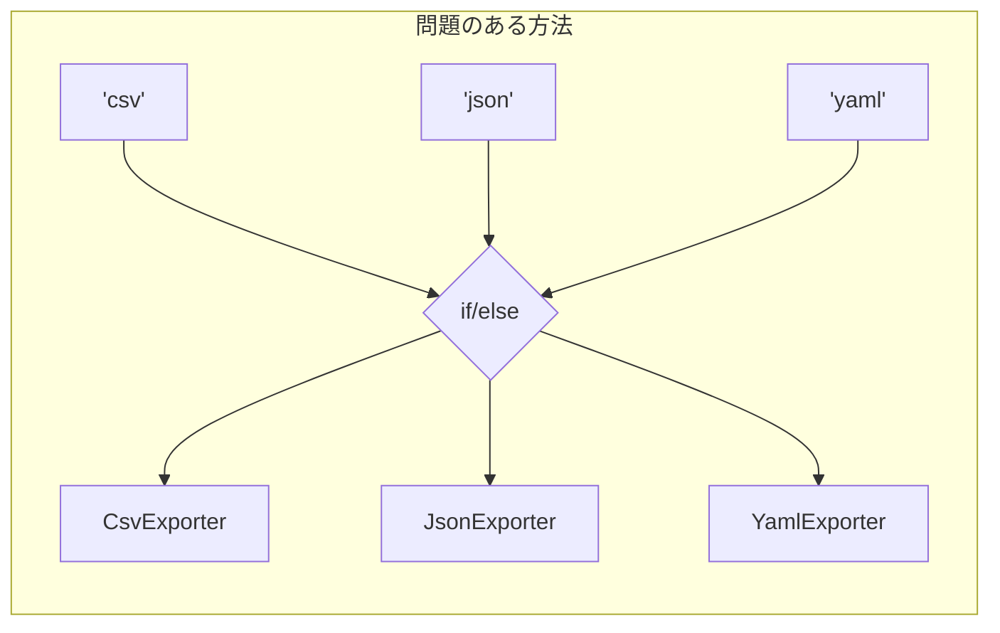
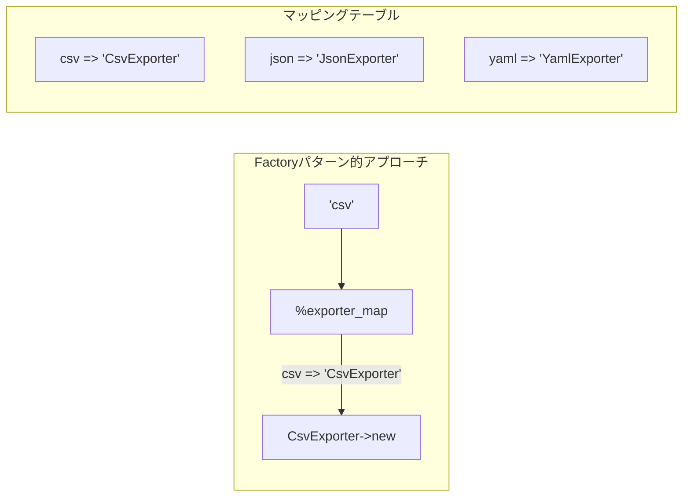

[@nqounet](https://x.com/nqounet)です。

前回は、isaを追加して型チェックができるようになりました。



今回は、"csv"や"json"といった形式名の文字列から、自動で適切なエクスポーターを選ぶ機能を追加します。

## 現在の問題点

現在のメイン処理では、形式に応じてif/elseでエクスポーターを選んでいます。

```perl
my $exporter_obj;
if ($format eq 'csv') {
    $exporter_obj = CsvExporter->new;
}
elsif ($format eq 'json') {
    $exporter_obj = JsonExporter->new;
}
else {
    die "未対応の形式です: $format\n";
}
```

これは第2回で見た問題と似ています。形式が増えるとif/elseが増えていきます。



せっかくエクスポーターをクラスに分離したのに、「どのエクスポーターを使うか選ぶ」部分にまだif/elseが残っています。

## exporter_forメソッドを作る

DataExporterクラスに、形式名から適切なエクスポーターを返すメソッドを追加しましょう。



```perl
package DataExporter {
    use Moo;
    use v5.36;

    has exporter => (
        is       => 'rw',
        required => 1,
        isa => sub { # 型チェック追加
            my $value = shift;
            die "exporter must does ExporterRole" unless $value->does('ExporterRole')
        },
    );

    # 形式名からエクスポーターを取得するためのマッピング
    my %exporter_map = (
        csv  => 'CsvExporter',
        json => 'JsonExporter',
    );

    # 形式名からエクスポーターを生成するクラスメソッド
    sub exporter_for ($class, $format) {
        my $exporter_class = $exporter_map{$format};
        die "未対応の形式です: $format\n" unless $exporter_class;
        return $exporter_class->new;
    }

    sub export_data ($self, $data) {
        return $self->exporter->export($data);
    }
}
```

ポイントは`%exporter_map`というハッシュです。形式名とエクスポータークラス名の対応表を持つことで、if/elseを使わずにクラスを選べます。

## 使い方

`exporter_for`メソッドを使うと、形式名からエクスポーターを簡単に取得できます。

```perl
# 形式名からエクスポーターを生成
my $exporter = DataExporter->exporter_for('csv');
my $data_exporter = DataExporter->new(exporter => $exporter);
print $data_exporter->export_data(\@contacts);
```

さらに、新しい形式を追加するときは`%exporter_map`にエントリを追加するだけでOKです。

## 完成したコード

```perl
#!/usr/bin/env perl
use v5.36;
use JSON::PP;

# ========================================
# ExporterRole - エクスポーターの約束
# ========================================
package ExporterRole {
    use Moo::Role;
    requires 'export';
}

# ========================================
# CsvExporterクラス
# ========================================
package CsvExporter {
    use Moo;
    use v5.36;
    with 'ExporterRole';

    sub export ($self, $data) {
        my $output = "name,email,phone\n";
        for my $contact (@$data) {
            $output .= "$contact->{name},$contact->{email},$contact->{phone}\n";
        }
        return $output;
    }
}

# ========================================
# JsonExporterクラス
# ========================================
package JsonExporter {
    use Moo;
    use v5.36;
    use JSON::PP;
    with 'ExporterRole';

    sub export ($self, $data) {
        return JSON::PP->new->pretty->encode($data);
    }
}

# ========================================
# DataExporterクラス（エクスポーター管理）
# ========================================
package DataExporter {
    use Moo;
    use v5.36;

    has exporter => (
        is       => 'rw',
        required => 1,
        isa => sub { # 型チェック追加
            my $value = shift;
            die "exporter must does ExporterRole" unless $value->does('ExporterRole')
        },
    );

    # 形式名からエクスポーターを取得するためのマッピング
    my %exporter_map = (
        csv  => 'CsvExporter',
        json => 'JsonExporter',
    );

    # 形式名からエクスポーターを生成するクラスメソッド
    sub exporter_for ($class, $format) {
        my $exporter_class = $exporter_map{$format};
        die "未対応の形式です: $format\n" unless $exporter_class;
        return $exporter_class->new;
    }

    sub export_data ($self, $data) {
        return $self->exporter->export($data);
    }
}

# ========================================
# メイン処理
# ========================================
package main;

# アドレス帳データ
my @contacts = (
    { name => '田中太郎', email => 'tanaka@example.com', phone => '090-1234-5678' },
    { name => '鈴木花子', email => 'suzuki@example.com', phone => '080-2345-6789' },
    { name => '佐藤次郎', email => 'sato@example.com',   phone => '070-3456-7890' },
);

# コマンドライン引数から形式を取得
my $format = $ARGV[0] // 'csv';

# 形式名からエクスポーターを生成し、DataExporterを作成
my $exporter = DataExporter->exporter_for($format);
my $data_exporter = DataExporter->new(exporter => $exporter);

# エクスポート実行
print $data_exporter->export_data(\@contacts);
```

## メインのif/elseがなくなった！

メイン処理を見てください。

```perl
my $format = $ARGV[0] // 'csv';
my $exporter = DataExporter->exporter_for($format);
my $data_exporter = DataExporter->new(exporter => $exporter);
print $data_exporter->export_data(\@contacts);
```

if/elseが完全になくなりました！形式の追加も`%exporter_map`へのエントリ追加だけで済みます。

## 新しい形式の追加方法

YAML形式を追加したい場合：

1. YamlExporterクラスを作成
2. `%exporter_map`に`yaml => 'YamlExporter'`を追加

既存のコードを変更する必要がほとんどありません。

## 今回のポイント

このような「何かの条件から適切なオブジェクトを生成する」処理を、設計の用語でFactory（ファクトリー）パターンと呼ぶことがあります。

今回の実装はシンプルなハッシュマッピングですが、Factoryパターンの考え方を取り入れています。

## まとめ

- 形式名からエクスポーターを選ぶ`exporter_for`メソッドを追加しました
- ハッシュマッピングでif/elseを排除しました
- 新しい形式の追加が簡単になりました
- メイン処理がスッキリしました

次回「[第9回-完成！データエクスポーター](/2026/01/09/005124/)」では、ここまで作ってきた機能を統合して、データエクスポーターを完成させます。お楽しみに！
