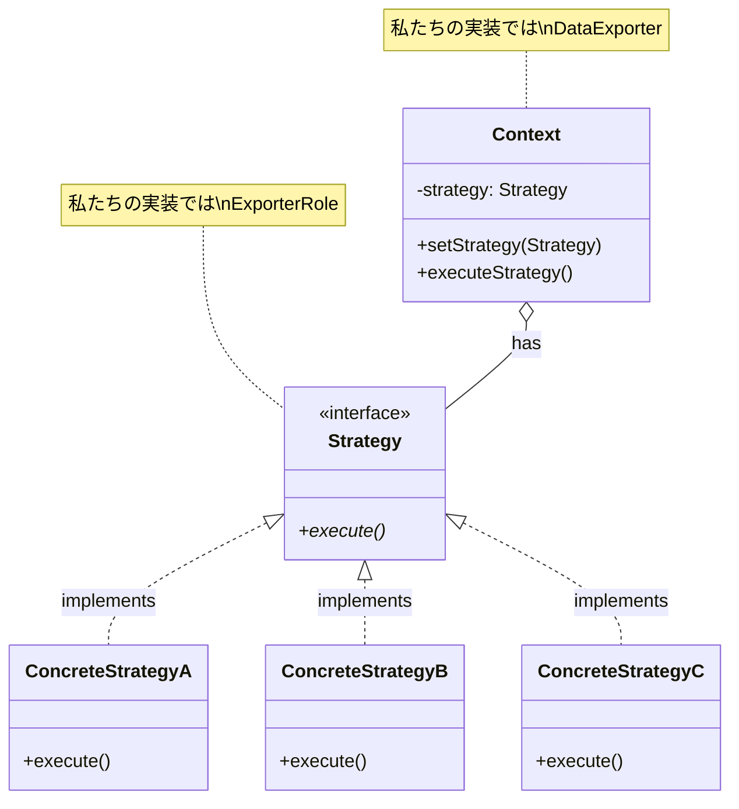
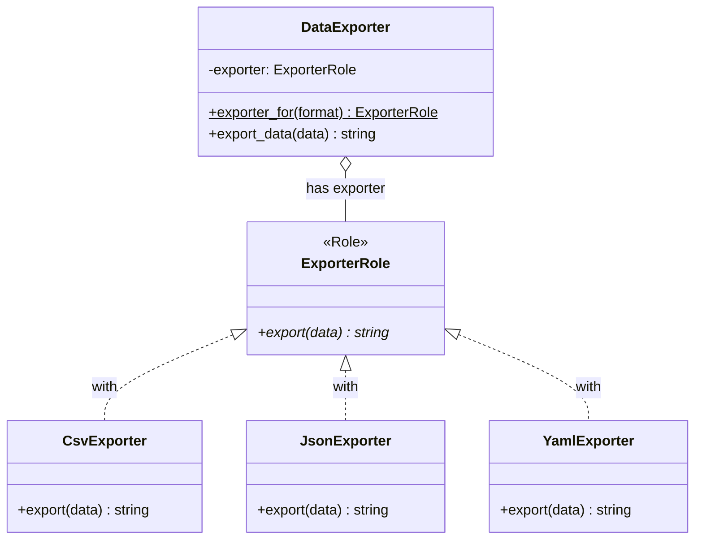

[@nqounet](https://x.com/nqounet)です。

前回で、データエクスポーターが完成しました。CSV、JSON、YAML形式に対応し、新しい形式の追加も簡単になりましたね。



最終回の今回は、これまで作ってきた設計に名前があることを明かします。

## 実は、これがStrategyパターンです！

このシリーズで作ってきた設計は、**Strategyパターン（ストラテジーパターン）**というデザインパターンです。

**デザインパターン**とは、ソフトウェア設計でよく使われる問題解決のパターン（定石）のことです。1994年に発表された「GoF本」で23個のパターンが紹介され、Strategyパターンはその1つです。

GoFとは「Gang of Four（4人組）」の略で、この本の4人の著者を指します。



## Strategyパターンの構造

作ってきたものを振り返りながら、Strategyパターンの構造を確認しましょう。



```
┌─────────────────┐
│   DataExporter  │ ← Context（コンテキスト）
│   (管理クラス)   │    エクスポーターを保持し、処理を委譲
└────────┬────────┘
         │ has exporter
         ▼
┌─────────────────┐
│  ExporterRole   │ ← Strategy（戦略インターフェース）
│   (Moo::Role)   │    exportメソッドを要求
└────────┬────────┘
         │ implements
    ┌────┴────┬────────────┐
    ▼         ▼            ▼
┌────────┐ ┌────────┐ ┌────────┐
│  Csv   │ │  Json  │ │  Yaml  │ ← ConcreteStrategy（具体的戦略）
│Exporter│ │Exporter│ │Exporter│    実際の処理を実装
└────────┘ └────────┘ └────────┘
```

| 用語 | 私たちが作ったもの | 役割 |
|-----|------------------|-----|
| Strategy | ExporterRole | 共通のインターフェース（約束） |
| ConcreteStrategy | CsvExporter, JsonExporter, YamlExporter | 具体的な処理の実装 |
| Context | DataExporter | Strategyを保持し、処理を委譲 |

## なぜこの設計が良いのか？

Strategyパターンを使うと、**SOLID原則**という設計原則に自然と従えます。

### 開放/閉鎖原則（OCP: Open/Closed Principle）

「拡張に開かれ、修正に閉じている」という原則です。

新しい形式（例：XML形式）を追加したい場合：

```perl
# 新しいエクスポーターを追加
package XmlExporter {
    use Moo;
    use v5.36;
    with 'ExporterRole';
    sub export ($self, $data) { ... }
}

# マッピングに登録
my %exporter_map = (
    csv  => 'CsvExporter',
    json => 'JsonExporter',
    yaml => 'YamlExporter',
    xml  => 'XmlExporter',  # 追加
);
```

**既存のCsvExporter、JsonExporter、YamlExporterのコードは一切変更していません！**

これが「拡張に開かれ、修正に閉じている」ということです。

### 単一責任の原則（SRP: Single Responsibility Principle）

「クラスは1つの責任だけを持つべき」という原則です。

- `CsvExporter` → CSV形式での出力だけを担当
- `JsonExporter` → JSON形式での出力だけを担当
- `YamlExporter` → YAML形式での出力だけを担当
- `DataExporter` → エクスポーターの管理だけを担当

各クラスが1つのことだけを担当しています。

### 依存性逆転の原則（DIP: Dependency Inversion Principle）

「具体ではなく抽象に依存すべき」という原則です。

`DataExporter`は具体的なエクスポーター（`CsvExporter`など）に直接依存せず、抽象（`ExporterRole`）に依存しています。

```perl
has exporter => (
    is   => 'rw',
    does => 'ExporterRole',  # 抽象に依存
);
```

## if/elseとの比較

最初のif/elseによる実装と比較してみましょう。

| 観点 | if/else版 | Strategyパターン版 |
|-----|----------|------------------|
| 新形式の追加 | if/elseに条件追加 | 新クラス作成のみ |
| 既存コードへの影響 | 影響あり | 影響なし |
| テスト | 全体をテスト | 個別にテスト可能 |
| コードの分離 | 1ファイルに集中 | 形式ごとに分離 |

## 他のパターンへの発展

Strategyパターンを理解したら、次は関連するパターンも学んでみてください。

- **Stateパターン** - オブジェクトの状態に応じて振る舞いを変える
- **Template Methodパターン** - アルゴリズムの骨格を定義し、一部をサブクラスで変える
- **Commandパターン** - 操作自体をオブジェクトとしてカプセル化する

これらは「Mooを使ってディスパッチャーを作ってみよう」シリーズでも触れています。

## シリーズのまとめ

全10回のシリーズを振り返りましょう。

| 回 | タイトル | 学んだこと |
|----|---------|----------|
| 第1回 | CSVとJSONでデータを保存しよう | if/elseでの形式切り替え |
| 第2回 | 新しい形式を追加すると大変！ | if/elseの肥大化問題 |
| 第3回 | 出力処理を専用クラスに分けよう | 責務分離 |
| 第4回 | Moo::Roleで共通の約束を決めよう | Moo::Roleとrequires |
| 第5回 | エクスポーターを管理するクラスを作ろう | Contextクラスと委譲 |
| 第6回 | 実行時に出力形式を切り替えよう | 動的な切り替え |
| 第7回 | does制約でバグを防ごう | 型チェック |
| 第8回 | 形式名から自動でエクスポーターを選ぼう | Factoryパターン的アプローチ |
| 第9回 | 完成！データエクスポーター | 機能統合 |
| 第10回 | これがStrategyパターンだ！ | デザインパターンの理解 |

## おわりに

このシリーズでは、「アドレス帳データを複数の形式で出力したい」という身近な課題から始めて、if/elseの問題を体験し、それを解決するためにコードを改善してきました。

そして最後に、作ってきた設計が「Strategyパターン」という名前を持つことを学びました。

デザインパターンは「パターン名を覚えて使う」のではなく、「問題を解決しようとしたら自然とパターンになっていた」という経験が大切です。

このシリーズがその体験の助けになれば幸いです。

お疲れ様でした！
