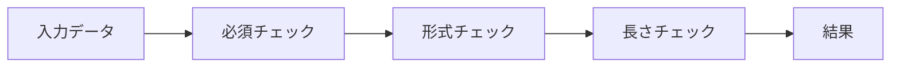

[@nqounet](https://x.com/nqounet)です。

「ユーザー登録バリデータで学ぶ責任の連鎖」シリーズの第3回（最終回）です。

前回は、検証ルールが増えることでif文がネスト化し、保守困難なコードになる問題を体験しました。



今回は、その問題を「Chain of Responsibility」パターンで解決します。各検証ルールを独立したクラスに分離し、柔軟に組み合わせられる設計に変更していきましょう。

## Chain of Responsibilityパターンとは

Chain of Responsibility（責任の連鎖）パターンは、GoF（Gang of Four）の23のデザインパターンの1つです。

このパターンでは、リクエストを処理するハンドラを連鎖（チェーン）状につなぎ、各ハンドラが自分の責任範囲を処理します。自分で処理できない場合は、次のハンドラに処理を委譲します。



バリデーションでは、各検証ルールをハンドラとして実装し、チェーンでつなぐことで柔軟な検証フローを構築できます。

## パターン適用のメリット

前回の問題コードと比較して、Chain of Responsibilityパターンには以下のメリットがあります。

| 問題 | パターン適用後 |
|-----|--------------|
| ネストが深い | 各ハンドラはフラットな構造 |
| 依存関係が暗黙的 | チェーン構築で明示的に表現 |
| 新ルール追加が困難 | 新しいハンドラを追加するだけ |
| テストが困難 | 各ハンドラを独立してテスト可能 |
| 修正の影響範囲が不明確 | ハンドラごとに影響が局所化 |

## 基底Validatorクラスの設計

まず、すべてのバリデータの基底となるクラスを設計します。

```perl
# validator_base.pl
# Perl v5.36+, Moo

use v5.36;
use utf8;
use warnings;
binmode STDOUT, ':utf8';

package Validator {
    use Moo;

    # 次のハンドラへの参照
    has next_handler => (
        is        => 'rw',
        predicate => 'has_next_handler',
    );

    # 対象フィールド名
    has field_name => (
        is       => 'ro',
        required => 1,
    );

    # エラーメッセージ
    has error_message => (
        is       => 'ro',
        required => 1,
    );

    # 次のハンドラを設定し、そのハンドラを返す（チェーン構築用）
    sub set_next ($self, $handler) {
        $self->next_handler($handler);
        return $handler;
    }

    # バリデーション実行（サブクラスでオーバーライド）
    sub validate ($self, $input, $errors) {
        # 具体的な検証ロジックはサブクラスで実装
        # エラーがあれば $errors ハッシュに追加

        # 次のハンドラがあれば委譲
        if ($self->has_next_handler) {
            return $self->next_handler->validate($input, $errors);
        }

        return $errors;
    }

    # 具体的な検証ロジック（サブクラスで実装）
    sub _do_validate ($self, $value) {
        die "サブクラスで_do_validateを実装してください";
    }
};

1;
```

基底クラスのポイントは以下のとおりです。

- `next_handler` - 次のハンドラへの参照を保持する
- `field_name` - 検証対象のフィールド名を保持する
- `error_message` - エラー時のメッセージを保持する
- `set_next()` - チェーン構築のためのメソッド
- `validate()` - 検証を実行し、次のハンドラに委譲する

## 具体的なバリデータの実装

基底クラスを継承して、具体的なバリデータを実装します。

```perl
# validators.pl
# Perl v5.36+, Moo

use v5.36;
use utf8;
use warnings;
binmode STDOUT, ':utf8';

# 基底Validatorクラス
package Validator {
    use Moo;

    has next_handler => (
        is        => 'rw',
        predicate => 'has_next_handler',
    );

    has field_name => (
        is       => 'ro',
        required => 1,
    );

    has error_message => (
        is       => 'ro',
        required => 1,
    );

    sub set_next ($self, $handler) {
        $self->next_handler($handler);
        return $handler;
    }

    sub validate ($self, $input, $errors) {
        my $value = $input->{$self->field_name} // '';

        # 検証実行（サブクラスの_do_validateを呼ぶ）
        if (!$self->_do_validate($value, $input)) {
            $errors->{$self->field_name} = $self->error_message;
        }

        # 次のハンドラがあれば委譲
        if ($self->has_next_handler) {
            return $self->next_handler->validate($input, $errors);
        }

        return $errors;
    }

    sub _do_validate ($self, $value, $input) {
        die "サブクラスで_do_validateを実装してください";
    }
};

# 必須チェック
package RequiredValidator {
    use Moo;
    extends 'Validator';

    sub _do_validate ($self, $value, $input) {
        return $value ne '';
    }
};

# メールアドレス形式チェック
package EmailValidator {
    use Moo;
    extends 'Validator';

    sub _do_validate ($self, $value, $input) {
        # 空の場合はスキップ（必須チェックは別のバリデータで行う）
        return 1 if $value eq '';
        return $value =~ /\A[^@\s]+\@[^@\s]+\.[^@\s]+\z/;
    }
};

# 文字列長チェック
package LengthValidator {
    use Moo;
    extends 'Validator';

    has min_length => (is => 'ro', default => 0);
    has max_length => (is => 'ro');

    sub _do_validate ($self, $value, $input) {
        return 1 if $value eq '';
        my $len = length($value);
        return 0 if $len < $self->min_length;
        return 0 if defined $self->max_length && $len > $self->max_length;
        return 1;
    }
};

# パスワード強度チェック
package PasswordStrengthValidator {
    use Moo;
    extends 'Validator';

    sub _do_validate ($self, $value, $input) {
        return 1 if $value eq '';
        # 大文字、小文字、数字を含むこと
        return 0 unless $value =~ /[A-Z]/;
        return 0 unless $value =~ /[a-z]/;
        return 0 unless $value =~ /[0-9]/;
        return 1;
    }
};

# 確認一致チェック
package ConfirmValidator {
    use Moo;
    extends 'Validator';

    has confirm_field => (is => 'ro', required => 1);

    sub _do_validate ($self, $value, $input) {
        return 1 if $value eq '';
        my $confirm = $input->{$self->confirm_field} // '';
        return $value eq $confirm;
    }
};

# 真偽値チェック（利用規約同意など）
package BooleanValidator {
    use Moo;
    extends 'Validator';

    sub _do_validate ($self, $value, $input) {
        return $value ? 1 : 0;
    }
};

# 数値範囲チェック
package RangeValidator {
    use Moo;
    extends 'Validator';

    has min_value => (is => 'ro');
    has max_value => (is => 'ro');

    sub _do_validate ($self, $value, $input) {
        return 1 if !defined $value || $value eq '';
        return 0 unless $value =~ /\A[0-9]+\z/;
        return 0 if defined $self->min_value && $value < $self->min_value;
        return 0 if defined $self->max_value && $value > $self->max_value;
        return 1;
    }
};

1;
```

各バリデータはシンプルで、自分の責任範囲だけを担当します。これが「単一責任の原則」です。

## チェーンの構築と実行

バリデータを組み合わせてチェーンを構築し、ユーザー登録の検証を行います。

```perl
# チェーン構築の例
sub build_user_registration_chain () {
    # 各バリデータを作成
    my $name_required = RequiredValidator->new(
        field_name    => 'name',
        error_message => '名前を入力してください',
    );

    my $email_required = RequiredValidator->new(
        field_name    => 'email',
        error_message => 'メールアドレスを入力してください',
    );

    my $email_format = EmailValidator->new(
        field_name    => 'email',
        error_message => 'メールアドレスの形式が正しくありません',
    );

    my $password_required = RequiredValidator->new(
        field_name    => 'password',
        error_message => 'パスワードを入力してください',
    );

    my $password_length = LengthValidator->new(
        field_name    => 'password',
        error_message => 'パスワードは8文字以上で入力してください',
        min_length    => 8,
    );

    my $password_strength = PasswordStrengthValidator->new(
        field_name    => 'password',
        error_message => 'パスワードには大文字・小文字・数字を含めてください',
    );

    my $password_confirm = ConfirmValidator->new(
        field_name    => 'password_confirm',
        error_message => 'パスワードが一致しません',
        confirm_field => 'password',
    );

    my $agreed_terms = BooleanValidator->new(
        field_name    => 'agreed_terms',
        error_message => '利用規約に同意してください',
    );

    my $age_range = RangeValidator->new(
        field_name    => 'age',
        error_message => '18歳以上の方のみ登録できます',
        min_value     => 18,
    );

    # チェーンを構築
    $name_required
        ->set_next($email_required)
        ->set_next($email_format)
        ->set_next($password_required)
        ->set_next($password_length)
        ->set_next($password_strength)
        ->set_next($password_confirm)
        ->set_next($agreed_terms)
        ->set_next($age_range);

    return $name_required;  # チェーンの先頭を返す
}

# バリデーション実行
sub validate_user ($input) {
    my $chain = build_user_registration_chain();
    my $errors = {};

    $chain->validate($input, $errors);

    if (%$errors) {
        return { ok => 0, errors => $errors };
    }

    return { ok => 1, data => $input };
}
```

チェーン構築のポイントは以下のとおりです。

- 各バリデータは独立したオブジェクトとして作成する
- `set_next()` でバリデータをつなげてチェーンを構築する
- チェーンの先頭から `validate()` を呼ぶと、すべてのバリデータが順に実行される

## 拡張性の実証

新しい検証ルールを追加してみましょう。たとえば「ユーザー名に禁止ワードを含まない」というルールを追加する場合、既存のコードを変更する必要はありません。

```perl
# 禁止ワードチェック（新規追加）
package ForbiddenWordsValidator {
    use Moo;
    extends 'Validator';

    has forbidden_words => (
        is      => 'ro',
        default => sub { ['admin', 'root', 'system'] },
    );

    sub _do_validate ($self, $value, $input) {
        return 1 if $value eq '';
        my $lower = lc($value);
        for my $word ($self->forbidden_words->@*) {
            return 0 if index($lower, $word) >= 0;
        }
        return 1;
    }
};
```

この新しいバリデータをチェーンに追加するだけで、検証ルールが拡張されます。

```perl
# 既存のチェーンに追加
my $name_forbidden = ForbiddenWordsValidator->new(
    field_name    => 'name',
    error_message => '使用できない文字列が含まれています',
);

$name_required
    ->set_next($name_forbidden)  # 新しいバリデータを追加
    ->set_next($email_required)
    # ... 以下同様
```

これが「開放閉鎖原則」です。既存のコードを変更せずに、新しい機能を追加できます。

## シリーズの振り返り

全3回のシリーズを振り返ってみましょう。

| 回 | 学んだこと |
|---|-----------|
| 第1回 | if文でシンプルなバリデーションを実装 |
| 第2回 | 検証ルール追加でコードが複雑化する問題を体験 |
| 第3回 | Chain of Responsibilityパターンで問題を解決 |

最初はシンプルなif文から始まり、要件追加でコードが複雑化し、最後にデザインパターンで解決する。この流れを体験することで、「なぜパターンが必要なのか」を実感できたのではないでしょうか。

## Chain of Responsibilityパターンの本質

このパターンの本質は「責任の分離」と「柔軟な組み合わせ」です。

1. 責任の分離 - 各バリデータは1つの検証ルールだけを担当する
2. 柔軟な組み合わせ - チェーン構築で検証フローを自由に変更できる
3. 拡張性 - 新しいバリデータを追加しても既存コードに影響しない
4. テスト容易性 - 各バリデータを独立してテスト可能

## 次のステップへ

Chain of Responsibilityパターンを学んだ皆さんは、以下のステップに進んでみてください。

- テストを書く - 各バリデータに対して単体テストを書いてみる
- 他のデザインパターン - Singletonパターンなど、他のGoFパターンを学ぶ
- Moo::Role - 共通インターフェースをRoleで定義する

デザインパターンを学ぶことで、より良い設計ができるようになります。

## 関連記事

### 前提知識



### 関連パターン



### インターフェース設計



## まとめ

- Chain of Responsibilityパターンは、ハンドラをチェーン状につなぐデザインパターンである
- 各バリデータは1つの検証ルールだけを担当し、責任が分離される
- `set_next()` でチェーンを構築し、柔軟に検証フローを組み立てられる
- 新しいバリデータを追加しても既存コードに影響しない（開放閉鎖原則）
- 各バリデータを独立してテストできる

## 完成コード

この回の完成コードを1つのスクリプトにまとめました。

```perl
#!/usr/bin/env perl
# form-validation-03.pl
# ユーザー登録バリデーション（Chain of Responsibilityパターン版）
# Perl v5.36+, Moo

use v5.36;
use utf8;
use warnings;
use Moo;
binmode STDOUT, ':utf8';

# ===== 基底Validatorクラス =====
package Validator {
    use Moo;

    has next_handler => (
        is        => 'rw',
        predicate => 'has_next_handler',
    );

    has field_name => (
        is       => 'ro',
        required => 1,
    );

    has error_message => (
        is       => 'ro',
        required => 1,
    );

    sub set_next ($self, $handler) {
        $self->next_handler($handler);
        return $handler;
    }

    sub validate ($self, $input, $errors) {
        my $value = $input->{$self->field_name} // '';

        if (!$self->_do_validate($value, $input)) {
            # 同じフィールドにエラーがなければ追加
            $errors->{$self->field_name} //= $self->error_message;
        }

        if ($self->has_next_handler) {
            return $self->next_handler->validate($input, $errors);
        }

        return $errors;
    }

    sub _do_validate ($self, $value, $input) {
        die "サブクラスで_do_validateを実装してください";
    }
};

# ===== 具体的なバリデータ =====

# 必須チェック
package RequiredValidator {
    use Moo;
    extends 'Validator';

    sub _do_validate ($self, $value, $input) {
        return $value ne '';
    }
};

# メールアドレス形式チェック
package EmailValidator {
    use Moo;
    extends 'Validator';

    sub _do_validate ($self, $value, $input) {
        return 1 if $value eq '';
        return $value =~ /\A[^@\s]+\@[^@\s]+\.[^@\s]+\z/;
    }
};

# 文字列長チェック
package LengthValidator {
    use Moo;
    extends 'Validator';

    has min_length => (is => 'ro', default => 0);
    has max_length => (is => 'ro');

    sub _do_validate ($self, $value, $input) {
        return 1 if $value eq '';
        my $len = length($value);
        return 0 if $len < $self->min_length;
        return 0 if defined $self->max_length && $len > $self->max_length;
        return 1;
    }
};

# パスワード強度チェック
package PasswordStrengthValidator {
    use Moo;
    extends 'Validator';

    sub _do_validate ($self, $value, $input) {
        return 1 if $value eq '';
        return 0 unless $value =~ /[A-Z]/;
        return 0 unless $value =~ /[a-z]/;
        return 0 unless $value =~ /[0-9]/;
        return 1;
    }
};

# 確認一致チェック
package ConfirmValidator {
    use Moo;
    extends 'Validator';

    has confirm_field => (is => 'ro', required => 1);

    sub _do_validate ($self, $value, $input) {
        my $original = $input->{$self->confirm_field} // '';
        return 1 if $original eq '';  # 元のフィールドが空ならスキップ
        return $value eq $original;
    }
};

# 真偽値チェック（利用規約同意など）
package BooleanValidator {
    use Moo;
    extends 'Validator';

    sub _do_validate ($self, $value, $input) {
        return $value ? 1 : 0;
    }
};

# 数値範囲チェック
package RangeValidator {
    use Moo;
    extends 'Validator';

    has min_value => (is => 'ro');
    has max_value => (is => 'ro');

    sub _do_validate ($self, $value, $input) {
        return 1 if !defined $value || $value eq '';
        return 0 unless $value =~ /\A[0-9]+\z/;
        return 0 if defined $self->min_value && $value < $self->min_value;
        return 0 if defined $self->max_value && $value > $self->max_value;
        return 1;
    }
};

# ===== チェーン構築 =====
package main;

sub build_user_registration_chain () {
    my $name_required = RequiredValidator->new(
        field_name    => 'name',
        error_message => '名前を入力してください',
    );

    my $email_required = RequiredValidator->new(
        field_name    => 'email',
        error_message => 'メールアドレスを入力してください',
    );

    my $email_format = EmailValidator->new(
        field_name    => 'email',
        error_message => 'メールアドレスの形式が正しくありません',
    );

    my $password_required = RequiredValidator->new(
        field_name    => 'password',
        error_message => 'パスワードを入力してください',
    );

    my $password_length = LengthValidator->new(
        field_name    => 'password',
        error_message => 'パスワードは8文字以上で入力してください',
        min_length    => 8,
    );

    my $password_strength = PasswordStrengthValidator->new(
        field_name    => 'password',
        error_message => 'パスワードには大文字・小文字・数字を含めてください',
    );

    my $password_confirm = ConfirmValidator->new(
        field_name    => 'password_confirm',
        error_message => 'パスワードが一致しません',
        confirm_field => 'password',
    );

    my $agreed_terms = BooleanValidator->new(
        field_name    => 'agreed_terms',
        error_message => '利用規約に同意してください',
    );

    my $age_range = RangeValidator->new(
        field_name    => 'age',
        error_message => '18歳以上の方のみ登録できます',
        min_value     => 18,
    );

    # チェーンを構築
    $name_required
        ->set_next($email_required)
        ->set_next($email_format)
        ->set_next($password_required)
        ->set_next($password_length)
        ->set_next($password_strength)
        ->set_next($password_confirm)
        ->set_next($agreed_terms)
        ->set_next($age_range);

    return $name_required;
}

sub validate_user ($input) {
    my $chain = build_user_registration_chain();
    my $errors = {};

    $chain->validate($input, $errors);

    if (%$errors) {
        return { ok => 0, errors => $errors };
    }

    return { ok => 1, data => $input };
}

# ===== 実行例 =====
my @test_cases = (
    # テスト1: すべて正常
    {
        name             => '山田太郎',
        email            => 'yamada@example.com',
        password         => 'Password123',
        password_confirm => 'Password123',
        agreed_terms     => 1,
        age              => 25,
    },
    # テスト2: 複数のエラー
    {
        name             => '',
        email            => 'invalid',
        password         => 'weak',
        password_confirm => 'mismatch',
        agreed_terms     => 0,
        age              => 15,
    },
    # テスト3: パスワード強度不足
    {
        name             => '鈴木花子',
        email            => 'suzuki@example.com',
        password         => 'password123',
        password_confirm => 'password123',
        agreed_terms     => 1,
        age              => 30,
    },
    # テスト4: 確認パスワード不一致
    {
        name             => '佐藤次郎',
        email            => 'sato@example.com',
        password         => 'Password123',
        password_confirm => 'Password456',
        agreed_terms     => 1,
        age              => 22,
    },
);

for my $i (0 .. $#test_cases) {
    say "=== テスト" . ($i + 1) . " ===";
    my $result = validate_user($test_cases[$i]);

    if ($result->{ok}) {
        say "検証成功: $result->{data}{name} ($result->{data}{email})";
    }
    else {
        say "検証失敗:";
        for my $field (sort keys $result->{errors}->%*) {
            say "  - $field: $result->{errors}{$field}";
        }
    }
    say "";
}
```
