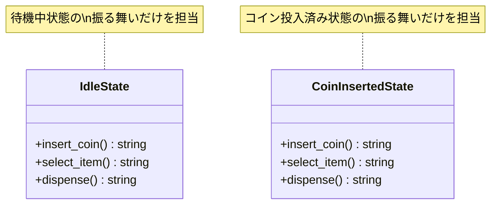

[@nqounet](https://twitter.com/nqounet)です。

前回は、if/elseが肥大化する問題を体験しました。状態が増えるとコードが複雑になり、保守が難しくなるのでしたね。



今回は、この問題を解決するために「状態を別のクラスに分ける」というアプローチを取ります。

## 責務分離という考え方

**責務分離（Separation of Concerns）**とは、1つのクラスや関数は1つのことだけを担当すべき、という考え方です。

前回のコードでは、1つのスクリプトが以下のすべてを担当していました。

- 「待機中」状態での振る舞いの処理
- 「コイン投入済み」状態での振る舞いの処理
- 「商品排出中」状態での振る舞いの処理

これを、状態ごとに専用のクラスを作って分離しましょう。

```
Before: 1つのファイルに全部入り
┌───────────────────────────────────┐
│        vending_machine.pl          │
│  ┌─────────────────────────────┐  │
│  │ 待機中の処理                 │  │
│  ├─────────────────────────────┤  │
│  │ コイン投入済みの処理         │  │
│  ├─────────────────────────────┤  │
│  │ 商品排出中の処理             │  │
│  └─────────────────────────────┘  │
└───────────────────────────────────┘

After: クラスごとに分離
┌─────────────┐  ┌────────────────────┐
│ IdleState   │  │ CoinInsertedState  │
│ (待機中)    │  │ (コイン投入済み)   │
└─────────────┘  └────────────────────┘
```

## IdleStateクラスを作る

まずは「待機中」状態を表すクラスを作ります。

```perl
package IdleState {
    use Moo;
    use v5.36;

    sub insert_coin ($self) {
        say "コインが投入されました";
        return 'coin_inserted';  # 次の状態を返す
    }

    sub select_item ($self) {
        say "先にコインを入れてください";
        return 'idle';  # 状態は変わらない
    }

    sub dispense ($self) {
        say "商品は選択されていません";
        return 'idle';  # 状態は変わらない
    }
}
```

このクラスは「待機中」状態での振る舞いだけを担当します。

- `insert_coin`: コインが投入されたら「コイン投入済み」状態に遷移
- `select_item`: 待機中に商品を選ぼうとしてもエラーメッセージを表示
- `dispense`: 待機中に商品を受け取ろうとしてもエラーメッセージを表示

## CoinInsertedStateクラスを作る

同様に、「コイン投入済み」状態を表すクラスも作ります。

```perl
package CoinInsertedState {
    use Moo;
    use v5.36;

    sub insert_coin ($self) {
        say "すでにコインが入っています";
        return 'coin_inserted';  # 状態は変わらない
    }

    sub select_item ($self) {
        say "商品を選択しました。排出中...";
        return 'dispensing';  # 排出中状態に遷移
    }

    sub dispense ($self) {
        say "先に商品を選択してください";
        return 'coin_inserted';  # 状態は変わらない
    }
}
```

こちらも「コイン投入済み」状態での振る舞いだけを担当します。

## 何が良くなったのか？

各クラスが1つの状態だけを担当するようになりました。



**変更が楽になった点**

- 「待機中」の振る舞いを変えたいときは`IdleState`クラスだけを見ればよい
- 「コイン投入済み」の振る舞いを変えたいときは`CoinInsertedState`クラスだけを見ればよい
- 他の状態のコードを壊す心配がない

## 状態を使ってみる

作成したクラスを使って、自動販売機を動かしてみましょう。

```perl
#!/usr/bin/env perl
use v5.36;

# ========================================
# IdleStateクラス（待機中状態）
# ========================================
package IdleState {
    use Moo;
    use v5.36;

    sub insert_coin ($self) {
        say "コインが投入されました";
        return 'coin_inserted';
    }

    sub select_item ($self) {
        say "先にコインを入れてください";
        return 'idle';
    }

    sub dispense ($self) {
        say "商品は選択されていません";
        return 'idle';
    }
}

# ========================================
# CoinInsertedStateクラス（コイン投入済み状態）
# ========================================
package CoinInsertedState {
    use Moo;
    use v5.36;

    sub insert_coin ($self) {
        say "すでにコインが入っています";
        return 'coin_inserted';
    }

    sub select_item ($self) {
        say "商品を選択しました。排出中...";
        return 'dispensing';
    }

    sub dispense ($self) {
        say "先に商品を選択してください";
        return 'coin_inserted';
    }
}

# ========================================
# メイン処理
# ========================================
package main;

# 現在の状態を管理
my $current_state = 'idle';
my %states = (
    idle          => IdleState->new,
    coin_inserted => CoinInsertedState->new,
);

say "=== 自動販売機シミュレーター（クラス分離版） ===";
say "";

say "1. コインを入れずに商品を選ぶ:";
$current_state = $states{$current_state}->select_item;
say "";

say "2. コインを投入:";
$current_state = $states{$current_state}->insert_coin;
say "";

say "3. 商品を選択:";
$current_state = $states{$current_state}->select_item;
say "";
```

状態クラスのメソッドを呼び出し、戻り値で次の状態を取得しています。if/elseの分岐がなくなり、すっきりしました。

## まだ残っている問題

現時点ではまだいくつかの問題が残っています。

- 「商品排出中」状態のクラスがまだない
- 状態クラスが「必ず同じメソッドを持つ」という保証がない
- 状態の管理がメイン処理に散らばっている

次回は、Moo::Roleを使って「すべての状態クラスが同じメソッドを持つ」という約束を定義します。

## 今回の完成コード

```perl
#!/usr/bin/env perl
use v5.36;

# ========================================
# IdleStateクラス（待機中状態）
# ========================================
package IdleState {
    use Moo;
    use v5.36;

    sub insert_coin ($self) {
        say "コインが投入されました";
        return 'coin_inserted';
    }

    sub select_item ($self) {
        say "先にコインを入れてください";
        return 'idle';
    }

    sub dispense ($self) {
        say "商品は選択されていません";
        return 'idle';
    }
}

# ========================================
# CoinInsertedStateクラス（コイン投入済み状態）
# ========================================
package CoinInsertedState {
    use Moo;
    use v5.36;

    sub insert_coin ($self) {
        say "すでにコインが入っています";
        return 'coin_inserted';
    }

    sub select_item ($self) {
        say "商品を選択しました。排出中...";
        return 'dispensing';
    }

    sub dispense ($self) {
        say "先に商品を選択してください";
        return 'coin_inserted';
    }
}

# ========================================
# メイン処理
# ========================================
package main;

# 現在の状態を管理
my $current_state = 'idle';
my %states = (
    idle          => IdleState->new,
    coin_inserted => CoinInsertedState->new,
);

say "=== 自動販売機シミュレーター（クラス分離版） ===";
say "";

say "1. コインを入れずに商品を選ぶ:";
$current_state = $states{$current_state}->select_item;
say "";

say "2. コインを投入:";
$current_state = $states{$current_state}->insert_coin;
say "";

say "3. 商品を選択:";
$current_state = $states{$current_state}->select_item;
say "";
```

## まとめ

- 状態を専用クラス（IdleState、CoinInsertedState）に分離した
- 「責務分離」の考え方を適用した
- 各クラスが1つの状態だけを担当することで、保守性が向上する
- どの状態クラスも同じ`insert_coin`、`select_item`、`dispense`メソッドを持つ

次回「第4回-Moo::Roleで状態の約束を決めよう」では、Moo::Roleを使って「共通の約束」を明確に定義します。お楽しみに！


