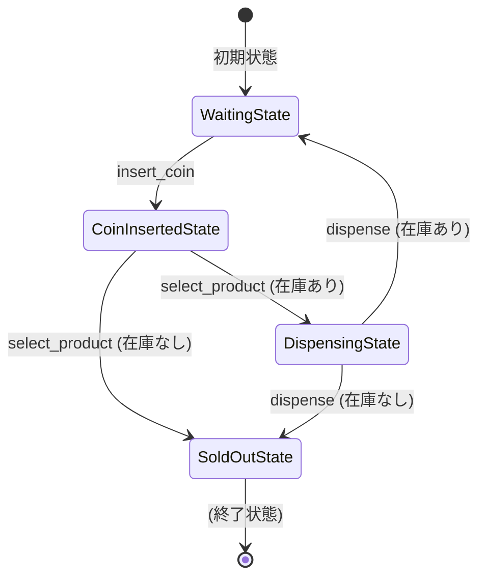

[@nqounet](https://x.com/nqounet)です。

前回は、SoldOutState（売り切れ状態）を追加して、OCP（開放閉鎖原則）の威力を体感しました。



今回は、これまで作ってきた自動販売機シミュレーターを統合し、対話的なCLIで動作確認できるようにします。

## これまでの振り返り

第1回から第8回までで、以下のことを学びました。

- 第1回：if/elseで状態を管理する素朴な実装
- 第2回：状態が増えるとif/elseが肥大化する問題
- 第3回：状態ごとにクラスを分離
- 第4回：Moo::Roleで共通インターフェースを定義
- 第5回：VendingMachine（Context）クラスで状態を一元管理
- 第6回：StateがContextへの参照を受け取り、自ら状態遷移
- 第7回：does制約で型チェック
- 第8回：SoldOutStateを追加してOCPを実践

これらをすべて統合した完成版を作りましょう。

## 対話的CLIの実装

ユーザーがコマンドを入力して操作できるCLIを追加します。

```perl
sub run_cli ($vm) {
    say "=== 自動販売機シミュレーター ===";
    say "コマンド: c(コイン投入), s(商品選択), d(払い出し), q(終了)";
    say "";

    while (1) {
        print "現在の状態: " . $vm->current_state_name;
        print " / 在庫: " . $vm->stock . "個";
        print "\n> ";

        my $input = <STDIN>;
        last unless defined $input;
        chomp $input;

        if ($input eq 'c') {
            $vm->insert_coin;
        }
        elsif ($input eq 's') {
            $vm->select_product;
        }
        elsif ($input eq 'd') {
            $vm->dispense;
        }
        elsif ($input eq 'q') {
            say "終了します";
            last;
        }
        else {
            say "不明なコマンドです: $input";
        }
        say "";
    }
}
```

## 完成コード

対話的CLIを含む完成コードです。

```perl
#!/usr/bin/env perl
use v5.36;
use Moo;

package VendingMachineState {
    use Moo::Role;

    requires 'insert_coin';
    requires 'select_product';
    requires 'dispense';
}

package WaitingState {
    use Moo;
    use v5.36;

    with 'VendingMachineState';

    sub insert_coin ($self, $context) {
        say "コインを受け付けました";
        $context->set_state(CoinInsertedState->new);
    }

    sub select_product ($self, $context) {
        say "先にコインを入れてください";
    }

    sub dispense ($self, $context) {
        say "払い出す商品がありません";
    }
}

package CoinInsertedState {
    use Moo;
    use v5.36;

    with 'VendingMachineState';

    sub insert_coin ($self, $context) {
        say "すでにコインが入っています";
    }

    sub select_product ($self, $context) {
        if ($context->stock > 0) {
            say "商品を選択しました。払い出しを開始します";
            $context->set_state(DispensingState->new);
        }
        else {
            say "申し訳ありません。売り切れです";
            say "コインを返却します";
            $context->set_state(SoldOutState->new);
        }
    }

    sub dispense ($self, $context) {
        say "先に商品を選択してください";
    }
}

package DispensingState {
    use Moo;
    use v5.36;

    with 'VendingMachineState';

    sub insert_coin ($self, $context) {
        say "払い出し中です。お待ちください";
    }

    sub select_product ($self, $context) {
        say "払い出し中です。お待ちください";
    }

    sub dispense ($self, $context) {
        say "商品を払い出しました";
        $context->stock($context->stock - 1);
        say "残り在庫: " . $context->stock . "個";

        if ($context->stock > 0) {
            $context->set_state(WaitingState->new);
        }
        else {
            say "在庫がなくなりました";
            $context->set_state(SoldOutState->new);
        }
    }
}

package SoldOutState {
    use Moo;
    use v5.36;

    with 'VendingMachineState';

    sub insert_coin ($self, $context) {
        say "売り切れです。コインを受け付けられません";
    }

    sub select_product ($self, $context) {
        say "売り切れです";
    }

    sub dispense ($self, $context) {
        say "売り切れです。払い出せません";
    }
}

package VendingMachine {
    use Moo;
    use v5.36;

    has state => (
        is      => 'rw',
        does    => 'VendingMachineState',
        default => sub { WaitingState->new },
    );

    has stock => (
        is      => 'rw',
        default => sub { 5 },
    );

    sub set_state ($self, $new_state) {
        $self->state($new_state);
    }

    sub insert_coin ($self) {
        $self->state->insert_coin($self);
    }

    sub select_product ($self) {
        $self->state->select_product($self);
    }

    sub dispense ($self) {
        $self->state->dispense($self);
    }

    sub current_state_name ($self) {
        my $name = ref($self->state);
        my %ja_names = (
            WaitingState      => '待機中',
            CoinInsertedState => 'コイン投入済み',
            DispensingState   => '払い出し中',
            SoldOutState      => '売り切れ',
        );
        return $ja_names{$name} // $name;
    }
}

# 対話的CLI
sub run_cli ($vm) {
    say "=== 自動販売機シミュレーター ===";
    say "コマンド: c(コイン投入), s(商品選択), d(払い出し), q(終了)";
    say "";

    while (1) {
        print "現在の状態: " . $vm->current_state_name;
        print " / 在庫: " . $vm->stock . "個";
        print "\n> ";

        my $input = <STDIN>;
        last unless defined $input;
        chomp $input;

        if ($input eq 'c') {
            $vm->insert_coin;
        }
        elsif ($input eq 's') {
            $vm->select_product;
        }
        elsif ($input eq 'd') {
            $vm->dispense;
        }
        elsif ($input eq 'q') {
            say "終了します";
            last;
        }
        elsif ($input eq '') {
            next;
        }
        else {
            say "不明なコマンドです: $input";
        }
        say "";
    }
}

# メイン
my $vm = VendingMachine->new(stock => 3);
run_cli($vm);
```

## 使い方

スクリプトを実行すると、対話的なCLIが起動します。

```
$ perl vending_machine.pl
=== 自動販売機シミュレーター ===
コマンド: c(コイン投入), s(商品選択), d(払い出し), q(終了)

現在の状態: 待機中 / 在庫: 3個
> c
コインを受け付けました

現在の状態: コイン投入済み / 在庫: 3個
> s
商品を選択しました。払い出しを開始します

現在の状態: 払い出し中 / 在庫: 3個
> d
商品を払い出しました
残り在庫: 2個

現在の状態: 待機中 / 在庫: 2個
> q
終了します
```

## 状態遷移図

完成した自動販売機の状態遷移を図にすると、以下のようになります。



## 設計のまとめ

完成した自動販売機シミュレーターの設計を振り返りましょう。

登場するクラス・ロール：

| 名前 | 役割 |
|------|------|
| VendingMachineState | 状態クラスの共通インターフェース（ロール） |
| WaitingState | 待機中状態 |
| CoinInsertedState | コイン投入済み状態 |
| DispensingState | 払い出し中状態 |
| SoldOutState | 売り切れ状態 |
| VendingMachine | 状態を管理するContext |

設計の特徴：

- 状態ごとにクラスが分離されている
- 各状態クラスは自分の振る舞いだけを知っている
- VendingMachine（Context）は状態を保持し、操作を委譲する
- 状態クラスがContextを受け取り、自ら状態遷移する
- does制約で型安全性を確保

## まとめ

- 全機能を統合した自動販売機シミュレーターが完成しました
- 対話的なCLIで実際に操作できます
- 状態遷移が正しく動作することを確認しました
- 状態ごとにクラスが分離された、保守しやすい設計になっています

次回「第10回-これがStateパターンだ！」では、私たちが作ってきた設計がデザインパターンの1つであることを明かします。お楽しみに！
