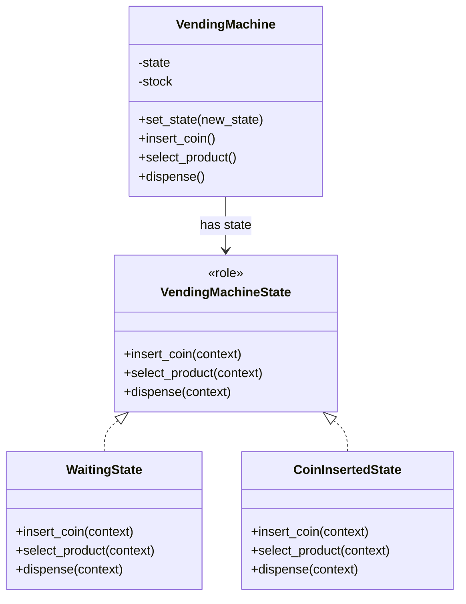

[@nqounet](https://x.com/nqounet)です。

前回で自動販売機シミュレーターが完成しました。



実は、私たちが作ってきた設計には名前があります。それがStateパターンです。

## Stateパターンとは

Stateパターン（ステートパターン）は、GoF（Gang of Four）のデザインパターンの1つです。

目的： オブジェクトの内部状態に応じて振る舞いを変える

私たちが作った自動販売機は、まさにこの目的を達成しています。

- 「待機中」のときは、コインを受け付ける
- 「コイン投入済み」のときは、商品を選べる
- 「払い出し中」のときは、商品を払い出す
- 「売り切れ」のときは、すべての操作を拒否する

同じ操作（例：`insert_coin`）でも、状態によって振る舞いが変わります。

## Stateパターンの構成要素

Stateパターンは、以下の3つの要素で構成されます。

| 要素 | 私たちの実装 | 役割 |
|------|------------|------|
| State | VendingMachineState | 状態の共通インターフェース |
| ConcreteState | WaitingState, CoinInsertedState, etc. | 具体的な状態クラス |
| Context | VendingMachine | 状態を保持し、操作を委譲する |



## Strategyパターンとの違い

以前のシリーズ「Mooを使ってデータエクスポーターを作ってみよう」で学んだStrategyパターンと、Stateパターンは似ています。

どちらも「振る舞いをカプセル化したオブジェクトを切り替える」という点では同じです。

しかし、本質的な違いがあります。

| 観点 | Strategyパターン | Stateパターン |
|------|-----------------|--------------|
| 切り替えの主体 | クライアント（外部）が選択 | オブジェクト自身が内部状態に応じて変更 |
| 状態遷移 | なし | あり（状態間の遷移ルールが存在） |
| Contextへの参照 | Strategyは通常Contextを知らない | StateはContextへの参照を持つ |
| 典型例 | CSV/JSON/YAMLへのエクスポート | 自動販売機の状態管理 |

Strategyパターンでは、クライアントが「どのStrategyを使うか」を決めます。

```perl
# Strategyパターン（データエクスポーター）
my $exporter = Exporter->new(strategy => CsvStrategy->new);
$exporter->export($data);  # CSV形式で出力

$exporter->set_strategy(JsonStrategy->new);  # 外部から切り替え
$exporter->export($data);  # JSON形式で出力
```

Stateパターンでは、State自身が「次にどの状態になるか」を決めます。

```perl
# Stateパターン（自動販売機）
my $vm = VendingMachine->new;
$vm->insert_coin;  # WaitingState → CoinInsertedState（内部で遷移）
$vm->select_product;  # CoinInsertedState → DispensingState（内部で遷移）
```

## 学んだ設計原則

このシリーズを通じて、以下の設計原則を学びました。

単一責任の原則（SRP）

各状態クラスは、その状態での振る舞いだけを知っています。

開放閉鎖原則（OCP）

SoldOutStateを追加するとき、既存のクラスをほとんど変更せずに済みました。

リスコフの置換原則（LSP）

すべての状態クラスはVendingMachineStateロールを持ち、同じインターフェースで使用できます。

依存性逆転の原則（DIP）

VendingMachineは具体的な状態クラスではなく、VendingMachineStateロール（インターフェース）に依存しています。

## 次のステップ

Stateパターンを学んだ今、次に挑戦できるパターンを紹介します。

Observerパターン

状態が変わったときに、外部に通知したい場合に使います。例えば、自動販売機の状態が変わったときにログを記録したり、UIを更新したりできます。

Mementoパターン

状態のスナップショットを保存・復元したい場合に使います。例えば、自動販売機の状態を保存して、後から復元できるようになります。

Commandパターン

操作自体をオブジェクトにするパターンです。「Mooを使ってTodo CLIを作ってみよう」シリーズで詳しく学べます。

## 自動販売機シミュレーターの設計図（最終版）

```perl
# Stateパターンの構成
#
# VendingMachineState（ロール）
#   - requires: insert_coin, select_product, dispense
#
# WaitingState, CoinInsertedState, DispensingState, SoldOutState
#   - with 'VendingMachineState'
#   - 各状態での振る舞いを実装
#   - $context->set_state() で状態遷移
#
# VendingMachine（Context）
#   - has state => (does => 'VendingMachineState')
#   - 操作を状態オブジェクトに委譲
```

## まとめ

- 私たちが作った設計はStateパターンです
- Stateパターンは、オブジェクトの内部状態に応じて振る舞いを変えるパターンです
- Strategyパターンとの違いは、「誰が切り替えるか」と「状態遷移があるか」です
- Stateパターンでは、State自身がContextへの参照を持ち、自ら次の状態へ遷移します
- SOLID原則の多くを自然に満たす設計になっています

## シリーズを終えて

「Mooを使って自動販売機シミュレーターを作ってみよう」シリーズ、全10回を読んでいただきありがとうございました。

このシリーズでは、if/elseによる素朴な実装から始めて、少しずつリファクタリングを重ね、最終的にStateパターンに到達しました。

デザインパターンは、先人たちが見つけた「うまくいく設計」の知恵です。名前を覚えることで、他のエンジニアとの会話がスムーズになります。

ぜひ、学んだことを自分のプロジェクトで活かしてみてください。

Happy Hacking!
