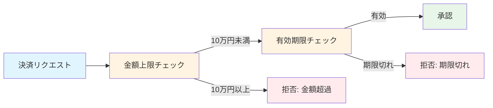

[@nqounet](https://x.com/nqounet)です。

「架空ECサイトで学ぶ決済審査システム」シリーズの第1回です。

シリーズ全体の目次はこちらをご覧ください。



このシリーズは、「Mooで覚えるオブジェクト指向プログラミング」シリーズの応用編です。まだ読んでいない方は、先にこちらをご覧ください。



今回から全3回にわたって、架空ECサイト「ペルマート」（Perl + Mart の造語です）の決済審査システムを開発していきます。

**注意**: このシリーズで扱う決済システムは学習用の架空システムです。実際の決済システムを開発する際は、PCI DSS などのセキュリティ基準を遵守してください。

## 決済審査とは

ECサイトでクレジットカード決済を行う際、いきなり決済処理を実行するわけではありません。まず「決済審査」というステップがあります。

決済審査では、以下のようなチェックを行います。

- 決済金額が上限を超えていないか
- カードの有効期限が切れていないか
- カードがブラックリストに登録されていないか

これらのチェックをすべて通過した場合のみ、実際の決済処理（オーソリゼーション）に進みます。

## シンプルな決済審査を書いてみる

まずは、金額上限チェックだけを行うシンプルなスクリプトを書いてみましょう。

```perl
# check_payment.pl
# Perl v5.36+, 外部依存なし

use v5.36;
use utf8;
use warnings;
binmode STDOUT, ':utf8';

sub check_payment ($request) {
    my $amount = $request->{amount} // 0;

    # 金額上限チェック（10万円以上は拒否）
    if ($amount >= 100_000) {
        say "拒否: 金額が上限（10万円）を超えています";
        return 0;
    }

    say "承認: 決済金額 $amount 円";
    return 1;
}

# テストしてみる
say "=== テスト1: 5万円の決済 ===";
check_payment({ amount => 50_000 });

say "\n=== テスト2: 10万円の決済 ===";
check_payment({ amount => 100_000 });

say "\n=== テスト3: 15万円の決済 ===";
check_payment({ amount => 150_000 });
```

実行すると、以下のような結果が表示されます。

```shell
perl check_payment.pl
```

```
=== テスト1: 5万円の決済 ===
承認: 決済金額 50000 円

=== テスト2: 10万円の決済 ===
拒否: 金額が上限（10万円）を超えています

=== テスト3: 15万円の決済 ===
拒否: 金額が上限（10万円）を超えています
```

動きましたね。金額が10万円以上の場合は拒否され、それ未満なら承認されます。

## コードのポイント

このコードにはいくつかのポイントがあります。

### 1. アンダースコアによる数値の可読性向上

`100_000` は `100000` と同じ値です。Perlでは数値リテラル内にアンダースコアを使って桁区切りができます。大きな金額を扱う際に便利です。

### 2. 早期リターン

拒否条件に該当した時点で `return 0` して関数を終了しています。これにより、ネストが深くならず、コードが読みやすくなります。

### 3. 決済リクエストはハッシュリファレンス

`$request` はハッシュリファレンスで渡しています。決済リクエストには金額だけでなく、カード情報や購入者情報なども含まれることを想定しています。

## 有効期限チェックを追加する

ペルマートの開発チームから「有効期限チェックも追加してほしい」という要望が来ました。if文を追加して対応しましょう。

```perl
# check_payment_v2.pl
# Perl v5.36+, 外部依存なし

use v5.36;
use utf8;
use warnings;
binmode STDOUT, ':utf8';

sub check_payment ($request) {
    my $amount     = $request->{amount} // 0;
    my $expiry_year  = $request->{expiry_year}  // 0;
    my $expiry_month = $request->{expiry_month} // 0;

    # 金額上限チェック（10万円以上は拒否）
    if ($amount >= 100_000) {
        say "拒否: 金額が上限（10万円）を超えています";
        return 0;
    }

    # 有効期限チェック
    my ($current_year, $current_month) = (localtime)[5,4];
    $current_year  += 1900;
    $current_month += 1;

    if ($expiry_year < $current_year) {
        say "拒否: カードの有効期限が切れています";
        return 0;
    }
    if ($expiry_year == $current_year && $expiry_month < $current_month) {
        say "拒否: カードの有効期限が切れています";
        return 0;
    }

    say "承認: 決済金額 $amount 円";
    return 1;
}

# テストしてみる（2026年1月時点を想定）
say "=== テスト1: 有効なカード ===";
check_payment({
    amount       => 50_000,
    expiry_year  => 2028,
    expiry_month => 12,
});

say "\n=== テスト2: 期限切れのカード ===";
check_payment({
    amount       => 50_000,
    expiry_year  => 2025,
    expiry_month => 6,
});

say "\n=== テスト3: 金額オーバー ===";
check_payment({
    amount       => 200_000,
    expiry_year  => 2028,
    expiry_month => 12,
});
```

実行結果を見てみましょう。

```
=== テスト1: 有効なカード ===
承認: 決済金額 50000 円

=== テスト2: 期限切れのカード ===
拒否: カードの有効期限が切れています

=== テスト3: 金額オーバー ===
拒否: 金額が上限（10万円）を超えています
```

有効期限チェックも正しく動いています。

有効期限チェックを追加すると、フローは以下のようになります。



2つのチェックを順番に通過することで、より厳密な審査が行えるようになりました。

## コードのポイント（追加分）

### localtime関数

`localtime` は現在時刻の各要素を配列で返します。インデックス5が「年（1900年からの経過年数）」、インデックス4が「月（0-11）」です。

```perl
my ($current_year, $current_month) = (localtime)[5,4];
$current_year  += 1900;  # 西暦に変換
$current_month += 1;     # 1-12に変換
```

これでシステム日付と比較して、カードの有効期限をチェックできます。

## まとめ

- 決済審査は決済処理の前に行うチェック処理である
- 金額上限チェックと有効期限チェックが基本的な審査項目である
- if文と早期リターンでシンプルに実装できる
- 決済リクエストはハッシュリファレンスで表現する

## 次回予告

今回は2つの審査条件をif文で実装しました。シンプルでわかりやすいですね。

しかし、ペルマートの開発が進むにつれて、審査条件はどんどん増えていきます。ブラックリストチェック、残高（利用枠）確認、不正利用検知ルール...

次回は、審査条件が増えてコードが複雑化する問題を体験します。if/elseのネストが深くなって保守が困難になる「あるある」な状況を見てみましょう。



## 完成コード

この回の完成コードを1つのスクリプトにまとめました。

```perl
#!/usr/bin/env perl
# payment-check-01.pl
# ペルマート決済審査（基本版）
# Perl v5.36+, 外部依存なし

use v5.36;
use utf8;
use warnings;
binmode STDOUT, ':utf8';

sub check_payment ($request) {
    my $amount       = $request->{amount}       // 0;
    my $expiry_year  = $request->{expiry_year}  // 0;
    my $expiry_month = $request->{expiry_month} // 0;

    # 金額上限チェック（10万円以上は拒否）
    if ($amount >= 100_000) {
        return { ok => 0, reason => '金額が上限（10万円）を超えています' };
    }

    # 有効期限チェック
    my ($current_year, $current_month) = (localtime)[5,4];
    $current_year  += 1900;
    $current_month += 1;

    if ($expiry_year < $current_year) {
        return { ok => 0, reason => 'カードの有効期限が切れています' };
    }
    if ($expiry_year == $current_year && $expiry_month < $current_month) {
        return { ok => 0, reason => 'カードの有効期限が切れています' };
    }

    return { ok => 1, amount => $amount };
}

# === 実行例 ===
my @test_cases = (
    { amount => 50_000,  expiry_year => 2028, expiry_month => 12 },  # 正常
    { amount => 50_000,  expiry_year => 2025, expiry_month => 6 },   # 期限切れ
    { amount => 200_000, expiry_year => 2028, expiry_month => 12 },  # 金額オーバー
);

for my $i (0 .. $#test_cases) {
    say "=== テスト" . ($i + 1) . " ===";
    my $result = check_payment($test_cases[$i]);

    if ($result->{ok}) {
        say "承認: 決済金額 $result->{amount} 円";
    }
    else {
        say "拒否: $result->{reason}";
    }
    say "";
}
```
