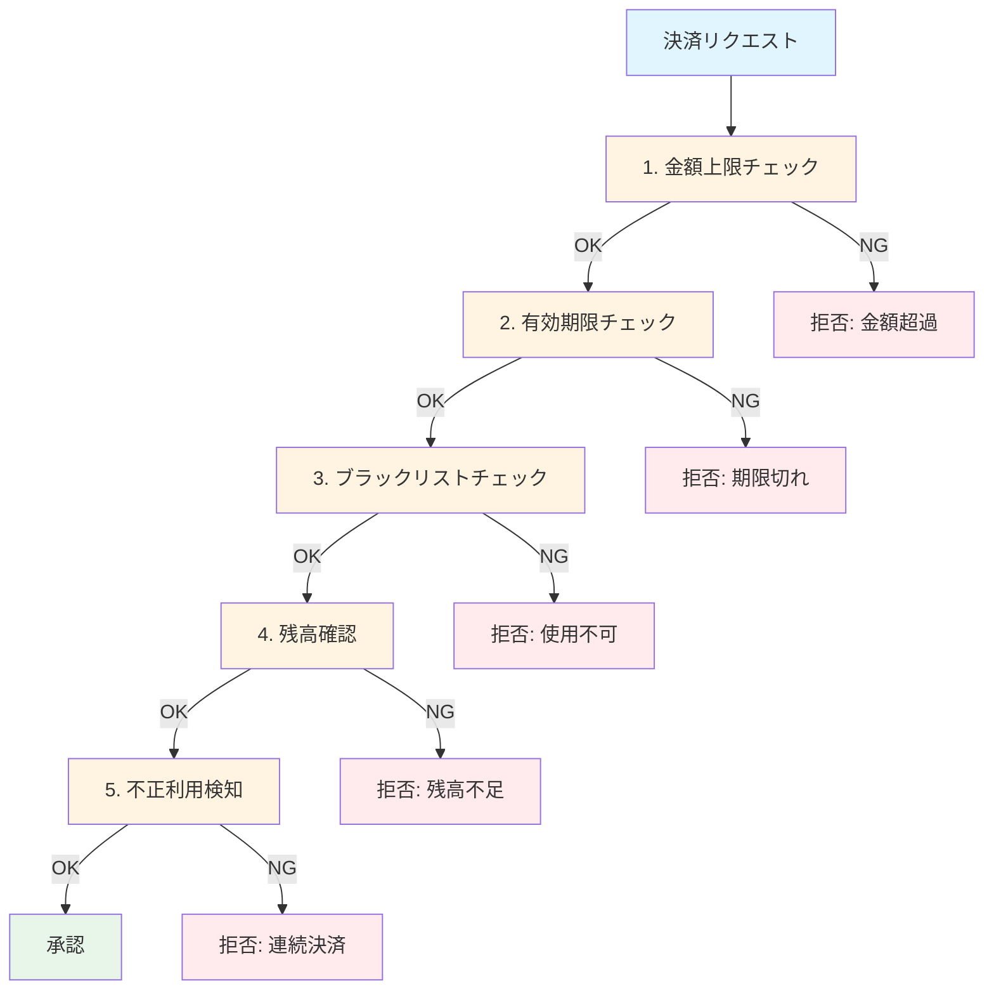

[@nqounet](https://x.com/nqounet)です。

「架空ECサイトで学ぶ決済審査システム」シリーズの第2回です。

シリーズ全体の目次はこちらをご覧ください。



前回は、金額上限チェックと有効期限チェックの2つの審査条件を実装しました。



今回は、審査条件が増えてコードが複雑化する問題を体験します。

**注意**: このシリーズで扱う決済システムは学習用の架空システムです。実際の決済システムを開発する際は、PCI DSS などのセキュリティ基準を遵守してください。

## ペルマートの要件追加

ペルマートの開発は順調に進み、サービスが成長してきました。それに伴い、セキュリティ強化のため新しい審査条件が次々と追加されることになりました。

追加される審査条件は以下の通りです。

1. ブラックリストチェック: 不正利用が確認されたカードを拒否
2. 残高（利用枠）確認: 決済金額が利用可能枠を超えていないかチェック
3. 不正利用検知: 短時間での連続決済を検知

「簡単簡単、if文を追加すればいいんでしょ？」と思いますよね。やってみましょう。

## 審査条件を5つに増やす

既存の2つに加えて、3つの審査条件を追加します。

審査条件が5つに増えると、フローはこのように複雑化します。



5つの審査が一直線に並び、1つでもNGなら拒否されます。

```perl
# check_payment_v3.pl
# Perl v5.36+, 外部依存なし

use v5.36;
use utf8;
use warnings;
binmode STDOUT, ':utf8';

# ブラックリスト（学習用のダミーデータ）
my @BLACKLIST = ('4111111111111111', '5500000000000004');

# 直近の決済履歴（学習用のダミーデータ）
my %RECENT_TRANSACTIONS = (
    '4111111111111111' => 3,   # 直近10分で3回決済
    '4242424242424242' => 1,   # 直近10分で1回決済
);

# 残高情報（学習用のダミーデータ）
my %AVAILABLE_BALANCE = (
    '4242424242424242' => 100_000,  # 利用可能枠10万円
    '5105105105105100' => 500_000,  # 利用可能枠50万円
);

sub check_payment ($request) {
    my $amount       = $request->{amount}       // 0;
    my $expiry_year  = $request->{expiry_year}  // 0;
    my $expiry_month = $request->{expiry_month} // 0;
    my $card_number  = $request->{card_number}  // '';

    # 1. 金額上限チェック（10万円以上は拒否）
    if ($amount >= 100_000) {
        say "拒否: 金額が上限（10万円）を超えています";
        return 0;
    }
    else {
        # 2. 有効期限チェック
        my ($current_year, $current_month) = (localtime)[5,4];
        $current_year  += 1900;
        $current_month += 1;

        if ($expiry_year < $current_year) {
            say "拒否: カードの有効期限が切れています";
            return 0;
        }
        elsif ($expiry_year == $current_year && $expiry_month < $current_month) {
            say "拒否: カードの有効期限が切れています";
            return 0;
        }
        else {
            # 3. ブラックリストチェック
            my $is_blacklisted = 0;
            for my $blacklisted_card (@BLACKLIST) {
                if ($card_number eq $blacklisted_card) {
                    $is_blacklisted = 1;
                    last;
                }
            }

            if ($is_blacklisted) {
                say "拒否: このカードは使用できません";
                return 0;
            }
            else {
                # 4. 残高（利用枠）確認
                my $balance = $AVAILABLE_BALANCE{$card_number} // 0;
                if ($balance < $amount) {
                    say "拒否: 利用可能枠が不足しています";
                    return 0;
                }
                else {
                    # 5. 不正利用検知（10分以内に3回以上の決済は拒否）
                    my $recent_count = $RECENT_TRANSACTIONS{$card_number} // 0;
                    if ($recent_count >= 3) {
                        say "拒否: 短時間での連続決済を検知しました";
                        return 0;
                    }
                    else {
                        say "承認: 決済金額 $amount 円";
                        return 1;
                    }
                }
            }
        }
    }
}

# テストしてみる
say "=== テスト1: 正常な決済 ===";
check_payment({
    amount       => 50_000,
    expiry_year  => 2028,
    expiry_month => 12,
    card_number  => '5105105105105100',
});

say "\n=== テスト2: ブラックリストのカード ===";
check_payment({
    amount       => 50_000,
    expiry_year  => 2028,
    expiry_month => 12,
    card_number  => '4111111111111111',
});

say "\n=== テスト3: 利用枠不足 ===";
check_payment({
    amount       => 80_000,
    expiry_year  => 2028,
    expiry_month => 12,
    card_number  => '4242424242424242',  # 利用可能枠10万円だが、残高不足とする
});
```

## コードを見て気づくこと

動作はしますが、コードを見てどう思いますか？

### 問題1: ネストが深い

if-else のネストが5段階になっています。新しい条件が追加されるたびに、既存のコードの中にさらにif文を追加していく必要があります。

```perl
if (条件1) {
    # 拒否
} else {
    if (条件2) {
        # 拒否
    } else {
        if (条件3) {
            # 拒否
        } else {
            # ... どんどん深くなる
        }
    }
}
```

### 問題2: 審査順序の変更が困難

「ブラックリストチェックを最初にしたい」という要件変更が来たらどうでしょう？コード全体を書き換える必要があります。

### 問題3: 個別のテストが困難

「残高確認だけをテストしたい」と思っても、その前の3つのチェック（金額上限、有効期限、ブラックリスト）を通過するテストデータを用意しなければなりません。

## 早期リターンで書き直してみる

「ネストが深いのは書き方の問題では？」と思った方、素晴らしい観察力です。早期リターンで書き直してみましょう。

```perl
# check_payment_v4.pl
# Perl v5.36+, 外部依存なし

use v5.36;
use utf8;
use warnings;
binmode STDOUT, ':utf8';

# （ダミーデータは省略、前のコードと同じ）
my @BLACKLIST = ('4111111111111111', '5500000000000004');
my %RECENT_TRANSACTIONS = (
    '4111111111111111' => 3,
    '4242424242424242' => 1,
);
my %AVAILABLE_BALANCE = (
    '4242424242424242' => 100_000,
    '5105105105105100' => 500_000,
);

sub check_payment ($request) {
    my $amount       = $request->{amount}       // 0;
    my $expiry_year  = $request->{expiry_year}  // 0;
    my $expiry_month = $request->{expiry_month} // 0;
    my $card_number  = $request->{card_number}  // '';

    # 1. 金額上限チェック
    if ($amount >= 100_000) {
        return { ok => 0, reason => '金額が上限を超えています' };
    }

    # 2. 有効期限チェック
    my ($current_year, $current_month) = (localtime)[5,4];
    $current_year  += 1900;
    $current_month += 1;
    if ($expiry_year < $current_year ||
        ($expiry_year == $current_year && $expiry_month < $current_month)) {
        return { ok => 0, reason => '有効期限が切れています' };
    }

    # 3. ブラックリストチェック
    for my $blacklisted_card (@BLACKLIST) {
        if ($card_number eq $blacklisted_card) {
            return { ok => 0, reason => 'このカードは使用できません' };
        }
    }

    # 4. 残高確認
    my $balance = $AVAILABLE_BALANCE{$card_number} // 0;
    if ($balance < $amount) {
        return { ok => 0, reason => '利用可能枠が不足しています' };
    }

    # 5. 不正利用検知
    my $recent_count = $RECENT_TRANSACTIONS{$card_number} // 0;
    if ($recent_count >= 3) {
        return { ok => 0, reason => '短時間での連続決済を検知しました' };
    }

    return { ok => 1, amount => $amount };
}
```

ネストは解消されました！しかし、まだ問題があります。

## 残る問題点

早期リターンでネストは解消されましたが、まだ重大な問題があります。これらの問題は、オブジェクト指向設計の原則である「SOLID原則」の観点から整理できます。

### 問題1: 単一責任原則（SRP）違反

`check_payment` 関数が複数の責任を持っています：

- 金額チェックの責任
- 有効期限チェックの責任
- ブラックリストチェックの責任
- 残高確認の責任
- 不正利用検知の責任

単一責任原則（Single Responsibility Principle）では「クラス（または関数）は1つの責任だけを持つべき」とされています。現在のコードは5つの責任を1つの関数に詰め込んでおり、明確なSRP違反です。

`check_payment` 関数が50行を超えています。審査条件が10個になったら100行以上になるでしょう。

### 問題2: 開放閉鎖原則（OCP）違反

新しい審査条件を追加するたびに、既存の `check_payment` 関数を編集する必要があります。これは開放閉鎖原則（Open-Closed Principle）の「拡張に対して開いているべき、修正に対して閉じているべき」という原則に違反しています。

理想的には、新しい審査ルールを追加する際に既存のコードを変更せず、新しいコードを追加するだけで対応できるべきです。

### 問題3: 再利用性がない

「金額上限チェックだけ別の場所で使いたい」と思っても、この関数から切り出すのは大変です。

### 問題4: 審査条件ごとのテストが書きにくい

例えば「不正利用検知だけをテストしたい」場合、前の4つのチェックを全て通過するテストデータを用意する必要があります。

```perl
# 不正利用検知のテストのために、
# 金額OK、有効期限OK、ブラックリストOK、残高OKのデータが必要...
my $test_data = {
    amount       => 50_000,       # 10万円未満でOK
    expiry_year  => 2028,         # 未来の日付でOK
    expiry_month => 12,
    card_number  => '4242424242424242',  # ブラックリストにない
    # さらに残高もセットアップ必要...
};
```

これは面倒ですし、テストデータの準備を間違えると、何をテストしているのかわからなくなります。

## まとめ

- 審査条件が増えるとif文のネストが深くなる
- 早期リターンでネストは解消できるが、根本的な問題は残る
- 1つの関数に全ロジックが集中すると保守が困難になる
- 個別の審査条件をテストしにくい
- 審査順序の変更や新ルール追加が大変

## 次回予告

ペルマートの決済審査コードは、このままでは保守困難です。審査条件は今後も増えていくでしょう。

次回は、この問題を解決するために、各審査ロジックを独立した「チェッカー」クラスに分割します。オブジェクト指向の力を借りて、拡張性のある決済審査システムを完成させましょう。



## 完成コード

この回の「問題を体験する」ためのコードです。次回で改善していきます。

```perl
#!/usr/bin/env perl
# payment-check-02.pl
# ペルマート決済審査（条件追加版）
# Perl v5.36+, 外部依存なし
# 
# このコードは「問題のあるコード」の例です。
# 次回の記事で改善方法を学びます。

use v5.36;
use utf8;
use warnings;
binmode STDOUT, ':utf8';

# ブラックリスト（学習用のダミーデータ）
my @BLACKLIST = ('4111111111111111', '5500000000000004');

# 直近の決済履歴（学習用のダミーデータ）
my %RECENT_TRANSACTIONS = (
    '4111111111111111' => 3,
    '4242424242424242' => 1,
);

# 残高情報（学習用のダミーデータ）
my %AVAILABLE_BALANCE = (
    '4242424242424242' => 100_000,
    '5105105105105100' => 500_000,
);

sub check_payment ($request) {
    my $amount       = $request->{amount}       // 0;
    my $expiry_year  = $request->{expiry_year}  // 0;
    my $expiry_month = $request->{expiry_month} // 0;
    my $card_number  = $request->{card_number}  // '';

    # 1. 金額上限チェック
    if ($amount >= 100_000) {
        return { ok => 0, reason => '金額が上限を超えています' };
    }

    # 2. 有効期限チェック
    my ($current_year, $current_month) = (localtime)[5,4];
    $current_year  += 1900;
    $current_month += 1;
    if ($expiry_year < $current_year ||
        ($expiry_year == $current_year && $expiry_month < $current_month)) {
        return { ok => 0, reason => '有効期限が切れています' };
    }

    # 3. ブラックリストチェック
    for my $blacklisted_card (@BLACKLIST) {
        if ($card_number eq $blacklisted_card) {
            return { ok => 0, reason => 'このカードは使用できません' };
        }
    }

    # 4. 残高確認
    my $balance = $AVAILABLE_BALANCE{$card_number} // 0;
    if ($balance < $amount) {
        return { ok => 0, reason => '利用可能枠が不足しています' };
    }

    # 5. 不正利用検知
    my $recent_count = $RECENT_TRANSACTIONS{$card_number} // 0;
    if ($recent_count >= 3) {
        return { ok => 0, reason => '短時間での連続決済を検知しました' };
    }

    return { ok => 1, amount => $amount };
}

# === 実行例 ===
my @test_cases = (
    {
        name         => '正常な決済',
        amount       => 50_000,
        expiry_year  => 2028,
        expiry_month => 12,
        card_number  => '5105105105105100',
    },
    {
        name         => '金額オーバー',
        amount       => 200_000,
        expiry_year  => 2028,
        expiry_month => 12,
        card_number  => '5105105105105100',
    },
    {
        name         => '期限切れ',
        amount       => 50_000,
        expiry_year  => 2025,
        expiry_month => 6,
        card_number  => '5105105105105100',
    },
    {
        name         => 'ブラックリスト',
        amount       => 50_000,
        expiry_year  => 2028,
        expiry_month => 12,
        card_number  => '4111111111111111',
    },
);

for my $test (@test_cases) {
    say "=== $test->{name} ===";
    my $result = check_payment($test);

    if ($result->{ok}) {
        say "承認: 決済金額 $result->{amount} 円";
    }
    else {
        say "拒否: $result->{reason}";
    }
    say "";
}
```
