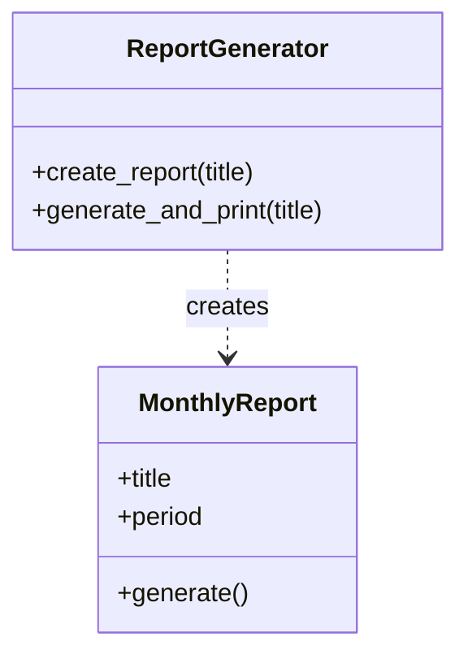

[@nqounet](https://x.com/nqounet)です。

## シリーズの概要

本シリーズ「PerlとMooでレポートジェネレーターを作ってみよう」では、全10回を通じて「レポートを自動生成するシステム」を作っていきます。

月次レポート、週次レポート、日次レポートなど、さまざまな種類のレポートを生成できる、拡張性の高いシステムを目指します。

シリーズを通じて、オブジェクト指向プログラミングの原則を深く学び、継承とオーバーライドを実践的に活用できるようになります。

### 対象読者

このシリーズは、以下のような方を対象としています。

- Perl入学式を卒業したばかりの方
- 「Mooで覚えるオブジェクト指向プログラミング」シリーズを読了した方
- Mooを使ったオブジェクト指向プログラミングをもっと実践したい方

### 前提知識

本シリーズを読み進めるにあたり、以下の知識があると理解がスムーズです。

- `has`と`sub`でクラスを定義する方法
- `new`でオブジェクトを生成する方法
- 基本的なPerlの文法（v5.36以降の機能を使用します）

これらの基礎は「Mooで覚えるオブジェクト指向プログラミング」シリーズで学べます。まだ読んでいない方は、ぜひ先にこちらをご覧ください。

### 動作環境

本シリーズのコード例は、以下の環境で動作確認しています。

- Perl v5.36以降
- Moo 2.x系



## 今回の目標

今回は、シリーズの土台となる「月次レポートを生成するクラス」を作成します。

具体的には、以下のことを行います。

- `MonthlyReport`クラスを作成する
- `ReportGenerator`クラスを作成する
- `create_report`メソッドでレポートを生成する

シンプルな構成ですが、これが今後の発展の土台になります。



この図は、今回作成する2つのクラスの関係を示しています。`ReportGenerator`が`MonthlyReport`を生成する、シンプルな構造です。

## ストーリー設定

あなたは、会社の業務システムを開発するプログラマーです。

上司から「毎月の売上をまとめた月次レポートを自動生成してほしい」と依頼されました。

まずは、月次レポートを生成するシンプルなプログラムを作ってみましょう。

## 実装

### コード例1: ReportGeneratorクラスとcreate_reportメソッド

それでは、実際にコードを書いていきます。まずは全体像を見てみましょう。

```perl
#!/usr/bin/env perl
use v5.36;

# ========================================
# MonthlyReport クラス
# ========================================
package MonthlyReport {
    use Moo;

    has title => (
        is       => 'ro',
        required => 1,
    );

    has period => (
        is      => 'ro',
        default => sub { '月次' },
    );

    sub generate ($self) {
        say "=== " . $self->title . " ===";
        say "期間: " . $self->period;
        say "レポートを生成しました。";
    }
}

# ========================================
# ReportGenerator クラス
# ========================================
package ReportGenerator {
    use Moo;

    sub create_report ($self, $title) {
        return MonthlyReport->new(title => $title);
    }

    sub generate_and_print ($self, $title) {
        my $report = $self->create_report($title);
        $report->generate();
        return $report;
    }
}

# ========================================
# メイン処理
# ========================================
package main;

my $generator = ReportGenerator->new();
$generator->generate_and_print("2026年1月 売上レポート");
```

コードの構成を説明します。

MonthlyReportクラス

- `title`: レポートのタイトルを保持する属性（必須）
- `period`: レポートの期間を表す属性（デフォルトは「月次」）
- `generate`: レポートを生成して画面に表示するメソッド

ReportGeneratorクラス

- `create_report`: MonthlyReportオブジェクトを生成して返すメソッド
- `generate_and_print`: レポートを生成して表示するメソッド

ポイントは、`ReportGenerator`クラスが`MonthlyReport`オブジェクトの生成を担当していることです。レポートを使いたいときは、`ReportGenerator`を通じて取得します。

### コード例2: 実行結果

上記のコードを実行すると、以下のように出力されます。

```
=== 2026年1月 売上レポート ===
期間: 月次
レポートを生成しました。
```

無事に月次レポートが生成されました！

`ReportGenerator`の`create_report`メソッドが`MonthlyReport`を生成し、`generate`メソッドでレポートの内容が表示されています。

## 今回のまとめ

今回は、レポートを生成する基本的な仕組みを作りました。

- `MonthlyReport`クラス: レポートの内容を表すクラス
- `ReportGenerator`クラス: レポートを生成するクラス
- `create_report`メソッド: 具体的なレポートオブジェクトを生成する

現時点では、`ReportGenerator`は`MonthlyReport`だけを生成しています。

しかし、次回以降で「週次レポートも作りたい」「日次レポートも必要」といった要望に対応していく中で、このシンプルな構造がどのように進化していくかを見ていきましょう。

## 次回予告

次回は「週次レポートも作りたい！」という新しい要望に対応します。

if/elseで生成するレポートを切り替えてみますが、そこで問題が発生します。

どんな問題が起こるのか、そしてどう解決していくのか、お楽しみに！


