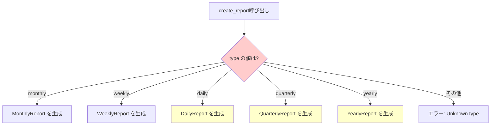

[@nqounet](https://x.com/nqounet)です。

## 前回の振り返り

前回は、月次レポートを生成する基本的な仕組みを作りました。

- `MonthlyReport`クラス: レポートの内容を表すクラス
- `ReportGenerator`クラス: レポートを生成するクラス
- `create_report`メソッド: 具体的なレポートオブジェクトを生成する



## 今回の目標

今回は「週次レポートも生成したい」という新しい要望に対応します。

具体的には、以下のことを行います。

- `WeeklyReport`クラスを新しく作成する
- `create_report`メソッドに引数を追加し、レポートの種類を切り替える
- if/elseで生成するレポートを切り替える

そして、この方法の問題点を確認します。

## ストーリー設定

上司から「週次レポートも欲しい」と依頼されました。

月次レポートだけでなく、週ごとの売上推移も確認したいとのことです。

「簡単そうだな」と思いながら、コードを修正してみましょう。

## 実装

### コード例1: if/elseでレポート種別を切り替えるコード

まず、`WeeklyReport`クラスを追加し、`create_report`メソッドで種別を切り替えます。

```perl
#!/usr/bin/env perl
use v5.36;

# ========================================
# MonthlyReport クラス
# ========================================
package MonthlyReport {
    use Moo;

    has title => (
        is       => 'ro',
        required => 1,
    );

    has period => (
        is      => 'ro',
        default => sub { '月次' },
    );

    sub generate ($self) {
        say "=== " . $self->title . " ===";
        say "期間: " . $self->period;
        say "月次レポートを生成しました。";
    }
}

# ========================================
# WeeklyReport クラス（新規追加）
# ========================================
package WeeklyReport {
    use Moo;

    has title => (
        is       => 'ro',
        required => 1,
    );

    has period => (
        is      => 'ro',
        default => sub { '週次' },
    );

    sub generate ($self) {
        say "=== " . $self->title . " ===";
        say "期間: " . $self->period;
        say "週次レポートを生成しました。";
    }
}

# ========================================
# ReportGenerator クラス
# ========================================
package ReportGenerator {
    use Moo;

    sub create_report ($self, $type, $title) {
        if ($type eq 'monthly') {
            return MonthlyReport->new(title => $title);
        }
        elsif ($type eq 'weekly') {
            return WeeklyReport->new(title => $title);
        }
        else {
            die "Unknown report type: $type";
        }
    }

    sub generate_and_print ($self, $type, $title) {
        my $report = $self->create_report($type, $title);
        $report->generate();
        return $report;
    }
}

# ========================================
# メイン処理
# ========================================
package main;

my $generator = ReportGenerator->new();

say "--- 月次レポート ---";
$generator->generate_and_print('monthly', "2026年1月 売上レポート");

say "";

say "--- 週次レポート ---";
$generator->generate_and_print('weekly', "2026年1月第1週 売上レポート");
```

実行結果は以下のようになります。

```
--- 月次レポート ---
=== 2026年1月 売上レポート ===
期間: 月次
月次レポートを生成しました。

--- 週次レポート ---
=== 2026年1月第1週 売上レポート ===
期間: 週次
週次レポートを生成しました。
```

無事に月次レポートと週次レポートの両方を生成できました！

### コード例2: 問題点の確認

一見うまくいっているように見えますが、問題があります。



この図のように、種別が増えるたびに分岐が増えていきます。

例えば、さらに「日次レポート」「四半期レポート」「年次レポート」が必要になったらどうなるでしょうか？

```perl
sub create_report ($self, $type, $title) {
    if ($type eq 'monthly') {
        return MonthlyReport->new(title => $title);
    }
    elsif ($type eq 'weekly') {
        return WeeklyReport->new(title => $title);
    }
    elsif ($type eq 'daily') {
        return DailyReport->new(title => $title);
    }
    elsif ($type eq 'quarterly') {
        return QuarterlyReport->new(title => $title);
    }
    elsif ($type eq 'yearly') {
        return YearlyReport->new(title => $title);
    }
    else {
        die "Unknown report type: $type";
    }
}
```

**問題点をまとめると**

- if/elseがどんどん長くなる
- 新しいレポート種別を追加するたびに`ReportGenerator`を修正する必要がある
- レポートの種類が増えると、コードが読みにくくなる
- 修正箇所が増えると、バグが入り込む可能性が高まる

これは「開放閉鎖原則」（Open-Closed Principle）に違反しています。

> 開放閉鎖原則: ソフトウェアの構成要素は「拡張に対しては開いていて、修正に対しては閉じている」べき

つまり、新しい機能を追加するときに、既存のコードを修正するのではなく、新しいコードを追加するだけで済むのが理想です。

## 今回のまとめ

今回は、週次レポートを追加するためにif/elseで種別を切り替える方法を試しました。

- `WeeklyReport`クラスを新規作成した
- `create_report`メソッドにtype引数を追加した
- if/elseでレポートの種類を切り替えた

しかし、この方法には問題があります。

- if/elseが肥大化する
- 新しい種別を追加するたびに既存コードを修正する必要がある
- 開放閉鎖原則に違反している

次回以降で、この問題を段階的に解決していきます。

## 次回予告

次回は「レポートの共通ルールを決めよう」として、レポートクラス間で共通のルールを定義します。

Moo::Roleを使って、すべてのレポートが持つべきメソッドを強制する方法を学びましょう。


