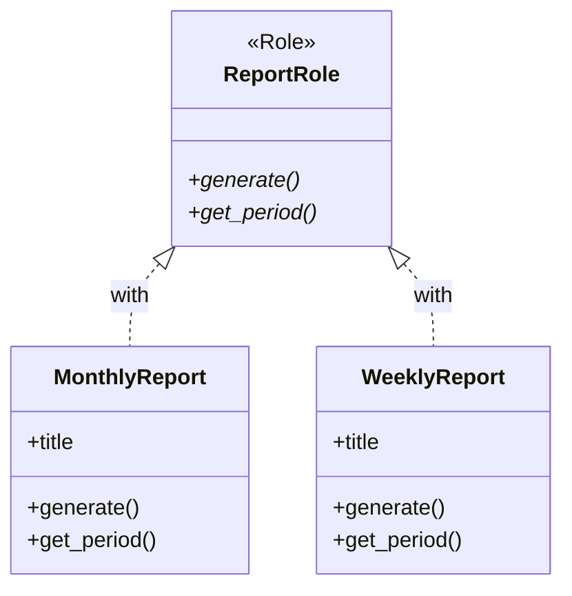

[@nqounet](https://x.com/nqounet)です。

## 前回の振り返り

前回は、週次レポートを追加するためにif/elseで種別を切り替える方法を試しました。

しかし、この方法には問題がありました。

- if/elseが肥大化する
- 新しい種別を追加するたびに既存コードを修正する必要がある
- 開放閉鎖原則に違反している



## 今回の目標

今回は、レポートクラスに共通のルールを定義します。

具体的には、以下のことを行います。

- `ReportRole`というロールを作成する
- すべてのレポートクラスが`generate`メソッドを持つことを強制する
- 各レポートクラスに`with`でロールを適用する

これにより、新しいレポートクラスを作成するときに「何を実装すべきか」が明確になります。



この図は、`ReportRole`がインターフェースとして機能し、各レポートクラスがそのロールを適用（`with`）している関係を示しています。

## ストーリー設定

上司から「レポートのフォーマットを統一したい」と言われました。

現状、`MonthlyReport`と`WeeklyReport`は似たようなメソッドを持っていますが、明確なルールがありません。

将来、別の人が新しいレポートクラスを作るときに「何を実装すればいいか」がわかるように、共通のルールを定義しましょう。

## 実装

### コード例1: ReportRoleの作成

まず、すべてのレポートが持つべきメソッドを定義したロールを作成します。

```perl
#!/usr/bin/env perl
use v5.36;

# ========================================
# ReportRole ロール（新規追加）
# ========================================
package ReportRole {
    use Moo::Role;

    # このロールを適用するクラスは、
    # 以下のメソッドを必ず実装しなければならない
    requires 'generate';
    requires 'get_period';
}

# ========================================
# MonthlyReport クラス
# ========================================
package MonthlyReport {
    use Moo;
    with 'ReportRole';  # ロールを適用

    has title => (
        is       => 'ro',
        required => 1,
    );

    sub generate ($self) {
        say "=== " . $self->title . " ===";
        say "期間: " . $self->get_period();
        say "月次レポートを生成しました。";
    }

    sub get_period ($self) {
        return '月次';
    }
}

# ========================================
# WeeklyReport クラス
# ========================================
package WeeklyReport {
    use Moo;
    with 'ReportRole';  # ロールを適用

    has title => (
        is       => 'ro',
        required => 1,
    );

    sub generate ($self) {
        say "=== " . $self->title . " ===";
        say "期間: " . $self->get_period();
        say "週次レポートを生成しました。";
    }

    sub get_period ($self) {
        return '週次';
    }
}

# ========================================
# ReportGenerator クラス
# ========================================
package ReportGenerator {
    use Moo;

    sub create_report ($self, $type, $title) {
        if ($type eq 'monthly') {
            return MonthlyReport->new(title => $title);
        }
        elsif ($type eq 'weekly') {
            return WeeklyReport->new(title => $title);
        }
        else {
            die "Unknown report type: $type";
        }
    }

    sub generate_and_print ($self, $type, $title) {
        my $report = $self->create_report($type, $title);
        $report->generate();
        return $report;
    }
}

# ========================================
# メイン処理
# ========================================
package main;

my $generator = ReportGenerator->new();

say "--- 月次レポート ---";
$generator->generate_and_print('monthly', "2026年1月 売上レポート");

say "";

say "--- 週次レポート ---";
$generator->generate_and_print('weekly', "2026年1月第1週 売上レポート");
```

`ReportRole`では`requires`を使って、このロールを適用するクラスが必ず実装すべきメソッドを宣言しています。

- `generate`: レポートを生成するメソッド
- `get_period`: レポートの期間を返すメソッド

Moo::Roleについて詳しくは、以下の記事をご覧ください。



### コード例2: ロールを実装しないとエラーになる

`ReportRole`を適用したクラスが必要なメソッドを実装していない場合、エラーになります。

試しに、`get_period`を実装しないクラスを作ってみましょう。

```perl
package BrokenReport {
    use Moo;
    with 'ReportRole';  # ロールを適用

    has title => (
        is       => 'ro',
        required => 1,
    );

    sub generate ($self) {
        say "壊れたレポート";
    }

    # get_period を実装していない！
}
```

このコードを実行すると、以下のようなエラーが発生します。

```
Can't apply ReportRole to BrokenReport - missing get_period at ...
```

`requires`で宣言したメソッドを実装していないため、ロールの適用に失敗しています。

これにより、新しいレポートクラスを作成する人が「何を実装すべきか」を忘れることを防げます。

## Moo::Roleの利点

ロールを使うことで、以下の利点があります。

- 契約の明示: どのメソッドが必要かが明確になる
- コンパイル時チェック: 実装漏れを早期に発見できる
- ドキュメントの役割: コードを読むだけでインターフェースがわかる

これは「インターフェース」や「抽象クラス」に似た概念です。JavaやTypeScriptを知っている人にはおなじみかもしれません。

## 今回のまとめ

今回は、レポートクラスに共通のルールを定義しました。

- `ReportRole`を作成し、`requires`で必須メソッドを宣言した
- `MonthlyReport`と`WeeklyReport`に`with`でロールを適用した
- ロールを実装しないとエラーになることを確認した

これで「レポートとして必要なメソッド」が明確になりました。

ただし、まだif/elseの問題は解決していません。次回以降で、この問題に取り組んでいきます。

## 次回予告

次回は「ジェネレーターを種別ごとに分けよう」として、継承を使ってif/elseの問題を解決します。

`extends`を使って`MonthlyReportGenerator`や`WeeklyReportGenerator`を作成し、コードを整理していきましょう。


