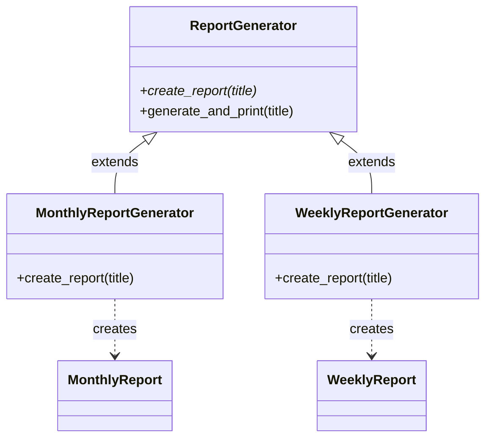

[@nqounet](https://x.com/nqounet)です。

## 前回の振り返り

前回は、レポートクラスに共通のルールを定義しました。

- `ReportRole`を作成し、`requires`で必須メソッドを宣言した
- `MonthlyReport`と`WeeklyReport`に`with`でロールを適用した
- ロールを実装しないとエラーになることを確認した



しかし、まだif/elseの問題は解決していませんでした。

## 今回の目標

今回は、継承を使ってジェネレーターを種別ごとに分けます。

具体的には、以下のことを行います。

- `ReportGenerator`を基底クラスとして整理する
- `MonthlyReportGenerator`クラスを作成する
- `WeeklyReportGenerator`クラスを作成する

これにより、if/elseを使わずにレポートの種類を切り替えられるようになります。



この図は、`ReportGenerator`基底クラスを継承（`extends`）した2つのサブクラスが、それぞれ対応するレポートを生成する構造を示しています。

## ストーリー設定

if/elseが増えてきて、コードが読みにくくなってきました。

「月次レポートの生成処理」と「週次レポートの生成処理」を分離して、それぞれ専用のジェネレーターを作ることにしましょう。

## 実装

### コード例1: ReportGenerator基底クラスの整理

まず、`ReportGenerator`を基底クラスとして整理します。

```perl
#!/usr/bin/env perl
use v5.36;

# ========================================
# ReportRole ロール
# ========================================
package ReportRole {
    use Moo::Role;

    requires 'generate';
    requires 'get_period';
}

# ========================================
# MonthlyReport クラス
# ========================================
package MonthlyReport {
    use Moo;
    with 'ReportRole';

    has title => (
        is       => 'ro',
        required => 1,
    );

    sub generate ($self) {
        say "=== " . $self->title . " ===";
        say "期間: " . $self->get_period();
        say "月次レポートを生成しました。";
    }

    sub get_period ($self) {
        return '月次';
    }
}

# ========================================
# WeeklyReport クラス
# ========================================
package WeeklyReport {
    use Moo;
    with 'ReportRole';

    has title => (
        is       => 'ro',
        required => 1,
    );

    sub generate ($self) {
        say "=== " . $self->title . " ===";
        say "期間: " . $self->get_period();
        say "週次レポートを生成しました。";
    }

    sub get_period ($self) {
        return '週次';
    }
}

# ========================================
# ReportGenerator 基底クラス
# ========================================
package ReportGenerator {
    use Moo;

    # サブクラスでオーバーライドするメソッド
    sub create_report ($self, $title) {
        die "create_report() must be implemented by subclass";
    }

    # 共通の処理
    sub generate_and_print ($self, $title) {
        my $report = $self->create_report($title);
        $report->generate();
        return $report;
    }
}

# ========================================
# MonthlyReportGenerator クラス
# ========================================
package MonthlyReportGenerator {
    use Moo;
    extends 'ReportGenerator';  # 継承

    sub create_report ($self, $title) {
        return MonthlyReport->new(title => $title);
    }
}

# ========================================
# WeeklyReportGenerator クラス
# ========================================
package WeeklyReportGenerator {
    use Moo;
    extends 'ReportGenerator';  # 継承

    sub create_report ($self, $title) {
        return WeeklyReport->new(title => $title);
    }
}

# ========================================
# メイン処理
# ========================================
package main;

say "--- 月次レポート ---";
my $monthly_generator = MonthlyReportGenerator->new();
$monthly_generator->generate_and_print("2026年1月 売上レポート");

say "";

say "--- 週次レポート ---";
my $weekly_generator = WeeklyReportGenerator->new();
$weekly_generator->generate_and_print("2026年1月第1週 売上レポート");
```

大きな変更点は以下の通りです。

- `ReportGenerator`は基底クラスになり、`create_report`メソッドは「サブクラスで実装すべき」というエラーを出す
- `MonthlyReportGenerator`は`extends`で`ReportGenerator`を継承し、`create_report`をオーバーライド
- `WeeklyReportGenerator`も同様に継承とオーバーライド

継承について詳しくは、前提知識のシリーズなどをご覧ください。



### コード例2: 実行結果の確認

実行結果は前回と同じです。

```
--- 月次レポート ---
=== 2026年1月 売上レポート ===
期間: 月次
月次レポートを生成しました。

--- 週次レポート ---
=== 2026年1月第1週 売上レポート ===
期間: 週次
週次レポートを生成しました。
```

重要なポイントは、if/elseがなくなったことです。

レポートの種類に応じて、適切なジェネレーターを使うだけです。

```perl
# 月次レポートが欲しいとき
my $generator = MonthlyReportGenerator->new();

# 週次レポートが欲しいとき
my $generator = WeeklyReportGenerator->new();
```

## 継承による設計のメリット

この設計には以下のメリットがあります。

- if/elseが不要: 種別に応じたジェネレーターを選ぶだけ
- 責任の分離: 各ジェネレーターは自分が担当するレポートだけを知っている
- 拡張が容易: 新しいレポート種別を追加するときは、新しいジェネレーターを作るだけ

## 今回のまとめ

今回は、継承を使ってジェネレーターを種別ごとに分けました。

- `ReportGenerator`を基底クラスとして整理した
- `MonthlyReportGenerator`を作成し、`create_report`を実装した
- `WeeklyReportGenerator`を作成し、`create_report`を実装した
- if/elseが不要になった

これで、if/elseの肥大化問題は解決しました。

しかし、まだ`create_report`メソッドの実装方法に改善の余地があります。次回は、このメソッドのオーバーライドについて詳しく見ていきます。

## 次回予告

次回は「生成処理をオーバーライドしよう」として、各ジェネレーターで`create_report`をオーバーライドする仕組みを詳しく解説します。

さらに`DailyReportGenerator`も追加して、拡張性を確認しましょう。


