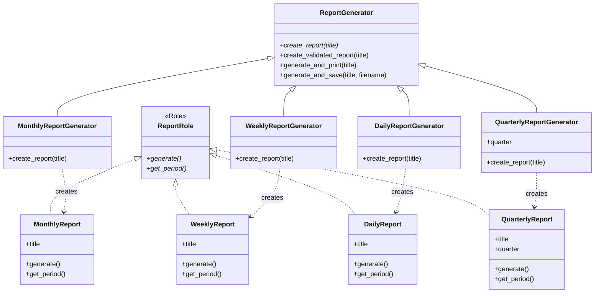

[@nqounet](https://x.com/nqounet)です。

## 前回の振り返り

前回は、`create_report`の戻り値を検証する仕組みを追加しました。

- `create_validated_report`メソッドで型チェックを行う
- `does`を使って`ReportRole`を持つことを確認する
- 型エラーが発生した場合は例外をスローする



## 今回の目標

今回は、四半期レポートを追加して、この設計の拡張性を確認します。

具体的には、以下のことを行います。

- `QuarterlyReport`クラスを新規作成する
- `QuarterlyReportGenerator`クラスを新規作成する
- 既存のコードを一切修正せずに機能を追加する

## ストーリー設定

経営陣から「四半期ごとの業績レポートも欲しい」と依頼されました。

これまで作ってきたレポートジェネレーターに、四半期レポートを追加します。

既存の月次・週次・日次レポートに影響を与えずに、新しい機能を追加できるでしょうか？

## 実装

### コード例1: QuarterlyReportクラスの追加

まず、四半期レポートのクラスを新しく作成します。

```perl
#!/usr/bin/env perl
use v5.36;

# ========================================
# ReportRole ロール
# ========================================
package ReportRole {
    use Moo::Role;

    requires 'generate';
    requires 'get_period';
}

# ========================================
# MonthlyReport クラス（既存・変更なし）
# ========================================
package MonthlyReport {
    use Moo;
    with 'ReportRole';

    has title => (
        is       => 'ro',
        required => 1,
    );

    sub generate ($self) {
        my @lines = (
            "=== " . $self->title . " ===",
            "期間: " . $self->get_period(),
            "月次レポートを生成しました。",
        );
        return join("\n", @lines);
    }

    sub get_period ($self) {
        return '月次';
    }
}

# ========================================
# WeeklyReport クラス（既存・変更なし）
# ========================================
package WeeklyReport {
    use Moo;
    with 'ReportRole';

    has title => (
        is       => 'ro',
        required => 1,
    );

    sub generate ($self) {
        my @lines = (
            "=== " . $self->title . " ===",
            "期間: " . $self->get_period(),
            "週次レポートを生成しました。",
        );
        return join("\n", @lines);
    }

    sub get_period ($self) {
        return '週次';
    }
}

# ========================================
# DailyReport クラス（既存・変更なし）
# ========================================
package DailyReport {
    use Moo;
    with 'ReportRole';

    has title => (
        is       => 'ro',
        required => 1,
    );

    sub generate ($self) {
        my @lines = (
            "=== " . $self->title . " ===",
            "期間: " . $self->get_period(),
            "日次レポートを生成しました。",
        );
        return join("\n", @lines);
    }

    sub get_period ($self) {
        return '日次';
    }
}

# ========================================
# QuarterlyReport クラス（★新規追加★）
# ========================================
package QuarterlyReport {
    use Moo;
    with 'ReportRole';

    has title => (
        is       => 'ro',
        required => 1,
    );

    has quarter => (
        is       => 'ro',
        required => 1,
    );

    sub generate ($self) {
        my @lines = (
            "=== " . $self->title . " ===",
            "期間: " . $self->get_period(),
            "四半期: Q" . $self->quarter,
            "四半期レポートを生成しました。",
        );
        return join("\n", @lines);
    }

    sub get_period ($self) {
        return '四半期';
    }
}

# ========================================
# ReportGenerator 基底クラス（既存・変更なし）
# ========================================
package ReportGenerator {
    use Moo;
    use Scalar::Util qw(blessed);

    sub create_report ($self, $title) {
        die "create_report() must be implemented by subclass";
    }

    sub create_validated_report ($self, $title) {
        my $report = $self->create_report($title);

        unless (blessed($report) && $report->does('ReportRole')) {
            die "create_report() must return an object that does ReportRole";
        }

        return $report;
    }

    sub generate_and_print ($self, $title) {
        my $report = $self->create_validated_report($title);
        my $content = $report->generate();
        say $content;
        return $report;
    }

    sub generate_and_save ($self, $title, $filename) {
        my $report = $self->create_validated_report($title);
        my $content = $report->generate();

        say $content;
        say "";
        say "[保存] $filename に保存しました。";

        return $report;
    }
}

# ========================================
# MonthlyReportGenerator クラス（既存・変更なし）
# ========================================
package MonthlyReportGenerator {
    use Moo;
    extends 'ReportGenerator';

    sub create_report ($self, $title) {
        return MonthlyReport->new(title => $title);
    }
}

# ========================================
# WeeklyReportGenerator クラス（既存・変更なし）
# ========================================
package WeeklyReportGenerator {
    use Moo;
    extends 'ReportGenerator';

    sub create_report ($self, $title) {
        return WeeklyReport->new(title => $title);
    }
}

# ========================================
# DailyReportGenerator クラス（既存・変更なし）
# ========================================
package DailyReportGenerator {
    use Moo;
    extends 'ReportGenerator';

    sub create_report ($self, $title) {
        return DailyReport->new(title => $title);
    }
}

# ========================================
# QuarterlyReportGenerator クラス（★新規追加★）
# ========================================
package QuarterlyReportGenerator {
    use Moo;
    extends 'ReportGenerator';

    has quarter => (
        is       => 'ro',
        required => 1,
    );

    sub create_report ($self, $title) {
        return QuarterlyReport->new(
            title   => $title,
            quarter => $self->quarter,
        );
    }
}

# ========================================
# メイン処理
# ========================================
package main;

say "=== 全種類のレポート生成 ===";
say "";

say "--- 月次レポート ---";
my $monthly = MonthlyReportGenerator->new();
$monthly->generate_and_print("2026年1月 売上レポート");

say "";

say "--- 週次レポート ---";
my $weekly = WeeklyReportGenerator->new();
$weekly->generate_and_print("2026年1月第1週 売上レポート");

say "";

say "--- 日次レポート ---";
my $daily = DailyReportGenerator->new();
$daily->generate_and_print("2026年1月9日 売上レポート");

say "";

say "--- 四半期レポート（★新規★）---";
my $quarterly = QuarterlyReportGenerator->new(quarter => 1);
$quarterly->generate_and_print("2026年度Q1 業績レポート");
```

### コード例2: 実行結果の確認

実行結果は以下のようになります。

```
=== 全種類のレポート生成 ===

--- 月次レポート ---
=== 2026年1月 売上レポート ===
期間: 月次
月次レポートを生成しました。

--- 週次レポート ---
=== 2026年1月第1週 売上レポート ===
期間: 週次
週次レポートを生成しました。

--- 日次レポート ---
=== 2026年1月9日 売上レポート ===
期間: 日次
日次レポートを生成しました。

--- 四半期レポート（★新規★）---
=== 2026年度Q1 業績レポート ===
期間: 四半期
四半期: Q1
四半期レポートを生成しました。
```

四半期レポートが追加されました！

## 開放閉鎖原則（OCP）の実証



今回、四半期レポートを追加しましたが、**既存のコードは一切修正していません**。

修正していないクラス/コード:

- `ReportRole`（ロール）
- `MonthlyReport`, `WeeklyReport`, `DailyReport`（既存のレポートクラス）
- `ReportGenerator`（基底クラス）
- `MonthlyReportGenerator`, `WeeklyReportGenerator`, `DailyReportGenerator`（既存のジェネレーター）

追加しただけのクラス/コード:

- `QuarterlyReport`（新しいレポートクラス）
- `QuarterlyReportGenerator`（新しいジェネレーター）

これが**開放閉鎖原則（Open-Closed Principle）**です。

> **開放閉鎖原則**: ソフトウェアの構成要素は「拡張に対しては開いていて、修正に対しては閉じている」べき

- **拡張に対して開いている**: 新しいレポート種別を追加できる
- **修正に対して閉じている**: 既存のコードを修正する必要がない

## 第2回との比較

第2回では、if/elseで種別を切り替えていました。

```perl
# 第2回のコード（if/else方式）
sub create_report ($self, $type, $title) {
    if ($type eq 'monthly') {
        return MonthlyReport->new(title => $title);
    }
    elsif ($type eq 'weekly') {
        return WeeklyReport->new(title => $title);
    }
    elsif ($type eq 'quarterly') {  # ← 追加
        return QuarterlyReport->new(title => $title);
    }
    # ...
}
```

この方式だと、新しい種別を追加するたびに`ReportGenerator`を修正する必要がありました。

今回の方式では、新しいクラスを追加するだけで済みます。

## 今回のまとめ

今回は、四半期レポートを追加して、開放閉鎖原則を実証しました。

- `QuarterlyReport`クラスを新規作成した
- `QuarterlyReportGenerator`クラスを新規作成した
- 既存のコードを一切修正せずに機能を追加できた

この設計により、将来「年次レポート」「半期レポート」などが必要になっても、同じ方法で拡張できます。

## 次回予告

次回は「完成！レポートジェネレーター」として、全機能を統合してレポートジェネレーターを完成させます。

月次・週次・日次・四半期レポートを生成できる、拡張性の高いシステムの全体像をお見せします。


