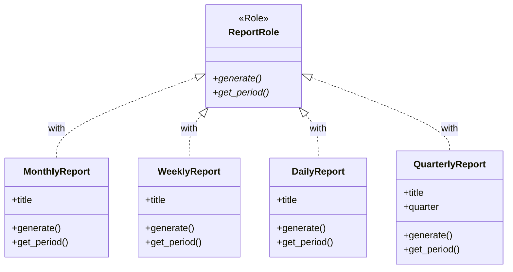
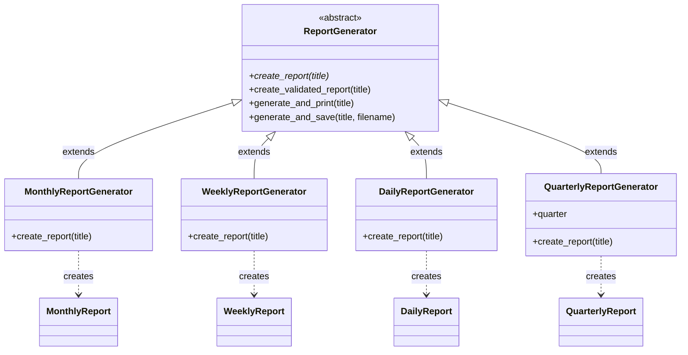

[@nqounet](https://x.com/nqounet)です。

## 前回の振り返り

前回は、四半期レポートを追加して、開放閉鎖原則を実証しました。

- `QuarterlyReport`クラスを新規作成した
- `QuarterlyReportGenerator`クラスを新規作成した
- 既存のコードを一切修正せずに機能を追加できた



## 今回の目標

今回は、これまで作ってきた全ての機能を統合して、レポートジェネレーターを完成させます。

具体的には、以下のことを行います。

- 完成したクラス群の全体像を確認する
- 各種レポートの生成例を実行する
- 設計の振り返りと今後の拡張について考える

## シリーズの振り返り

これまでの流れを振り返ってみましょう。

| 回 | 何をしたか |
|---|----------|
| 第1回 | 月次レポートを生成する基本クラスを作成 |
| 第2回 | 週次レポートを追加（if/elseで切り替え）→ 問題発覚 |
| 第3回 | `ReportRole`で共通ルールを定義 |
| 第4回 | 継承でジェネレーターを種別ごとに分離 |
| 第5回 | `create_report`をオーバーライドして生成処理を実装 |
| 第6回 | 基底クラスに共通処理を集約 |
| 第7回 | `isa`で型チェックを追加 |
| 第8回 | 四半期レポートを追加して拡張性を実証 |

## 完成コード

### コード例1: 完成したクラス群の全体像

```perl
#!/usr/bin/env perl
use v5.36;

# ========================================
# ReportRole ロール
# すべてのレポートが持つべきメソッドを定義
# ========================================
package ReportRole {
    use Moo::Role;

    requires 'generate';
    requires 'get_period';
}

# ========================================
# MonthlyReport クラス
# ========================================
package MonthlyReport {
    use Moo;
    with 'ReportRole';

    has title => (
        is       => 'ro',
        required => 1,
    );

    sub generate ($self) {
        my @lines = (
            "╔══════════════════════════════════════╗",
            "║ " . $self->title,
            "╠══════════════════════════════════════╣",
            "║ 期間: " . $self->get_period(),
            "║ 種別: 月次売上レポート",
            "╚══════════════════════════════════════╝",
        );
        return join("\n", @lines);
    }

    sub get_period ($self) {
        return '月次';
    }
}

# ========================================
# WeeklyReport クラス
# ========================================
package WeeklyReport {
    use Moo;
    with 'ReportRole';

    has title => (
        is       => 'ro',
        required => 1,
    );

    sub generate ($self) {
        my @lines = (
            "┌──────────────────────────────────────┐",
            "│ " . $self->title,
            "├──────────────────────────────────────┤",
            "│ 期間: " . $self->get_period(),
            "│ 種別: 週次売上レポート",
            "└──────────────────────────────────────┘",
        );
        return join("\n", @lines);
    }

    sub get_period ($self) {
        return '週次';
    }
}

# ========================================
# DailyReport クラス
# ========================================
package DailyReport {
    use Moo;
    with 'ReportRole';

    has title => (
        is       => 'ro',
        required => 1,
    );

    sub generate ($self) {
        my @lines = (
            "+-----------------------------------------+",
            "| " . $self->title,
            "+-----------------------------------------+",
            "| 期間: " . $self->get_period(),
            "| 種別: 日次売上レポート",
            "+-----------------------------------------+",
        );
        return join("\n", @lines);
    }

    sub get_period ($self) {
        return '日次';
    }
}

# ========================================
# QuarterlyReport クラス
# ========================================
package QuarterlyReport {
    use Moo;
    with 'ReportRole';

    has title => (
        is       => 'ro',
        required => 1,
    );

    has quarter => (
        is       => 'ro',
        required => 1,
    );

    sub generate ($self) {
        my @lines = (
            "╔══════════════════════════════════════════╗",
            "║ " . $self->title,
            "╠══════════════════════════════════════════╣",
            "║ 期間: " . $self->get_period(),
            "║ 四半期: Q" . $self->quarter,
            "║ 種別: 四半期業績レポート",
            "╚══════════════════════════════════════════╝",
        );
        return join("\n", @lines);
    }

    sub get_period ($self) {
        return '四半期';
    }
}

# ========================================
# ReportGenerator 基底クラス
# ========================================
package ReportGenerator {
    use Moo;
    use Scalar::Util qw(blessed);

    sub create_report ($self, $title) {
        die "create_report() must be implemented by subclass";
    }

    sub create_validated_report ($self, $title) {
        my $report = $self->create_report($title);

        unless (blessed($report) && $report->does('ReportRole')) {
            die "create_report() must return an object that does ReportRole";
        }

        return $report;
    }

    sub generate_and_print ($self, $title) {
        my $report = $self->create_validated_report($title);
        my $content = $report->generate();
        say $content;
        return $report;
    }

    sub generate_and_save ($self, $title, $filename) {
        my $report = $self->create_validated_report($title);
        my $content = $report->generate();

        say $content;
        say "";
        say "[INFO] ファイル '$filename' に保存しました。";

        return $report;
    }
}

# ========================================
# MonthlyReportGenerator クラス
# ========================================
package MonthlyReportGenerator {
    use Moo;
    extends 'ReportGenerator';

    sub create_report ($self, $title) {
        return MonthlyReport->new(title => $title);
    }
}

# ========================================
# WeeklyReportGenerator クラス
# ========================================
package WeeklyReportGenerator {
    use Moo;
    extends 'ReportGenerator';

    sub create_report ($self, $title) {
        return WeeklyReport->new(title => $title);
    }
}

# ========================================
# DailyReportGenerator クラス
# ========================================
package DailyReportGenerator {
    use Moo;
    extends 'ReportGenerator';

    sub create_report ($self, $title) {
        return DailyReport->new(title => $title);
    }
}

# ========================================
# QuarterlyReportGenerator クラス
# ========================================
package QuarterlyReportGenerator {
    use Moo;
    extends 'ReportGenerator';

    has quarter => (
        is       => 'ro',
        required => 1,
    );

    sub create_report ($self, $title) {
        return QuarterlyReport->new(
            title   => $title,
            quarter => $self->quarter,
        );
    }
}

# ========================================
# メイン処理
# ========================================
package main;

say "=" x 50;
say " レポートジェネレーター v1.0";
say " 月次・週次・日次・四半期レポートに対応";
say "=" x 50;
say "";

# 月次レポート
say "[1] 月次レポートを生成中...";
my $monthly = MonthlyReportGenerator->new();
$monthly->generate_and_print("2026年1月 売上レポート");
say "";

# 週次レポート
say "[2] 週次レポートを生成中...";
my $weekly = WeeklyReportGenerator->new();
$weekly->generate_and_print("2026年1月 第1週 売上レポート");
say "";

# 日次レポート
say "[3] 日次レポートを生成中...";
my $daily = DailyReportGenerator->new();
$daily->generate_and_print("2026年1月9日 売上レポート");
say "";

# 四半期レポート
say "[4] 四半期レポートを生成中...";
my $q1 = QuarterlyReportGenerator->new(quarter => 1);
$q1->generate_and_print("2026年度 Q1 業績レポート");
say "";

say "=" x 50;
say " すべてのレポートが正常に生成されました！";
say "=" x 50;
```

### コード例2: 実行結果

```
==================================================
 レポートジェネレーター v1.0
 月次・週次・日次・四半期レポートに対応
==================================================

[1] 月次レポートを生成中...
╔══════════════════════════════════════╗
║ 2026年1月 売上レポート
╠══════════════════════════════════════╣
║ 期間: 月次
║ 種別: 月次売上レポート
╚══════════════════════════════════════╝

[2] 週次レポートを生成中...
┌──────────────────────────────────────┐
│ 2026年1月 第1週 売上レポート
├──────────────────────────────────────┤
│ 期間: 週次
│ 種別: 週次売上レポート
└──────────────────────────────────────┘

[3] 日次レポートを生成中...
+-----------------------------------------+
| 2026年1月9日 売上レポート
+-----------------------------------------+
| 期間: 日次
| 種別: 日次売上レポート
+-----------------------------------------+

[4] 四半期レポートを生成中...
╔══════════════════════════════════════════╗
║ 2026年度 Q1 業績レポート
╠══════════════════════════════════════════╣
║ 期間: 四半期
║ 四半期: Q1
║ 種別: 四半期業績レポート
╚══════════════════════════════════════════╝

==================================================
 すべてのレポートが正常に生成されました！
==================================================
```

## 設計の振り返り

完成したシステムの構造をMermaid図で表すと、以下のようになります。





ポイント

- `ReportRole`がレポートの「契約」を定義
- `ReportGenerator`がジェネレーターの「骨格」を定義
- 各サブクラスは`create_report`をオーバーライドして「具体的なレポート」を返す
- 新しいレポート種別を追加するときは、新しいクラスを追加するだけ

## 今後の拡張

このシステムは、以下のように拡張できます。

新しいレポート種別の追加

- 年次レポート（`YearlyReport` + `YearlyReportGenerator`）
- 半期レポート（`SemiAnnualReport` + `SemiAnnualReportGenerator`）
- カスタムレポート（任意の期間を指定）

機能の追加

- レポートをPDF形式で出力
- レポートをメールで送信
- レポートをデータベースに保存

いずれの場合も、基本的な構造は変わりません。

## 今回のまとめ

今回は、レポートジェネレーターを完成させました。

- 月次・週次・日次・四半期の4種類のレポートに対応
- `ReportRole`で共通のインターフェースを定義
- `ReportGenerator`基底クラスで共通処理を実装
- 各ジェネレーターは`create_report`をオーバーライドするだけ

このシステムは、継承とオーバーライドを活用した拡張性の高い設計になっています。

## 次回予告

次回は最終回「これがFactory Methodパターンだ！」として、これまで作ってきたものが実はデザインパターンの1つだったことを明かします。

「Factory Methodパターン」とは何か、そしてStrategyパターンとの違いも解説します。お楽しみに！


