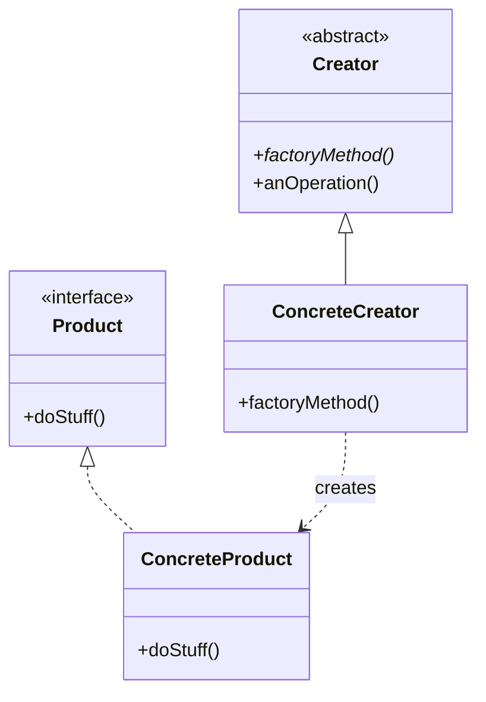

[@nqounet](https://x.com/nqounet)です。

レポートジェネレーターシリーズ、ついに最終回です。

## 前回の振り返り

前回は、レポートジェネレーターを完成させました。

- 月次・週次・日次・四半期の4種類のレポートに対応
- `ReportRole`で共通のインターフェースを定義
- `ReportGenerator`基底クラスで共通処理を実装
- 各ジェネレーターは`create_report`をオーバーライドして具体的なレポートを生成



## 今回の目標

今回は、これまで作ってきた仕組みが、実はデザインパターンの1つであることを明かします。

具体的には、以下のことを行います。

- Factory Methodパターンの定義と構造を学ぶ
- 私たちが作ったコードとパターンの要素を対応させる
- 以前学んだStrategyパターンとの違いを理解する

## 実は「Factory Methodパターン」でした

これまで「if/elseを使わずに、新しいレポート種別を追加できるようにする」ために、継承とオーバーライドを使ってきました。

この設計こそが、Factory Methodパターンそのものです。

### Factory Methodパターンとは

Factory Methodパターンは、GoF（Gang of Four）が定義した23のデザインターンのうち、生成パターン（Creational Patterns）に分類されるものです。

定義:
> オブジェクトを作成するためのインターフェースを定義するが、どのクラスをインスタンス化するかはサブクラスに決定させる。Factory Methodは、クラスのインスタンス化をサブクラスに延期させる。

まさに私たちがやってきたことですね！

- インターフェースを定義: `ReportGenerator`クラスの`create_report`メソッド
- サブクラスに決定させる: `DailyReportGenerator`などが具体的に`DailyReport`を`new`している

## Factory Methodパターンの構造

一般的なFactory Methodパターンの構造図（UML）は以下のようになります。



### 私たちのコードとの対応

この一般的な構造が、私たちのレポートジェネレーターではどうなっているか見てみましょう。

| パターン要素 | 役割 | 私たちのコード |
|------------|------|--------------|
| Creator (抽象作成者) | ファクトリメソッドを宣言する抽象クラス | `ReportGenerator` |
| ConcreteCreator (具象作成者) | 具体的な製品を作るサブクラス | `MonthlyReportGenerator`、`WeeklyReportGenerator` 等 |
| Product (製品) | 製品の共通インターフェース | `ReportRole` (Role) |
| ConcreteProduct (具象製品) | 具体的な製品クラス | `MonthlyReport`、`WeeklyReport` 等 |
| factoryMethod | 生成を行うメソッド | `create_report()` |

完全に一致していますね！

## Strategyパターンとの違い

以前、「Mooを使ってディスパッチャーを作ってみよう」シリーズでStrategyパターンを学びました。

どちらも「うまく切り替える」ためのパターンに見えますが、何が違うのでしょうか？

| 項目 | Strategyパターン | Factory Methodパターン |
|-----|-----------------|----------------------|
| パターン分類 | 振る舞いパターン (Behavioral) | 生成パターン (Creational) |
| 主な関心 | 「どう処理するか」 (アルゴリズム) | 「何を作るか」 (オブジェクト) |
| 実現方法 | 委譲 (has + Role) | 継承 (extends + Override) |
| 切り替え | 実行時にオブジェクトごと入れ替え可能 | クラス定義時に生成するものを決定 |
| 私たちの例 | URLルーター、データ出力形式 | レポートジェネレーター |

### Strategyパターン（復習）

```perl
# Strategy: 処理を委譲する
package Context {
    use Moo;
    has strategy => (is => 'ro', handles => ['execute']); # 委譲
}
```

「私はやり方を知らないけど、`strategy`さんが知ってるから任せるよ」というスタンスです。

### Factory Methodパターン（今回）

```perl
# Factory Method: 生成をサブクラスに任せる
package Creator {
    use Moo;
    sub create_object { die "Subclass must implement" } # 継承
}
```

「私は作り方を知らないけど、子供（サブクラス）が知ってるから作ってもらうよ」というスタンスです。

## なぜこのパターンを使ったのか？

もし、第2回の時のように`if/else`で分岐し続けていたらどうなっていたでしょうか？

- レポートの種類が増えるたびに、ジェネレーターのコードを修正する必要がある
- 修正のたびに、既存のコード（月次や週次）を壊すリスクがある
- コードが巨大になり、読みづらくなる

Factory Methodパターンを使うことで、開放閉鎖原則（Open/Closed Principle）を守ることができました。

- 拡張に対して開いている (Open): 新しいレポートを追加できる
- 修正に対して閉じている (Closed): 既存のジェネレーターのコードは修正しなくていい

## 今後の展望

生成パターンには、他にもいくつか種類があります。

- Abstract Factoryパターン: 関連する製品の「セット」を作る（例：Mac風ボタンとMac風ウィンドウのセット）
- Builderパターン: 複雑なオブジェクトをステップ·バイ·ステップで作る
- Singletonパターン: インスタンスが1つしかないことを保証する

これらも、必要になった時に学んでいくと良いでしょう。

## シリーズまとめ

全10回、お疲れ様でした！

1. クラス作成: 基本的なクラスを作りました
2. if/elseの限界: 単純な分岐では管理しきれないことを知りました
3. 継承: `extends`を使ってクラスを分けました
4. ロール: `Moo::Role`で共通ルールを決めました
5. オーバーライド: 親のメソッドを上書きして振る舞いを変えました
6. 基底クラス: 共通処理を親にまとめました
7. 型チェック: `isa`でオブジェクトの型を保証しました
8. 拡張性: 既存コードを触らずに機能追加できました
9. 完成: システム全体を統合しました
10. パターン: それがFactory Methodパターンだと知りました

このシリーズを通して、「変更に強く、拡張しやすいコード」を書くための強力な武器を手に入れました。
ぜひ、日々のPerlプログラミングで活用してください！

「PerlとMooでレポートジェネレーターを作ってみよう」シリーズ、完結です。
ありがとうございました！
