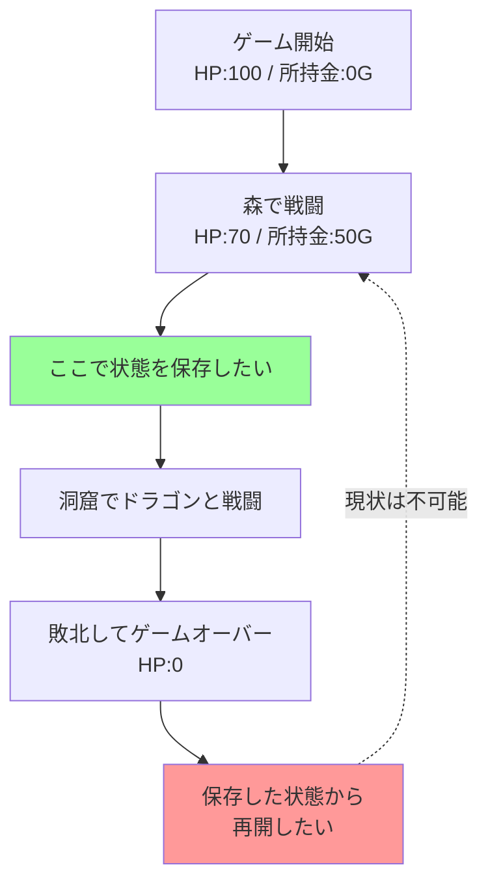
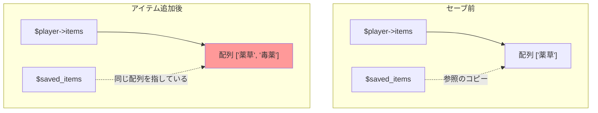
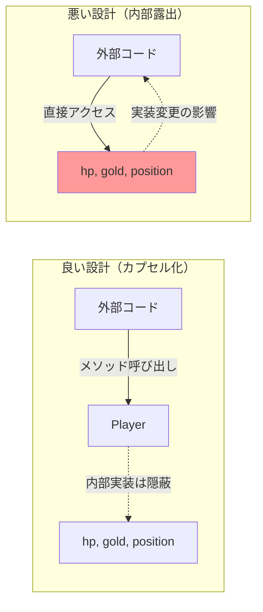
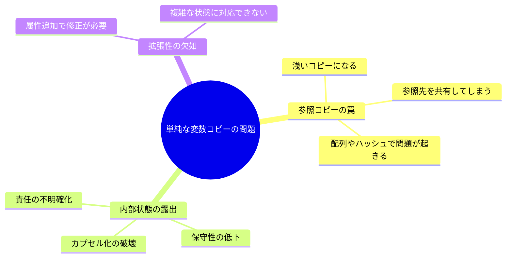

[@nqounet](https://x.com/nqounet)です。

前回は、プレイヤーの状態を管理するシンプルなRPGを作成しました。HP・所持金・位置を持つ`Player`クラスを定義し、戦闘や移動の基本的な動作を実装しました。



しかし、ドラゴンとの戦闘に負けてゲームオーバーになると、また最初からやり直しです。森での戦闘後、HP70・所持金50Gの状態に戻りたいのに、その方法がありませんでした。

今回は、この「途中から再開したい！」という問題に取り組みます。

## 今回のゴール

今回のゴールは、状態保存の必要性を理解し、単純な変数コピーによる保存を試みることです。

そして、その試みが直面する問題を確認します。

- 単純な変数コピーで状態保存を試みる
- 参照コピーの罠（浅いコピー問題）を発見する
- 内部状態の露出問題を理解する

最終的には、もっと良い解決策が必要だと気づきます。その解決策は次回以降で実装していきます。

## 問題の整理

前回作成したRPGで、プレイヤーが直面する問題を整理しましょう。



理想的には、森での戦闘後の状態を保存しておき、ドラゴンに負けたらその時点に戻りたいわけです。

では、どうやって状態を保存すればよいのでしょうか。

## 最初の試み：単純な変数コピー

まず思いつくのは、変数に保存しておく方法です。プレイヤーのHP、所持金、位置を別の変数にコピーしておけばよいのではないでしょうか。

```perl
# Perl v5.36 以降
# 外部依存: Moo

use v5.36;

package Player {
    use Moo;

    has hp => (
        is      => 'rw',
        default => 100,
    );

    has gold => (
        is      => 'rw',
        default => 0,
    );

    has position => (
        is      => 'rw',
        default => '町',
    );

    sub take_damage ($self, $amount) {
        $self->hp($self->hp - $amount);
        if ($self->hp < 0) {
            $self->hp(0);
        }
    }

    sub earn_gold ($self, $amount) {
        $self->gold($self->gold + $amount);
    }

    sub move_to ($self, $location) {
        $self->position($location);
    }

    sub is_alive ($self) {
        return $self->hp > 0;
    }

    sub show_status ($self) {
        say "HP: " . $self->hp;
        say "所持金: " . $self->gold . "G";
        say "位置: " . $self->position;
        say "";
    }
};

# ゲームループのデモ
my $player = Player->new;

say "=== ゲーム開始 ===";
$player->show_status;

say "森へ移動...";
$player->move_to('森');
$player->show_status;

say "スライムと戦闘！";
$player->take_damage(30);
say "30のダメージを受けた！";
$player->show_status;

if ($player->is_alive) {
    say "スライムを倒した！";
    $player->earn_gold(50);
    say "50Gを手に入れた！";
    $player->show_status;
}

# ここで状態を保存
say "=== セーブポイント ===";
my $saved_hp       = $player->hp;
my $saved_gold     = $player->gold;
my $saved_position = $player->position;
say "状態を保存しました";
say "";

say "洞窟へ移動...";
$player->move_to('洞窟');
$player->show_status;

say "ドラゴンと戦闘！";
$player->take_damage(80);
say "80のダメージを受けた！";
$player->show_status;

if (!$player->is_alive) {
    say "=== GAME OVER ===";
    say "セーブポイントから復元します...";
    say "";
    
    # 保存した状態を復元
    $player->hp($saved_hp);
    $player->gold($saved_gold);
    $player->position($saved_position);
    
    say "=== 復元完了 ===";
    $player->show_status;
}
```

実行すると以下のようになります。

```
=== ゲーム開始 ===
HP: 100
所持金: 0G
位置: 町

森へ移動...
HP: 100
所持金: 0G
位置: 森

スライムと戦闘！
30のダメージを受けた！
HP: 70
所持金: 0G
位置: 森

スライムを倒した！
50Gを手に入れた！
HP: 70
所持金: 50G
位置: 森

=== セーブポイント ===
状態を保存しました

洞窟へ移動...
HP: 70
所持金: 50G
位置: 洞窟

ドラゴンと戦闘！
80のダメージを受けた！
HP: 0
所持金: 50G
位置: 洞窟

=== GAME OVER ===
セーブポイントから復元します...

=== 復元完了 ===
HP: 70
所持金: 50G
位置: 森
```

一見うまく動いているように見えます。ドラゴンに負けた後、森での状態に戻ることができました。

しかし、この方法には深刻な問題があります。

## 問題点1：参照コピーの罠

今回のコードでは、属性が単純な値（整数や文字列）だったため、うまく動きました。しかし、属性が配列やハッシュなどの参照だった場合、思わぬ動作になります。

以下のコード例で確認してみましょう。プレイヤーが複数のアイテムを持つ場合を想定して、`items`という配列リファレンスの属性を追加します。

```perl
# Perl v5.36 以降
# 外部依存: Moo

use v5.36;

package Player {
    use Moo;

    has hp => (
        is      => 'rw',
        default => 100,
    );

    has items => (
        is      => 'rw',
        default => sub { [] },  # 配列リファレンス
    );

    sub take_damage ($self, $amount) {
        $self->hp($self->hp - $amount);
        if ($self->hp < 0) {
            $self->hp(0);
        }
    }

    sub add_item ($self, $item) {
        push $self->items->@*, $item;
    }

    sub show_items ($self) {
        say "所持アイテム: " . join(', ', $self->items->@*);
    }
};

my $player = Player->new;

say "=== ゲーム開始 ===";
say "HP: " . $player->hp;
$player->show_items;
say "";

say "薬草を拾った！";
$player->add_item('薬草');
$player->show_items;
say "";

# 状態を保存（単純な変数コピー）
say "=== セーブポイント ===";
my $saved_hp    = $player->hp;
my $saved_items = $player->items;  # これは参照のコピー
say "状態を保存しました";
say "";

say "毒薬を拾った！";
$player->add_item('毒薬');
$player->show_items;
say "";

say "毒薬を飲んでゲームオーバー！";
$player->take_damage(100);
say "HP: " . $player->hp;
say "";

# 復元
say "=== セーブポイントから復元 ===";
$player->hp($saved_hp);
$player->items($saved_items);

say "HP: " . $player->hp;
$player->show_items;  # 期待: 薬草のみ、実際: 薬草、毒薬
```

実行結果は以下のようになります。

```
=== ゲーム開始 ===
HP: 100
所持アイテム: 

薬草を拾った！
所持アイテム: 薬草

=== セーブポイント ===
状態を保存しました

毒薬を拾った！
所持アイテム: 薬草, 毒薬

毒薬を飲んでゲームオーバー！
HP: 0

=== セーブポイントから復元 ===
HP: 100
所持アイテム: 薬草, 毒薬
```

HPは正しく復元されましたが、アイテムは復元されていません。セーブ後に拾った「毒薬」が残ったままです。

これがPerlの参照コピーの罠です。

### なぜこうなるのか

問題の原因を図で見てみましょう。



`$saved_items = $player->items`という代入は、配列そのものをコピーしているのではなく、配列への参照（メモリアドレス）をコピーしています。

つまり、`$player->items`と`$saved_items`は、同じ配列を指しているのです。

そのため、保存後に配列に要素を追加すると、保存した参照からも見えてしまいます。

### Perlでの浅いコピーと深いコピー

この問題を解決するには、配列の中身まで完全にコピーする「深いコピー」（deep copy）が必要です。

浅いコピー（shallow copy）と深いコピー（deep copy）の違いを整理します。

| 項目 | 浅いコピー | 深いコピー |
|-----|----------|----------|
| 単純な値 | 値をコピーする | 値をコピーする |
| 参照 | 参照をコピーする | 参照先の中身までコピーする |
| 結果 | 元と同じオブジェクトを指す | 新しいオブジェクトを作る |

単純な変数コピーは浅いコピーです。参照の場合、参照先を共有してしまいます。

深いコピーを行う方法はいくつかありますが、今回の例では単純に配列をコピーしてみましょう。

```perl
# 浅いコピー（参照を共有）
my $saved_items = $player->items;

# 深いコピー（新しい配列を作る）
my $saved_items = [ @{$player->items} ];
```

`[ @{$player->items} ]`は、配列を展開して新しい配列リファレンスを作成しています。

しかし、これでも不十分です。配列の要素がさらに参照だった場合、その参照は共有されてしまいます。完全な深いコピーには、`Storable`モジュールの`dclone`などを使う必要があります。

## 問題点2：内部状態の露出

単純な変数コピーには、もう1つ重要な問題があります。

それは、オブジェクトの内部状態を外部に露出していることです。

```perl
# セーブ
my $saved_hp       = $player->hp;
my $saved_gold     = $player->gold;
my $saved_position = $player->position;
my $saved_items    = [ @{$player->items} ];

# ロード
$player->hp($saved_hp);
$player->gold($saved_gold);
$player->position($saved_position);
$player->items($saved_items);
```

このコードでは、`Player`クラスの内部構造（どんな属性があるか）を知っていないと、保存・復元ができません。

これは以下の問題につながります。

1. 保守性の低下 — `Player`クラスに属性を追加したら、保存・復元のコードも修正が必要
2. カプセル化の破壊 — `Player`の内部実装が変わると、外部のコードも影響を受ける
3. 責任の不明確化 — 状態の保存・復元の責任が、`Player`クラスの外に漏れている

オブジェクト指向設計の原則であるカプセル化（情報隠蔽）に反しています。

### カプセル化とは

カプセル化は、オブジェクトの内部実装を隠し、外部からはメソッドを通じてのみアクセスできるようにする設計原則です。



良い設計では、`Player`クラスの内部実装が変わっても、外部コードは影響を受けません。

しかし、単純な変数コピーでは、属性を直接読み書きするため、内部実装が変わると外部コードも修正が必要になります。

## 問題点の整理

単純な変数コピーによる状態保存には、以下の問題があることがわかりました。



これらの問題を解決するには、もっと良い方法が必要です。

## 望ましい解決策の条件

問題点を踏まえて、望ましい解決策の条件を整理しましょう。

1. 深いコピーができること — 参照を含む状態も正しく保存できる
2. カプセル化を維持すること — 内部実装を外部に露出しない
3. 拡張性があること — 属性が増えても外部コードの修正が不要
4. 責任が明確であること — 状態の保存・復元の責任がどこにあるか明確

次回は、これらの条件を満たす解決策として、スナップショットという考え方を導入します。

プレイヤーの状態を1つのオブジェクトにまとめて保存することで、上記の問題を解決していきます。

## 今回作成した完成コード

以下が今回作成した完成コードです。参照コピーの問題を再現するコードと、単純な変数コピーで保存・復元を試みるコードの2つを示します。

### コード例1：単純な変数コピー（動作する例）

```perl
#!/usr/bin/env perl
# Perl v5.36 以降
# 外部依存: Moo

use v5.36;

package Player {
    use Moo;

    has hp => (
        is      => 'rw',
        default => 100,
    );

    has gold => (
        is      => 'rw',
        default => 0,
    );

    has position => (
        is      => 'rw',
        default => '町',
    );

    sub take_damage ($self, $amount) {
        $self->hp($self->hp - $amount);
        if ($self->hp < 0) {
            $self->hp(0);
        }
    }

    sub earn_gold ($self, $amount) {
        $self->gold($self->gold + $amount);
    }

    sub move_to ($self, $location) {
        $self->position($location);
    }

    sub is_alive ($self) {
        return $self->hp > 0;
    }

    sub show_status ($self) {
        say "HP: " . $self->hp;
        say "所持金: " . $self->gold . "G";
        say "位置: " . $self->position;
        say "";
    }
};

# ゲームループのデモ
my $player = Player->new;

say "=== ゲーム開始 ===";
$player->show_status;

say "森へ移動...";
$player->move_to('森');
$player->show_status;

say "スライムと戦闘！";
$player->take_damage(30);
say "30のダメージを受けた！";
$player->show_status;

if ($player->is_alive) {
    say "スライムを倒した！";
    $player->earn_gold(50);
    say "50Gを手に入れた！";
    $player->show_status;
}

# ここで状態を保存
say "=== セーブポイント ===";
my $saved_hp       = $player->hp;
my $saved_gold     = $player->gold;
my $saved_position = $player->position;
say "状態を保存しました";
say "";

say "洞窟へ移動...";
$player->move_to('洞窟');
$player->show_status;

say "ドラゴンと戦闘！";
$player->take_damage(80);
say "80のダメージを受けた！";
$player->show_status;

if (!$player->is_alive) {
    say "=== GAME OVER ===";
    say "セーブポイントから復元します...";
    say "";
    
    # 保存した状態を復元
    $player->hp($saved_hp);
    $player->gold($saved_gold);
    $player->position($saved_position);
    
    say "=== 復元完了 ===";
    $player->show_status;
}
```

### コード例2：参照コピーの罠（問題を再現）

```perl
#!/usr/bin/env perl
# Perl v5.36 以降
# 外部依存: Moo

use v5.36;

package Player {
    use Moo;

    has hp => (
        is      => 'rw',
        default => 100,
    );

    has items => (
        is      => 'rw',
        default => sub { [] },  # 配列リファレンス
    );

    sub take_damage ($self, $amount) {
        $self->hp($self->hp - $amount);
        if ($self->hp < 0) {
            $self->hp(0);
        }
    }

    sub add_item ($self, $item) {
        push $self->items->@*, $item;
    }

    sub show_items ($self) {
        say "所持アイテム: " . join(', ', $self->items->@*);
    }
};

my $player = Player->new;

say "=== ゲーム開始 ===";
say "HP: " . $player->hp;
$player->show_items;
say "";

say "薬草を拾った！";
$player->add_item('薬草');
$player->show_items;
say "";

# 状態を保存（単純な変数コピー）
say "=== セーブポイント ===";
my $saved_hp    = $player->hp;
my $saved_items = $player->items;  # これは参照のコピー
say "状態を保存しました";
say "";

say "毒薬を拾った！";
$player->add_item('毒薬');
$player->show_items;
say "";

say "毒薬を飲んでゲームオーバー！";
$player->take_damage(100);
say "HP: " . $player->hp;
say "";

# 復元
say "=== セーブポイントから復元 ===";
$player->hp($saved_hp);
$player->items($saved_items);

say "HP: " . $player->hp;
$player->show_items;  # 期待: 薬草のみ、実際: 薬草、毒薬
say "";
say "※ 毒薬が残っている！これが参照コピーの罠です";
```

## まとめ

今回は、ゲームの状態を保存しようとして、単純な変数コピーを試みました。

試したこと:

- 単純な変数コピーで状態を保存・復元した
- 単純な値（整数、文字列）の場合はうまく動いた

発見した問題:

- 配列やハッシュなどの参照は、参照のコピーになる（浅いコピー）
- 保存後に元のオブジェクトを変更すると、保存した状態も変わってしまう
- オブジェクトの内部状態を外部に露出している（カプセル化の破壊）
- 属性が増えると、保存・復元のコードも修正が必要（保守性の低下）

わかったこと:

- 単純な変数コピーでは、正しく状態を保存できない
- 深いコピーが必要
- カプセル化を維持する仕組みが必要

次回は、これらの問題を解決する方法として、スナップショットという考え方を導入します。

プレイヤーの状態を1つのオブジェクトにまとめて保存することで、参照コピーの問題とカプセル化の問題を同時に解決していきます。

## 次回予告

今回、単純な変数コピーでは状態を正しく保存できないことがわかりました。

次回は、この問題を解決するために、スナップショットという考え方を導入します。

プレイヤーの状態を1つのオブジェクトにまとめて保存する`PlayerSnapshot`クラスを作成し、状態の保存と復元を実装します。

特に、`is => 'ro'`（読み取り専用）の属性を使って、保存した状態が後から変更されないようにします。これが、状態を守る重要なポイントになります。

第3回のテーマ: 状態をまとめて保存しよう（スナップショット）

お楽しみに。
