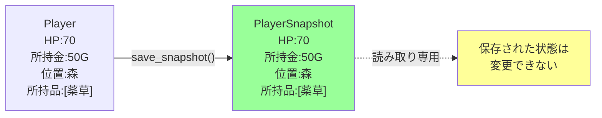
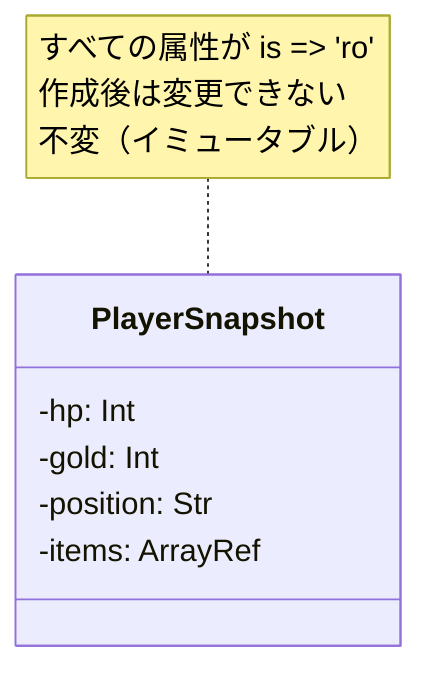
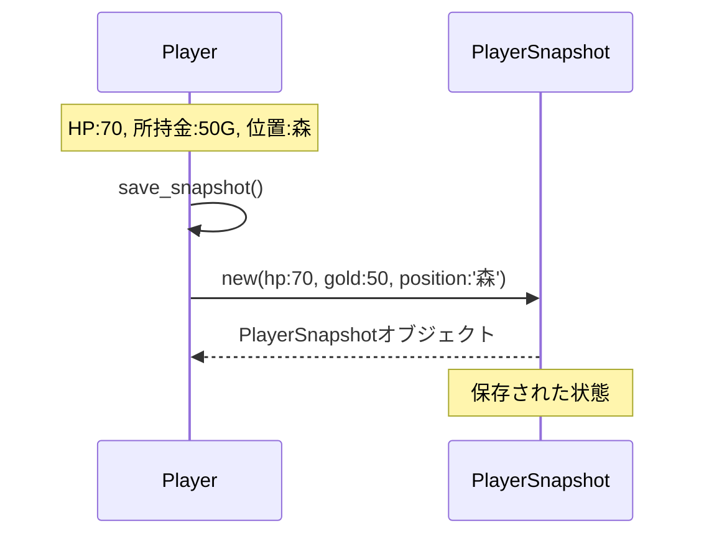
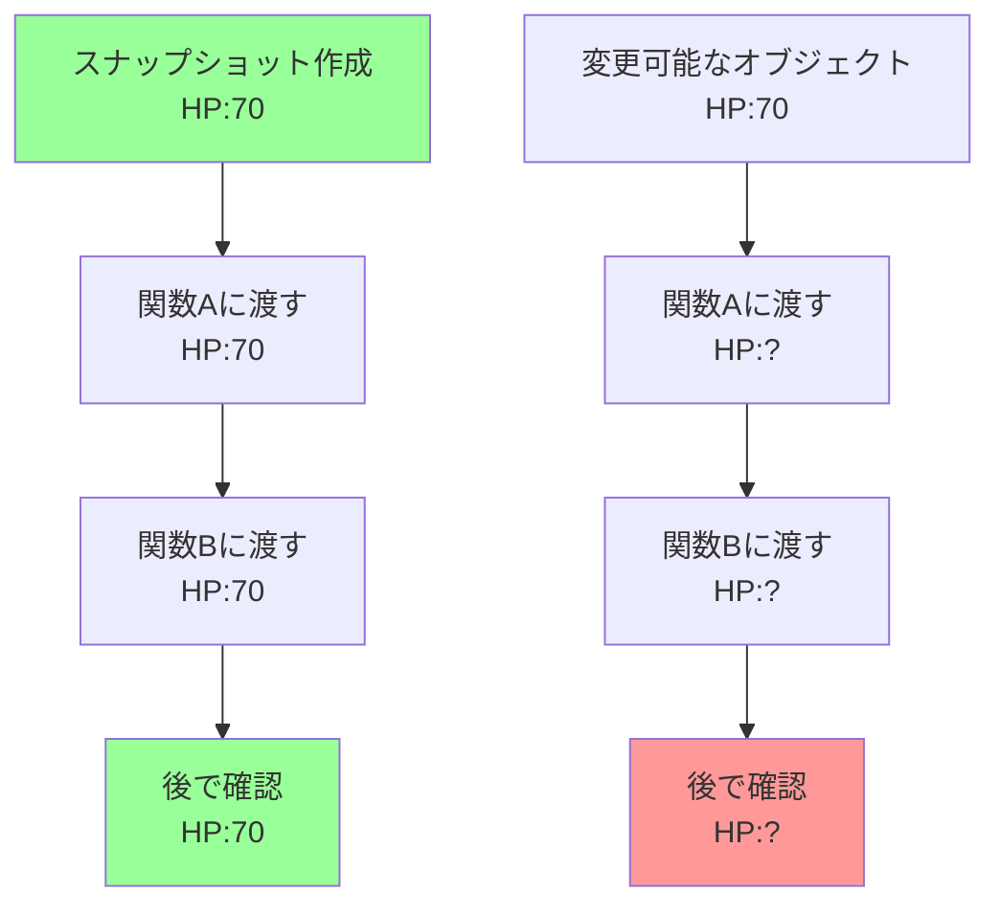

[@nqounet](https://x.com/nqounet)です。

## 前回の振り返り

前回は、ゲームの状態を保存しようとして、単純な変数コピーを試みました。しかし、参照コピーの罠やカプセル化の破壊といった問題に直面しました。



### 前回見つかった問題点

単純な変数コピーによる状態保存には、以下の問題がありました。

問題1：参照コピーの罠

配列やハッシュなどの参照は浅いコピーになってしまい、保存後に元のオブジェクトを変更すると保存した状態も変わってしまう問題がありました。

問題2：カプセル化の破壊

`Player`クラスの内部実装（属性の構造）を外部に露出しており、カプセル化の原則に反していました。属性が増えるたびに、保存・復元のコードも修正が必要になります。

今回は、これらの問題を解決する方法として、スナップショットという考え方を導入します。

## 今回のゴール

今回のゴールは、プレイヤーの状態を1つのオブジェクトにまとめて保存することです。

- `PlayerSnapshot`クラスを作成する
- `is => 'ro'`で不変（イミュータブル）なスナップショットを作る
- `Player`クラスに`save_snapshot`メソッドを追加する
- スナップショットの動作を確認する

スナップショットを使うことで、前回の問題（参照コピーの罠、カプセル化の破壊）を解決していきます。

## スナップショットとは

スナップショットとは、ある時点でのオブジェクトの状態を丸ごと保存したものです。

写真を撮るように、その瞬間の状態を「パシャッ」と記録するイメージです。



スナップショットの重要なポイントは、保存した状態が後から変更されないことです。

これを実現するために、Mooの`is => 'ro'`（読み取り専用）属性を使います。

## PlayerSnapshotクラスを作る

まず、プレイヤーの状態を保存するための`PlayerSnapshot`クラスを作成しましょう。



### コード例1：PlayerSnapshotクラス

```perl
# Perl v5.36 以降
# 外部依存: Moo

package PlayerSnapshot {
    use Moo;
    use v5.36;

    has hp => (
        is       => 'ro',
        required => 1,
    );

    has gold => (
        is       => 'ro',
        required => 1,
    );

    has position => (
        is       => 'ro',
        required => 1,
    );

    has items => (
        is       => 'ro',
        required => 1,
    );
};
```

このクラスは、4つの属性を持っています。

属性:

- `hp` — プレイヤーの体力
- `gold` — 所持金
- `position` — 現在位置
- `items` — 所持品（配列リファレンス）

すべての属性は`is => 'ro'`で読み取り専用に設定されています。これは、一度作成したスナップショットは後から変更できないことを意味します。

また、すべての属性に`required => 1`を指定しています。スナップショットを作成する際、必ずすべての値を渡す必要があります。

### `is => 'ro'`の重要性

`is => 'ro'`（read-only）は、属性を読み取り専用にするオプションです。

前シリーズ「Mooで覚えるオブジェクト指向プログラミング」の第4回で学んだ内容ですね。



```perl
my $snapshot = PlayerSnapshot->new(
    hp       => 70,
    gold     => 50,
    position => '森',
    items    => [],
);

say $snapshot->hp;  # 70（読み取りはOK）

$snapshot->hp(100); # エラー！書き込みはできない
```

スナップショットは、ある時点での状態を記録したものです。後から「あの時のHPは実は100だった」と変更されてしまったら、記録の意味がありません。

`is => 'ro'`を使うことで、スナップショットの不変性（イミュータブル）を保証します。

### Playerクラスと比較

前回までに作成した`Player`クラスと比較してみましょう。

| 項目 | Player | PlayerSnapshot |
|-----|--------|----------------|
| 属性のアクセス | `is => 'rw'` | `is => 'ro'` |
| 目的 | ゲーム中に状態が変化する | 状態を記録して保存する |
| 変更可能性 | いつでも変更できる | 一度作成したら変更できない |
| メソッド | 状態を変更するメソッドあり | メソッドなし（読み取りのみ） |

`Player`は「今遊んでいるゲーム」、`PlayerSnapshot`は「セーブデータ」と考えるとわかりやすいでしょう。

## Playerクラスにsave_snapshotメソッドを追加する

次に、`Player`クラスに、自分の状態からスナップショットを作成するメソッドを追加します。



### コード例2：save_snapshotメソッド

```perl
# Perl v5.36 以降
# 外部依存: Moo

package Player {
    use Moo;
    use v5.36;

    has hp => (
        is      => 'rw',
        default => 100,
    );

    has gold => (
        is      => 'rw',
        default => 0,
    );

    has position => (
        is      => 'rw',
        default => '町',
    );

    has items => (
        is      => 'rw',
        default => sub { [] },
    );

    sub take_damage ($self, $amount) {
        $self->hp($self->hp - $amount);
        if ($self->hp < 0) {
            $self->hp(0);
        }
    }

    sub earn_gold ($self, $amount) {
        $self->gold($self->gold + $amount);
    }

    sub move_to ($self, $location) {
        $self->position($location);
    }

    sub is_alive ($self) {
        return $self->hp > 0;
    }

    sub show_status ($self) {
        say "HP: " . $self->hp;
        say "所持金: " . $self->gold . "G";
        say "位置: " . $self->position;
        my $items = $self->items;
        my $items_str = ($items->@*) ? join(', ', $items->@*) : 'なし';
        say "所持品: " . $items_str;
        say "";
    }

    sub save_snapshot ($self) {
        return PlayerSnapshot->new(
            hp       => $self->hp,
            gold     => $self->gold,
            position => $self->position,
            items    => [$self->items->@*], # 配列の中身を展開して新しい配列リファレンスを作成（コピー）
        );
    }
};
```

`save_snapshot`メソッドは、現在の自分の状態から`PlayerSnapshot`オブジェクトを作成して返します。

このメソッドの重要なポイントは、`Player`クラスの内部実装を隠蔽していることです。

外部のコードは、`Player`がどんな属性を持っているかを知る必要がありません。ただ`save_snapshot`メソッドを呼ぶだけで、正しくスナップショットが作成されます。

### カプセル化の維持

前回の問題点だった「内部状態の露出」が、この設計で解決されています。

```perl
# 前回の方法（内部状態を露出）
my $saved_hp       = $player->hp;
my $saved_gold     = $player->gold;
my $saved_position = $player->position;

# 今回の方法（カプセル化を維持）
my $snapshot = $player->save_snapshot;
```

`save_snapshot`メソッドを使うことで、`Player`クラスの内部構造を知らなくても状態を保存できます。

コピーの問題についても、`Player`クラスがメソッドの中で解決することができます。

もし将来、`Player`クラスに新しい属性（例えば`level`や`experience`）を追加したとしても、`save_snapshot`メソッドの中を修正するだけで済みます。外部のコードは一切変更不要です。

これが、カプセル化を維持することのメリットです。

## 動作確認

それでは、作成した`PlayerSnapshot`と`save_snapshot`メソッドを使って、実際に動作を確認してみましょう。

```perl
# Perl v5.36 以降
# 外部依存: Moo

use v5.36;

package PlayerSnapshot {
    use Moo;
    use v5.36;

    has hp => (
        is       => 'ro',
        required => 1,
    );

    has gold => (
        is       => 'ro',
        required => 1,
    );

    has position => (
        is       => 'ro',
        required => 1,
    );

    has items => (
        is       => 'ro',
        required => 1,
    );
};

package Player {
    use Moo;
    use v5.36;

    has hp => (
        is      => 'rw',
        default => 100,
    );

    has gold => (
        is      => 'rw',
        default => 0,
    );

    has position => (
        is      => 'rw',
        default => '町',
    );

    has items => (
        is      => 'rw',
        default => sub { [] },
    );

    sub take_damage ($self, $amount) {
        $self->hp($self->hp - $amount);
        if ($self->hp < 0) {
            $self->hp(0);
        }
    }

    sub earn_gold ($self, $amount) {
        $self->gold($self->gold + $amount);
    }

    sub move_to ($self, $location) {
        $self->position($location);
    }

    sub is_alive ($self) {
        return $self->hp > 0;
    }

    sub add_item ($self, $item) {
        push $self->items->@*, $item;
    }

    sub remove_item ($self, $item) {
        my @new = grep { $_ ne $item } $self->items->@*;
        $self->items(\@new);
    }

    sub show_status ($self) {
        say "HP: " . $self->hp;
        say "所持金: " . $self->gold . "G";
        say "位置: " . $self->position;
        my $items = $self->items;
        my $items_str = ($items->@*) ? join(', ', $items->@*) : 'なし';
        say "所持品: " . $items_str;
        say "";
    }

    sub save_snapshot ($self) {
        return PlayerSnapshot->new(
            hp       => $self->hp,
            gold     => $self->gold,
            position => $self->position,
            items    => [$self->items->@*],
        );
    }
};

# ゲームループのデモ
my $player = Player->new;

say "=== ゲーム開始 ===";
$player->show_status;

say "森へ移動...";
$player->move_to('森');
$player->show_status;

say "スライムと戦闘！";
$player->take_damage(30);
say "30のダメージを受けた！";
$player->show_status;

if ($player->is_alive) {
    say "スライムを倒した！";
    $player->earn_gold(50);
    say "50Gを手に入れた！";
    $player->add_item("薬草");
    say "薬草を手に入れた！";
    $player->show_status;
}

# スナップショットを保存
say "=== セーブポイント ===";
my $snapshot = $player->save_snapshot;
say "状態を保存しました";
say "保存された状態:";
{
    say "HP: " . $snapshot->hp;
    say "所持金: " . $snapshot->gold . "G";
    say "位置: " . $snapshot->position;
    my $items = $snapshot->items;
    my $items_str = ($items->@*) ? join(', ', $items->@*) : 'なし';
    say "所持品: " . $items_str;
    say "";
}
say "洞窟へ移動...";
$player->move_to('洞窟');
$player->add_item("毒消し草");
say "毒消し草を手に入れた！";
$player->show_status;

say "ドラゴンと戦闘！";
$player->take_damage(80);
say "80のダメージを受けた！";
$player->show_status;

# スナップショットの内容は変わっていないことを確認
say "=== スナップショットの確認 ===";
say "保存された状態は変わっていない:";
{
    say "HP: " . $snapshot->hp;
    say "所持金: " . $snapshot->gold . "G";
    say "位置: " . $snapshot->position;
    my $items = $snapshot->items;
    my $items_str = ($items->@*) ? join(', ', $items->@*) : 'なし';
    say "所持品: " . $items_str;
    say "";
}

# スナップショットを変更しようとするとエラーになる
say "スナップショットを変更しようとすると...";
eval {
    $snapshot->hp(999);
};
if ($@) {
    say "エラー: スナップショットは変更できません";
    say "（is => 'ro'で保護されています）";
}
```

実行結果は以下のようになります。

```
=== ゲーム開始 ===
HP: 100
所持金: 0G
位置: 町
所持品: なし

森へ移動...
HP: 100
所持金: 0G
位置: 森
所持品: なし

スライムと戦闘！
30のダメージを受けた！
HP: 70
所持金: 0G
位置: 森
所持品: なし

スライムを倒した！
50Gを手に入れた！
薬草を手に入れた！
HP: 70
所持金: 50G
位置: 森
所持品: 薬草

=== セーブポイント ===
状態を保存しました
保存された状態:
HP: 70
所持金: 50G
位置: 森
所持品: 薬草

洞窟へ移動...
毒消し草を手に入れた！
HP: 70
所持金: 50G
位置: 洞窟
所持品: 薬草, 毒消し草

ドラゴンと戦闘！
80のダメージを受けた！
HP: 0
所持金: 50G
位置: 洞窟
所持品: 薬草, 毒消し草

=== スナップショットの確認 ===
保存された状態は変わっていない:
HP: 70
所持金: 50G
位置: 森
所持品: 薬草

スナップショットを変更しようとすると...
エラー: スナップショットは変更できません
（is => 'ro'で保護されています）
```

重要なポイントは以下の通りです。

1. スナップショット作成時の状態が保存される — HP:70、所持金:50G、位置:森
2. プレイヤーの状態が変わっても、スナップショットは変わらない — ドラゴンとの戦闘後もスナップショットはHP:70のまま
3. スナップショットを変更しようとするとエラーになる — `is => 'ro'`で保護されている

これで、前回の問題点だった「参照コピーの罠」も解決されています。スナップショットは完全に独立したオブジェクトであり、元の`Player`オブジェクトとは別の値を持っています。

## 不変性（イミュータブル）の重要性

今回、スナップショットのすべての属性を`is => 'ro'`（読み取り専用）にしました。これが不変性（イミュータブル）です。

不変性とは、一度作成したオブジェクトの状態を変更できないようにすることです。

### なぜ不変性が重要なのか

セーブデータを考えてみてください。「2024年12月1日 15:30のセーブデータ」というのは、その時点での状態を記録したものですよね。

もしこのセーブデータが後から勝手に書き換えられたら、それはもう「その時点のセーブデータ」ではありません。

スナップショットも同じです。ある時点での状態を記録したものなので、後から変更されてはいけません。

### 不変性のメリット

不変性には、以下のような重要なメリットがあります。

### 1. 予期しない変更を防ぐ

セーブデータが勝手に書き換えられたら、ゲームが壊れてしまいます。

```perl
# もし is => 'rw' だったら...
$snapshot->hp(999);  # セーブデータを改ざんできてしまう！
```

`is => 'ro'`にすることで、このような改ざんを防ぎます。

### 2. コードの安全性が高まる

スナップショットを受け取った関数が、その中身を変更しないことが保証されます。

```perl
sub display_save_data ($snapshot) {
    # この関数内でスナップショットを変更することはできない
    say "HP: " . $snapshot->hp;
}
```

### 3. デバッグがしやすい

スナップショットの値が変わらないことがわかっているので、バグの原因を探しやすくなります。



不変オブジェクトは、どこに渡しても値が変わらないため、予測しやすく安全です。

### Perlでのイミュータブル

Perlには、Javaの`final`やJavaScriptの`const`のような言語組み込みの不変性機能はありません。しかし、Mooの`is => 'ro'`を使うことで、オブジェクトの属性を不変にできます。

```perl
# Java での例（参考）
# public final int hp = 70;

# Perl + Moo での例
has hp => (
    is => 'ro',  # 読み取り専用 = 不変
);
```

`is => 'ro'`は単なる「読み取り専用」ではなく、オブジェクト指向設計における「不変オブジェクト」を実現する重要なテクニックです。

前シリーズで学んだ`is => 'ro'`の使い方が、ここで活きてきましたね！

## 解決できたこと、できていないこと

今回のスナップショット導入で、前回の問題がどこまで解決できたか整理しましょう。

### 解決できたこと ✓

1. 参照コピーの罠 → スナップショットは完全に独立したオブジェクト
2. カプセル化の破壊 → `save_snapshot`メソッドで内部実装を隠蔽
3. 不変性の保証 → `is => 'ro'`でスナップショットの改ざんを防止

### まだできていないこと ✗

1. スナップショットから復元する機能 — 保存はできるが、復元はまだ実装していない
2. 複数のスナップショット管理 — 1つしか保存できない（複数のセーブスロットがない）
3. 自動的な保存 — 手動で`save_snapshot`を呼ぶ必要がある

次回は、「スナップショットから復元する」機能を実装します。

## 今回作成した完成コード

以下が今回作成した完成コードです。1つのスクリプトファイルとして動作します。

```perl
#!/usr/bin/env perl
# Perl v5.36 以降
# 外部依存: Moo
use v5.36;

package PlayerSnapshot {
    use Moo;
    use v5.36;

    has hp => (
        is       => 'ro',
        required => 1,
    );

    has gold => (
        is       => 'ro',
        required => 1,
    );

    has position => (
        is       => 'ro',
        required => 1,
    );

    has items => (
        is       => 'ro',
        required => 1,
    );
};

package Player {
    use Moo;
    use v5.36;

    has hp => (
        is      => 'rw',
        default => 100,
    );

    has gold => (
        is      => 'rw',
        default => 0,
    );

    has position => (
        is      => 'rw',
        default => '町',
    );

    has items => (
        is      => 'rw',
        default => sub { [] },
    );

    sub take_damage ($self, $amount) {
        $self->hp($self->hp - $amount);
        if ($self->hp < 0) {
            $self->hp(0);
        }
    }

    sub earn_gold ($self, $amount) {
        $self->gold($self->gold + $amount);
    }

    sub move_to ($self, $location) {
        $self->position($location);
    }

    sub is_alive ($self) {
        return $self->hp > 0;
    }

    sub add_item ($self, $item) {
        push $self->items->@*, $item;
    }

    sub remove_item ($self, $item) {
        my @new = grep { $_ ne $item } $self->items->@*;
        $self->items(\@new);
    }

    sub show_status ($self) {
        say "HP: " . $self->hp;
        say "所持金: " . $self->gold . "G";
        say "位置: " . $self->position;
        my $items = $self->items;
        my $items_str = ($items->@*) ? join(', ', $items->@*) : 'なし';
        say "所持品: " . $items_str;
        say "";
    }

    sub save_snapshot ($self) {
        return PlayerSnapshot->new(
            hp       => $self->hp,
            gold     => $self->gold,
            position => $self->position,
            items    => [$self->items->@*],
        );
    }
};

# ゲームループのデモ
my $player = Player->new;

say "=== ゲーム開始 ===";
$player->show_status;

say "森へ移動...";
$player->move_to('森');
$player->show_status;

say "スライムと戦闘！";
$player->take_damage(30);
say "30のダメージを受けた！";
$player->show_status;

if ($player->is_alive) {
    say "スライムを倒した！";
    $player->earn_gold(50);
    say "50Gを手に入れた！";
    $player->add_item("薬草");
    say "薬草を手に入れた！";
    $player->show_status;
}

# スナップショットを保存
say "=== セーブポイント ===";
my $snapshot = $player->save_snapshot;
say "状態を保存しました";
say "保存された状態:";
{
    say "HP: " . $snapshot->hp;
    say "所持金: " . $snapshot->gold . "G";
    say "位置: " . $snapshot->position;
    my $items = $snapshot->items;
    my $items_str = ($items->@*) ? join(', ', $items->@*) : 'なし';
    say "所持品: " . $items_str;
    say "";
}
say "洞窟へ移動...";
$player->move_to('洞窟');
$player->add_item("毒消し草");
say "毒消し草を手に入れた！";
$player->show_status;

say "ドラゴンと戦闘！";
$player->take_damage(80);
say "80のダメージを受けた！";
$player->show_status;

# スナップショットの内容は変わっていないことを確認
say "=== スナップショットの確認 ===";
say "保存された状態は変わっていない:";
{
    say "HP: " . $snapshot->hp;
    say "所持金: " . $snapshot->gold . "G";
    say "位置: " . $snapshot->position;
    my $items = $snapshot->items;
    my $items_str = ($items->@*) ? join(', ', $items->@*) : 'なし';
    say "所持品: " . $items_str;
    say "";
}

# スナップショットを変更しようとするとエラーになる
say "スナップショットを変更しようとすると...";
eval {
    $snapshot->hp(999);
};
if ($@) {
    say "エラー: スナップショットは変更できません";
    say "（is => 'ro'で保護されています）";
}
```

## まとめ

今回は、プレイヤーの状態を1つのオブジェクトにまとめて保存する`PlayerSnapshot`クラスを作成しました。

作成したもの:

- `PlayerSnapshot`クラスで、プレイヤーの状態を保存する構造を作った
- すべての属性を`is => 'ro'`で読み取り専用にし、不変性を保証した
- `Player`クラスに`save_snapshot`メソッドを追加し、カプセル化を維持した
- スナップショットが元のオブジェクトから独立していることを確認した

解決できたこと:

- 参照コピーの罠 → スナップショット作成時に「深いコピー」（deep copy）を行う。作成したスナップショットはPlayerとは独立したオブジェクトなので、元のPlayerを変更してもスナップショットは影響を受けない
- カプセル化の破壊 → `save_snapshot`メソッドで内部実装を隠蔽し、属性を直接触らなくて済む
- 不変性の保証 → `is => 'ro'`でスナップショットの改ざんを防止し、保存した状態が変わらないことを保証

学んだこと:

- `is => 'ro'`で不変（イミュータブル）なオブジェクトを作れる
- 不変オブジェクトは、予期しない変更を防ぎ、コードの安全性を高める
- スナップショットという考え方で、状態を安全に保存できる
- カプセル化を維持することで、将来の変更に強い設計になる

前回の問題点をすべて解決できました！次回は、保存したスナップショットから、プレイヤーの状態を復元する機能を実装します。

## 次回予告

今回、スナップショットを作成して状態を保存する機能ができました。

しかし、まだ「復元」する機能がありません。ゲームオーバーになっても、保存した状態に戻ることができないのです。

次回は、スナップショットから`Player`の状態を復元する`restore_from_snapshot`メソッドを実装します。

セーブ→ダメージを受ける→ロードという一連の流れを完成させ、ゲームのセーブ・ロード機能の基本を実現します。

第4回のテーマ: 保存した状態から復元しよう

お楽しみに。
