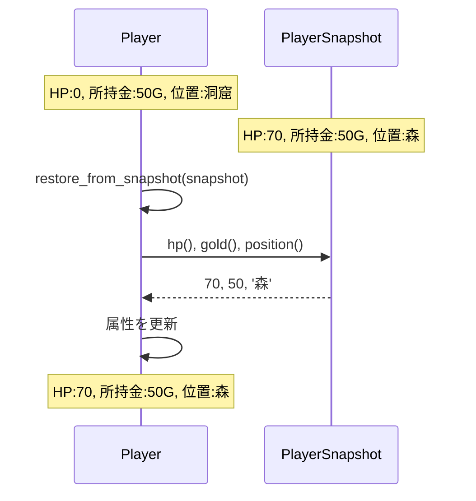
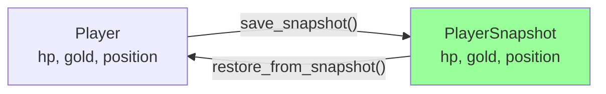
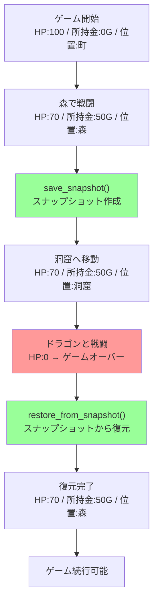
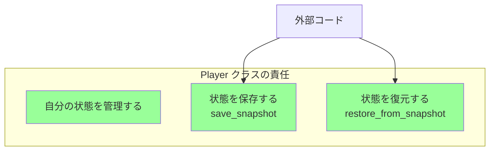

[@nqounet](https://x.com/nqounet)です。

## 前回の振り返り



前回は、プレイヤーの状態を1つのオブジェクトにまとめて保存する`PlayerSnapshot`クラスを作成しました。`is => 'ro'`で不変性を保証し、カプセル化を維持しながら状態を保存できるようになりました。



### 前回作成したもの

- `PlayerSnapshot`クラス — すべての属性が`is => 'ro'`で不変
- `save_snapshot`メソッド — `Player`の状態からスナップショットを作成

### 解決できたこと、できていないこと

**解決できたこと:**

- 参照コピーの罠を回避
- カプセル化を維持した状態保存
- 不変性の保証

**まだできていないこと:**

- スナップショットから復元する機能
- 複数のスナップショット管理
- 自動的な保存

今回は、「スナップショットから復元する機能」を実装します。

## 今回のゴール

今回のゴールは、保存したスナップショットから、プレイヤーの状態を復元することです。

- `restore_from_snapshot`メソッドを実装する
- セーブ→ダメージ→ロードの流れを完成させる
- 復元が正しく動作することを確認する

これで、ゲームのセーブ・ロード機能の基本が完成します。

## restore_from_snapshotメソッドの設計

スナップショットから状態を復元する方法を考えましょう。



`restore_from_snapshot`メソッドは、スナップショットの値を読み取り、自分の属性を更新します。

### なぜPlayerクラスにメソッドを追加するのか

復元機能を`Player`クラスに追加する理由は、**カプセル化を維持する**ためです。

```perl
# 悪い例：外部で属性を直接更新（カプセル化の破壊）
$player->hp($snapshot->hp);
$player->gold($snapshot->gold);
$player->position($snapshot->position);

# 良い例：Playerクラスのメソッドで復元（カプセル化を維持）
$player->restore_from_snapshot($snapshot);
```

外部から属性を直接更新すると、`Player`クラスの内部構造を知る必要があります。もし将来、属性が増えたり、復元時に特別な処理が必要になったりしたら、外部のコードをすべて修正しなければなりません。

`restore_from_snapshot`メソッドを用意することで、復元の責任を`Player`クラスに集約できます。

## コード例1：restore_from_snapshotメソッドの実装

それでは、`Player`クラスに`restore_from_snapshot`メソッドを追加しましょう。

```perl
# Perl v5.36 以降
# 外部依存: Moo

package Player {
    use Moo;
    use v5.36;

    has hp => (
        is      => 'rw',
        default => 100,
    );

    has gold => (
        is      => 'rw',
        default => 0,
    );

    has position => (
        is      => 'rw',
        default => '町',
    );

    sub take_damage ($self, $amount) {
        $self->hp($self->hp - $amount);
        if ($self->hp < 0) {
            $self->hp(0);
        }
    }

    sub earn_gold ($self, $amount) {
        $self->gold($self->gold + $amount);
    }

    sub move_to ($self, $location) {
        $self->position($location);
    }

    sub is_alive ($self) {
        return $self->hp > 0;
    }

    sub show_status ($self) {
        say "HP: " . $self->hp;
        say "所持金: " . $self->gold . "G";
        say "位置: " . $self->position;
        say "";
    }

    sub save_snapshot ($self) {
        return PlayerSnapshot->new(
            hp       => $self->hp,
            gold     => $self->gold,
            position => $self->position,
        );
    }

    sub restore_from_snapshot ($self, $snapshot) {
        $self->hp($snapshot->hp);
        $self->gold($snapshot->gold);
        $self->position($snapshot->position);
    }
};
```

`restore_from_snapshot`メソッドは、スナップショットを受け取り、その値で自分の属性を更新します。

実装はシンプルですが、重要なポイントがあります。

### ポイント1：スナップショットの読み取り

スナップショットの属性は`is => 'ro'`なので、読み取りしかできません。

```perl
$snapshot->hp;        # OK: 読み取り
$snapshot->hp(100);   # エラー: 書き込みはできない
```

これは正しい設計です。スナップショットは「過去の記録」なので、読み取ることはできても書き換えることはできません。

### ポイント2：Playerの属性は書き込み可能

一方、`Player`の属性は`is => 'rw'`なので、読み書きできます。

```perl
$self->hp($snapshot->hp);  # OK: 自分の属性は更新できる
```

これも正しい設計です。`Player`は「今遊んでいるゲーム」なので、状態が変化します。

### save_snapshotとrestore_from_snapshotの対称性

2つのメソッドを並べて見てみましょう。

```perl
# 保存：Playerの状態 → PlayerSnapshot
sub save_snapshot ($self) {
    return PlayerSnapshot->new(
        hp       => $self->hp,
        gold     => $self->gold,
        position => $self->position,
    );
}

# 復元：PlayerSnapshot → Playerの状態
sub restore_from_snapshot ($self, $snapshot) {
    $self->hp($snapshot->hp);
    $self->gold($snapshot->gold);
    $self->position($snapshot->position);
}
```

**保存**は、自分の属性を読み取ってスナップショットを作成します。

**復元**は、スナップショットの属性を読み取って自分の属性を更新します。

この対称性が美しいですね！



## コード例2：セーブ→ダメージ→ロードのデモ

それでは、完全なセーブ・ロード機能を動かしてみましょう。

```perl
# Perl v5.36 以降
# 外部依存: Moo

use v5.36;

package PlayerSnapshot {
    use Moo;

    has hp => (
        is       => 'ro',
        required => 1,
    );

    has gold => (
        is       => 'ro',
        required => 1,
    );

    has position => (
        is       => 'ro',
        required => 1,
    );
};

package Player {
    use Moo;

    has hp => (
        is      => 'rw',
        default => 100,
    );

    has gold => (
        is      => 'rw',
        default => 0,
    );

    has position => (
        is      => 'rw',
        default => '町',
    );

    sub take_damage ($self, $amount) {
        $self->hp($self->hp - $amount);
        if ($self->hp < 0) {
            $self->hp(0);
        }
    }

    sub earn_gold ($self, $amount) {
        $self->gold($self->gold + $amount);
    }

    sub move_to ($self, $location) {
        $self->position($location);
    }

    sub is_alive ($self) {
        return $self->hp > 0;
    }

    sub show_status ($self) {
        say "HP: " . $self->hp;
        say "所持金: " . $self->gold . "G";
        say "位置: " . $self->position;
        say "";
    }

    sub save_snapshot ($self) {
        return PlayerSnapshot->new(
            hp       => $self->hp,
            gold     => $self->gold,
            position => $self->position,
        );
    }

    sub restore_from_snapshot ($self, $snapshot) {
        $self->hp($snapshot->hp);
        $self->gold($snapshot->gold);
        $self->position($snapshot->position);
    }
};

# ゲームループのデモ
my $player = Player->new;

say "=== ゲーム開始 ===";
$player->show_status;

say "森へ移動...";
$player->move_to('森');
$player->show_status;

say "スライムと戦闘！";
$player->take_damage(30);
say "30のダメージを受けた！";
$player->show_status;

if ($player->is_alive) {
    say "スライムを倒した！";
    $player->earn_gold(50);
    say "50Gを手に入れた！";
    $player->show_status;
}

# セーブポイント
say "=== セーブポイント ===";
my $snapshot = $player->save_snapshot;
say "状態を保存しました";
say "";

say "洞窟へ移動...";
$player->move_to('洞窟');
$player->show_status;

say "ドラゴンと戦闘！";
$player->take_damage(80);
say "80のダメージを受けた！";
$player->show_status;

if (!$player->is_alive) {
    say "=== GAME OVER ===";
    say "セーブポイントから復元します...";
    say "";
    
    # スナップショットから復元
    $player->restore_from_snapshot($snapshot);
    
    say "=== 復元完了 ===";
    $player->show_status;
    
    if ($player->is_alive) {
        say "プレイヤーは復活しました！";
        say "ゲームを続行できます。";
    }
}
```

実行結果は以下のようになります。

```
=== ゲーム開始 ===
HP: 100
所持金: 0G
位置: 町

森へ移動...
HP: 100
所持金: 0G
位置: 森

スライムと戦闘！
30のダメージを受けた！
HP: 70
所持金: 0G
位置: 森

スライムを倒した！
50Gを手に入れた！
HP: 70
所持金: 50G
位置: 森

=== セーブポイント ===
状態を保存しました

洞窟へ移動...
HP: 70
所持金: 50G
位置: 洞窟

ドラゴンと戦闘！
80のダメージを受けた！
HP: 0
所持金: 50G
位置: 洞窟

=== GAME OVER ===
セーブポイントから復元します...

=== 復元完了 ===
HP: 70
所持金: 50G
位置: 森

プレイヤーは復活しました！
ゲームを続行できます。
```

完璧に動きました！ドラゴンに負けた後、森でのセーブポイントに戻り、ゲームを続行できます。

## セーブ・ロードの流れを可視化

今回実装したセーブ・ロードの仕組みを、時系列で可視化してみましょう。



この流れで、ゲームのセーブ・ロード機能が実現できました。

## 設計の利点

今回の設計には、いくつかの重要な利点があります。

### 1. カプセル化の維持

復元の処理が`Player`クラスの中に隠蔽されているため、外部のコードは内部実装を知る必要がありません。

```perl
# 内部実装を知らなくても使える
$player->restore_from_snapshot($snapshot);
```

### 2. 将来の拡張に強い

もし将来、`Player`クラスに新しい属性（例えば`level`や`experience`）を追加しても、`save_snapshot`と`restore_from_snapshot`の中を修正するだけで済みます。

```perl
# 将来の拡張例
sub save_snapshot ($self) {
    return PlayerSnapshot->new(
        hp         => $self->hp,
        gold       => $self->gold,
        position   => $self->position,
        level      => $self->level,      # 追加
        experience => $self->experience, # 追加
    );
}

sub restore_from_snapshot ($self, $snapshot) {
    $self->hp($snapshot->hp);
    $self->gold($snapshot->gold);
    $self->position($snapshot->position);
    $self->level($snapshot->level);           # 追加
    $self->experience($snapshot->experience); # 追加
}
```

外部のコードは変更不要です。これが、カプセル化のメリットです。

### 3. 責任の明確化

状態の保存・復元の責任が`Player`クラスに集約されています。



この設計により、「状態の保存・復元に関する処理はPlayerクラスを見ればわかる」という明確さが生まれます。

## まだできていないこと

今回の実装で、基本的なセーブ・ロード機能は完成しました。しかし、まだいくつかの課題があります。

1. **複数のセーブスロットがない** — 1つのスナップショットしか保存できない
2. **セーブスロットの管理機能がない** — どのスナップショットをロードするか選べない
3. **自動セーブ機能がない** — 手動で`save_snapshot`を呼ぶ必要がある

次回は、複数のセーブポイントを管理する仕組みを作ります。`GameManager`クラスを導入し、セーブスロット機能を実装していきます。

## 今回作成した完成コード

以下が今回作成した完成コードです。1つのスクリプトファイルとして動作します。

```perl
#!/usr/bin/env perl
# Perl v5.36 以降
# 外部依存: Moo

use v5.36;

package PlayerSnapshot {
    use Moo;

    has hp => (
        is       => 'ro',
        required => 1,
    );

    has gold => (
        is       => 'ro',
        required => 1,
    );

    has position => (
        is       => 'ro',
        required => 1,
    );
};

package Player {
    use Moo;

    has hp => (
        is      => 'rw',
        default => 100,
    );

    has gold => (
        is      => 'rw',
        default => 0,
    );

    has position => (
        is      => 'rw',
        default => '町',
    );

    sub take_damage ($self, $amount) {
        $self->hp($self->hp - $amount);
        if ($self->hp < 0) {
            $self->hp(0);
        }
    }

    sub earn_gold ($self, $amount) {
        $self->gold($self->gold + $amount);
    }

    sub move_to ($self, $location) {
        $self->position($location);
    }

    sub is_alive ($self) {
        return $self->hp > 0;
    }

    sub show_status ($self) {
        say "HP: " . $self->hp;
        say "所持金: " . $self->gold . "G";
        say "位置: " . $self->position;
        say "";
    }

    sub save_snapshot ($self) {
        return PlayerSnapshot->new(
            hp       => $self->hp,
            gold     => $self->gold,
            position => $self->position,
        );
    }

    sub restore_from_snapshot ($self, $snapshot) {
        $self->hp($snapshot->hp);
        $self->gold($snapshot->gold);
        $self->position($snapshot->position);
    }
};

# ゲームループのデモ
my $player = Player->new;

say "=== ゲーム開始 ===";
$player->show_status;

say "森へ移動...";
$player->move_to('森');
$player->show_status;

say "スライムと戦闘！";
$player->take_damage(30);
say "30のダメージを受けた！";
$player->show_status;

if ($player->is_alive) {
    say "スライムを倒した！";
    $player->earn_gold(50);
    say "50Gを手に入れた！";
    $player->show_status;
}

# セーブポイント
say "=== セーブポイント ===";
my $snapshot = $player->save_snapshot;
say "状態を保存しました";
say "";

say "洞窟へ移動...";
$player->move_to('洞窟');
$player->show_status;

say "ドラゴンと戦闘！";
$player->take_damage(80);
say "80のダメージを受けた！";
$player->show_status;

if (!$player->is_alive) {
    say "=== GAME OVER ===";
    say "セーブポイントから復元します...";
    say "";
    
    # スナップショットから復元
    $player->restore_from_snapshot($snapshot);
    
    say "=== 復元完了 ===";
    $player->show_status;
    
    if ($player->is_alive) {
        say "プレイヤーは復活しました！";
        say "ゲームを続行できます。";
    }
}
```

## まとめ

今回は、保存したスナップショットから、プレイヤーの状態を復元する機能を実装しました。

**作成したもの:**

- `restore_from_snapshot`メソッドで、スナップショットから状態を復元できるようにした
- セーブ→ダメージ→ロードの完全な流れを実現した
- カプセル化を維持しながら、復元機能を実装した

**確認できたこと:**

- `save_snapshot`と`restore_from_snapshot`の対称性
- スナップショットの不変性（`is => 'ro'`）による安全性
- カプセル化を維持した状態管理の実現

**設計の利点:**

- 将来の拡張に強い設計
- 責任の明確化（状態管理はPlayerクラスの責任）
- 外部コードがPlayerの内部実装を知る必要がない

基本的なセーブ・ロード機能が完成しました！次回は、複数のセーブスロットを管理する仕組みを作ります。

## 次回予告

今回、セーブ・ロード機能の基本が完成しました。

しかし、現状では1つのスナップショットしか保存できません。複数のセーブポイントを管理したり、どのセーブデータをロードするか選んだりする機能がありません。

次回は、複数のセーブポイントを管理する`GameManager`クラスを作成します。セーブスロット機能を実装し、複数の状態を保存・管理できるようにします。

**第5回のテーマ: セーブデータを管理しよう（履歴機能）**

お楽しみに。
